# 📜 DOCUMENTAÇÃO OFICIAL - HEROES OF MAJESTY: CONSOLE EDITION

> **Documento Oficial de Mecânicas do Jogo e Parte Conceitual**
>
> Este documento define todas as regras funcionais, mecânicas de funcionamento, explicações de diversão, sistemas e tudo relacionado ao gameplay.

---

## 📑 ÍNDICE COMPLETO

### PARTE I: FUNDAMENTOS

1. [Visão Geral e Filosofia do Jogo](#1-visão-geral-e-filosofia-do-jogo)
   - 1.1 [O Monarca Indireto](#11-o-monarca-indireto-a-filosofia-de-observar-mais-do-que-comandar)
   - 1.2 [O Efeito Aquário](#12-o-efeito-aquário-criando-uma-simulação-viva-e-reativa-em-tempo-real)
   - 1.3 [Pilares de Diversão](#13-pilares-de-diversão-imprevisibilidade-agência-indireta-e-narrativa-emergente)
   - 1.4 [A Nova Direção (RTS → Terminal)](#14-a-nova-direção-do-rts-visual-para-a-simulação-profunda)
   - 1.5 [Viabilidade Técnica](#15-por-que-a-mudança-viabilidade-técnica)
   - 1.6 [Sistema de Tempo e Turnos](#16-sistema-de-tempo-e-turnos-a-regra-dos-3-segundos)

2. [Interface e Experiência do Usuário (UI/UX)](#2-interface-e-experiência-do-usuário-uiux)
   - 2.1 [Conceito de Workspaces](#21-o-conceito-de-workspaces-tty)
   - 2.2 [Regras Globais de Interação](#22-regras-globais-de-interação-system-wide)
   - 2.3 [[F1] COMMAND CENTER](#23-f1-command-center---the-war-room)
   - 2.4 [[F2] ADMIN](#24-f2-management---the-tycoon)
   - 2.5 [[F3] LIBRARY](#25-f3-library---the-armanaves)
   - 2.6 [[F4] WORLD MAP](#26-f4-world-map---the-conquest)
   - 2.7 [[F5] THE AVIARY](#27-f5-the-aviary---royal-mail)
   - 2.8 [[F6] THE CHRONICLES](#28-f6-the-chronicles---the-living-book)

### PARTE II: SISTEMAS DE IA

3. [Arquitetura de IA Híbrida](#3-arquitetura-de-ia-híbrida)
   - 3.1 [Visão Geral](#31-visão-geral-o-cérebro-dos-heróis)
   - 3.2 [Utility AI](#32-utility-ai-o-sistema-de-decisão-estratégica)
   - 3.3 [Behavior Trees](#33-behavior-trees-a-execução-tática)
   - 3.4 [FSM (Máquinas de Estados)](#34-fsm-gerenciamento-de-estados-macro)
   - 3.5 [NLP (Conselheiro)](#35-nlp-processamento-de-linguagem-natural-conselheiro)

4. [Os Heróis: Agentes Autônomos](#4-os-heróis-agentes-autônomos)
   - 4.1 [Estrutura de Dados](#41-estrutura-de-dados-de-um-herói)
   - 4.2 [Sistema P.E.C.M.A.](#42-sistema-pecma-os-5-vetores-de-personalidade)
   - 4.3 [Camadas de Modificação](#43-camadas-de-modificação-estados-e-peculiaridades)
   - 4.4 [Classes de Heróis](#44-classes-de-heróis-vieses-e-identidade)
   - 4.5 [Sistema de Loot](#45-sistema-de-loot-e-economia)
   - 4.6 [Ciclo de Vida](#46-ciclo-de-vida-morte-trabalho-e-redenção)
   - 4.7 [Limitação: 5 Heróis Máximo](#47-limitação-estratégica-máximo-de-5-heróis)
   - 4.8 [Sistema de Skills](#48-sistema-de-skills-árvore-completa-de-habilidades)
   - 4.9 [Sistema de Itens e Loot](#49-sistema-de-itens-e-loot-a-arma-e-a-lenda)

5. [Dinâmica Social: O Drama Emergente](#5-dinâmica-social-o-drama-emergente)
   - 5.1 [Formação de Grupos](#51-formação-de-grupos-party-system)
   - 5.1 [Formação de Grupos](#51-formação-de-grupos-party-system)
   - 5.2 [Disputa de Glória](#52-disputa-de-glória-quem-finalizou)
   - 5.3 [Combate PvP](#53-combate-pvp-player-vs-player-entre-heróis)
   - 5.4 [Amizades e Lealdade](#54-amizades-e-lealdade)
   - 5.5 [Saque de Heróis Caídos](#55-saque-de-heróis-caídos-sem-roubo)
   - 5.6 [Sistema de Banter](#56-sistema-de-banter-diálogos-dinâmicos)
   - 5.7 [Matriz de Relacionamento](#57-matriz-de-relacionamento-visualização)
   - 5.8 [Outros Conflitos](#58-outros-gatilhos-de-conflito-social)

6. [O Conselheiro Real de IA](#6-o-conselheiro-real-de-ia)
   - 6.1 [O NPC Mais Importante](#61-o-npc-mais-importante-do-jogo)
   - 6.2 [Chat Interativo via NLP](#62-chat-interativo-via-nlp)
   - 6.3 [Personalidades do Conselheiro](#63-personalidades-do-conselheiro)
   - 6.4 [Cronista e Analista](#64-cronista-e-analista-o-historiador)
   - 6.5 [Sussurros e Lore](#65-sussurros-e-lore-dinâmica)
   - 6.6 [Espionagem](#66-espionagem-e-estratégia)
   - 6.7 [Influence Points (IP)](#67-custo-de-influência-o-rate-limit-narrativo)
   - 6.8 [API de Comandos da LLM](#68-api-de-comandos-da-llm-interface-homem-máquina)

7. [Economia e Gestão do Reino](#7-economia-e-gestão-do-reino)
   - 7.1 [Tesouro Real](#71-tesouro-real-a-fonte-de-ouro)
   - 7.2 [Curadoria de Habilidades](#72-curadoria-de-habilidades-tech-tree)
   - 7.3 [Gestão de Estoques](#73-gestão-de-estoques-poções-e-salários)
   - 7.4 [Decretos Reais](#74-decretos-reais-buffs-globais-com-risco)
   - 7.5 [Influence Points](#75-influence-points-ip-sistema-completo-de-mana-social)
   - 7.6 [Manutenção de Edifícios](#76-manutenção-de-edifícios)

### PARTE IV: MUNDO E PROGRESSÃO

8. [Mundo Procedural e Ciclos](#8-mundo-procedural-e-ciclos-temporais)
   - 8.1 [Névoa de Guerra](#81-névoa-de-guerra-pessoal-o-reino-oculto)
   - 8.2 [Os 4 Ciclos de 2 Dias](#82-os-4-ciclos-de-2-dias-progressão-temporal)
   - 8.3 [Ciclo Dia/Noite](#83-ciclo-dianoite-perigo-após-o-pôr-do-sol)
   - 8.4 [Eventos Globais](#84-eventos-globais-o-caos-controlado)
   - 8.5 [Boss Global](#85-boss-global-o-rei-vilão)
   - 8.6 [Escalonamento Dinâmico](#86-escalonamento-dinâmico-de-dificuldade)
   - 8.7 [Mapas Procedurais](#87-mapas-procedurais-cada-partida-é-única)
   - 8.8 [Tutorial e Onboarding](#88-tutorial-e-onboarding)

9. [Mecânicas Avançadas de Expansão](#9-mecânicas-avançadas-de-expansão)
   - 9.1 [Postos Avançados](#91-postos-avançados-expandindo-o-reino)
   - 9.2 [Fundando Postos](#92-fundando-um-posto-avançado)
   - 9.3 [Gestão Autônoma](#93-gestão-autônoma-do-posto)
   - 9.4 [Lealdade do Posto](#94-lealdade-do-posto)
   - 9.5 [Morte do Capitão](#95-morte-do-capitão-condição-de-falha)
   - 9.6 [Mudança de Capital](#96-mudança-de-capital-decisão-irreversível)
   - 9.7 [Traição Individual](#97-traição-quando-heróis-se-voltam-contra-você)
   - 9.8 [Colônia Rebelde](#98-colônia-rebelde-traição-em-massa)
   - 9.9 [Classes e Evolução](#99-notas-sobre-classes-e-evolução)
   - 9.10 [Habitação](#910-habitação-e-bases)

10. [Narrativa Emergente e Legado](#10-narrativa-emergente-e-legado)

- 10.1 [Crônicas do Reino (PDF)](#101-crônicas-do-reino-o-pdf-ilustrado)
- 10.2 [Sonhos e Sussurros](#102-sonhos-e-sussurros-balões-de-pensamento)
- 10.3 [Títulos Dinâmicos](#103-títulos-e-epítetos-dinâmicos)
- 10.4 [Modo Historiador](#104-modo-historiador-replay-com-onisciência)
- 10.5 [Ecos do Passado](#105-ecos-do-passado-itens-lendários-de-partidas-anteriores)
- 10.7 [Amanaevements Narrativos](#107-amanaevements-narrativos-conquistas)
- 10.8 [Compartilhamento Social](#108-compartilhamento-social)
- 10.9 [Vitória e Pós-Jogo](#109-vitória-e-pós-jogo-a-comemoração)

### PARTE V: MULTIPLAYER E INIMIGOS

11. [Multiplayer (Visão Futura)](#11-multiplayer-visão-futura)

- 11.1 [Por Que Foi Desprioritizado](#111-por-que-multiplayer-foi-desprioritizado)
- 11.2 [Co-op Assíncrono](#112-modo-co-op-assíncrono-proposta-futura)
- 11.3 [PvP Indireto](#113-modo-pvp-indireto-proposta-futura)
- 11.4 [Leaderboards e Seasons](#114-leaderboards-e-seasons-proposta-futura)
- 11.5 [Desafios de Amigos](#115-desafios-de-amigos-proposta-futura)

12. [Sistema de Monstros: IA P.A.I.N.](#12-sistema-de-monstros-ia-pain)

- 12.1 [Visão Geral](#121-visão-geral-os-inimigos-autônomos)
- 12.2 [Perfis de Monstros](#122-perfis-de-monstros)
- 12.3 [Sistema de Nêmesis](#123-sistema-de-nêmesis-monstros-que-evoluem)
- 12.4 [Facções](#124-facções-de-monstros-comportamento-coletivo)
- 12.5 [Patrulhas](#125-patrulhas-e-spawn-dinâmico)
- 12.6 [Ondas de Invasão](#126-ondas-de-invasão-eventos-de-cerco)
- 12.7 [Bosses Dinâmicos](#127-bosses-dinâmicos-diferentes-a-cada-partida)
- 12.8 [Escalonamento por Ciclo](#128-escalonamento-de-dificuldade-por-ciclo)
- 12.9 [Anti-Padrões](#129-comportamentos-especiais-anti-padrões)
- 12.10 [Loot Dinâmico](#1210-loot-dinâmico-recompensa-por-risco)

### PARTE VI: COMBATE E APRESENTAÇÃO

13. [Sistema de Combate e Flavor Texts](#13-sistema-de-combate-e-flavor-texts)

- 13.1 [Mecânica de Combate](#131-mecânica-de-combate-simplificada-mas-profunda)
- 13.2 [Flavor Texts](#132-flavor-texts-o-coração-da-narrativa)
- 13.3 [Contextos de Eventos](#133-contextos-de-eventos)
- 13.4 [Geração de Logs](#134-sistema-de-geração-de-logs)
- 13.5 [Prompt para LLM](#135-prompt-para-llm-geração-de-flavor-texts)
- 13.6 [Cache e Performance](#136-cache-e-performance)
- 13.7 [Estilização Visual](#137-guia-de-estilização-visual-dos-logs)

14. [Estética e "Juice" Visual/Sonoro](#14-estética-e-juice-visualsonoro)

- 14.1 [Terminal Mágico de Fantasia](#141-a-filosofia-do-terminal-mágico-de-fantasia)
- 14.2 [Portraits Dinâmicos](#142-portraits-dinâmicos-doom-style)
- 14.3 [Ícones Vivos](#143-ícones-vivos-micro-animações)
- 14.4 [Sonoplastia Imersiva](#144-sonoplastia-imersiva-o-mundo-sonoro)
- 14.5 [Audio Manager](#145-audio-manager-gerenciamento-de-som)
- 14.6 [Variação de Pitch](#146-variação-de-pitch-evitando-repetição)
- 14.7 [Efeitos de Partículas](#147-efeitos-de-partículas-csscanvas)

15. [Análise Crítica e Justificativas](#15-análise-crítica-e-justificativas-de-design)

- 15.1 [Por Que Controle Indireto?](#151-por-que-controle-indireto)
- 15.2 [Por Que Terminal?](#152-por-que-terminal-em-vez-de-gráficos-3d)
- 15.3 [Limite de 5 Heróis](#153-limite-de-5-heróis-por-quê)
- 15.4 [Progressão Lenta](#154-progressão-lenta-feature-ou-bug)
- 15.5 [IA Determinística vs Generativa](#155-ia-determinística-vs-generativa)
- 15.6 [Multiplayer: Por Que Não Agora?](#156-multiplayer-por-que-não-agora)
- 15.7 [Influence Points](#157-influence-points-limitação-ou-mecânica)
- 15.8 [Crônicas em PDF](#158-crônicas-em-pdf-vale-a-pena)
- 15.9 [Features Cortadas](#159-features-cortadas-com-tristeza)
- 15.10 [Visão Final](#1510-a-visão-final-o-que-torna-este-jogo-especial)
- 15.11 [Métricas de Sucesso](#1511-métricas-de-sucesso)
- 15.12 [Roadmap Pós-Lançamento](#1512-roadmap-pós-lançamento)

### PARTE VII: NARRATIVA GENERATIVA

16. [O Motor de Narrativa](#16-o-motor-de-narrativa-infinite-tales)

- 16.1 [Visão Geral](#161-visão-geral-o-problema-da-fadiga-de-texto)
- 16.2 [A Solução](#162-a-solução-separação-de-poderes-dois-cérebros)

17. [Infraestrutura de Dados](#17-infraestrutura-de-dados-postgresql--ram)

- 17.1 [Schema do Banco de Dados](#171-schema-do-banco-de-dados)
- 17.2 [Estratégia de Cache](#172-estratégia-de-cache)

18. [Entropia e Sopa de Tags](#18-o-conceito-de-entropia-e-sopa-de-tags)

- 18.1 [Por que não usar Templates?](#181-por-que-não-usar-templates)
- 18.2 [O Algoritmo do "Liquidificador"](#182-o-algoritmo-do-liquidificador)
- 18.3 [A Matemática da Variedade](#183-a-matemática-da-variedade)

19. [Configuração do Modelo](#19-configuração-do-modelo-webllm)

- 19.1 [O Modelo Escolhido](#191-o-modelo-escolhido)
- 19.2 [Parâmetros de Inferência](#192-parâmetros-de-inferência)
- 19.3 [O System Prompt Otimizado](#193-o-system-prompt-otimizado)

20. [Implementação Técnica](#20-implementação-técnica-angular--webgpu)

- 20.1 [Serviço de IA](#201-serviço-de-ia)
- 20.2 [Consumo no Componente](#202-consumo-no-componente)

21. [Conclusão Técnica](#21-conclusão-técnica)

### ANEXOS

- [Tabela de Flavor Texts](#132-flavor-texts-o-coração-da-narrativa)
- [Sistema P.E.C.M.A. Completo](#42-sistema-perma-os-5-vetores-de-personalidade)
- [Sistema P.A.I.N. Completo](#121-visão-geral-os-inimigos-autônomos)
- [Comandos do Conselheiro](#62-chat-interativo-via-nlp)
- [Lista de Eventos Globais](#84-eventos-globais-o-caos-controlado)

---
# 1. VISÃO GERAL E FILOSOFIA DO JOGO

## 1.1 O Monarca Indireto: A Filosofia de "Observar mais do que Comandar"

A essência do jogo reside no **controle indireto**. O jogador não é um general microgerenciando unidades, mas sim um **monarca que atua como o "jardineiro de um ecossistema vivo"**. Você planta as sementes e fertiliza o solo, mas as flores (os heróis) crescem e agem por conta própria.

### Influência, não Comando

O jogador molda o destino do reino através de **decisões estratégicas** e não por cliques diretos em unidades.

### Ferramentas de Poder

A soberania é exercida através de:

- **Recrutamento seletivo:** Escolher quais classes e personalidades atrair para o reino
- **Infraestrutura:** Construir guildas, lojas e torres para prover suporte e guiar o comportamento dos heróis
- **Recompensas (Bounties):** Colocar ouro em alvos ou áreas para incentivar a ação autônoma dos heróis
- **Conselheiro de IA:** Interagir via chat em linguagem natural para delegar ordens e pedidos sociais

---

## 1.2 O Efeito Aquário: Criando uma Simulação Viva e Reativa em Tempo Real

O mundo de Heroes of Majesty funciona como um **organismo pulsante** onde o tempo não para. Este "Efeito Aquário" garante que a vida no reino continue acontecendo simultaneamente, mesmo em áreas fora da visão do jogador.

### Características do Efeito Aquário

- **Fluxo Contínuo:** O jogo roda em tempo real assistível, onde cada evento gera uma cadeia de causa e efeito imediata
- **Reatividade Orgânica:** Se um herói derrota um monstro perto de uma vila, a segurança aumenta e outros heróis mudam suas rotas de patrulha
- **Cérebro Autônomo:** Cada entidade é regida por uma Máquina de Estados Finitos (FSM), garantindo que estejam sempre focadas em uma tarefa lógica (explorar, atacar, fugir, descansar) sem necessidade de input manual
- **Ciclos Temporais:** A progressão é marcada por 4 ciclos de 2 dias, onde biomas, estações e a dificuldade dos monstros são drasticamente alterados

---

## 1.3 Pilares de Diversão: Imprevisibilidade, Agência Indireta e Narrativa Emergente

A diversão do jogo não vem da execução motora rápida, mas sim da **satisfação intelectual** de guiar um sistema complexo e imperfeito.

### Os Três Pilares

1. **Imprevisibilidade**
   - Traços de personalidade como ganância, coragem e ética fazem com que os heróis tomem decisões inesperadas
   - Um ladino pode ignorar um combate para saquear um baú
   - Um guerreiro covarde pode fugir cedo demais

2. **Narrativa Emergente**
   - Histórias épicas, cômicas ou dramáticas surgem naturalmente das interações sociais
   - Rivalidades por títulos, romances emergentes e resgates heroicos entre amigos
   - Cada partida gera sua própria saga única

3. **Legado Tangível**
   - Ao final de cada partida, os logs de eventos são transformados em uma "Crônica do Reino" ilustrada (PDF)
   - Eterniza a saga única daquela sessão
   - **Pausa Tática:** O jogador pode congelar o tempo (Pausa Ativa) para analisar logs, dossiês de heróis e emitir decretos

---

## 1.4 A Nova Direção: Do RTS Visual para a Simulação Profunda

### A Metamorfose Completa

O projeto passou por uma **transformação radical**. Deixamos para trás a ideia de um jogo 3D/2D feito em Godot para abraçar algo mais cru, mais complexo e, ironicamente, **muito mais imersivo**.

**Apresentamos:** Heroes of Majesty - **Console Edition**

### A Filosofia: "O Sistema Operacional do Reino"

A proposta original focava em ver bonequinhos andando na tela. Percebemos que isso **limitava a profundidade da simulação**. Ao remover a complexidade gráfica (física, pathfinding visual, animações de esqueleto), liberamos recursos para focar no que realmente importa:

- **O cérebro dos heróis**
- **A narrativa emergente**

### A Nova Estética: Terminal Mágico de Fantasia Medieval

Imagine que você não está flutuando sobre o castelo, mas **sentado na sala de guerra**, operando um sistema mágico de monitoramento via texto, logs e mapas táticos.

- **Você é o Operador**
- **O Reino é o Sistema**

---

## 1.5 Por que a Mudança? Viabilidade Técnica

Como um **Solopreneur e Senior Web Developer**, essa mudança alinha o desenvolvimento com minhas maiores forças técnicas.

### Stack Tecnológica

- **Frontend:** Angular (Interface Terminal)
- **Desktop Runtime:** Tauri (Aplicação Nativa)
- **Backend:** Deno (Servidor de Simulação)
- **Banco de Dados:** PostgreSQL (Narrativa, Tags, Estado do Jogo)
- **IA Generativa:** WebGPU + WebLLM (Llama 3.2 3B rodando local)

### Vantagens

- **Performance:** A simulação roda num servidor Deno robusto, permitindo milhares de cálculos de IA sem travar
- **IA Local:** Narrativa generativa roda na GPU do jogador (zero custo de API, privacidade total)
- **Aplicação Desktop:** Tauri garante performance nativa e acesso a recursos do sistema
- **Escalabilidade:** PostgreSQL + Cache em RAM (Deno) para consultas ultra-rápidas
- **Jogabilidade:** 100% via teclado (para os amantes de atalhos) ou mouse
- **Foco no que Importa:** Em vez de animações complexas, foco total na complexidade da IA e narrativa emergente

> _Heroes of Majesty deixou de ser um jogo que você assiste para ser um sistema que você opera._

---
# 02b. Sistema de Tempo e Turnos

## Conceito Fundamental

O Majesty opera sob um sistema híbrido de tempo: **Turnos Lógicos** que são traduzidos em **Tempo Real** para a experiência do jogador. Para garantir consistência nas mecânicas, durações de habilidades, cooldowns e eventos, o jogo utiliza o **Turno** como unidade padrão de medida.

## A Regra de Ouro da Equivalência Temporal

> **1 Turno = 3 Segundos**

Essa equivalência foi estabelecida com base no ritmo de leitura dos logs e na cadência de atualização do mundo.

### Por que 3 Segundos?

1.  **Ritmo de Leitura:** É o tempo médio para o jogador ler uma nova linha de log sem se sentir sobrecarregado (spam).
2.  **Ciclo de Processamento:** Permite que a IA processe a lógica de todos os agentes e gere uma narrativa coerente.
3.  **Fluidez Variável:** Fora de combate, os turnos passam automaticamente e fluidamente. Em situações críticas (como combate pausado), o jogador pode ter controle mais granular.

## Conversão de Tempo para Turnos

Todas as mecânicas que anteriormente utilizavam "segundos" devem ser interpretadas em "Turnos".

| Tempo Real (Anterior) | Unidade de Turnos (Novo Padrão) | Exemplo de Aplicação                                              |
| :-------------------- | :------------------------------ | :---------------------------------------------------------------- |
| **3 seg**             | **1 Turno**                     | Duração mínima de um stun simples ou ataque rápido.               |
| **6 seg**             | **2 Turnos**                    | Pequenos buffs ou debuffs.                                        |
| **9-12 seg**          | **3-4 Turnos**                  | Duração padrão de habilidades de controle (CC) médias.            |
| **30 seg**            | **10 Turnos**                   | Cooldowns rápidos, durações de buffs significativos.              |
| **60 seg (1 min)**    | **20 Turnos**                   | Tempo de construção de estruturas simples, cooldown de Ultimates. |
| **300 seg (5 min)**   | **100 Turnos**                  | Ciclos de eventos menores, duração de efeitos climáticos curtos.  |

## Aplicação Prática nas Mecânicas

### 1. Combate e Habilidades

Em vez de uma habilidade durar "8 segundos", ela durará **3 Turnos** (aprox. 9s), arredondando para manter a integridade do sistema de turnos.

- **Antes:** "Atordoa o alvo por 3 segundos."
- **Agora:** "Atordoa o alvo por **1 Turno**."

### 2. Construção e Coleta

Ações de longo prazo são medidas em ciclos de turnos.

- **Antes:** "Mina de Ouro gera recursos a cada 30 segundos."
- **Agora:** "Mina de Ouro gera recursos a cada **10 Turnos**."

### 3. Notificações e UI

O tempo de exibição de alertas e a cadência de mensagens no log seguem o ritmo dos turnos.

- **Cadência de Log:** 1 mensagem relevante a cada ~1 Turno (3s).
- **Timeouts de Resposta:** Se um conselheiro pede uma decisão, o tempo limite será contabilizado em turnos do jogo (ex: "Você tem 15 Turnos para decidir").

## Observação sobre Efeitos Visuais (Juice)

Efeitos puramente visuais (como _crossfades_, _flashes_ de crítico, animações de particulas) continuam sendo descritos em **segundos ou milissegundos** reais, pois referem-se à renderização na tela e não à lógica do jogo.

Exemplo:

- **Lógica:** O ataque causa dano no Turno 5.
- **Visual:** A animação da espada dura 0.5s e o flash da tela 0.2s.
# 2. INTERFACE E EXPERIÊNCIA DO USUÁRIO (UI/UX)

## 2.1 O Conceito de Workspaces (TTY)

Inspirado em ferramentas de produtividade como **tmux** e sistemas Linux, o jogo agora opera através de **Workspaces (Áreas de Trabalho)** acessíveis via teclado. Não há menus arrastados; há **comando instantâneo**.

### Os 6 Workspaces

| Tecla    | Nome               | Descrição                                                      |
| -------- | ------------------ | -------------------------------------------------------------- |
| **[F1]** | **OPS CENTER**     | "The War Room" - Monitoramento em tempo real, combate tático   |
| **[F2]** | **ADMIN**          | "The Tycoon" - Gestão econômica, árvores de habilidades        |
| **[F3]** | **LIBRARY**        | "The Armanaves" - Lore, bestiário, análise psicológica         |
| **[F4]** | **WORLD MAP**      | "The Conquest" - Mapa visual com ícones, postos avançados      |
| **[F5]** | **THE AVIARY**     | "Royal Mail" - Sistema de correspondência via corvos           |
| **[F6]** | **THE CHRONICLES** | "The Chronicles" - História sendo gerada, narrativa generativa |

---

## 2.2 Regras Globais de Interação (System-Wide)

### Controles de Navegação

| Ação                         | Teclado (Primário)  | Teclado (Alternativo) | Mouse                   |
| ---------------------------- | ------------------- | --------------------- | ----------------------- |
| **Mudar Workspace**          | `Alt + [1-6]`       | `F1 - F6`             | Clicar na Barra de Abas |
| **Ciclar Painéis**           | `Tab` / `Shift+Tab` | -                     | Clicar dentro do painel |
| **Focar Painel Específico**  | `Ctrl + [1-7]`      | -                     | -                       |
| **Abrir Chat (Conselheiro)** | `/` (Barra)         | -                     | Clicar no Input         |
| **Pausa Tática**             | `Espaço`            | `Pause/Break`         | Clicar no Relógio       |
| **Menu Sistema**             | `Esc`               | `Alt + 0`             | Botão Engrenagem        |

### Princípios de UX

- **Navegação de Foco (Tab):** A tecla Tab cicla o foco ativo entre os Painéis (P1 → P2 → ...). O painel focado ganha um realce de borda (ex: verde neon ou branco brilhante)
- **Comando Rápido (/):** Pressionar `/` foca imediatamente o Input do Conselheiro (P7), independente de onde você esteja
- **Atalhos de Painel (Alt + Num):** Alt+1 foca P1, Alt+2 foca P2, etc.
- **Mouse UX:** Todo elemento listado tem estado `:hover`. O layout é responsivo ao clique, mas otimizado para teclado

---

## 2.3 [F1] COMMAND CENTER - "The War Room"

**Foco Principal:** Centro de Comando com Logs Regionais Dinâmicos

### Conceito: Logs Regionais Dinâmicos

O problema de heróis em múltiplas regiões gerando uma "sopa de logs" é resolvido através de **janelas dinâmicas**. O sistema automaticamente:

1.  **Cria** uma janela de log para cada região que contenha pelo menos 1 herói.
2.  **Destrói** a janela quando todos os heróis saem daquela região.
3.  **Preserva** o histórico de logs de cada região, retomando de onde parou quando um herói retorna.
4.  **Delimita** sessões antigas com um separador visual `═══ [Dia X - HH:MM] ═══` para evitar confusão.

### Descrição dos Painéis Fixos

| Painel     | Nome                              | Conteúdo                                                         |
| ---------- | --------------------------------- | ---------------------------------------------------------------- |
| **P1**     | **Mapa Visual (Grid)**            | Grade 10×10 com ícones representando áreas do mundo              |
| **P2**     | **Mapa Lógico (Textual)**         | Lista de POIs mostrando heróis, monstros e status detalhado      |
| **LR_VIS** | **Cena Dinâmica (Visual)**        | **(Novo)** Bloco gráfico inserido diretamente no fluxo do log.   |
| **P3**     | **Stats do Reino**                | Dashboard: Ouro, Dia, Ciclo, Recursos                            |
| **P8**     | **Status Temporários (Vertical)** | Lista de buffs/debuffs/condições ativas de TODOS heróis/monstros |

### Painéis Dinâmicos de Log (LR = Log Regional)

| Painel   | Nome (Dinâmico)           | Comportamento                                                       |
| -------- | ------------------------- | ------------------------------------------------------------------- |
| **LR1**  | **Log: [Nome Região]**    | Criado quando ≥1 herói entra na região. Scroll de eventos locais.   |
| **LR1v** | **Visual: [Nome Região]** | Bloco visual renderizado entre as mensagens de log (Eventos Ricos). |
| **LR2**  | **Log: [Nome Região]**    | Segunda região ativa (se houver).                                   |
| **LR3**  | **Log: [Nome Região]**    | Terceira região ativa (se houver).                                  |
| **LR4**  | **Log: [Nome Região]**    | Quarta região ativa (se houver).                                    |
| **LR5**  | **Log: [Nome Região]**    | Quinta região ativa (máximo com 5 heróis em locais diferentes).     |

### Regras de Layout Dinâmico

1.  **1 Região Ativa:** Log ocupa toda a largura inferior. Altura generosa (50% da tela).
2.  **2 Regiões:** Logs lado a lado (50% cada). Altura 40%.
3.  **3 Regiões:** Logs em grid (2 em cima, 1 embaixo centralizado). Altura 35%.
4.  **4-5 Regiões:** Grid 2x2 ou 2x3. Logs menores, mas ainda legíveis. Altura 30%.
5.  **Prioridade:** Se espaço for crítico, P1 e P2 reduzem (mínimo 20% cada). Logs nunca ficam menores que 25% de largura.

### Renderização de Log: UX e Ritmo

Para garantir legibilidade mesmo em layouts divididos, o sistema segue regras estritas de renderização:

1.  **Texto Fluido (Text Wrap):** Linhas longas de log quebram automaticamente para a próxima linha com indentação, garantindo que nenhum texto seja cortado horizontalmente.
2.  **Ritmo de Leitura (Cognitive Delay):** O jogo **NÃO** é um fluxo frenético de dados. Existe um **delay intencional** (500ms a 1.5s) entre cada ação de combate ou diálogo, permitindo que o jogador acompanhe o desenrolar da batalha confortavelmente.
3.  **Destaque para Banter (Diálogos):**
    - Diferente dos logs de combate (que usam colunas rígidas), o Banter é renderizado como um **bloco de destaque**.
    - Possui borda colorida (ex: amarelo) e ignora a formatação de colunas, ocupando toda a largura disponível da janela regional.
    - Isso garante que o "Drama" nunca se perca no meio dos números.

### Layout Visual: 1 Região Ativa (Todos heróis juntos)

```
┌───────────────────────────────────────────────────────────────────────────┐
│ P3: STATS DO REINO                                                        │
│ 💰 Ouro: 1,250g | 📅 Dia: 2 | 🌙 Ciclo: 1 (Primavera)                       │
├──────────────────────────────────────┬────────────────────────────────────┤
│   P1: MAPA VISUAL (Grid 10×10)       │ P2: MAPA LÓGICO (Textual)          │
│  [🏰][🌲][🌲][⚔️][ ][ ][ ][ ][ ][ ] │ ⚔️ FLORESTA SOMBRIA [3,3]          │
│  [🌲][🌲][🌲][🌲][ ][ ][ ][ ][ ][ ] │  ├─ Sir Kaelen (Guerreiro Lvl 8)   │
│                                      │  ├─ Lila (Ladina Lvl 9)            │
│  Legenda: 🏰=Vila ⚔️=Combate        │  ├─ Aria (Maga Lvl 7)              │
│                                      │  ├─ Elara (Paladina Lvl 6)         │
│                                      │  └─ Kenji (Monge Lvl 5)            │
├──────────────────────────────────────┴────────────────────────────────────┤
│ LR1: 📍 FLORESTA SOMBRIA (5 heróis)                               [SCROLL]│
├───────────────────────────────────────────────────────────────────────────┤
│ [14:30] ⚠️ Encontro Iniciado: Emboscada na Floresta                       │
│ ┌───────────────────────────────────────────────────────────────────────┐ │
│ │ [VISUAL SCENE: EMBOSCADA]                                   [REPLAY]  │ │
│ │                                                                       │ │
│ │ [ 🧙‍♂️Kaelen ]  (⚡ Combo Line)  [ 🧝‍♀️Lila ]   VS   [ 👹Ogro ]           │ │
│ │    "Agora, Lila!"                                                     │ │
│ └───────────────────────────────────────────────────────────────────────┘ │
│ [14:32] ⚔️ [Sir Kaelen] ataca Ogro (85 dano)                              │
│ [14:33] ⚔️ [Lila] usa [Apunhalar Crítico] → Ogro (142 dano!) CRÍTICO      │
│ [14:34] 🩹 [Elara] usa [Cura Sagrada] → Kaelen (+45 HP)                   │
│ [14:35] ⏱️ TIMELINE: Kenji age em 0.5s | Ogro age em 2.1s                 │
│ [14:36] 👊 [Kenji] [COMBO x3] → Ogro (60+80+120 = 260 dano)               │
│ [14:37] 💀 Ogro DERROTADO! Loot: 45g, Poção de Mana                       │
│ [14:38] 💬 [Kaelen]: "Bela luta, Lila! Aquele crítico foi incrível."      │
│ [14:39] ❤️ RELAÇÃO [Kaelen ↔ Lila] +5 (Elogio em combate)                 │
├───────────────────────────────────────────────────────────────────────────┤
│ P8: 🔀 STATUS TEMPORÁRIOS ATIVOS                                          │
│  ├─ Sir Kaelen [⚡ Fúria +50% ATK] ⏱️ 4 Turnos                              │
│  ├─ Lila [☣️ Envenenada -2HP/s] ⏱️ 3 Turnos                                  │
│  └─ Elara [🛡️ Aura Sagrada +Cura] ⏱️ Permanente                          │
└───────────────────────────────────────────────────────────────────────────┘
```

### Layout Visual: 2 Regiões Ativas (Grupo dividido)

```
┌───────────────────────────────────────────────────────────────────────────┐
│ P3: STATS DO REINO                                                        │
│ 💰 1,250g | 📅 Dia 2 | 🌙 Ciclo 1                                         │
├────────────────────────────┬──────────────────────────────────────────────┤
│ P1: MAPA (Compacto)        │ P2: MAPA LÓGICO                              │
│ [🏰][🌲][⚔️][ ][ ]        │ ⚔️ FLORESTA: 3 heróis                        │
│ [🌲][🌲][🌲][🏔️][💀]      │ 💀 MASMORRA: 2 heróis                         │
├────────────────────────────┴──────────────────────────────────────────────┤
│ LR1: 📍 FLORESTA SOMBRIA (3)       │ LR2: 📍 MASMORRA PROFUNDA (2)        │
├────────────────────────────────────┼──────────────────────────────────────┤
│ [14:32] ⚔️ Kaelen ataca Lobo       │ [14:30] 🚪 Lila e Kenji entram       │
│ [14:33] ⚔️ Aria [Bola de Fogo]     │ [14:31] ⚔️ Lila vs Esqueleto         │
│ [14:34] 🩹 Elara cura Kaelen       │ [14:32] 👊 Kenji [Combo x2]          │
│ [14:35] 💀 Lobo MORTO               │ [14:33] 💀 Esqueleto MORTO           │
│ [14:36] 💬 Kaelen: "Próximo!"      │ [14:34] 🔍 Baú encontrado!           │
│ ...                                 │ [14:35] 💰 +120g, Anel de Agilidade  │
├────────────────────────────────────┴──────────────────────────────────────┤
│ P8: STATUS TEMPORÁRIOS                                                    │
│  Kaelen [⚡ Fúria] | Lila [🔇 Furtiva] | Kenji [🔥 Combo Ativo]            │
└───────────────────────────────────────────────────────────────────────────┘
```

### Layout Visual: 5 Regiões Ativas (Heróis totalmente dispersos)

```
┌───────────────────────────────────────────────────────────────────────────┐
│ P3: 💰 1,250g | 📅 2 | 🌙 C1                                              │
├───────────────────────────────────────────────────────────────────────────┤
│ P1+P2: MAPA COMPACTO (Mini)                                               │
│ [🏰][🌲:K][⚔️:L][🏔️:A][ ] │ K=Kaelen L=Lila A=Aria E=Elara J=Kenji      │
│ [ ][💀:E][ ][🌊:J][ ]    │ 5 regiões ativas                              │
├───────────────┬───────────────┬───────────────────────────────────────────┤
│ LR1: VILA     │ LR2: FLORESTA │ LR3: MASMORRA                             │
│ (Kaelen)      │ (Lila)        │ (Aria)                                    │
├───────────────┼───────────────┼───────────────────────────────────────────┤
│ [14:32] 🏠    │ [14:30] ⚔️    │ [14:31] ⚔️                                │
│ Kaelen descans│ Lila vs Lobo  │ Aria vs Lich                              │
│ [14:33] 🍺    │ [14:31] 💀    │ [14:32] 🔥                                │
│ Entrou Taverna│ Lobo morto    │ [Meteoro] AoE                             │
├───────────────┴───────────────┼───────────────────────────────────────────┤
│ LR4: MONTANHAS (Elara)        │ LR5: PÂNTANO (Kenji)                      │
├───────────────────────────────┼───────────────────────────────────────────┤
│ [14:30] 🏔️ Elara explora     │ [14:30] 🌊 Kenji nada                     │
│ [14:31] 🔍 Minério encontrado │ [14:31] ⚔️ Kenji vs Sapo                  │
│ [14:32] ⛏️ Coletou 15 Ferro   │ [14:32] 👊 [Combo x4] → MORTO             │
├───────────────────────────────┴───────────────────────────────────────────┤
│ P8: STATUS│ Kaelen[🍺] Lila[🐺] Aria[🔥Mana+] Elara[🛡️] Kenji[👊Combo]   │
└───────────────────────────────────────────────────────────────────────────┘
```

### Comportamento do Histórico Regional

Quando um herói **sai** de uma região e depois **retorna**, o log daquela região é restaurado com um delimitador temporal:

```
LR1: 📍 FLORESTA SOMBRIA (Lila retornou)
────────────────────────────────────────
│ ═══════════ Dia 1 - 10:30 ═══════════
│ [10:30] 💀 Lila matou 3 Lobos
│ [10:35] 🚶 Lila saiu para Vila
│ ═══════════ Dia 2 - 14:00 ═══════════
│ [14:00] 🚪 Lila retornou à Floresta
│ [14:01] ⚔️ Lila encontra Ogro Elite
│ [14:02] ⚔️ Lila ataca (95 dano)
────────────────────────────────────────
```

### Alertas de Eventos Críticos

Mesmo com logs separados, o sistema mostra **banners de alerta** no topo da tela quando algo crítico acontece em outra região:

```
┌─────────────────────────────────────────────────────────────────┐
│ ⚠️ ALERTA: [MASMORRA] Aria está com HP CRÍTICO (8%)! [PULAR]   │
└─────────────────────────────────────────────────────────────────┘
```

Pressionar `[PULAR]` ou `Tab` foca a câmera e os controles naquela região.

### Visualização de Cena Dinâmica (Eventos Ricos)

Para eventos de maior importância (narrativa emergente, encontros com bosses, diálogos cruciais), o sistema gera um **Bloco de Animação Visual** inserido diretamente na sequência do log.

**Conceito:**
A cena dinâmica não é uma janela separada, mas sim **parte do histórico**. Ela aparece cronologicamente entre as mensagens de texto. Isso garante que:

1.  **Contexto:** O jogador sabe exatamente a que eventos a animação se refere (está "sandwichada" pelos logs relevantes).
2.  **Histórico:** Como é um item do log, o jogador pode rolar para cima e ver animações passadas.
3.  **Replay:** Cada bloco de cena possui um botão `[REPLAY]` que permite assistir à sequência novamente a qualquer momento.

**Funcionamento:**
A LLM envia um payload JSON específico. O frontend renderiza este payload como um "Card Interativo" dentro da lista de logs (`<li>` ou equivalente). Ao invés de desaparecer quando a cena acaba, ela permanece lá como um registro visual do evento.

**Características da Janela:**

1.  **Cenário (Background):** Imagem ambiental correspondente ao bioma.
2.  **Slots de Personagens:**
    - **Side-View:** Time Esquerdo (Heróis) vs Time Direito (Inimigos).
    - **Destaque (Highlight):** O personagem agindo no momento "salta" para frente e brilha.
    - **Inativos:** Personagens aguardando ficam mais escuros e menores ao fundo.
3.  **Balões de Diálogo:** Pop-ups dinâmicos estilo HQ. O posicionamento se ajusta para não cobrir a arte (topo para inativos, laterais para ativos).
4.  **Estado de Morte:** Se um personagem morre na timeline, ele recebe um filtro grayscale e um "X" vermelho sobre o retrato.

**Estrutura do Payload (JSON):**

O sistema de animação é controlado por um objeto JSON contendo o estado inicial e uma `timeline` de eventos.

```json
{
  "title": "Título da Cena (ex: Emboscada na Floresta)",
  "centerIcon": true, // Exibe ícone de espadas cruzadas no centro
  "leftTeam": [
    // Lista de IDs e configs iniciais
    { "id": "c1", "color": "#0088ff" }
  ],
  "rightTeam": [{ "id": "m1", "color": "#aa0000", "flip": false }],
  "timeline": [
    // Sequência de Ações
    {
      "delay": 1000, // Pausa antes de executar
      "side": "left", // Qual time age
      "id": "c1", // Quem age
      "talkingTo": "m1", // Alvo (faz o ator virar/flipar para o alvo)
      "update": {
        "text": "Sua tirania acaba hoje!", // Gera balão de fala
        "highlight": true, // Traz para frente e ilumina
        "keepPrevious": false, // Se false, limpa falas anteriores
        "dead": false // Se true, marca como morto (X vermelho)
      }
    }
  ]
}
```

**Comportamento da Timeline:**
O cliente processa a lista `timeline` sequencialmente. Cada passo atualiza o estado visual dos "bonecos" (posição, brilho, texto). Isso permite que a LLM "dirija" uma pequena cutscene de batalha ou diálogo dramático sem precisar renderizar gráficos 3D pesados.

### Detalhamento do P8: Status Temporários

**Formato de Entrada:**

```
[Emoji Estado] [Nome do Estado] [Efeito] ⏱️ [Tempo Restante]
```

**Categorias:**

1. **🔼 BUFFS** (Efeitos Positivos):
   - Aumentam stats
   - Concedem habilidades temporárias
   - Proteções/escudos
   - Origem: Skills, itens, Bardo, Paladino, etc

2. **🔽 DEBUFFS** (Efeitos Negativos):
   - Reduzem stats
   - Dano contínuo (DoT)
   - Penalida des
   - Origem: Venenos, magias inimigas, etc

3. **⚠️ CONDIÇÕES ESPECIAIS**:
   - Controle de multidão (Stun, Freeze, Fear)
   - Estados extremos P.E.C.M.A. (Lobo Alfa, Guarda Leal, etc)
   - Estados emocionais (DRUNK, SCARED, INSPIRED)
   - Podem ser permanentes ou temporários

**Exemplos de Status:**

```
BUFFS:
⚡ Fúria Berserker +50% ATK (Guerreiro skill)
🛡️ Escudo Mágico 150 absorção (Mago skill)
🎵 Melodia de Ataque +20% ATK (Bardo canalização)
🙏 Benção em Massa +30% todos stats (Paladino)
✨ Inspirado +0.1 todos P.E.C.M.A. (evento)
⚡ Grito de Guerra +30% Speed (Bardo)

DEBUFFS:
☣️ Envenenado -X HP/s (Flecha/Lâmina venenosa)
❄️ Congelado -50% Speed (Magia de gelo)
🔥 Queimando -X HP/s (Magia de fogo)
⚫ Maldição de Fraqueza -40% ATK (Necromante)
🌑 Peste (contágio) -5 HP/s (Necromante)
😰 Exaustão -30% Speed (usar skills demais)

CONDIÇÕES:
😵 Atordoado - Zero ações (Stun)
🧊 Congelado - Zero ações (Freeze)
😵‍💫 Confuso - 50% atacar aliado
😱 Amedrontado - -30% ATK, pode fugir
🤐 Silenciado - Não usa skills mágicas
🐌 Lento - Reduz Speed
🐺 Lobo Alfa - Trait extremo (Cooperation ≤0.1)
🛡️ Guarda Leal - Trait extremo (Proactivity ≤0.1)
🍺 DRUNK - Modifica P.E.C.M.A. temporariamente
```

**Interação com Timeline:**

- Buffs/Debuffs de Speed modificam posição na fila de ação
- Condições de Controle (Stun/Freeze) param progresso na timeline
- Estados P.E.C.M.A. afetam tomada de decisão da IA

---

### P8 - Status Temporários Ativos (Detalhado)

#### Propósito

Painel dedicado para mostrar **todos os buffs, debuffs e condições especiais** ativas no momento, seja em heróis, monstros ou globais.

#### O Que Mostra

**3 Categorias:**

1. **🔼 BUFFS** (Verde) - Efeitos positivos
2. **🔽 DEBUFFS** (Vermelho) - Efeitos negativos
3. **⚠️ CONDIÇÕES** (Amarelo) - Estados especiais neutros

#### Formato de Entrada

```
[ÍCONE] [TIPO]: [Alvo] [Efeito] [Duração]

Exemplo:
🔼 BUFFS: Kaelen [⚔️ Fúria +20% ATK] 15 Turnos
```

#### Lista Completa de Status Temporários

**BUFFS (Positivos)**

| Ícone | Nome               | Efeito                   | Duração Típica | Fonte              |
| ----- | ------------------ | ------------------------ | -------------- | ------------------ |
| ⚔️    | **Fúria**          | +20-50% Attack           | 10-20 Turnos   | Skill de Guerreiro |
| 🛡️    | **Fortificado**    | +30% Defense             | 20 Turnos      | Poção/Buff         |
| ⚡    | **Acelerado**      | +50% Velocidade          | 10 Turnos      | Skill de Mago      |
| 💪    | **Força Titânica** | +100% Attack             | 5 Turnos       | Decreto Real       |
| ❤️    | **Regeneração**    | +10 HP/s                 | 40 Turnos      | Poção de Cura      |
| 🔥    | **Chama Interior** | +30% Dano Fogo           | 13 Turnos      | Buff de Mago       |
| 🧠    | **Concentração**   | +50% Crit Chance         | 7 Turnos       | Habilidade         |
| 🌟    | **Bênção Divina**  | Invulnerável             | 2 Turnos       | Skill Rara         |
| 👥    | **Grupo Unido**    | +15% Stats (se em grupo) | Passivo        | Social             |

**DEBUFFS (Negativos)**

| Ícone | Nome                | Efeito                 | Duração Típica | Fonte                  |
| ----- | ------------------- | ---------------------- | -------------- | ---------------------- |
| ☣️    | **Envenenado**      | -2 a -10 HP/s          | 10-20 Turnos   | Ataque de Aranha/Snake |
| 🔥    | **Queimando**       | -5 HP/s                | 3-7 Turnos     | Magia de Fogo          |
| ❄️    | **Congelado/Lento** | -50% Velocidade        | 5-10 Turnos    | Magia de Gelo          |
| 🩸    | **Sangrando**       | -3 HP/s + deixa rastro | 7-13 Turnos    | Corte Profundo         |
| 😨    | **Amedrontado**     | -30% Attack, foge      | 3-7 Turnos     | Grito/Roar             |
| 🤮    | **Doente**          | -25% todos stats       | 40 Turnos      | Pântano/Praga          |
| 👁️    | **Cego**            | Miss 50% ataques       | 5 Turnos       | Flash Bang             |
| 🧟    | **Amaldiçoado**     | XP -50%                | 100 Turnos     | Boss/Magia negra       |
| 😵    | **Confuso**         | Ataca aliados          | 3 Turnos       | Skill de Controle      |
| 🐌    | **Exausto**         | -75% Stamina regen     | 20 Turnos      | Cansaço/Sobrecarga     |

**CONDIÇÕES ESPECIAIS**

| Ícone | Nome                | Efeito                         | Duração      | Fonte        |
| ----- | ------------------- | ------------------------------ | ------------ | ------------ |
| ⚡    | **Atordoado**       | Não pode agir                  | 1-3 Turnos   | Stun/Bash    |
| 💤    | **Dormindo**        | Inconsciente (remove com dano) | Até acordar  | Skill Sleep  |
| 🪨    | **Petrificado**     | Imóvel + Invulnerável          | 3-10 Turnos  | Magia/Medusa |
| 👻    | **Invisível**       | Não pode ser atacado           | 7 Turnos     | Skill Ladino |
| 🔗    | **Preso/Enraizado** | Não pode mover                 | 5 Turnos     | Trap/Root    |
| 🌀    | **Levitando**       | Imune a dano terrestre         | 3 Turnos     | Magia        |
| 🍺    | **Bêbado**          | Stats aleatórios (-20 a +20)   | 60 Turnos    | Taverna      |
| 🚩    | **Marcado (PvP)**   | Pode ser atacado por aliados   | Até resolver | Sistema PvP  |
| 💀    | **Necromancia**     | Morto mas reanimado            | Até morrer   | Boss Lich    |

#### Layout Detalhado do P8

**Visão Normal:**

```
P8: STATUS TEMPORÁRIOS ATIVOS

🔼 BUFFS (3 ativos):
  Kaelen [⚔️ Fúria +20% ATK] 45s | Reino [👥 Banquete] 8m12s

🔽 DEBUFFS (2 ativos):
  Lila [☣️ Envenenada -2HP/s] 28s | Gandalf [❄️ Lento -50% Vel] 14s

⚠️ CONDIÇÕES (1 ativa):
  Ogro [🔥 Queimando -5HP/s] 11s
```

**Visão Expandida (ao clicar em P8):**

```
┌────────────────────────────────────────────────────────────────────┐
│ STATUS TEMPORÁRIOS ATIVOS - DETALHADO                              │
├────────────────────────────────────────────────────────────────────┤
│                                                                    │
│ 🔼 BUFFS (3)                                                       │
│ ┌──────────────────────────────────────────────────────────────┐ │
│ │ [1] ⚔️ Fúria (Kaelen)                                         │ │
│ │     Efeito: +20% Attack                                      │ │
│ │     Duração: 15 Turnos restantes (de 20)                     │ │
│ │     Fonte: Skill "Grito de Guerra"                           │ │
│ │     Empilha?: Não                                            │ │
│ │     [X] Remover (custaria 10 IP)                             │ │
│ └──────────────────────────────────────────────────────────────┘ │
│ ┌──────────────────────────────────────────────────────────────┐ │
│ │ [2] 👥 Banquete Real (GLOBAL)                                 │ │
│ │     Efeito: +10% Stats para todos os heróis                  │ │
│ │     Duração: 8min 12s restantes                              │ │
│ │     Fonte: Decreto Real (custo: 30 IP)                       │ │
│ │     [✓] Ativo em 10 heróis                                   │ │
│ └──────────────────────────────────────────────────────────────┘ │
│                                                                    │
│ 🔽 DEBUFFS (2)                                                     │
│ ┌──────────────────────────────────────────────────────────────┐ │
│ │ [3] ☣️ Envenenada (Lila)                                      │ │
│ │     Efeito: -2 HP/s (já perdeu 40 HP)                        │ │
│ │     Duração: 9 Turnos restantes                              │ │
│ │     Fonte: Mordida de Aranha Gigante                         │ │
│ │     CRÍTICO: HP atual 35% - RISCO DE MORTE!                  │ │
│ │     [!] Enviar antídoto? (Custo: 50g)                        │ │
│ └──────────────────────────────────────────────────────────────┘ │
│ ┌──────────────────────────────────────────────────────────────┐ │
│ │ [4] ❄️ Lento (Gandalf)                                        │ │
│ │     Efeito: -50% Velocidade de movimento                     │ │
│ │     Duração: 5 Turnos restantes                              │ │
│ │     Fonte: Magia de Gelo (Mago Inimigo)                      │ │
│ │     Status: Moderado (não crítico)                           │ │
│ └──────────────────────────────────────────────────────────────┘ │
│                                                                    │
│ ⚠️ CONDIÇÕES (1)                                                   │
│ ┌──────────────────────────────────────────────────────────────┐ │
│ │ [5] 🔥 Queimando (Ogro - Inimigo)                             │ │
│ │     Efeito: -5 HP/s                                          │ │
│ │     Duração: 4 Turnos restantes                              │ │
│ │     Fonte: Bola de Fogo de Gandalf                           │ │
│ │     [✓] Contribuindo para a vitória                          │ │
│ └──────────────────────────────────────────────────────────────┘ │
│                                                                    │
│ [ESC] Fechar | [R] Remover Status | [F] Filtrar por tipo          │
└────────────────────────────────────────────────────────────────────┘
```

#### Interatividade

**Clique em Status:**

- Abre modal com detalhes completos
- Opção de remover (se possível e se tiver recursos)
- Mostra histórico (quando foi aplicado, por quem)

**Filtros:**

- `[B]` - Mostrar só Buffs
- `[D]` - Mostrar só Debuffs
- `[C]` - Mostrar só Condições
- `[H]` - Filtrar por herói específico
- `[A]` - Mostrar tudo (padrão)

**Cores Dinâmicas:**

```css
.buff {
  color: #00ff00;
  background: rgba(0, 255, 0, 0.1);
}
.debuff {
  color: #ff0000;
  background: rgba(255, 0, 0, 0.1);
}
.condition {
  color: #ffff00;
  background: rgba(255, 255, 0, 0.1);
}
.critical {
  animation: pulse 1s infinite;
} /* Se HP < 20% */
```

#### Alertas Automáticos

O P8 emite **alertas visuais** quando:

1. **Debuff Crítico:** HP < 30% E debuff de dano continuo ativo

   ```
   ⚠️ ALERTA: Lila morrendo! Envenenada + HP crítico!
   ```

2. **Buff Expirando:** Buff importante termina em < 3 Turnos

   ```
   Let's replace:
   ⏰ Fúria de Kaelen expira em 3 Turnos!
   ```

3. **Condição Permanente:** Status > 100 Turnos
   ```
   🚩 Amaldiçoado há 200 Turnos! Considere cura especial.
   ```

#### Ações Rápidas do P8

**[R] Remover Status:**

- Abre menu:

  ```
  Remover qual status?
  [1-9] Selecione pelo número

  Custo: Varia
  - Buff próprio: Grátis
  - Debuff em herói: 50-100g (poção/magia)
  - Condição: 10-30 IP (intervenção divina)
  ```

**[A] Aplicar Buff Global:**

- Lista de decretos:
  ```
  APLICAR BUFF GLOBAL:
  [1] Banquete (30 IP, 10min)
  [2] Fúria Coletiva (+15% ATK, 50 IP, 20 Turnos)
  [3] Escudo Divino (+20% DEF, 40 IP, 40 Turnos)
  ```

---

### Exemplos Práticos

**Exemplo 1: Detectando Perigo**

```
Jogador olha P8:
🔽 DEBUFFS (3):
  Lila [☣️ Envenenada] 18 Turnos
  Lila [🩸 Sangrando] 10 Turnos
  Lila [😨 Amedrontada] 5 Turnos

P8 pisca VERMELHO (3 debuffs simultâneos!)

Conselheiro (P7):
"MAJESTADE! Lila está em CRISE! 3 debuffs ativos.
Recomendo enviar poção AGORA ou ela morre em 13 Turnos!"
```

**Exemplo 2: Buff Stacking (Combos)**

```
P8 mostra:
🔼 BUFFS:
  Kaelen [⚔️ Fúria] 10 Turnos
  Kaelen [💪 Força Tit.] 3 Turnos
  Kaelen [🧠 Concentração] 5 Turnos

Conselheiro:
"Kaelen está com TRIPLO buff! Attack +120%!
Esse é o momento PERFEITO para atacar o boss!"

[Sistema sugere]:
"Enviar carta para Kaelen: 'ATAQUE O BOSS AGORA!'"
```

---

### Layout Visual Completo

```
+---------------------+------------------------------------------+---------------------+
| P1: LISTA DE HERÓIS |          P2: O MAPA LÓGICO               | P3: ESTADO DO REINO |
| [1] Sir Kaelen 📩   |                                          |                     |
|     HP: 80% | Lvl 3 |  > VILA REAL (Seguro)                    |  OURO: 1,250        |
|     Sts: LENDO      |    [N] Conselheiro                       |  MANA: 300          |
|                     |                                          |  INFL: [|||||.....] |
| [2] Lila Rogue      |  > FLORESTA SOMBRIA (Combate!)           |  (50/100 IP)        |
|     HP: 40% | Lvl 5 |    [H] Sir Kaelen 🪶 (Escrevendo...)     |                     |
|     Sts: LUTA       |    [H] Lila Rogue                        |  -- NOTIFICAÇÕES -- |
|                     |    [M] Ogro (HP: 10%)                    |  [!] Carta de Lila  |
| [3] Vazio           |                                          |      (Ler Agora [R])|
|     (Recrutar +)    |  > CAVERNA (Desconhecido)                |  [!] Estoque Baixo  |
|                     |    [?] Névoa de Guerra                   |                     |
+---------------------+------------------------------------------+---------------------+
| P4: INSPEÇÃO / CARTA|          P5: TIMELINE SOCIAL (LOGS)      | P6: AÇÕES RÁPIDAS   |
| Selecionado: [1]    | [12:03] 📩 MAIL [Majesty ➜ Kaelen] [-25 IP] Corvo enviado. | [A] Curar (100g)    |
| Sir Kaelen          | [12:03] 👣 MOVE [Kaelen] [Parou] Lendo carta... | [B] Buff Dano (300g)|
|                     | [12:04] 💬 CHAT [Kaelen] "Vou tentar, senhor!" | [C] Carta (-25 IP)  |
| [Status da Carta]   | [12:04] ⚔️ ATK [Kaelen ⚔️ Ogro] [CRÍTICO! -80 HP] Golpe devastador! |                     |
| > Enviada: 12:03    | [12:05] 📩 MAIL [Lila ➜ Majesty] [Resposta] Carta recebida. |                     |
| > Status: Lida      |                                          | (Use teclas)        |
| > Resposta: A caminho|                                         |                     |
+---------------------+------------------------------------------+---------------------+
|                 P8: STATUS TEMPORÁRIOS ATIVOS (BUFFS/DEBUFFS)                        |
| 🔼 BUFFS: Kaelen [Fúria +20% ATK] 15 Turnos | Reino [Banquete +10% Stats] 8min      |
| 🔽 DEBUFFS: Lila [☣️ Envenenada -2HP/s] 10 Turnos | Gandalf [❄️ Lento -50% Vel] 5 Turnos    |
| ⚠️ CONDIÇÕES: Elara [⚡ Atordoada] 2 Turnos | Ogro [🔥 Queimando -5HP/s] 4 Turnos          |
+--------------------------------------------------------------------------------------+
|                        P7: CONSELHEIRO REAL (CHAT)                                   |
| IA: "Majestade, a carta surtiu efeito. Kaelen parece motivado, mas Lila enviou uma   |
|      resposta malcriada pedindo aumento de salário."                                 |
|                                                                                      |
| > /_                                                                                 |
+--------------------------------------------------------------------------------------+
```

### Interação e UX (F1)

#### Seleção Rápida (P1)

- **Teclado:** Teclas numéricas `1` a `9` selecionam instantaneamente o herói correspondente e carregam seus dados no P4
- **Mouse:** Clique em um herói para selecionar

#### Filtro de Log (P2 → P5)

- **Teclado:** Setas Cima/Baixo navegam no mapa. Enter filtra o P5
- **Mouse:** Clicar em um local (ex: "Floresta Sombria") filtra o P5 (Timeline) para mostrar apenas eventos daquele local

#### Freeze Log (P5)

- **Mouse:** Clicar em um log "pausa" o texto (freeze) para leitura. Clicar novamente retoma o real-time

#### Ações Rápidas (P6)

- **Teclado:** As letras `[A]`, `[B]`, `[C]` são atalhos. Pressionar A abre um mini-input modal sobre o P6 perguntando: Alvo? (1-9)
- **Mouse:** Clique no botão da ação. Abre menu de contexto (dropdown simples) para selecionar o alvo

---

## 2.4 [F2] MANAGEMENT - "The Tycoon"

**Foco Principal:** Gestão Administrativa, Econômica e Treinamento de Heróis

### Descrição dos Painéis

| Painel | Nome                        | Conteúdo                                                            |
| ------ | --------------------------- | ------------------------------------------------------------------- |
| **P1** | **Build Menu**              | Lista de construções e guildas disponíveis para compra/upgrade      |
| **P2** | **Árvore de Skills**        | Pesquisa e desbloqueio de novas habilidades com Ouro                |
| **P9** | **Escola Estoica**          | Interface de treinamento para modificação de traits P.E.C.M.A.      |
| **P3** | **Stock & Inventário**      | Controle de poções, armas, armaduras e recursos básicos             |
| **P4** | **Detalhes Econômicos**     | Relatório de Fluxo de Caixa (Receitas vs Despesas)                  |
| **P5** | **Orçamento**               | Alocação de recursos por categoria (Manutenção, Salários, Obras)    |
| **P6** | **Preview de Edifício**     | Detalhes técnicos, buffs e requisitos do edifício selecionado em P1 |
| **P7** | **Ações Rápidas (Admin)**   | Comandos globais: Reparar Tudo, Reabastecer Stock, Pagar Salários   |
| **P8** | **Log de Ordem de Serviço** | Histórico de construções, upgrades e manutenções concluídas         |

### Layout Visual Completo

```
┌───────────────────────────────────────────────────────────────────────────┐
│ P1: BUILD MENU                 │ P2: ÁRVORE DE SKILLS (Requer Ouro)       │
│ [1] Guilda Guerreiros (Lvl 2)  │ [T1] Power Strike (200g) [✓]             │
│ [2] Guilda Magos (Lvl 1)       │  └── [T2] Battle Cry (400g) [ ]          │
│ [3] Guilda Paladinos (Bloq.)   │ [T1] Fireball (200g) [✓]                 │
│ [4] Torre de Vigia (Lvl 3)     │  └── [T2] Frost Bolt (400g) [ ]          │
│ [5] Escola Estoica (Lvl 1)     │ [Clique para Pesquisar]                   │
│ [6] Mercado (Lvl 2)            │ [G] Mudar Classe (Tab)                   │
├────────────────────────────────┼──────────────────────────────────────────┤
│ P3: STOCK & INVENTÁRIO         │ P4: ECONOMIA (Resumo Diário)             │
│ Poções HP: [████░░░░░░] 45/100 │ Receita: +450g (Taxas: 120g, Loot: 330g) │
│ Poções MP: [███░░░░░░░] 32/100 │ Despesa: -320g (Manut: 220g, Salários:100g)│
│ Espadas:   [████████░░] 12/15  │ Lucro Líquido: +130g                     │
│ Armaduras: [██████░░░░] 8/15   │ Projeção Próx. Dia: +145g                │
├────────────────────────────────┼──────────────────────────────────────────┤
│ P5: ORÇAMENTO                  │ P6: PREVIEW EDIFÍCIO                     │
│ [A] Obras: 500g (Pendente)     │ [Escola Estoica - Lvl 1]                 │
│ [B] Manutenção: 150g (OK)      │ Permite treinar 1 herói por vez.         │
│ [C] Salários: 100g (ATRASO!)   │ Aumenta traits P.E.C.M.A. através de     │
│ [D] Emergência: 50g            │ disciplina e estudo.                     │
├────────────────────────────────┴──────────────────────────────────────────┤
│ P7: ⚡ AÇÕES RÁPIDAS (ADMINISTRATIVAS)                                    │
│ [R] Reparar Tudo (50g) | [S] Reabastecer Stock (400g)                     │
│ [P] Pagar Salários (100g) | [U] Upgrade Prédio (Selecionado em P1)        │
├───────────────────────────────────────────────────────────────────────────┤
│ P8: 🏗️ LOG DE ORDEM DE SERVIÇO                                           │
│ [14:30] 🏗️ Guilda Magos concluída (300g, 20 Turnos)                         │
│ [14:32] 🔨 Taverna Lvl 2 em construção (15 Turnos restantes)                   │
│ [14:35] ⚙️ Manutenção de rotina em torres concluída (-30g)               │
│ [14:40] 🏛️ Escola Estoica iniciou treinamento: Sir Kaelen                │
└───────────────────────────────────────────────────────────────────────────┘
```

### Interação e UX (F2)

#### P1 (Infraestrutura)

- **Teclado:** Setas Cima/Baixo percorrem a lista. Enter seleciona e mostra dados no P4. Espaço inicia upgrade (se tiver ouro)
- **Mouse:** Clique seleciona. Duplo-clique inicia upgrade

#### P2 (Skill Tree)

- **Teclado:** Navegação hierárquica. Setas para mover entre nós, Enter para comprar a skill selecionada
- **Mouse:** Hover sobre a skill mostra Tooltip flutuante com descrição completa. Clique compra

#### P3 (Logística)

- **Compra Rápida:** Ao selecionar um item (ex: Poção [A]) e pressionar Enter (ou clicar), o foco vai para o P7 (Input) pré-preenmanado com `/buy A [quantidade]`

#### P6 (Ações Rápidas)

- **Contexto:** Funciona como um menu de contexto para o item selecionado no P1 ou P3. Se "Guilda" estiver selecionada em P1, pressionar U (Upgrade) tenta evoluir o prédio

---

### Casa Central do Majesty: "A Coroa do Reino"

#### Descrição

A **Casa Central** (Crown Keep) é o edifício mais importante do reino. É onde o Majesty reside e governa.

#### Características

| Atributo          | Valor                | Descrição                     |
| ----------------- | -------------------- | ----------------------------- |
| **HP**            | 5,000                | O dobro de outras construções |
| **Defense**       | 100                  | Alta resistência              |
| **Regeneração**   | 250 HP/dia           | Auto-reparo natural           |
| **Tipo**          | Edifício Especial    | Único no reino                |
| **Posição no P1** | [0] (sempre no topo) | Prioridade visual             |

#### Condição de Derrota (GAME OVER)

**Regra Crítica:** Se a Casa Central ativa chegar a HP = 0 → **GAME OVER IMEDIATO**

**Exceção:** Se o jogador já moveu a capital para um Posto Avançado:

- Casa Central antiga vira "Casa Secundária"
- Destruição dela NÃO causa game over
- Nova Casa Central está no Posto Avançado

#### Sistema de Proteção Especial

**Imunidades:**

- ✅ **Imune a Eventos Globais** (terremotos, tempestades NÃO causam dano)
- ✅ **Imune a Fendas Mágicas** (portais não spawnam perto)
- ❌ **Vulnerável a Invasões de Monstros** (ataques diretos funcionam)

**Buffs Defensivos:**

- Torres adjacentes (raio 5 hexágonos) ganham +50% range
- Heróis defendendo Casa Central ganham +20% stats
- Alertas de invasão acontecem 40 Turnos antes (vs 10 Turnos normal)

#### Estados Visuais (P1)

```
P1: INFRAESTRUTURA

[0] 👑 Casa Central "Coroa do Reino"
    HP: ████████░░ (80%)
    Status: Intacta
    Proteção: 3 Torres, 5 Heróis

--- ou quando danificada ---

[0] ⚠️ Casa Central "Coroa do Reino"
    HP: ███░░░░░░░ (30%) [CRÍTICO!]
    Status: Ruínas Parciais
    [!] AMEAÇA DE GAME OVER
```

| HP          | Ícone | Status Visual | Descrição no P4                                |
| ----------- | ----- | ------------- | ---------------------------------------------- |
| **100-80%** | 👑    | Intacta       | Bandeiras tremulando, muros dourados           |
| **79-50%**  | ⚠️    | Danificada    | Rachaduras, bandeira rasgada                   |
| **49-25%**  | 🔥    | Crítica       | Chamas parciais, torres desabando              |
| **24-1%**   | 💀    | Ruínas        | Prestes a colapsar, **alarme vermelho global** |

#### Detalhes no P4 (Quando Casa Central Selecionada)

```
P4: DETALHE DA CONSTRUÇÃO
Selecionado: [0] Casa Central

[STATUS ATUAL]
HP: 4,200 / 5,000 (84%)
Defense: 100
Regeneração: 50 HP/dia

[FUNÇÕES ATIVAS]
> Sede do Governo
> Respawn de Heróis habilitado

[PROTEÇÃO ATUAL]
Torres adjacentes: 2
Heróis defendendo: 3 (Kaelen, Lila, Gandalf)
Último ataque: Há 2 dias (Goblin, repelido)

[AÇÕES DISPONÍVEIS]
[R] Reparar (50g = +500 HP)
[F] Fortificar (+1,000 HP max, Custo: 2,000g)
[E] Evacuar (Mover capital, Custo: 5,000g)
```

---

### Mecânica de Construção de Edifícios (P1)

#### Como Construir Novos Edifícios

**Opção 1: Via Menu Numérico (P1)**

1.  Pressionar `[N]` (New Building) no P1
2.  Menu modal abre:

    ```
    +--------------------------------------+
    |   ESCOLHA O QUE CONSTRUIR            |
    +--------------------------------------+
    | [1] Guilda Guerreiros    (300g)      |
    | [2] Guilda Magos         (350g)      |
    | [3] Guilda Ladinos       (280g)      |
    | [4] Guilda Arqueiros     (300g)      |
    | [5] Guilda Druidas       (320g)      |
    | [6] Guilda Elfos         (330g)      |
    | [7] Guilda Paladinos     (400g)      |
    | [8] Guilda Necromantes   (420g)      |
    | [9] Guilda Bardos        (350g)      |
    | [10] Guilda Monges       (320g)      |
    | [11] Torre de Vigia      (200g)      |
    | [12] Loja de Poções      (250g)      |
    | [13] Ferreiro            (400g)      |
    | [14] Taverna             (300g)      |
    | [ESC] Cancelar                       |
    +--------------------------------------+
    ```

3.  Jogador digita número (ex: `1`)
4.  Confirmação:

    ```
    Construir Guilda Guerreiros?
    Custo: 300g | Tempo: 60s
    Saldo após: 700g

    [ENTER] Confirmar | [ESC] Cancelar
    ```

**Opção 2: Via Comando (P7)**

```
Jogador: /build warrior_guild

Conselheiro: "Iniciando construção da Guilda Guerreiros.
Custo: 300g. Tempo estimado: 60 segundos."
```

#### Estados de Construção (P1)

```
P1: INFRAESTRUTURA

[1] Guilda Guerreiros
    Lvl: 2 | Vagas: 3/5
    Status: ✅ Ativa

[2] Guilda Magos
    Progresso: [||||||||░░] 80%
    Status: 🔨 Construindo... (12s restantes)

[3] Torre de Vigia
    Lvl: 1
    Status: ⚠️ Danificada (HP: 40%)

[4] Loja de Poções
    Status: 💀 Destruída
    [Ver Detalhes: Log de Destruição]
```

---

### Edifícios Destruídos: Logs e Visual

#### P1 - Listagem de Ruínas

Quando um edifício é destruído, ele **permanece** na lista do P1 mas com visual em **cinza**:

```
P1: INFRAESTRUTURA

[2] 💀 Guilda Magos [DESTRUÍDA]
    Último status: Lvl 2, 3 Magos
    Destruída: Dia 7, 14:35
    [R] Reconstruir (300g)
```

#### P4 - Log Completo de Destruição

Ao selecionar edifício destruído:

```
P4: DETALHE DA CONSTRUÇÃO
Selecionado: [2] Guilda Magos
Status: ⚠️ DESTRUÍDA

+--------------------------------------+
|  HISTÓRICO DE DESTRUIÇÃO             |
+--------------------------------------+
| Dia: 7                               |
| Hora: 14:35:22                       |
| Causa: [INVASÃO] Horda de Ogros      |
| Atacantes: 15 Ogros (Lvl 8-12)       |
| Dano Total: 800 (de 500 HP)          |
| Heróis defendendo: 0 (todos longe)   |
| Tempo de queda: 2 minutos            |
+--------------------------------------+

[ÚLTIMO STATUS ANTES DA DESTRUIÇÃO]
> Nível: 2
> Heróis treinados: 3 (Gandalf, Merlin, Zara)
> Skills ativas: 5
> Vagas: 2/5
> Ouro investido total: 850g

[CONSEQUÊNCIAS]
> Magos perderam acesso a skills avançadas
> -10% Poder Mágico Global
> Gandalf ficou "Sem Lar" por 5 minutos

[AÇÕES DISPONÍVEIS]
[R] Reconstruir (Custo: 300g, Tempo: 2 min)
[D] Demolir ruínas (Libera espaço, +50g recuperado)
[V] Ver log detalhado (timeline)
```

---

### Identificadores de Logs do F2 ADMIN

#### Lista Completa de Tags de Logs (P5)

Todos os eventos econômicos e administrativos usam **identificadores coloridos** para facilitar a leitura no P5 (Ordem de Serviço).

| Identificador  | Cor (Terminal)            | Categoria       | Uso                                 | Exemplo                                          |
| -------------- | ------------------------- | --------------- | ----------------------------------- | ------------------------------------------------ |
| **[ADMIN]**    | Ciano (#00FFFF)           | Administração   | Construções, upgrades, demolições   | `[ADMIN] Torre de Vigia construída`              |
| **[ECO]**      | Verde (#00FF00)           | Economia        | Vendas, compras, transações         | `[ECO] Venda: Poção Vida → Kaelen (+50g)`        |
| **[ALERTA]**   | Vermelho (#FF0000)        | Avisos Críticos | Problemas urgentes                  | `[ALERTA] Ouro insuficiente para salários!`      |
| **[SKILL]**    | Amarelo (#FFFF00)         | Habilidades     | Skills desbloqueadas ou ativas      | `[SKILL] "Golpe Giratório" desbloqueado`         |
| **[MAINT]**    | Laranja (#FFA500)         | Manutenção      | Reparos, salários, manutenções      | `[MAINT] Salários pagos (-100g/dia)`             |
| **[DESTRUCT]** | Vermelho Escuro (#8B0000) | Destruição      | Edifícios danificados ou destruídos | `[DESTRUCT] Guilda Mago destruída por Ogros`     |
| **[BUILD]**    | Azul (#0080FF)            | Construção      | Progresso de obras                  | `[BUILD] Guilda Arqueiros 75% concluída`         |
| **[STOCK]**    | Magenta (#FF00FF)         | Estoque         | Alertas de inventário               | `[STOCK] Poções de Mana reabastecidas (+20)`     |
| **[DEBT]**     | Vermelho Piscante         | Dívida/Falência | Falta de recursos                   | `[DEBT] Dia 2 sem pagar salários! Risco CRÍTICO` |
| **[PROFIT]**   | Verde Brilhante           | Lucro/Ganho     | Grandes ganhos                      | `[PROFIT] Boss derrotado: +2,000g em loot`       |

#### Exemplo de Log Real (P5)

```
P5: ORDEM DE SERVIÇO (LOGS)

[14:02] 💰 LOOT [Kaelen] [Poção Vida] Comprou por 50g.
[14:02] 💰 ECO [Tesouro] [+25g] Imposto 50% arrecadado.
[14:05] 🏭 BUILD [Guilda Magos] [45%] 27s restantes.
[14:10] 💰 ECO [Guilda Guerreiros] [-5g] Manutenção diária paga.
[14:15] 💰 LOOT [Tesouro] [+200g] Loot de Ogro depositado.
[14:20] ✨ CAST [Sistema] [Tempestade de Lâminas] Skill ativa para Guerreiros.
[14:25] ⚠️ ALERT [Estoque] [CRÍTICO: 3/50] Poção Vida BAIXO!
[14:30] 💰 LOOT [Estoque] [+20 Poções] Compra automática -1,000g.
[14:35] 🏭 BUILD [Torre Vigia Leste] [HP: 60%] Sob ataque!
```

---

### P3 - Relatório Financeiro Detalhado

#### Visão Expandida de Logística e Finanças

O **P3** não mostra apenas estoques, mas um **relatório completo** de entradas e saídas de ouro.

#### Layout Completo do P3

```
P3: LOGÍSTICA & FINANÇAS

+========================================+
|  RESUMO DO DIA (Dia 4)                 |
+========================================+
| Saldo Inicial:      1,000g             |
| (+) Entradas:        +450g             |
| (-) Saídas:          -320g             |
| Saldo Final:        1,130g [+13%]      |
+========================================+

> DETALHAMENTO DE ENTRADAS ▼
+----------------------------------------+
| Hora  | Fonte              | Valor    |
+----------------------------------------+
| 14:02 | Imposto: Poção     | +50g     |
| 14:15 | Loot: Ogro         | +200g    |
| 14:30 | Imposto: Upgrade   | +80g     |
| 15:00 | Tributo: Posto N.  | +120g    |
+----------------------------------------+
| TOTAL ENTRADAS                  +450g  |
+----------------------------------------+

> DETALHAMENTO DE SAÍDAS ▼
+----------------------------------------+
| Hora  | Destino            | Valor    |
+----------------------------------------+
| 14:05 | Poções Mana (x3)   | -150g    |
| 14:20 | Salários: Torres   | -100g    |
| 14:45 | Manutenção: Guildas| -70g     |
+----------------------------------------+
| TOTAL SAÍDAS                    -320g  |
+----------------------------------------+

> PROJEÇÃO (Próximas 24h)
+----------------------------------------+
| Entradas estimadas:        +400g       |
| Saídas fixas:              -250g       |
| Saldo projetado:          1,280g       |
+----------------------------------------+

> ESTOQUES CRÍTICOS
+----------------------------------------+
| [!] Poção Vida: 12/50      BAIXO       |
| [!] Poção Mana: 8/30       CRÍTICO     |
| [✓] Armas: 25/40           OK          |
+----------------------------------------+
```

#### Interatividade do P3

**Ações disponíveis:**

- **Setas Cima/Baixo:** Rolar lista de entradas/saídas
- **[E]:** Expandir detalhes de entrada específica
- **[S]:** Expandir detalhes de saída específica
- **[P]:** Ver projeção de 7 dias (gráfico de tendência)
- **[A]:** Abrir menu de compra rápida de estoque

**Exemplo de expansão:**

Jogador seleciona entrada "Loot: Ogro" e pressiona `[E]`:

```
DETALHES DA ENTRADA
+----------------------------------------+
| Hora: 14:15:33                         |
| Fonte: Loot de Monstro                 |
| Tipo: Ogro "Grok, O Brutal"            |
| Derrotado por: Grupo (Kaelen, Lila)    |
| Loot total: 400g                       |
| Dividido: 200g/herói                   |
| Imposto (50%): 200g → Tesouro          |
| Items dropados:                        |
|   - Machado Pesado +15                 |
|   - Pele de Ogro (x3)                  |
+----------------------------------------+
```

---

### Menu de Compra Rápida (P3 → P6 Integrado)

Quando jogador pressiona `[C]` (Comprar) no P3:

```
+----------------------------------------+
|  COMPRA RÁPIDA DE ESTOQUES             |
+----------------------------------------+
| [1] Poção Vida x10      (500g)         |
| [2] Poção Mana x10      (800g)         |
| [3] Poção Vida x30      (1,500g) [-10%]|
| [4] Poção Mana x30      (2,400g) [-10%]|
| [5] Kit Completo        (3,000g) [-20%]|
|     (30 Vida + 20 Mana + 10 Stamina)   |
| [ESC] Cancelar                         |
+----------------------------------------+
Saldo atual: 1,130g
```

**Desconto por volume:**

- 10-29 unidades: -5%
- 30-49 unidades: -10%
- 50+ unidades: -20%

---

## 2.5 [F3] LIBRARY - "The Armanaves"

**Foco Principal:** Lore, Psicologia Profunda, Bestiário e Estatísticas (Pausa Tática)

.png>)

### Descrição dos Painéis

| Painel | Nome                     | Conteúdo                                                            |
| ------ | ------------------------ | ------------------------------------------------------------------- |
| **P1** | Índice de Dados          | Navegação tipo explorador entre Heróis, Monstros e História         |
| **P2** | Leitor de Dados (Reader) | Área larga de texto para biografias, sussurros, crônicas            |
| **P3** | Estatísticas             | **Gráficos com componentes UI** (barras, pizza, linhas) + números   |
| **P4** | Metadados                | Dados técnicos imutáveis da entidade selecionada                    |
| **P5** | Registo do Historiador   | Log histórico filtrado apenas para "Grandes Feitos"                 |
| **P6** | Filtros de Visualização  | Botões para alternar conteúdo de P2 (Heróis/Monstros/Lore/Gráficos) |
| **P7** | Pesquisa & Consulta      | Input para busca semântica ou por palavra-chave                     |

### Layout Visual Completo

```

+---------------------+------------------------------------------+---------------------+
| P1: ÍNDICE DE DADOS |    P2: LEITOR DE DADOS (READER)          | P3: ESTATÍSTICAS    |
| > HERÓIS ATIVOS     | DOSSIÊ: SIR KAELEN (Guerreiro)           | -- OURO / DIA --    |
| [1] Sir Kaelen      |                                          | Dia 2: ####         |
| [2] Lila Rogue      | [SUSSURROS RECENTES]                     | Dia 3: ######       |
|                     | "Aquele Ogro parecia ter medo de fogo... | Dia 4: ##           |
| > MEMORIAL (MORTOS) | Devia ter comprado uma tocha."           |                     |
| [3] Gandalf (Mago)  |                                          | -- KILLS / TIPO --  |
|                     | [TRAÇOS DE PERSONALIDADE]                | Ogros: 12 [|||..]   |
| > BESTIÁRIO         | Coragem: [||||||||..] (Alta)             | Goblins: 45 [||||]  |
| [4] Ogro das Cvs.   | Ganância: [||........] (Baixa)           | Dragões: 0 [.....]  |
| [5] Dragão Sombra   | Lealdade: "Pelo Rei!"                    |                     |
|                     |                                          | -- PARTIDA --       |
| > HISTÓRICO         | [BIOGRAFIA GERADA]                       | Tempo: 02:14:00     |
| [6] Crônica Atual   | Nascido nas montanhas do norte, Kaelen   | Score: B+           |
|                     | jurou proteger os fracos após...         |                     |
+---------------------+------------------------------------------+---------------------+
| P4: METADADOS | P5: REGISTO DO HISTORIADOR | P6: FILTROS |
| ID: Hero*001 | [Dia 1] Kaelen salvou Lila na floresta. | [H] Ver Heróis |
| Status: Vivo | [Dia 2] Kaelen recusou suborno. | [M] Ver Monstros |
| Kills: 42 | [Dia 3] Adquiriu título "O Bravo". | [L] Ver Lore |
| Mortes: 0 | [Dia 4] Atualmente a dormir na Vila. | [G] Ver Gráficos |
| | | |
| "A lenda viva." | | (Use teclas) |
+---------------------+------------------------------------------+---------------------+
| P7: PESQUISA & CONSULTA (MODO ARQUIVO) |
| IA: "Aqui estão os registos mentais de Sir Kaelen. A sua lealdade é inabalável, mas |
| notei que ele tem uma fobia secreta de aranhas baseada na biografia." |
| |
| > /search "fobia"* |
+--------------------------------------------------------------------------------------+

```

### Interação e UX (F3)

#### P1 (Índice)

- **Teclado:** Setas navegam na árvore de arquivos. Direita expande categoria, Esquerda recolhe. Enter carrega o conteúdo no P2
- **Mouse:** Clique simples carrega conteúdo

#### P2 (Leitor)

- **Scroll (Global):** Teclas PageUp e PageDown rolam o conteúdo deste painel independentemente de qual painel está focado
- **Seleção:** Mouse pode selecionar texto para Copy/Paste

#### P6 (Filtros)

- **Teclado:** Pressionar a tecla de filtro (ex: G) alterna o P2 para exibir os gráficos correspondentes

#### P7 (Pesquisa)

- **Comando:** `/search [termo]` filtra o P1 e destaca ocorrências no texto do P2

---

### P1 - Índice de Dados: Estrutura Completa

#### Árvore de Navegação

O **P1** funciona como um explorador de arquivos hierárquico. Todas as categorias são expandíveis/recolhíveis.

```
P1: ÍNDICE DE DADOS

▼ HERÓIS ATIVOS (10/12)
  ├─ [1] 👑 Sir Kaelen (Guerreiro, Lvl 9)
  ├─ [2] 🗡️ Lila Rogue (Ladina, Lvl 7)
  ├─ [3] 🔮 Gandalf (Mago, Lvl 6)
  └─ [+] Ver todos (10)

▼ MEMORIAL DOS CAÍDOS (3)
  ├─ [M1] 💀 Elara (Arqueira) - Dia 4
  ├─ [M2] 💀 Thorgrim (Guerreiro) - Dia 3
  └─ [M3] 💀 Zara (Maga) - Dia 2

▶ BESTIÁRIO (Expandir)
  └─ (23 espécies catalogadas)

▶ FACÇÕES DE MONSTROS
  └─ (5 facções ativas)

▶ HISTÓRICO DA PARTIDA
  ├─ Crônica Atual (Dia 1-4)
  ├─ Grandes Feitos (45 eventos)
  └─ Eventos Memoráveis (120)

▶ LORE DO MUNDO
  ├─ Reinos Antigos
  ├─ Mitologia
  └─ Artefatos Lendários

[AÇÕES]
[E] Expandir Tudo | [C] Recolher Tudo
[F] Filtrar por... | [S] Ordenar por...
```

#### Usabilidade do P1

**Navegação por Teclado:**

1.  **Setas Cima/Baixo:** Navegar entre itens
2.  **Seta Direita:** Expandir categoria fechada
3.  **Seta Esquerda:** Recolher categoria aberta
4.  **Enter:** Selecionar item e carregar no P2
5.  **Backspace:** Voltar para categoria pai
6.  **Home/End:** Ir para primeiro/último item da lista

**Atalhos Rápidos:**

- **[H]:** Ir direto para "Heróis Ativos"
- **[M]:** Ir direto para "Memorial"
- **[B]:** Ir direto para "Bestiário"
- **[L]:** Ir direto para "Lore"

**Estados Visuais:**

```
▼ Categoria Expandida (cor: ciano brilhante)
▶ Categoria Recolhida (cor: cinza)
> Item Selecionado (fundo: azul escuro)
  Item Normal (cor: branco)
💀 Item Morto (cor: vermelho escuro)
👑 Item Especial (cor: dourado)
```

---

### P2 - Leitor de Dados & P6 - Filtros (Integração)

#### O Que o P2 Mostra (Baseado no Filtro P6)

O conteúdo do **P2** muda completamente dependendo do **filtro ativo no P6**:

**[H] Ver Heróis** (Padrão)

```
P2: LEITOR DE DADOS

╔════════════════════════════════════════╗
║  DOSSIÊ: SIR KAELEN (Guerreiro)        ║
╚════════════════════════════════════════╝

[SUSSURROS RECENTES]
💭 "Aquele Ogro parecia ter medo de fogo...
    Devia ter comprado uma tocha."
💭 "Lila me salvou hoje. Talvez eu a julguei
    mal. Ela não é tão egoísta quanto pensei."

[TRAÇOS DE PERSONALIDADE - P.E.C.M.A.]
⚔️ Coragem (Power):   [████████░░] 0.8 (Alta)
⚖️ Ética (Ethics):    [██████░░░░] 0.6 (Média)
💰 Ganância (Resource): [██░░░░░░░░] 0.2 (Baixa)
🧠 Intelecto (Mind):  [████░░░░░░] 0.4 (Média)
😊 Humor (Affect):    [██████████] 1.0 (Estoico)

[BIOGRAFIA GERADA POR IA]
Nascido nas montanhas gélidas do norte, Sir Kaelen
jurou proteger os fracos após presenciar a destruição
de sua aldeia por bandidos quando tinha apenas 12 anos.
Seu pai, um ferreiro, forjou para ele a espada que
carrega até hoje. Kaelen vê o Majesty como um líder
justo e fará qualquer sacrifício para defender o reino.

[RELACIONAMENTOS]
👥 Lila Rogue: +45 (Companheiros)
👥 Gandalf: +80 (Inseparáveis)
👥 Elara: +20 (Conhecidos)
```

**[M] Ver Monstros**

```
P2: LEITOR DE DADOS

╔════════════════════════════════════════╗
║  BESTIÁRIO: OGRO DAS CAVERNAS          ║
╚════════════════════════════════════════╝

[CLASSIFICAÇÃO]
Tipo: Humanóide Maior
Tier: 2 (Médio)
Periculosidade: ⚠️⚠️⚠️ (Alta)

[ESTATÍSTICAS]
HP: 800-1,200 (varia por nível)
Ataque: 80-150
Defense: 40-60
Velocidade: Lenta (3 hex/turno)

[COMPORTAMENTO - P.A.I.N.]
🛡️ Preservation: 0.2 (Luta até quase morrer)
⚔️ Aggression: 0.9 (Extremamente agressivo)
🧠 Intellect: 0.2 (Tático: Burro)
🌿 Nature: 0.1 (Solitário)

[PADRÕES DE ATAQUE]
> Foca no herói mais forte (ignora fracos)
> Não foge (só com HP < 10%)
> Destrói edifícios se não há heróis
> Ruído alto (heróis ouvem de longe)

[FRAQUEZAS]
🔥 Fogo: +50% dano recebido
⚡ Raios: +30% dano recebido
❌ Veneno: Imune

[LOOT COMUM]
💰 Ouro: 150-300g
⚔️ Machado Pesado +10 (30% chance)
🧴 Pele de Ogro x3 (sempre)
```

**[L] Ver Lore**

```
P2: LEITOR DE DADOS

╔════════════════════════════════════════╗
║  LORE: OS REINOS ANTIGOS               ║
╚════════════════════════════════════════╝

Antes da era dos heróis, cinco reinos governavam
as terras conhecidas. Cada um guardava um artefato
de poder inimaginável...

[REINO DO NORTE - "Gelo Eterno"]
Governante: Rei Thorvald, O Gélido
Artefato: "Coração do Inverno"
Destino: Dizimado pela Praga das Sombras (Ano 342)

[REINO DO LESTE - "Aurora Dourada"]
Governante: Rainha Elyndra, A Radiante
Artefato: "Coroa do Amanhecer"
Destino: Traição interna, colapsou em guerra civil

(...mais lore...)
```

**[G] Ver Gráficos**

```
P2: LEITOR DE DADOS

╔════════════════════════════════════════╗
║  ESTATÍSTICAS DA PARTIDA               ║
╚════════════════════════════════════════╝

[Aqui aparecerão os componentes UI do P3]
(Ver seção P3 abaixo)
```

---

### P3 - Estatísticas com Componentes UI

**IMPORTANTE:** Os gráficos serão **componentes visuais** feitos em Angular.

#### Tipos de Gráficos Disponíveis

**1. Gráfico de Barras (Ouro por Dia)**

```typescript
// Componente: BarChartComponent
<bar-chart
  [data]="goldPerDay"
  [labels]="['Dia 2', 'Dia 3', 'Dia 4']"
  [color]="'#FFD700'"
></bar-chart>
```

**Visual:**

```
+------------------------------------+
|  OURO ACUMULADO (Últimos 7 Dias)   |
+------------------------------------+
Dia 2  ████████░░ 850g
Dia 3  ██████████ 1,200g
Dia 4  ████░░░░░░ 450g
Dia 5  ███████░░░ 920g
Dia 6  ████████░░ 1,100g
Dia 7  ██░░░░░░░░ 300g (BAIXO!)
Dia 8  ███████████ 1,450g
+------------------------------------+
Média: 896g/dia | Total: 6,270g
```

**2. Gráfico de Pizza (Kills por Tipo)**

```typescript
<pie-chart
  [data]="[
    {label: 'Goblins', value: 45, color: '#00FF00'},
    {label: 'Ogros', value: 12, color: '#FF5500'},
    {label: 'Lobos', value: 23, color: '#888888'}
  ]"
></pie-chart>
```

**3. Gráfico de Linha (Progressão de Poder)**

```typescript
<line-chart
  [data]="heroPowerOverTime"
  [xAxis]="'Dias'"
  [yAxis]="'Nível Médio'"
></line-chart>
```

**4. Barras de Progresso Simples**

```
Kills Totais
████████████████░░░░ 245 / 300 (82%)

Edifícios Construídos
██████████░░░░░░░░░░ 8 / 15 (53%)

Grandes Feitos
████████░░░░░░░░░░░░ 12 / 30 (40%)
```

---

### P5 - Grandes Feitos: Lista Completa

#### O Que é um "Grande Feito"?

Eventos **épicos e raros** que merecem destaque no histórico. São filtrados automaticamente para o P5.

#### Categorias de Grandes Feitos

**1. COMBATE ÉPICO**

- Derrotar boss solo
- Sobreviver com HP < 5%
- Crítico que mata de um hit
- Matar 10+ inimigos em 1 minuto
- Vingança: Matar Nêmesis

**2. SOCIAL DRAMÁTICO**

- Primeira amizade (+80 Affinity)
- Primeira traição (herói corrupto)
- PvP que resulta em morte
- Salvamento heroico (< 10% HP)
- Formação de grupo lendário (3 heróis +90 Affinity)

**3. ECONÔMICO**

- Primeiro 1,000 ouro acumulado
- Falência evitada por pouco
- Loot lendário (valor > 1,000g)
- Completar tech tree de uma classe

**4. EXPANSÃO**

- Fundar primeiro Posto Avançado
- Mover capital
- Perder Posto por traição
- Reconquistar Posto perdido

**5. EVENTOS GLOBAIS**

- Sobreviver Lua de Sangue
- Derrotar Boss Global
- Repelir invasão de 50+ monstros
- Casa Central com HP < 10% (quase Game Over)

**6. NARRATIVA**

- Primeiro herói morto
- Primeiro herói redimido (Guarda → Aventureiro)
- Título lendário adquirido
- Nêmesis criado

#### Exemplo de Log no P5

```
P5: REGISTO DO HISTORIADOR (GRANDES FEITOS)

[Dia 1] 🏆 PRIMEIRO SANGUE
        Sir Kaelen derrotou seu primeiro inimigo solo.
        (Goblin "Krax, O Fedido")

[Dia 2] 💖 LAÇOS FORTES
        Kaelen salvou Lila de morte certa.
        Affinity: -10 → +25 (Primeira amizade)

[Dia 3] 💀 MORTE HEROICA
        Gandalf caiu defendendo a Casa Central.
        Último HP do edifício: 8% (salvou o reino)

[Dia 4] ⚔️ VINGANÇA CUMPRIDA
        Kaelen derrotou "Ogro Matador de Gandalf".
        XP dobrado. Título: "Vingador de Gandalf"

[Dia 5] 🏰 EXPANSÃO DO REINO
        Posto Avançado fundado na Floresta Norte.
        Capitão: Lila Rogue

[Dia 6] 🌙 SOBREVIVÊNCIA
        Reino resistiu à Lua de Sangue.
        73 monstros eliminados. 2 heróis caídos.

[Dia 7] 👑 STATUS ATUAL
        Partida em andamento...
        Próximo grande feito: Derrotar Rei Vilão
```

#### Condições Técnicas (Para Implementação)

```typescript
interface GrandeFeito {
  id: string;
  dia: number;
  categoria:
    | "COMBATE"
    | "SOCIAL"
    | "ECONOMICO"
    | "EXPANSAO"
    | "GLOBAL"
    | "NARRATIVA";
  titulo: string;
  descricao: string;
  icone: string;
  raridade: "COMUM" | "RARO" | "EPICO" | "LENDARIO";
  pontosLegado: number; // Para meta-progressão
}

// Exemplo de trigger
function checkGrandeFeito(event: GameEvent) {
  if (event.type === "HERO_KILL" && event.heroHP < 0.05 && event.survived) {
    createGrandeFeito({
      categoria: "COMBATE",
      titulo: "POR UM FIO",
      descricao: `${event.hero.name} sobreviveu com ${event.heroHP * 100}% HP`,
      raridade: "EPICO",
      pontosLegado: 50,
    });
  }
}
```

---

## 2.6 [F4] WORLD MAP - "The Conquest"

**Foco Principal:** Macro-estratégia, Expansão Territorial e Eventos Globais

%202.png>)

### Descrição dos Painéis

| Painel | Nome                  | Conteúdo                                                       |
| ------ | --------------------- | -------------------------------------------------------------- |
| **P1** | Domínios Reais        | Lista da Capital e dos Postos Avançados com status de lealdade |
| **P2** | Mapa Visual (Tiles)   | **Imagens quadradas** representando biomas com ícones visuais  |
| **P3** | Previsão Global       | Ciclos de tempo atuais, previsão de eventos e clima global     |
| **P4** | Detalhe do Nó/Setor   | Informações detalhadas sobre a célula selecionada no mapa      |
| **P5** | Log de Expedição      | Logs de eventos que ocorrem longe da capital                   |
| **P6** | Comandos de Expedição | Ações de alto nível estratégico (Fundar Posto, Mover Capital)  |
| **P7** | Estratégia Global     | Sistema de comandos intuitivo (menu numérico) para ações       |

### Layout Visual Completo

```

+---------------------+------------------------------------------+---------------------+
| P1: DOMÍNIOS REAIS  |        P2: MAPA VISUAL (ÍCONES)          | P3: PREVISÃO GLOBAL |
| > CAPITAL (Sede)    |                                          |                     |
| Regente: Você       | [~] [~] [M] [M] [F] [F] [C]              | -- CICLO ATUAL --   |
| Pop: 12/12          | [~] [P] [.] [.] [F] [T] [C]              | Ciclo: 2 de 4       |
| Ouro: 100% Taxa     | [~] [.] [V] [.] [.] [.] [M]              | Tipo: "Verão"       |
|                     | [~] [.] [.] [R] [R] [.] [M]              | Monstros: T2 (Médio)|
| > POSTO NORTE       | [M] [M] [F] [R] [?] [?] [?]              |                     |
| Capitão: Rurik      | [M] [C] [F] [?] [?] [?] [?]              | -- TEMPO --         |
| Status: AUTÓNOMO    |                                          | Próx. Evento:       |
| Lealdade: 80%       | Legenda:                                 | "Lua de Sangue"     |
| (Vassalo)           | [V]ila [.]Campo [F]loresta               | Em: 05:00 min       |
|                     | [M]ont [~]Água [C]averna                 |                     |
| > POSTO LESTE       | [T]orre [P]osto [R]uínas                 | -- AMEAÇAS --       |
| (Destruído)         | [?]Névoa                                 | [!] Invasão Norte   |
|                     |                                          | [!] Peste na Vila   |
+---------------------+------------------------------------------+---------------------+
| P4: DETALHE DO NÓ | P5: LOG DE EXPEDIÇÃO | P6: COMANDOS EXP. |
| Coords: X:5 Y:8 | [GLOBAL] Novo ciclo iniciado: Chuvas. | [N] Novo Posto |
| Bioma: Floresta | [POSTO] Rurik solicita reforços (Ouro). | [M] Mover Capital |
| Dono: Neutro | [EVENTO] Terramoto abriu passagem em C4. | [E] Enviar Espião |
| Recurso: Madeira | [EXPLOR] Lila descobriu "Ruínas Antigas".| [D] Diplomacia |
| | [ALERTA] Movimento inimigo no setor Norte| |
| Ameaça: Alta (ursus)| | (Use teclas) |
+---------------------+------------------------------------------+---------------------+
| P7: ESTRATÉGIA GLOBAL (MODO CONQUISTA) |
| IA: "Majestade, o Capitão Rurik está a pedir ouro. Se recusarmos, a lealdade dele |
| cairá. Além disso, a Lua de Sangue aproxima-se. Devemos recuar os batedores?" |
| |
| > /send gold 500 posto*norte* |
+--------------------------------------------------------------------------------------+

```

### Interação e UX (F4)

#### P2 (Mapa Visual)

- **Teclado:** WASD ou Setas movem um cursor piscante sobre os tiles. O painel P4 atualiza instantaneamente com os dados da célula sob o cursor
- **Mouse:** Hover sobre um tile mostra tooltip rápido (ex: "Floresta - Madeira"). Clique seleciona e atualiza P4 com detalhes completos

#### P1 (Domínios)

- **Atalho:** Clicar/Selecionar um Posto na lista centra o cursor do mapa (P2) na localização daquele posto

#### P6 (Comandos de Expedição)

- **Menu Numérico Intuitivo:** Ao invés de comandos de texto, usa **menu contextual** baseado na seleção do mapa
- **Contextual:** As opções mudam baseadas no cursor do mapa (P2)
  - Se cursor em Espaço Vazio: Opção `[1] Fundar Novo Posto`
  - Se cursor em Posto: Opção `[2] Diplomacia` ou `[3] Enviar Suprimentos`

---

### P2 - Mapa Visual com Tiles e Ícones

**IMPORTANTE:** O mapa será composto de **imagens quadradas** (tiles) representando cada tipo de terreno.

#### Sistema de Tiles

**Cada célula do mapa** é uma imagem 64x64px que representa o bioma:

```typescript
// Exemplo de estrutura
interface MapTile {
  coord: { x: number; y: number };
  biome: "FLORESTA" | "MONTANHA" | "PLANICIE" | "AGUA" | "CAVERNA";
  imageUrl: string; // 'assets/tiles/floresta.png'
  owner: "PLAYER" | "NEUTRAL" | "ENEMY";
  resource: "MADEIRA" | "PEDRA" | "OURO" | null;
  poi: PointOfInterest | null; // Ponto de interesse
}
```

#### Tiles Disponíveis

| Bioma        | Imagem         | Cor Base      | Ícone Sobreposto |
| ------------ | -------------- | ------------- | ---------------- |
| **Floresta** | `floresta.png` | Verde escuro  | 🌲 (madeira)     |
| **Montanha** | `montanha.png` | Cinza         | ⛰️ (pedra)       |
| **Planície** | `planicie.png` | Verde claro   | 🌾 (fazenda)     |
| **Água**     | `agua.png`     | Azul          | 💧               |
| **Caverna**  | `caverna.png`  | Marrom escuro | ⛏️ (minério)     |
| **Pântano**  | `pantano.png`  | Verde lama    | 🌿 (ervas)       |
| **Deserto**  | `deserto.png`  | Amarelo       | 🏜️ (ouro)        |
| **Névoa**    | `nevoa.png`    | Cinza escuro  | ❓               |

#### Ícones de Pontos de Interesse (POI)

Além do tile base, **ícones são sobrepostos** para indicar estruturas:

```html
<!-- Exemplo de tile com ícone -->
<div
  class="map-tile"
  [style.background-image]="'url(assets/tiles/floresta.png)'"
>
  
</div>
```

| POI                | Ícone            | Descrição                         |
| ------------------ | ---------------- | --------------------------------- |
| **Vila (Capital)** | 🏰 `castle.png`  | Casa Central (dourado)            |
| **Posto Avançado** | 🏕️ `outpost.png` | Posto (prata)                     |
| **Torre de Vigia** | 🗼 `tower.png`   | Torre (vermelho)                  |
| **Boss Lair**      | 💀 `skull.png`   | Covil de Boss (vermelho pulsante) |
| **Ruínas**         | 🏛️ `ruins.png`   | Ruínas antigas (cinza)            |
| **Monstros**       | 👾 `monster.png` | Grupo de monstros (animado)       |
| **Heróis**         | ⚔️ `hero.png`    | Heróis explorando (azul)          |
| **Evento Ativo**   | ⚡ `event.png`   | Evento global (amarelo piscante)  |

#### Exemplo Visual do Mapa

```
P2: MAPA DO MUNDO (7x7 Grid)

+-------------------------------------------+
| [🌊] [🌊] [⛰️] [⛰️] [🌲] [🌲🗼] [⛏️] |
| [🌊] [🌲🏕️] [🌾] [🌾] [🌲] [🌲] [⛏️] |
| [🌊] [🌾] [🏰] [🌾] [🌾] [🌾] [⛰️] | ← Cursor aqui
| [🌊] [🌾] [🌾] [🏛️] [🏛️] [🌾] [⛰️] |
| [⛰️] [⛰️] [🌲] [🏛️] [❓] [❓] [❓] |
| [⛰️] [⛏️] [🌲] [❓] [❓] [❓] [❓] |
| [🌲] [🌲] [🌲] [❓] [❓] [❓] [❓] |
+-------------------------------------------+

Legenda:
🏰 = Vila (Capital)
🏕️ = Posto Avançado
🗼 = Torre de Vigia
🏛️ = Ruínas Antigas
❓ = Névoa de Guerra (inexplorado)
```

#### Estados Visuais dos Tiles

**1. Normal**

```css
.map-tile {
  opacity: 1;
  filter: brightness(1);
}
```

**2. Selecionado (Cursor)**

```css
.map-tile.selected {
  border: 3px solid #00ffff;
  box-shadow: 0 0 10px #00ffff;
  transform: scale(1.1);
}
```

**3. Névoa de Guerra**

```css
.map-tile.fog {
  opacity: 0.3;
  filter: grayscale(100%);
}
```

**4. Ameaça Ativa**

```css
.map-tile.threat {
  border: 2px solid #ff0000;
  animation: pulse 1s infinite;
}
```

---

### P3 - Previsão Global: Eventos e Clima

#### Layout Expandido

```
P3: PREVISÃO GLOBAL

+--------------------------------------+
|  CICLO ATUAL (1/3)                   |
+--------------------------------------+
| Nome: "Primavera"                    |
| Dias: 1-50 (Dia atual: 23)           |
| Monstros: Tier 1 (Goblins, Lobos)    |
| Clima: Neutro                        |
+--------------------------------------+

▼ PRÓXIMOS EVENTOS AGENDADOS
+--------------------------------------+
| [EM 04:32] 🌙 Lua de Sangue          |
|            (Evento Global Maior)     |
|                                      |
| [EM 12:00] 🌧️ Tempestade              |
|            (Dura 5 min)              |
|                                      |
| [EM 1 DIA] 🌋 Terremoto                |
|            (Abre novas passagens)    |
+--------------------------------------+

▼ CLIMA ATIVO
+--------------------------------------+
| Atual: ☀️ Ensolarado                  |
| Duração: Permanente                  |
| Efeitos: Normal                      |
+--------------------------------------+

▼ AMEAÇAS ATIVAS
+--------------------------------------+
| [!] Invasão: Horda Goblin (Norte)    |
|     ETA: 02:15                       |
|     Força: 25 Goblins                 |
|                                      |
| [!] Boss: Ogro Rei (Caverna X:5 Y:8)|
|     Status: Patrulhando              |
|     Risco: EXTREMO                   |
+--------------------------------------+
```

---

### Lista Completa de Eventos Globais

#### Categorias de Eventos

**1. EVENTOS CLIMÁTICOS**

| Evento             | Frequência     | Duração       | Efeitos                                                   |
| ------------------ | -------------- | ------------- | --------------------------------------------------------- |
| **☀️ Sol Intenso** | Aleatório      | 10 min        | +20% Stamina heróis, -10% HP monstros noturnos            |
| **🌧️ Tempestade**  | A cada 10 dias | 5 min         | Magos +50% poder, Arqueiros -30% acurácia, Torres offline |
| **❄️ Nevasca**     | Ciclo 3        | 8 min         | -20% velocidade todos, Monstros gelo +50% stats           |
| **🌪️ Tornado**     | Raro (5%)      | 3 min         | Destrói construções aleatórias (exceto Casa Central)      |
| **🌫️ Névoa Densa** | Noturno        | Até amanhecer | Visibilidade -70%, Heróis perdem direção                  |

**2. EVENTOS GEOLÓGICOS**

| Evento                 | Frequência     | Duração     | Efeitos                                            |
| ---------------------- | -------------- | ----------- | -------------------------------------------------- |
| **🌋 Terremoto**       | A cada 15 dias | Instantâneo | Abre novas passagens, 5% chance destruir prédio    |
| **🌋 Terremoto Maior** | Raro           | Instantâneo | Muda geografia (novos biomas), 20% destruir prédio |
| **🌋 Fenda no Chão**   | Após terremoto | Permanente  | Cria barren intransponível no mapa                 |
| **🌋 Erupção Vulcão**  | Se há vulcão   | 10 min      | Spawna Elementais de Fogo, +50% dano fogo global   |

**3. EVENTOS MÁGICOS**

| Evento                   | Frequência         | Duração    | Efeitos                                            |
| ------------------------ | ------------------ | ---------- | -------------------------------------------------- |
| **🔮 Fenda Mágica**      | 5%/dia (Ciclo 2+)  | 200 Turnos | Portal spawna 10-20 monstros elite                 |
| **🌙 Lua de Sangue**     | Dias 100, 125, 150 | 300 Turnos | Todos monstros +100% HP/Attack, Boss Global spawna |
| **✨ Chuva de Estrelas** | Raro (3%)          | 100 Turnos | +50% XP global, Chance loot lendário dobra         |
| **🕯️ Eclipse**           | Ciclo 3            | 160 Turnos | Mortos-vivos +200% poder, Sol = Noite              |

**4. EVENTOS DE INVASÃO**

| Evento                       | Frequência         | Duração     | Efeitos                               |
| ---------------------------- | ------------------ | ----------- | ------------------------------------- |
| **👾 Horda Goblin**          | A cada 20 dias     | Até repelir | 30-50 Goblins atacam capital          |
| **👹 Invasão Ogro**          | Ciclo 2            | Até repelir | 15-25 Ogros cerco à vila              |
| **💉 Praga de Mortos-Vivos** | Após muitas mortes | Permanente  | Heróis mortos reanimam como inimigos  |
| **🐉 Ataque de Dragão**      | Ciclo 3            | Boss fight  | Dragão ataca diretamente Casa Central |

**5. EVENTOS ECONÔMICOS/SOCIAIS**

| Evento                   | Frequência      | Duração      | Efeitos                                 |
| ------------------------ | --------------- | ------------ | --------------------------------------- |
| **💰 Caravana Mercante** | Aleatório       | 100 Turnos   | Desconto -30% em todos os itens da loja |
| **🎭 Festival da Vila**  | A cada 30 dias  | 200 Turnos   | +20 Moral, Heróis não lutam (descansam) |
| **⚖️ Motim**             | Se Moral < 30%  | Até resolver | Guardas desertam, Heróis podem trair    |
| **🎖️ Lenda Nasce**       | Herói 50+ kills | Permanente   | +10% Recrutamento, -20% custo skills    |

**6. EVENTOS DE BOSS**

| Evento                     | Frequência         | Duração      | Efeitos                                  |
| -------------------------- | ------------------ | ------------ | ---------------------------------------- |
| **💀 Castelo Amaldiçoado** | Dia 5 (Ciclo 3)    | Até derrotar | Herói caído vira Rei Vilão + exército    |
| **🐊 Leviatã Desperta**    | Se há água         | Boss fight   | Boss aquático gigante bloqueia navegação |
| **🧛 Nêmesis Ressurge**    | Após matar Nêmesis | Boss fight   | Nêmesis volta 2x mais forte              |

#### Sistema de Agendamento

```typescript
interface EventoGlobal {
  id: string;
  tipo: "CLIMATICO" | "GEOLOGICO" | "MAGICO" | "INVASAO" | "ECONOMICO" | "BOSS";
  nome: string;
  diaInicio: number; // Ou null se aleatório
  duracao: number; // Em minutos
  efeitos: Efeito[];
  cancelavel: boolean;
  prioridade: 1 | 2 | 3; // 3 = mais importante
}

// Exemplo de evento agendado
const luaDeSangue: EventoGlobal = {
  id: "blood_moon_1",
  tipo: "MAGICO",
  nome: "Lua de Sangue",
  diaInicio: 100,
  duracao: 15,
  efeitos: [
    { tipo: "MONSTER_BUFF", valor: 2.0 }, // +100%
    { tipo: "SPAWN_BOSS", bossId: "cursed_king" },
  ],
  cancelavel: false,
  prioridade: 3,
};
```

---

### P4 - Detalhe do Nó/Setor (Completo)

#### Informações Mostradas ao Selecionar Tile

```
P4: DETALHE DO NÓ
Coordenadas: X:5, Y:8

+--------------------------------------+
|  BIOMA: FLORESTA 🌲                 |
+--------------------------------------+
| Tipo: Terreno natural                |
| Acessibilidade: Normal (caminhado por heróis) |
| Exploração: 100% (já visitado)         |
+--------------------------------------+

▼ PROPRIEDADE
+--------------------------------------+
| Dono: NEUTRO                         |
| Controle: Ninguém                    |
| Disputado: Não                       |
+--------------------------------------+

▼ RECURSOS DISPONÍVEIS
+--------------------------------------+
| Primário: 🌲 Madeira (Abundante)     |
| Secundário: 🌿 Ervas Medicinais      |
| Extração: Automática (heróis coletam) |
+--------------------------------------+

▼ AMEAÇAS PRESENTES
+--------------------------------------+
| [!] 3x Lobos (Lvl 5-7)               |
|     Status: Patrulhando              |
|     Risco: MÉDIO                     |
|                                      |
| [!] 1x Urso Pálido (Lvl 10 - Elite) |
|     Status: Dormindo (covil próximo)|
|     Risco: ALTO                      |
+--------------------------------------+

▼ PONTOS DE INTERESSE
+--------------------------------------+
| [🏛️] Ruínas Antigas (inexploradas)  |
|     Loot estimado: Médio-Alto       |
|     Guardado por: Lobos              |
+--------------------------------------+

▼ HERÓIS NESTA ÁREA
+--------------------------------------+
| Lila Rogue (Explorando)              |
| Status: Saudável | HP: 85%          |
| Ação: Procurando recursos           |
+--------------------------------------+

▼ AÇÕES DISPONÍVEIS
+--------------------------------------+
| [E]  Enviar heróis para cá (scout) |
| [C]  Construir Torre de Vigia        |
| [M]  Marcar como ponto de interesse  |
| [ESC] Voltar                         |
+--------------------------------------+
```

#### Tipos de Nós Especiais

**Nó com Boss:**

```
▼ BOSS DETECTADO!
+--------------------------------------+
| 💀 OGRO REI "Grok, O Devorador"     |
+--------------------------------------+
| Nível: 15 (Elite Maior)              |
| HP: 5,000                            |
| Attack: 200                          |
| Guarda: "Baú Lendário"             |
| Risco: EXTREMO 🔴🔴🔴                |
+--------------------------------------+
| RECOMPENSA ESTIMADA:                 |
| 💰 2,000-3,000 Ouro                  |
| ⚔️ Item Lendário (95% chance)       |
+--------------------------------------+
```

**Nó com Posto Avançado:**

```
▼ POSTO AVANÇADO: "Bastilha Norte"
+--------------------------------------+
| Capitão: Rurik, O Leal              |
| Heróis: 3/5 (Rurik, Elara, Thorgrim)|
| Lealdade: 80% (Vassalo)              |
| Tributo: 20% ouro                    |
+--------------------------------------+
| PRODUÇÃO DIÁRIA:                      |
| +150g Ouro                           |
| +30g Tributo enviado à capital       |
+--------------------------------------+
| PEDIDOS ATIVOS:                      |
| [!] Rurik pediu 500g para upgrade    |
|     Prazo: 2 dias                    |
+--------------------------------------+
```

---

### P5 - Identificadores de Logs de Expedição

#### Lista Completa de Tags

| Identificador    | Cor                       | Categoria        | Uso                             | Exemplo                                    |
| ---------------- | ------------------------- | ---------------- | ------------------------------- | ------------------------------------------ |
| **[GLOBAL]**     | Roxo (#AA00FF)            | Eventos Globais  | Eventos que afetam todo o mundo | `[GLOBAL] Lua de Sangue iniciada!`         |
| **[POSTO]**      | Azul (#0080FF)            | Postos Avançados | Ações e pedidos de postos       | `[POSTO] Rurik solicita reforços`          |
| **[EVENTO]**     | Amarelo (#FFFF00)         | Eventos Locais   | Eventos específicos em áreas    | `[EVENTO] Terremoto abriu passagem C4`     |
| **[EXPLOR]**     | Verde (#00FF00)           | Exploração       | Heróis descobrindo coisas       | `[EXPLOR] Lila descobriu Ruínas Antigas`   |
| **[ALERTA]**     | Vermelho (#FF0000)        | Alertas          | Ameaças e perigos               | `[ALERTA] Movimento inimigo setor Norte`   |
| **[COMBATE]**    | Laranja (#FFA500)         | Combate Remoto   | Lutas longe da capital          | `[COMBATE] Kaelen vs 5 Goblins (vitória)`  |
| **[DIPLOMACIA]** | Ciano (#00FFFF)           | Política         | Negociações e acordos           | `[DIPLOMACIA] Posto Norte agora é Vassalo` |
| **[MORTE]**      | Vermelho Escuro (#8B0000) | Heroes caídos    | Mortes longe da capital         | `[MORTE] Gandalf morreu em exploração`     |
| **[BOSS]**       | Magenta (#FF00FF)         | Boss Detectado   | Boss avistado ou derrotado      | `[BOSS] Dragão detectado em X:10 Y:15!`    |
| **[CONQUISTA]**  | Dourado (#FFD700)         | Vitórias         | Território conquistado          | `[CONQUISTA] Caverna agora é sua!`         |

#### Exemplo de Log Real (P5)

```
P5: LOG DE EXPEDIÇÃO

[14:02] 👣 MOVE [Lila] [X:5 Y:8] Reconhecimento iniciado.
[14:05] 🌅 SYS [Global] [☄️ Meteoros] Dura 5min.
[14:07] 👣 MOVE [Lila] [Ruínas Antigas] Descoberta!
[14:10] ⚔️ ATK [Lila ⚔️ 3 Lobos Pálidos] [Em andamento] Combate remoto.
[14:12] 💀 KILL [Lila] [Vitória!] +300 XP, +150g.
[14:15] ⚠️ ALERT [Global] [💀 Boss] Ogro Rei detectado X:5 Y:8!
[14:20] 📩 MAIL [Rurik ➜ Majesty] Detectei horda Goblin. Pedindo 500g.
[14:25] 🌅 SYS [Global] [Terremoto] Passagem C4-D5 aberta.
[14:30] 💀 KILL [Heróis ⚔️ Ogro Rei] [Iniciado] Ataque ao boss.
[14:35] 💀 KILL [Ogro Rei ⚔️ Elara] [☼️] Elara caiu em combate.
[14:40] 💀 KILL [Heróis] [Boss Derrotado!] +2,500g + Machado Lendário.
```

---

### P6 - Comandos de Expedição: Lista Completa

#### Todos os Comandos Disponíveis

**COMANDOS BÁSICOS:**

| Tecla/Número     | Comando             | Descrição                       | Requisitos                      |
| ---------------- | ------------------- | ------------------------------- | ------------------------------- |
| **[1] ou [N]**   | Novo Posto          | Fundar Posto Avançado           | 3 heróis + 1,000g + tile válido |
| **[2] ou [M]**   | Mover Capital       | Transferir capital para Posto   | Posto Lealdade 100% + 5 heróis  |
| **[3] ou [E]**   | Enviar Espião       | Scout invisível para área       | 1 Ladino + 100g                 |
| **[4] ou [D]**   | Diplomacia          | Negociar com Posto/Facção       | Posto ou facção neutra          |
| **[5] ou [S]**   | Enviar Suprimentos  | Mandar ouro/itens para Posto    | Posto ativo                     |
| **[6] ou [A]**   | Atacar Nó           | Enviar heróis para limpar área  | Heróis disponíveis              |
| **[7] ou [C]**   | Construir Torre     | Torre de Vigia remota           | 300g + tile controlado          |
| **[8] ou [R]**   | Reclamar Território | Assumir controle de tile neutro | Tile limpo de monstros          |
| **[9] ou [I]**   | Investigar          | Revelar tile com Névoa          | 50g                             |
| **[0] ou [ESC]** | Cancelar            | Fechar menu                     | Sempre                          |

**COMANDOS AVANÇADOS:**

| Comando                         | Descrição                           | Custo IP | Requisitos             |
| ------------------------------- | ----------------------------------- | -------- | ---------------------- |
| **/teleport_hero [nome] [X,Y]** | Teleportar herói para tile          | 50 IP    | Tile explorado         |
| **/recall_all**                 | Chamar todos heróis de volta        | 30 IP    | Sempre                 |
| **/fortify [X,Y]**              | Fortificar tile com defesas         | 500g     | Tile controlado        |
| **/sabotage [posto]**           | Enviar sabotador para posto inimigo | 1,000g   | Ladino + Posto inimigo |

#### Exemplo de Uso: Fundar Posto

**Método 1: Menu Numérico (Recomendado)**

1.  Jogador seleciona tile vazio no P2 (ex: X:10 Y:5)
2.  Menu contextual aparece automaticamente no P6:

    ```
    +--------------------------------------+
    |  AÇÕES DISPONÍVEIS (X:10 Y:5)         |
    +--------------------------------------+
    | [1] Fundar Novo Posto                |
    |     Custo: 1,000g                    |
    |     Requer: 3 heróis                 |
    |                                      |
    | [2] Construir Torre de Vigia         |
    |     Custo: 300g                      |
    |                                      |
    | [3] Marcar como Objetivo             |
    |     Custo: Gratis                    |
    |                                      |
    | [ESC] Cancelar                       |
    +--------------------------------------+
    Digite o número: _
    ```

3.  Jogador digita `1`
4.  Submenu abre:

    ```
    +--------------------------------------+
    |  FUNDAR POSTO AVANÇADO               |
    +--------------------------------------+
    | Localização: X:10 Y:5 (Floresta)     |
    | Custo: 1,000g                        |
    |                                      |
    | Escolha 3 heróis:                   |
    | [1] Sir Kaelen (Lvl 9)               |
    | [2] Lila Rogue (Lvl 7)               |
    | [3] Gandalf (Lvl 6)                  |
    | [4] Elara (Lvl 5)                    |
    | ...                                  |
    |                                      |
    | Digite 3 números separados por vírgula: |
    | Ex: 1,2,3_                           |
    +--------------------------------------+
    ```

5.  Jogador digita `1,2,3`
6.  Confirmação final:

    ```
    +--------------------------------------+
    |  CONFIRMAR FUNDAÇÃO?                  |
    +--------------------------------------+
    | Heróis escolhidos:                   |
    | - Sir Kaelen (Capitão)              |
    | - Lila Rogue                         |
    | - Gandalf                            |
    |                                      |
    | Custo: 1,000g                        |
    | Saldo após: 500g                    |
    |                                      |
    | [ENTER] Confirmar | [ESC] Cancelar   |
    +--------------------------------------+
    ```

**Método 2: Comando de Texto (Avançado)**

```
Jogador (P7): /found_outpost X:10 Y:5 heroes:kaelen,lila,gandalf

Conselheiro: "Iniciando fundação do Posto Avançado em X:10 Y:5.
Custo: 1,000g. Heróis: Kaelen (Capitão), Lila, Gandalf.
Tempo de construção: 60 segundos."
```

---

### P7 - Sistema de Comandos Intuitivo

#### Filosofia: Menu Numérico > Comandos de Texto

**Problema com comandos de texto:**

- Exige memorização
- Sintaxe complexa (`/send gold 500 posto_norte`)
- Propenso a erros de digitação

**Solução: Menu Contextual**

- Todas as ações disponíveis mostradas visualmente
- Jogador escolhe número ou tecla de atalho
- Submenus guiam o processo

#### Exemplo Completo: Enviar Ouro para Posto

**Passo 1:** Jogador seleciona Posto no mapa (P2) ou na lista (P1)

**Passo 2:** Menu aparecer no P7:

```
+--------------------------------------+
|  POSTO NORTE - AÇÕES                 |
+--------------------------------------+
| [1] Enviar Ouro                      |
| [2] Enviar Suprimentos (Poções)      |
| [3] Enviar Herói (Reforço)          |
| [4] Diplomacia (Negociar)            |
| [5] Recall (Trazer de volta)         |
| [ESC] Cancelar                       |
+--------------------------------------+
Escolha: _
```

**Passo 3:** Jogador digita `1`

**Passo 4:** Submenu:

```
+--------------------------------------+
|  ENVIAR OURO PARA POSTO NORTE        |
+--------------------------------------+
| Saldo atual: 1,500g                  |
|                                      |
| Quanto enviar?                       |
| [1] 100g   (Mínimo)                  |
| [2] 500g   (Recomendado)             |
| [3] 1,000g (Muito)                   |
| [4] Custom (Digite valor)            |
| [ESC] Cancelar                       |
+--------------------------------------+
Escolha: _
```

**Passo 5:** Jogador escolhe `2` (500g)

**Passo 6:** Confirmação:

```
+--------------------------------------+
|  CONFIRMAR ENVIO?                    |
+--------------------------------------+
| Destino: Posto Norte                 |
| Valor: 500g                          |
| Saldo após: 1,000g                  |
|                                      |
| Efeito esperado:                     |
| Lealdade: 80% → 90% (+10%)          |
|                                      |
| [ENTER] Confirmar | [ESC] Cancelar   |
+--------------------------------------+
```

**Passo 7:** Jogador pressiona ENTER

**Passo 8:** Feedback:

```
[P5 LOG]
[14:35] [POSTO] Ouro enviado: 500g → Posto Norte
[14:35] [DIPLOMACIA] Lealdade do Posto Norte: 80% → 90%

[P7 Conselheiro]
"Ouro enviado com sucesso. Capitão Rurik agradece.
Lealdade aumentou para 90%. Eles estão satisfeitos."
```

#### Comandos de Texto (Opcional para Experts)

Jogadores avançados ainda podem usar comandos de texto no P7:

```
Jogador: /send gold 500 posto_norte

(Sistema interpreta e executa diretamente sem menus)
```

**Autocomplete:**

- Ao digitar `/send`, mostra sugestões
- Tab completa automaticamente
- Histórico de comandos (Seta Cima)

---

---

## 2.7 [F5] THE AVIARY - "Royal Mail"

**Foco:** Histórico de Cartas, Gestão de Relacionamento e Arquivo de Mensagens

**Metáfora:** Um cliente de e-mail retro-futurista misturado com um pombal medieval

.png>)

### Descrição dos Painéis

| Painel | Nome                     | Conteúdo                                                    |
| ------ | ------------------------ | ----------------------------------------------------------- |
| **P1** | Caixa de Correio         | Pastas (Inbox, Sent, Drafts). Lista de mensagens com status |
| **P2** | Leitura de Mensagem      | Visualiza o conteúdo da carta e a thread anterior           |
| **P3** | Perfil do Alvo           | Avatar do remetente/destinatário, humor atual e Custo de IP |
| **P4** | Lista de Contatos        | Lista rápida de Heróis e NPCs para iniciar nova mensagem    |
| **P5** | Rascunho Atual (Editor)  | Área de texto livre para compor mensagem                    |
| **P6** | Ações de Envio           | Enter=Enviar, S=Salvar, T=Anexar Ouro                       |
| **P7** | Status da Rede de Corvos | Feedback sobre corvos em voo e tempo estimado de resposta   |

### Layout Visual Completo

```

+---------------------+------------------------------------------+---------------------+
| P1: CAIXA DE CORREIO|     P2: LEITURA DE MENSAGEM              | P3: PERFIL DO ALVO  |
| > CAIXA DE ENTRADA  | DE: Sir Kaelen (Guerreiro)               | [IMG] Kaelen        |
| [1] Sir Kaelen (N)  | PARA: Vossa Majestade                    | (Avatar)            |
|     "Sobre o Ouro"  | DATA: Dia 4 - 14:02                      | Status: EM COMBATE  |
|     14:02           | ASSUNTO: Re: Covardia                    | Humor: Irritado     |
|                     |                                          | Lealdade: 45% (Baixa|
| [2] Lila Rogue      | "Majestade, com todo o respeito, chamar  | Última Carta:       |
|     "Pedido..."     | retirada estratégica de 'covardia' é     | Há 2 dias (Ignorada)|
|     Ontem           | fácil para quem está sentado no trono.   |                     |
|                     | O Ogro tinha vantagem de terreno!"       | Custo Envio:        |
| > ENVIADOS          |                                          | 25 IP (Influência)  |
| [3] P/ Conselheiro  | [ANEXO: Relatório de Danos.log]          |                     |
|                     |                                          |                     |
| > RASCUNHOS         | ---------------------------------------- |                     |
| (Vazio)             | > [R] RESPONDER  > [A] ARQUIVAR          |                     |
+---------------------+------------------------------------------+---------------------+
| P4: LISTA CONTATOS  |     P5: RASCUNHO ATUAL (EDITOR)          | P6: AÇÕES DE ENVIO  |
| [H] Sir Kaelen      | PARA: Sir Kaelen                         | [Enter] Enviar      |
| [H] Lila Rogue      |                                          | [S] Salvar Rascunho |
| [H] Gandalf         | "Entendo seu ponto, Kaelen. Mas preciso  | [D] Descartar       |
| [N] Conselheiro     | que você volte lá. Vou enviar poções."_  | [T] Anexar Ouro     |
| [E] Guilda Mercante |                                          |                     |
|                     | (Digite sua mensagem aqui...)            |                     |
+---------------------+------------------------------------------+---------------------+
| P7: STATUS DA REDE DE CORVOS |
| STATUS: 2 Pássaros em voo. |
| NOTIF: A resposta de Lila deve chegar em 30 segundos. |
| > /send_ |
+--------------------------------------------------------------------------------------+

```

### UX & Interação (F5)

#### P1 (Inbox)

- **Teclado:** Setas Cima/Baixo navegam. Enter abre a mensagem no P2
- **(N)** indica Não Lida

#### P2 (Leitura)

- Mostra a thread (conversa) anterior em scroll

#### P5 (Editor)

- Área de texto livre para composição

#### P6 (Ações)

- **T** abre um modal numérico para anexar Ouro à carta (suborno/ajuda)

---

### P3 - Perfil do Alvo (Detalhado)

#### O Que é Mostrado no P3

Quando o jogador seleciona um herói para enviar uma carta (seja no P4 ou após ler uma mensagem no P2), o **P3** mostra um **perfil completo** daquele herói.

#### Layout Completo do P3

```
P3: PERFIL DO ALVO

+--------------------------------------+
|  [AVATAR] SIR KAELEN                 |
|  Guerreiro | Nível 9                 |
+--------------------------------------+

▼ STATUS ATUAL (TEMPO REAL)
+--------------------------------------+
| Estado: ⚠️ EM COMBATE                 |
| Localização: Floresta Norte (X:5 Y:8) |
| HP: 65% (Ferido)                     |
| Atividade: Lutando vs Ogro Rei       |
| Última atualização: Há 5 segundos       |
+--------------------------------------+

▼ ESTADO EMOCIONAL
+--------------------------------------+
| Humor: 😠 IRRITADO                   |
| Moral: 45/100 (Baixo)                |
| Lealdade: 65/100 (Média)             |
|                                      |
| Razão: "Você o chamou de covarde     |
|          na última carta"             |
+--------------------------------------+

▼ RELACIONAMENTO COM VOCÊ
+--------------------------------------+
| Affinity: +45 (Companheiro)          |
| Confiança: Média                      |
| Respeito: Alto                       |
| Medo: Nenhum                         |
|                                      |
| Tendência de resposta: 60%           |
| (Se enviar carta agora)              |
+--------------------------------------+

▼ HISTÓRICO DE CORRESPONDÊNCIA
+--------------------------------------+
| Total de cartas trocadas: 8          |
| Enviadas por você: 5                |
| Recebidas dele: 3                    |
|                                      |
| Última carta:                        |
| Data: Há 2 dias (Dia 2)              |
| Assunto: "Sobre o Ouro"              |
| Resposta: Ignorada por ele           |
| Tom: Neutro                          |
+--------------------------------------+

▼ CONTEXTO DA SITUAÇÃO ATUAL
+--------------------------------------+
| Kaelen está em maus lençóis:        |
| > Lutando contra boss sozinho        |
| > HP crítico (65%)                   |
| > Sem poções no inventário          |
|                                      |
| Se enviar carta AGORA:               |
| Chance de ele ler: 30% (em combate)  |
| Melhor esperar? Sim (após combate)  |
+--------------------------------------+

▼ CUSTO DE ENVIO
+--------------------------------------+
| Influence Points: 25 IP              |
| Saldo atual: 75/100 IP               |
| Saldo após envio: 50/100 IP         |
|                                      |
| Tempo estimado de entrega: 15s       |
| Distância: 8 hexágonos da capital    |
+--------------------------------------+

▼ SUGESTÕES DO CONSELHEIRO
+--------------------------------------+
| 🧠 Conselheiro sugere:               |
| "Kaelen está irritado com você.      |
|  Evite críticas diretas. Elogie      |
|  sua bravura primeiro, depois peça   |
|  que continue lutando. Considere     |
|  anexar 100g como gestão de boa fé." |
+--------------------------------------+

[AÇÕES]
[ENTER] Começar a escrever (P5)
[ESC] Voltar
```

#### Breakdown de Cada Seção do P3

**1. AVATAR E IDENTIFICAÇÃO**

- **Avatar:** Imagem pixel art 64x64 do herói (varia por classe)
- **Nome:** Nome completo do herói
- **Classe e Nível:** Informação básica

**2. STATUS ATUAL (Tempo Real)**

| Campo                  | Descrição                        | Valores Possíveis                                                                   |
| ---------------------- | -------------------------------- | ----------------------------------------------------------------------------------- |
| **Estado**             | O que o herói está fazendo AGORA | ⚔️ EM COMBATE, 🛏️ DESCANSANDO, 🚶 EXPLORANDO, 🛡️ DEFENDENDO, 🛒 COMPRANDO, 💀 MORTO |
| **Localização**        | Onde ele está no mapa            | Nome do bioma + coordenadas (X, Y)                                                  |
| **HP**                 | Saúde atual                      | Percentual (cor: verde >70%, amarelo 30-70%, vermelho <30%)                         |
| **Atividade**          | Descrição do que ele faz         | "Lutando vs Ogro Rei", "Salvando Lila", "Bebendo na taverna"                        |
| **Última atualização** | Quão recente é essa info         | "Há 5 segundos", "Há 1 minuto" (atualiza em tempo real)                             |

**3. ESTADO EMOCIONAL**

| Campo        | Descrição                    | Valores                                                               |
| ------------ | ---------------------------- | --------------------------------------------------------------------- |
| **Humor**    | Emoção atual do herói        | 😄 FELIZ, 😐 NEUTRO, 😠 IRRITADO, 😨 ASSUSTADO, 😔 TRISTE, 😈 FURIOSO |
| **Moral**    | Motivação geral (0-100)      | Valor numérico + etiqueta (Baixo/Médio/Alto)                          |
| **Lealdade** | Lealdade ao reino (0-100)    | Valor numérico + cor (verde >70, amarelo 40-70, vermelho <40)         |
| **Razão**    | Por que ele está nesse humor | Texto explicativo gerado pela IA                                      |

**Exemplos de Razões:**

- "Acabou de matar um boss (orgulhoso)"
- "Lila tomou seu kill (irritado)"
- "Você enviou ouro (agradecido)"
- "Ignorou pedido de ajuda (ressentido)"

**4. RELACIONAMENTO COM VOCÊ**

| Campo                     | Descrição                            | Range                                       |
| ------------------------- | ------------------------------------ | ------------------------------------------- |
| **Affinity**              | Gosto pessoal pelo Majesty           | -100 a +100 (Inimigo ↔ Inseparável)         |
| **Confiança**             | Acredita nas suas decisões           | Nenhuma / Baixa / Média / Alta / Absoluta   |
| **Respeito**              | Te vê como líder                     | Nenhum / Baixo / Médio / Alto / Reverencial |
| **Medo**                  | Tem medo de você                     | Nenhum / Leve / Moderado / Terror           |
| **Tendência de resposta** | Probabilidade de ele LER e RESPONDER | 0-100%                                      |

**Fórmula da Tendência:**

```typescript
const tendencia =
  (affinity / 100) * 40 + // 40% baseado em affinity
  (lealdade / 100) * 30 + // 30% baseado em lealdade
  (estadoAtual === "LIVRE" ? 30 : 0); // 30% se não ocupado

// Exemplo: Affinity +50, Lealdade 80, em combate
// = (0.5 * 40) + (0.8 * 30) + 0 = 20 + 24 = 44%
```

**5. HISTÓRICO DE CORRESPONDÊNCIA**

| Campo                        | Descrição                                |
| ---------------------------- | ---------------------------------------- |
| **Total de cartas trocadas** | Contador de toda a conversação           |
| **Enviadas por você**        | Quantas você mandou                      |
| **Recebidas dele**           | Quantas ele respondeu (taxa de resposta) |
| **Última carta**             | Resumo da última interação               |
| **Assunto**                  | Título ou resumo do conteúdo             |
| **Resposta**                 | Ele respondeu? Ignorou? Reagiu mal?      |
| **Tom**                      | Friendly / Neutro / Hostil / Sarcastico  |

**Exemplo de Histórico:**

```
Carta #1 (Dia 1): Você pediu para atacar Goblins
  Resposta: "Com prazer, Majestade!" (Feliz)

Carta #2 (Dia 2): Você elogiou a vitória dele
  Resposta: "Obrigado!" (+10 Lealdade)

Carta #3 (Dia 3): Você o chamou de covarde
  Resposta: "QUE?! Como ousa!" (-20 Lealdade)

Carta #4 (Dia 4): Pediu desculpas
  Resposta: [IGNORADA] (ainda irritado)
```

**6. CONTEXTO DA SITUAÇÃO ATUAL**

Seção dinâmica que muda baseada no que está acontecendo:

**Cenário 1: Herói em Perigo**

```
▼ CONTEXTO DA SITUAÇÃO ATUAL
+--------------------------------------+
| Lila está em PERIGO EXTREMO:         |
| > HP: 12% (CRÍTICO!)                 |
| > Cercada por 5 Goblins              |
| > Sem aliados próximos               |
|                                      |
| Se enviar carta pedindo para RECUAR:|
| Chance de obedecer: 85% (medo alto)  |
+--------------------------------------+
```

**Cenário 2: Herói Feliz**

```
▼ CONTEXTO DA SITUAÇÃO ATUAL
+--------------------------------------+
| Kaelen está em ótimo momento:        |
| > Acabou de derrotar boss sozinho    |
| > Ganhou item lendário               |
| > Moral no máximo                    |
|                                      |
| Ótima hora para:                    |
| > Elogiar e aumentar Lealdade        |
| > Pedir missão difícil                |
+--------------------------------------+
```

**Cenário 3: Herói Ocupado**

```
▼ CONTEXTO DA SITUAÇÃO ATUAL
+--------------------------------------+
| Gandalf está MUITO OCUPADO:          |
| > Lendo outra carta (de Lila)        |
| > Fila: 2 cartas não lidas           |
|                                      |
| Recomendação:                        |
| Aguardar 1-2 minutos antes de enviar |
| outra carta (evite spam)             |
+--------------------------------------+
```

**7. CUSTO DE ENVIO**

| Campo                         | Descrição                                      |
| ----------------------------- | ---------------------------------------------- |
| **Influence Points**          | Custo fixo (sempre 25 IP por carta)            |
| **Saldo atual**               | Quanto IP você tem agora                       |
| **Saldo após envio**          | Quanto sobrará                                 |
| **Tempo estimado de entrega** | Baseado na distância no mapa (1s por hexágono) |
| **Distância**                 | Hexágonos entre capital e herói                |

**Cálculo de Tempo:**

```typescript
const distancia = calculateDistance(hero.position, capital.position);
const tempoEntrega = distancia * 2; // 2 segundos por hexágono

// Exemplo: Herói a 10 hexágonos = 20 segundos de entrega
```

**8. SUGESTÕES DO CONSELHEIRO**

Baseado na personalidade do Conselheiro (Cético/Otimista/Burocrático) e no contexto:

**Conselheiro Cético:**

```
🧠 Conselheiro sugere:
"Francamente, Kaelen está com razão de estar irritado.
Você realmente o chamou de covarde sem motivo.
Sugiro um pedido de desculpas SINCERO, não essa
diplomacia falsa que você costuma usar."
```

**Conselheiro Otimista:**

```
🧠 Conselheiro sugere:
"Majestade, Kaelen é um guerreiro leal! Tenho CERTEZA
que ele entenderá se você explicar que foi um mal-entendido.
Ele admira sua liderança! Basta elogiar sua bravura e
tudo voltará ao normal!"
```

**Conselheiro Burocrático:**

```
🧠 Conselheiro sugere:
"Dados da situação:
- Lealdade: 65% (abaixo da média de 75%)
- Humor: Irritado (duração estimada: 1 dia)
- Recomendação: Anexar 100-200g como compensação.
- Taxa de sucesso estimada: 73%."
```

---

### Exemplo Completo: Enviando Carta em Situação Crítica

**Passo 1:** Jogador seleciona Lila no P4 (ela está com HP crítico)

**P3 atualiza:**

```
P3: PERFIL DO ALVO

[AVATAR] LILA ROGUE (Ladina, Lvl 7)

▼ STATUS ATUAL
Estado: ⚠️ EM COMBATE CRÍTICO!
Localização: Caverna Sombria (X:12 Y:3)
HP: 8% (🔴 MORRENDO!)
Atividade: Fugindo de 5 Goblins

▼ ESTADO EMOCIONAL
Humor: 😨 ATERRORIZADA
Moral: 25/100 (PÂNICO)
Lealdade: 55/100
Razão: "Está prestes a morrer sozinha"

▼ RELACIONAMENTO
Affinity: +30 (Conhecidos)
Tendência de resposta: 95% (DESESPERADA)

▼ CONTEXTO
🚨 EMERGÊNCIA!
Se ela morrer AGORA:
> Perde herói lvl 7
> -20 Moral global (era popular)
> Memorial criado

Ação urgente: Pedir para RECUAR
Chance dela obedecer: 90% (medo alto)

▼ SUGESTÃO DO CONSELHEIRO
"MAJESTADE! Lila VAI MORRER! Envie carta
ORDENANDO retirada IMEDIATA! Anexe 50g para
poções se ela sobreviver!"

[!] CUSTO: 25 IP | Entrega: 5s (próxima)
```

**Passo 2:** Jogador começa a escrever no P5:

```
P5: RASCUNHO
PARA: Lila Rogue

"Lila, RECUE AGORA! Isso é uma ordem!
Volte à vila imediatamente!

Anexo: 50g (compre poções)"
```

**Passo 3:** Jogador pressiona ENTER

**Feedback:**

```
P7: STATUS DA REDE
🐦 Corvo partiu! (Custo: -25 IP)
Tempo estimado: 5 segundos...

[5s depois]
📩 Carta entregue!
Lila leu a mensagem.

[P2 - Resposta instantânea]:
"OBRIGADA! Estou saindo daqui!"

[Log de jogo]:
Lila iniciou retirada estratégica.
Lealdade: 55% → 65% (+10, você salvou ela)
```

---

### Sistema de Correspondência via Corvos

#### O Conceito: "Corvos não têm WhatsApp"

A comunicação é **Assíncrona**. Você não está num chat ao vivo com o herói. Você envia uma carta e precisa esperar:

1. O **tempo de viagem do pássaro**
2. O tempo do **herói resolver responder**

#### Fluxo da Mecânica

1. **A Escrita (Input):**
   - No Painel P4 (Inspetor) ou F5, ao selecionar um herói, você tem a opção `[C] Enviar Carta`
   - Isso abre um modal simples de texto
   - Você escreve: _"Sir Kaelen, pare de ser covarde e ataque o Ogro! O reino depende de você."_

2. **O Envio (Animação):**
   - Gasta **25 IP** (Influência)
   - **Visual:** Um ícone de Pássaro (Pixel Art) sai da sua barra de ferramentas e "voa" para dentro da lista de heróis ou para o mapa

3. **O Trânsito (Delay):**
   - O pássaro leva tempo para chegar (ex: **10 a 30 segundos**, dependendo da distância no mapa)
   - No P1 (Lista), aparece um ícone de **"Envelope Fechado" 📩** piscando ao lado do herói

4. **A Reação do Herói (IA de Utilidade):**
   - Quando o pássaro chega, o herói faz um check de prioridade
   - Se estiver em **Combate Crítico:** Ele ignora a carta temporariamente (Status: "Ocupado"). O pássaro fica rodando sobre ele
   - Se estiver **Livre:** Ele para (State: `READING_LETTER`)

5. **A Resposta (O "Ouro" Narrativo):**
   - A LLM gera uma **resposta curta** baseada na **Personalidade + Status Atual + Sua Mensagem**
   - O pássaro volta. Uma notificação **[!] Nova Carta de Kaelen** aparece

#### Exemplos de Respostas (Geradas pela IA)

**Cenário:** Você chamou Kaelen de covarde

- **Kaelen (Se estiver com Vida Cheia):** _"Covarde? Eu chamo isso de estratégia! Mas já que insiste, Majestade..."_ (Ganha buff de Coragem temporário)
- **Kaelen (Se estiver Morrendo):** _"Falar do trono é fácil! Mande cura, não cartas!"_ (Perde Lealdade)

---

## 2.8 [F6] THE CHRONICLES - "The Living Book"

**Foco:** Narrativa Emergente em Tempo Real, Geração de História e Exportação para PDF

**Metáfora:** Um livro mágico que se escreve sozinho conforme o reino vive suas aventuras

![Imagem conceitual: Livro antigo com páginas se escrevendo magicamente]

### O Conceito

O **F6 THE CHRONICLES** é onde a **história da partida é contada em tempo real**. Diferente do log de eventos (P5 do F1), que é técnico e imediato, as Crônicas são uma **narrativa literária** gerada por IA.

**Características únicas:**

- Atualiza **a cada 5 minutos de jogo real**
- Gera **parágrafo narrativo** resumindo eventos daquele período
- Cria **banner visual (imagem IA)** para cada parágrafo
- **No final da partida:** exporta tudo como **PDF ilustrado**

---

### Descrição dos Painéis

| Painel | Nome                     | Conteúdo                                                    |
| ------ | ------------------------ | ----------------------------------------------------------- |
| **P1** | Índice de Capítulos      | Lista cronológica de todos os períodos (5 em 5 min)         |
| **P2** | Leitor Principal         | Visualização do parágrafo + banner da seção selecionada     |
| **P3** | Timeline Visual          | Linha do tempo com miniaturas dos banners                   |
| **P4** | Estatísticas do Capítulo | Dados numéricos do período (kills, ouro, eventos)           |
| **P5** | Eventos-Chave            | Lista dos 3 eventos mais importantes daquele período        |
| **P6** | Controles de Exportação  | Opções de PDF, compartilhamento, edição                     |
| **P7** | Prompt do Cronista       | Sistema de IA que gera a narrativa (visível para depuração) |

---

### Layout Visual Completo

```
+----------------------+--------------------------------------------------+------------------+
| P1: ÍNDICE CAPÍTULOS |         P2: LEITOR PRINCIPAL                      | P3: TIMELINE     |
|                      |                                                  |                  |
| 📖 CRÔNICAS DO REINO | ┌─────────────────────────────────────────────┐  | [Dia 1-2]        |
|                      | │  CAPÍTULO 1: Os Primeiros Passos            │  | [Banner Mini]    |
| > Prólogo (D1)       | │  Dias 1-2 | 5 minutos reais                  │  |                  |
| > Cap 1 (D1-2)   ✓   | └─────────────────────────────────────────────┘  | [Dia 3-4]        |
| > Cap 2 (D3-4)   ✓   |                                                  | [Banner Mini]    |
| > Cap 3 (D5-6)   ✓   | [BANNER GERADO POR IA]                           |                  |
| > Cap 4 (D7-8)   ⏳   | ╔════════════════════════════════════════════╗  | [Dia 5-6]        |
|   (Gerando...)       | ║ Imagem: Vila ao amanhecer, 3 heróis saindo ║  | [Banner Mini]    |
|                      | ║ da taverna, floresta ao fundo, estilo      ║  |                  |
| > Cap 5 (D9+)    🔒   | ║ medieval fantasy art                       ║  | ... (40 total)   |
|   (Aguardando)       | ╚════════════════════════════════════════════╝  |                  |
|                      |                                                  |                  |
| Total: 40 caps       | O reino despertou sob o sol da primavera. Três   |                  |
| Tempo: 2h00min       | almas corajosas responderam ao chamado do        |                  |
|                      | Majesty: Sir Kaelen, um guerreiro de honra       |                  |
|                      | inabalável; Lila, uma ladina astuta demais para  |                  |
|                      | seu próprio bem; e Gandalf, cujo cajado brilhava |                  |
|                      | com promessas arcanas.                           |                  |
|                      |                                                  |                  |
|                      | A primeira missão foi humilde: exterminar        |                  |
|                      | goblins que infestavam a Floresta Sombria. Mas   |                  |
|                      | mesmo nessa tarefa simples, os deuses viram a    |                  |
|                      | semente do drama: Lila tomou o último golpe de   |                  |
|                      | um goblin ferido por Kaelen. O guerreiro jurou   |                  |
|                      | silenciosamente que não esqueceria.              |                  |
|                      |                                                  |                  |
|                      | [Gerado por IA em: 18/01 14:32]                  |                  |
+----------------------+--------------------------------------------------+------------------+
| P4: ESTATÍSTICAS     |      P5: EVENTOS-CHAVE DO CAPÍTULO               | P6: EXPORTAÇÃO   |
|                      |                                                  |                  |
| Período: Dias 1-2    | 🏆 MAIS IMPORTANTE:                              | [📄] Exportar PDF|
| Tempo real: 5min     | > Primeira Disputa de Glória (Lila vs Kaelen)       | [🔗] Compartilhar|
|                      |   Affinity: +40 → +25                            | [✏️] Editar Texto|
| Kills: 15            |                                                  | [🎨] Regerar Img |
| Ouro ganho: +450g    | ⚔️ COMBATE ÉPICO:                                |                  |
| Heróis ativos: 3     | > Gandalf derrotou 8 goblins com Bola de Fogo    | Status: ✅ Salvo |
| Mortes: 0            |                                                  |                  |
| XP total: +1,200     | 💬 MOMENTO SOCIAL:                               |                  |
|                      | > Kaelen enviou carta hostil para Lila           |                  |
+----------------------+--------------------------------------------------+------------------+
|                      P7: PROMPT DO CRONISTA (IA)                                          |
| Sistema: "Resuma os eventos dos últimos 5 minutos em um parágrafo estilo narrativa épica  |
|          medieval. Tom: Neutro, observador. Foco: Drama social e combate. Limite: 150     |
|          palavras. Contexto: Dia 1-2, Ciclo Primavera, 3 heróis novos."                    |
|                                                                                             |
| IA Cronista: [Gerando...] 🤖                                                               |
+---------------------------------------------------------------------------------------------+
```

---

### Sistema de Geração a Cada 5 Minutos

#### Fluxo Automático

```typescript
setInterval(() => {
  // A cada 5 minutos de jogo real
  const ultimosPeriodo = getEventosUltimos5Min();

  // 1. Filtrar eventos importantes
  const eventosChave = filterKeyEvents(ultimosPeriodo);

  // 2. Gerar prompt para LLM
  const prompt = gerarPromptCronista(eventosChave);

  // 3. Chamar IA para gerar parágrafo
  const paragrafo = await LLM.generateNarrative(prompt);

  // 4. Chamar IA para gerar banner
  const promptImagem = gerarPromptImagem(paragrafo, eventosChave);
  const bannerUrl = await ImageAI.generate(promptImagem);

  // 5. Salvar capítulo
  saveChapter({
    numero: currentChapter++,
    dias: [diaAtual - 4, diaAtual],
    timestamp: Date.now(),
    paragrafo: paragrafo,
    banner: bannerUrl,
    estatisticas: getStats(ultimosPeriodo),
    eventosChave: eventosChave.slice(0, 3),
  });

  // 6. Notificar jogador
  showNotification("📖 Novo capítulo das Crônicas disponível!");
}, 300000); // 5 minutos = 300,000ms
```

---

### Prompt Template para IA Cronista

#### Template Base

```
Você é o Cronista Real do jogo "Heroes of Majesty".
Sua tarefa é narrar a história do reino em estilo épico medieval.

CONTEXTO DA PARTIDA:
- Nome do Reino: {kingdomName}
- Dia atual: {currentDay} de 200
- Ciclo: {currentCycle} ({cycleName})
- Heróis vivos: {heroCount}
- Moral do reino: {morale}

EVENTOS DOS ÚLTIMOS 5 MINUTOS:
{eventList}

INSTRUÇÕES:
1. Escreva 1 parágrafo de 100-150 palavras
2. Tom: Narrativo, épico, mas neutro (como um historiador)
3. Foco: Drama social > Combate > Economia
4. Mencione NOMES dos heróis envolvidos
5. Use linguagem literária ("Sob o sol carmesim", "jurou vingança")
6. NÃO use termos de jogo ("XP", "stats", "buff")
7. Termine com gancho para próximo capítulo (se possível)

FORMATO DE SAÍDA:
Apenas o parágrafo narrativo, sem títulos ou metadados.
```

#### Exemplo de Eventos Passados

```json
{
  "eventList": [
    "Kaelen matou 5 Goblins (XP: +500)",
    "Lila tomou último golpe de Kaelen",
    "Affinity Kaelen ↔ Lila: +40 → +25",
    "Kaelen enviou carta hostil para Lila",
    "Gandalf usou Bola de Fogo (8 kills)",
    "Tesouro: +450 ouro",
    "Primeiro edifício construído: Guilda Guerreiros"
  ]
}
```

#### Exemplo de Parágrafo Gerado

```
O reino despertou sob o sol da primavera. Três almas corajosas
responderam ao chamado do Majesty: Sir Kaelen, um guerreiro de
honra inabalável; Lila, uma ladina astuta demais para seu próprio
bem; e Gandalf, cujo cajado brilhava com promessas arcanas.

A primeira missão foi humilde: exterminar goblins que infestavam
a Floresta Sombria. Mas mesmo nessa tarefa simples, os deuses
viram a semente do drama: Lila tomou o último golpe de um goblin
ferido por Kaelen. O guerreiro jurou silenciosamente que não
esqueceria. Enquanto isso, Gandalf incinerou hordas com seu fogo
arcano, indiferente às tensões mortais ao seu redor.

As primeiras moedas encheram o tesouro real, e a Guilda dos
Guerreiros ergueu-se como um monumento à ambição nascente do reino.
```

---

### Prompt Template para Banner (Imagem IA)

#### Template Stable Diffusion / DALL-E

```
medieval fantasy illustration, {sceneDescription},
detailed background with {location},
{characterDescriptions},
epic atmosphere, painterly style,
trending on artstation, 4k quality,
dramatic lighting, cinematic composition

Negative prompt: modern, anime, cartoon, low quality
```

#### Exemplo Concreto

**Input:**

- Parágrafo fala de: "3 heróis saindo para matar goblins na floresta"
- Personagens: Kaelen (guerreiro), Lila (ladina), Gandalf (mago)
- Local: Vila → Floresta

**Prompt gerado:**

```
medieval fantasy illustration, three adventurers leaving a small
village at dawn heading towards a dark forest,
a noble knight in plate armor (Kaelen),
a hooded rogue with daggers (Lila),
an old wizard with glowing staff (Gandalf),
detailed medieval village background with wooden houses and smoke,
epic atmosphere, painterly style, trending on artstation,
4k quality, dramatic lighting, cinematic composition,
golden hour sunlight

Negative prompt: modern, anime, cartoon, low quality, blurry
```

**Resultado esperado:**

- Banner 1920x400px (formato largo)
- Estilo: Fantasy art realista
- Composição: 3 heróis em primeiro plano, vila ao fundo, floresta no horizonte

---

### Categorização de Capítulos

Os capítulos são agrupados em **Arcos Narrativos** baseados nos ciclos:

#### Arco 1: "A Primavera dos Heróis" (Dias 1-2)

- 10 capítulos (5min cada = 50min real)
- Tom: Esperançoso, introdutório
- Eventos típicos: Primeiros combates, formação de amizades, construção inicial

#### Arco 2: "O Verão Vermelho" (Dias 3-4)

- 10 capítulos
- Tom: Conflitos aumentam, guerras intensas
- Eventos típicos: Invasões, Disputas de Glória, primeira morte de herói

#### Arco 3: "O Inverno do Desespero" (Dias 5-6)

- 10 capítulos
- Tom: Sombrio, tenso, sobrevivência
- Eventos típicos: Fome, traições, Lua de Sangue

#### Arco 4: "O Apocalipse Final" (Dias 7-8+)

- 10 capítulos (ou mais, indefinido)
- Tom: Épico, climático, resolução
- Eventos típicos: Boss final, redenções, vitória ou derrota

**Total:** ~40 capítulos para uma partida completa de 8 dias (2h de jogo real)

---

### Exportação para PDF

#### Estrutura do PDF Final

```
┌─────────────────────────────────────────────┐
│                                             │
│    CRÔNICAS DO REINO DE {Nome}              │
│                                             │
│    Uma História de Heroes of Majesty        │
│    Partida iniciada em: 18/01/2026          │
│    Duração: 8 dias (2h 00min)               │
│                                             │
└─────────────────────────────────────────────┘

[CAPA com banner mais épico da partida]

---

PRÓLOGO

O Majesty {nome_jogador} ascendeu ao trono no dia
X de YYY. O reino estava em ruínas, mas a esperança
ainda pulsava nos corações dos bravos...

---

ARCO I: A PRIMAVERA DOS HERÓIS
Dias 1-2

---

CAPÍTULO 1: Os Primeiros Passos
Dias 1-2

[BANNER 1]

{Parágrafo do cap 1}

Estatísticas do Capítulo:
- Heróis recrutados: 3
- Kills: 15 Goblins
- Ouro acumulado: 450g
- Eventos épicos: Primeira Disputa de Glória

---

CAPÍTULO 2: {Título gerado por IA}
Dias 3-4

[BANNER 2]

{Parágrafo do cap 2}

...

(Repetir para todos os 40 capítulos)

---

EPÍLOGO

{Resumo final gerado por IA sobre como terminou a partida}

O reino de {Nome} {venceu/caiu}. Os heróis que sobreviveram...

---

ESTATÍSTICAS FINAIS

Duração total: X dias (Yh Zmin)
Heróis recrutados: X
Heróis vivos ao final: X
Heróis mortos: X
Kills totais: X
Ouro total movimentado: X
Grandes feitos: X

---

MEMORIAL DOS CAÍDOS

[Lista de todos os heróis que morreram com causa da morte]

---

FIM DA CRÔNICA
```

#### Botão de Exportação (P6)

```typescript
async function exportarPDF() {
  showLoading("Gerando PDF... Isso pode levar 2-3 minutos.");

  // 1. Compilar todos os capítulos
  const chapters = getAllChapters();

  // 2. Gerar prólogo e epílogo com IA
  const prologo = await LLM.generatePrologo(gameStats);
  const epilogo = await LLM.generateEpilogo(gameStats, finalOutcome);

  // 3. Montar documento
  const pdfDoc = new PDFDocument();

  // Capa
  pdfDoc.addPage(gerarCapa());

  // Prólogo
  pdfDoc.addPage(prologo);

  // Capítulos (40 páginas)
  chapters.forEach((cap) => {
    pdfDoc.addPage(cap.banner); // Imagem
    pdfDoc.addText(cap.paragrafo); // Texto
    pdfDoc.addText(cap.stats); // Estatísticas
  });

  // Epílogo
  pdfDoc.addPage(epilogo);

  // Estatísticas finais
  pdfDoc.addPage(gerarEstatisticas());

  // Memorial
  pdfDoc.addPage(gerarMemorial());

  // 4. Salvar
  const filename = `Chronicles_${kingdomName}_${Date.now()}.pdf`;
  pdfDoc.save(filename);

  showSuccess(`PDF gerado! ${filename} (${pdfDoc.pageCount} páginas)`);

  // 5. Oferecer compartilhamento
  showShareOptions(filename);
}
```

---

### Funcionalidades Extras do F6

#### 1. Edição Manual (P6 - Botão [✏️])

```
Jogador pode editar parágrafo antes de finalizar:

┌─────────────────────────────────────────┐
│ EDITAR CAPÍTULO 5                       │
├─────────────────────────────────────────┤
│                                         │
│ [Texto do parágrafo]                    │
│                                         │
│ O reino despertou sob o sol...          │
│ (editável)                              │
│                                         │
│ [Salvar] [Cancelar] [Regenerar com IA]  │
└─────────────────────────────────────────┘
```

#### 2. Regerar Banner (P6 - Botão [🎨])

```
Não gostou do banner?

[Opções]:
1. Regenerar com mesmo prompt
2. Editar prompt manualmente
3. Escolher de 3 variações

Custo: 1 crédito de imagem (ou $0.02)
```

#### 3. Compartilhamento Social (P6 - Botão [🔗])

```
Compartilhar Crônicas:

[📱] Twitter/X
    "Acabei de completar minha partida de
     Heroes of Majesty! Veja as crônicas:"
    + link para PDF

[💬] Discord
    Enviar para servidor/canal

[📧] Email
    Enviar PDF por email

[🌐] Link Público
    Gerar link temporário (7 dias)
```

---

### Custo e Otimizações

#### Custo por Partida Completa

**Geração de texto (LLM):**

- 40 capítulos × ~200 tokens cada = 8,000 tokens
- Custo: ~$0.02 (GPT-4) ou $0.002 (Gemini)

**Geração de imagens (DALL-E / SD):**

- 40 banners × $0.02/imagem = $0.80
- **OU** Stable Diffusion local = grátis (lento)

**Total por partida:** ~$0.82 (se usar serviços pagos)

#### Otimizações

1. **Cache de imagens:** Reaproveitar para eventos similares
2. **Geração sob demanda:** Só gerar quando jogador abrir F6
3. **Batch processing:** Gerar 5 capítulos de vez (mais barato)
4. **Tier grátis:** Primeiros 10 capítulos grátis, depois paga

---

### Integração com Sistema de Flavor Texts

O F6 **reaproveita** o sistema de flavor texts já existente:

```typescript
async function gerarCapitulo(eventos) {
  // Pega flavor texts dos eventos
  const flavors = eventos.map((e) => getFlavorText(e));

  // Monta contexto rico
  const contexto = {
    flavors: flavors,
    stats: getStats(),
    mood: calculateMood(),
  };

  // IA usa flavors como "inspiração"
  const prompt = `
    Baseado nestes eventos em linguagem de jogo:
    ${flavors.join("\n")}
    
    Transforme em um parágrafo narrativo épico...
  `;

  return await LLM.generate(prompt);
}
```

---

## 2.9 Padrão de Sintaxe Visual 2.0 - Sistema de Logs

### O Problema da Escaneabilidade

Em jogos baseados em texto, o **log é tudo**. Se o jogador não consegue ler rapidamente os eventos, ele **cansa em 10 minutos**.

**Problema anterior:**

```
"O Goblin acertou o Kaelen por 20 de dano"
```

❌ Player precisa ler a frase inteira para achar o número "20"

**Solução:**

```
[14:32] ⚔️ ATK [Goblin ⚔️ Kaelen] [-20 HP] O golpe acertou exposto.
```

✅ Player scanner visual: HORA → TIPO → ALVO → DANO → (opcional: ler narrativa)

---

### Anatomia do Novo Log

#### Estrutura Rígida (5 Colunas)

```
[HORA] [ÍCONE TIPO] [CONTEXTO/ALVOS] [RESULTADO/MATH] NARRATIVA & SKILLS

│      │            │                  │                 │
│      │            │                  │                 └─ Texto descritivo (opcional)
│      │            │                  └─ Número/efeito em destaque
│      │            └─ Quem vs Quem ou Status mudado
│      └─ Identificador visual (ícone + 4 letras)
└─ Timestamp simples
```

#### Exemplo Anotado

```
[14:32] ⚔️ ATK [Kaelen ⚔️ Goblin] [-45 HP] Golpe certeiro no flanco.
   │      │       │                 │         │
   │      │       │                 │         └─ Narrativa
   │      │       │                 └─ Resultado (vermelho)
   │      │       └─ Combate (Kaelen atacando Goblin)
   │      └─ Tipo: Ataque físico
   └─ Hora do evento
```

---

### Dicionário de Identificadores

#### Combate e Ações

| Ícone | Código   | Tipo          | Uso                            | Cor             |
| ----- | -------- | ------------- | ------------------------------ | --------------- |
| ⚔️    | **ATK**  | Ataque Físico | Golpe normal, arma             | Branco          |
| ✨    | **CAST** | Magia/Skill   | Conjuração, habilidade         | Azul            |
| 🛡️    | **DEF**  | Defesa        | Bloqueio, esquiva, absorção    | Verde           |
| 💀    | **KILL** | Morte         | Unidade morreu                 | Vermelho Escuro |
| 🩸    | **STAT** | Status Effect | Buff, debuff, condição         | Amarelo         |
| 🧠    | **MIND** | Psicológico   | Decisão IA, emoção, quirk      | Roxo            |
| 👣    | **MOVE** | Movimento     | Entrar/sair de área, teleporte | Ciano           |
| 💰    | **LOOT** | Item/Ouro     | Pegar loot, ganhar gold        | Dourado         |
| 💬    | **CHAT** | Social        | Diálogo, carta, banter         | Branco          |

#### Sistemas e Mundo

| Ícone | Código    | Tipo            | Uso                               | Cor        |
| ----- | --------- | --------------- | --------------------------------- | ---------- |
| 🌅    | **SYS**   | Sistema         | Dia/noite, ciclo, eventos globais | Cinza      |
| 🏗️    | **BUILD** | Construção      | Edifício construído/destruído     | Marrom     |
| 📈    | **ECO**   | Economia        | Transação, imposto, salário       | Verde $$$  |
| ⚠️    | **ALERT** | Alerta          | Perigo, warning crítico           | Laranja    |
| 📩    | **MAIL**  | Correspondência | Carta enviada/recebida            | Azul claro |

---

### Formatação de Elementos

#### 1. Contexto de Combate

```
[Atacante ⚔️ Defensor]

Exemplos:
[Kaelen ⚔️ Goblin]     - Herói vs Monstro
[Lila ⚔️ Kaelen]       - PvP (herói vs herói)
[Dragão ⚔️ Torre]      - Monstro vs Estrutura
```

#### 2. Skills e Habilidades

```
Ícone + Nome

Exemplos:
🔥 Bola de Fogo
🗡️ Estocada Mortal
❄️ Raio Congelante
💨 Bomba de Fumaça
```

#### 3. Resultados Numéricos

```
[Valor Tipo]

Exemplos:
[-45 HP]           - Dano (vermelho)
[+100 XP]          - Ganho (verde)
[-25 IP]           - Gasto (amarelo)
[CRÍTICO!]         - Texto especial (vermelho piscante)
[35 Físico]        - Dano tipado (cinza)
```

#### 4. Quirks e Traços P.E.C.M.A.

```
[⚠️ Nome do Traço]

Exemplos:
[⚠️ Burro]         - Quirk negativo
[⚠️ Arachnophobia] - Fobia
[⚠️ Ganância]      - Traço de personalidade
```

---

### Paleta de Cores

> **Nota:** Markdown puro não suporta renderização de cores. As cores abaixo são referências hexadecimais para implementação em CSS/HTML.

#### Identificadores de Ações

| Classe  | Cor             | Hexadecimal | Uso                          |
| ------- | --------------- | ----------- | ---------------------------- |
| `.atk`  | Branco          | `#FFFFFF`   | Ataques físicos gerais       |
| `.cast` | Azul            | `#00BFFF`   | Conjuração de magias         |
| `.def`  | Verde           | `#00FF00`   | Ações defensivas/bloqueio    |
| `.kill` | Vermelho Escuro | `#8B0000`   | Morte/execução               |
| `.stat` | Dourado         | `#FFD700`   | Mudanças de status/atributos |
| `.mind` | Roxo            | `#9370DB`   | Ações mentais/psíquicas      |
| `.move` | Ciano           | `#00FFFF`   | Movimento/deslocamento       |
| `.loot` | Dourado         | `#FFD700`   | Itens/ouro obtidos           |
| `.chat` | Cinza Claro     | `#D3D3D3`   | Diálogos e comunicação       |

#### Resultados Numéricos

| Classe      | Cor             | Hexadecimal | Uso               | Efeito Visual                    |
| ----------- | --------------- | ----------- | ----------------- | -------------------------------- |
| `.damage`   | Vermelho        | `#FF4444`   | Dano causado      | `font-weight: bold`              |
| `.heal`     | Verde Brilhante | `#44FF44`   | Cura recebida     | `font-weight: bold`              |
| `.gain`     | Verde           | `#44FF44`   | Ganhos (XP/stats) | Normal                           |
| `.loss`     | Amarelo         | `#FFAA00`   | Perdas (debuffs)  | Normal                           |
| `.critical` | Vermelho Puro   | `#FF0000`   | Acerto crítico    | `animation: pulse 0.5s infinite` |

#### Contexto de Entidades

| Classe     | Cor            | Hexadecimal | Uso               |
| ---------- | -------------- | ----------- | ----------------- |
| `.hero`    | Azul           | `#00BFFF`   | Nomes de heróis   |
| `.monster` | Vermelho Claro | `#FF6B6B`   | Nomes de monstros |
| `.neutral` | Cinza          | `#CCCCCC`   | NPCs/mercadores   |

**Implementação CSS:**

```css
/* Identificadores */
.atk {
  color: #ffffff;
}
.cast {
  color: #00bfff;
}
.def {
  color: #00ff00;
}
.kill {
  color: #8b0000;
}
.stat {
  color: #ffd700;
}
.mind {
  color: #9370db;
}
.move {
  color: #00ffff;
}
.loot {
  color: #ffd700;
}
.chat {
  color: #d3d3d3;
}

/* Resultados Numéricos */
.damage {
  color: #ff4444;
  font-weight: bold;
}
.heal {
  color: #44ff44;
  font-weight: bold;
}
.gain {
  color: #44ff44;
}
.loss {
  color: #ffaa00;
}
.critical {
  color: #ff0000;
  font-weight: bold;
  animation: pulse 0.5s infinite;
}

/* Contexto */
.hero {
  color: #00bfff;
}
.monster {
  color: #ff6b6b;
}
.neutral {
  color: #cccccc;
}
```

---

### Exemplos Completos por Categoria

#### COMBATE BÁSICO

```
[14:32] ⚔️ ATK [Kaelen ⚔️ Goblin] [-15 HP] Golpe certeiro.
[14:33] 🛡️ DEF [Goblin] [5 BLK] Escudo absorveu o impacto.
[14:34] ⚔️ ATK [Kaelen ⚔️ Goblin] [CRÍTICO! -30 HP] Decapitação!
[14:35] 💀 KILL [Kaelen] [+50 XP] Goblin morto.
```

#### MAGIA E SKILLS

```
[14:40] ✨ CAST [Gandalf ➜ Ogro] [-30 MP] Conjura 🔥 Bola de Fogo.
[14:41] ⚔️ HIT [Magia ⚔️ Ogro] [45 DMG] Fogo incinerou o alvo.
[14:42] 🩸 STAT [Ogro] [🔥 Queimando] -5 HP/s por 10s.
```

#### SOCIAL E PSICOLÓGICO

```
[15:10] 💬 CHAT [Lila] "Kaelen, divida o ouro!"
[15:11] 🧠 MIND [Kaelen] [⚠️ Ganância] Ignorou o pedido.
[15:12] 💰 LOOT [Kaelen] [+200g] Pegou todo o tesouro sozinho.
[15:13] 🧠 MIND [Lila] [😠 -15 Aff] Relacionamento piorou.
```

#### DISPUTA DE GLÓRIA (Exemplo Clássico)

```
[15:20] ⚔️ ATK [Kaelen ⚔️ Boss] [Iniciou] Kaelen causou 90% dano.
[15:25] ⚔️ ATK [Boss] [HP: 8%] Quase morto...
[15:26] ⚔️ ATK [Lila ⚔️ Boss] [-10 HP] Último golpe!
[15:27] 💀 KILL [Lila] [Last Hit] Finalizou o alvo com estilo!
[15:28] 💰 LOOT [Boss] Dropou [Espada Lendária]!
[15:29] 🤝 PARTY [Kaelen] "Bela finalização, Lila!"
```

#### MOVIMENTO E EXPLORAÇÃO

```
[16:00] 👣 MOVE [Party] [Floresta] Grupo entrou na zona de perigo.
[16:05] ⚠️ ALERT [Sistema] Monstros detectados à frente!
[16:06] 👣 MOVE [Lila] [Stealth] Invisível por 20s.
```

#### STATUS EFFECTS COMPLEXOS

```
[16:10] 🩸 STAT [Kaelen] [☣️ Envenenado] -2 HP/s por 30s.
[16:15] 🩸 STAT [Kaelen] [🩸 Sangrando] -3 HP/s (acumula!).
[16:20] ⚠️ ALERT [Sistema] Kaelen HP CRÍTICO: 15%!
[16:22] ✨ CAST [Gandalf ➜ Kaelen] [-40 MP] Lança ❤️ Cura Maior.
[16:23] 🧠 MIND [Kaelen] [+10 Aff] "Obrigado, amigo!"
```

#### CONSTRUÇÃO E ECONOMIA

```
[17:00] 🏗️ BUILD [Vila] [Guilda Guerreiros] -500g, 60s construção.
[17:01] 📈 ECO [Tesouro] [-500g] Saldo: 1,200g restantes.
[17:60] 🏗️ BUILD [Sistema] Guilda Guerreiros PRONTA!
[18:00] 💰 LOOT [Heróis] [+150g/dia] Receita passiva ativa.
```

#### EVENTOS GLOBAIS

```
[18:00] 🌅 SYS [Mundo] [Noite] Sol se põe. Penalidade ativa.
[18:05] 🌅 SYS [Ciclo] [Verão] Tempestade se aproxima (ETA: 5min).
[18:10] ⚠️ ALERT [Global] 🌪️ TEMPESTADE ATIVA!
[18:11] 🩸 STAT [Todos] [-30% Vel] Dura 200 Turnos.
```

#### COVARDIA E TRAUMA (Seção 5.8 Exemplo)

```
[19:00] ⚔️ ATK [5 Ogros ⚔️ Party] Cerco iniciado!
[19:02] 🧠 MIND [Kaelen] [😨 HP<30%] Audácia caiu.
[19:03] 👣 FLEE [Kaelen] [Fuga] Largou Lila sozinha!
[19:05] 💀 KILL [Ogro ⚔️ Lila] Lila morreu abandonada.
[19:06] 🧠 MIND [Lila] [💀 Último] "Kaelen... covarde..."
[19:07] 🩸 STAT [Kaelen] [😔 Culpa] Trauma permanente.
[19:08] 🧠 MIND [Todos] [-10 Aff] Perderam respeito por Kaelen.
```

---

### Caixa de Efeito Especial

Para eventos MUITO importantes, usar caixa destacada:

```
[19:10] ⚔️ ATK [Kaelen ⚔️ Aranha] [Iniciou] Combate crítico.
[19:12] 🧠 MIND [Kaelen] [⚠️ Arachnophobia] GATILHO ATIVADO!
+-----------------------------------------------------------------------+
| 📉 EFEITO CRÍTICO: Audácia de Kaelen = 0.0 (PÂNICO TOTAL)             |
| > Kaelen não pode atacar por 30 segundos                              |
| > Chance de fuga: 95%                                                 |
+-----------------------------------------------------------------------+
[19:13] 👣 FLEE [Kaelen] [Terror] Largou escudo e fugiu!
```

---

### Comparação: Antes vs Depois

#### ANTES (Log Antigo)

```
[12:03] Corvo enviado para Kaelen.
[12:03] Kaelen parou para ler a carta.
[12:04] Kaelen: "Vou tentar, senhor!"
[12:04] Kaelen atacou Ogro. CRÍTICO!
[12:05] Resposta de Lila chegou.
```

❌ Problemas:

- Difícil escanear visualmente
- Sem contexto numérico
- Não prioriza informação

#### DEPOIS (Log Novo)

```
[12:03] 📩 MAIL [Majesty ➜ Kaelen] [-25 IP] Corvo enviado.
[12:03] 👣 MOVE [Kaelen] [Parou] Lendo carta...
[12:04] 💬 CHAT [Kaelen] "Vou tentar, senhor!"
[12:04] ⚔️ ATK [Kaelen ⚔️ Ogro] [CRÍTICO! -80 HP] Golpe devastador!
[12:05] 📩 MAIL [Lila ➜ Majesty] [Resposta] Carta recebida.
```

✅ Melhorias:

- Scanner rápido por ícones
- Números destacados
- Contexto claro (quem → quem)

---

### Regras de Implementação

#### 1. Sempre use a estrutura completa

```typescript
function logEvent(type, context, result, narrative) {
  const time = getCurrentTime();
  const icon = EVENT_ICONS[type];
  const code = EVENT_CODES[type];

  return `[${time}] ${icon} ${code} ${context} ${result} ${narrative}`;
}

// Exemplo de uso:
logEvent("ATK", "[Kaelen ⚔️ Goblin]", "[-20 HP]", "Golpe certeiro.");
// Output: [14:32] ⚔️ ATK [Kaelen ⚔️ Goblin] [-20 HP] Golpe certeiro.
```

#### 2. Cores dinâmicas no terminal

```typescript
const COLORS = {
  ATK: "\x1b[37m", // Branco
  CAST: "\x1b[36m", // Ciano
  DMG: "\x1b[31m", // Vermelho
  HEAL: "\x1b[32m", // Verde
  RESET: "\x1b[0m",
};

console.log(
  `${COLORS.ATK}⚔️ ATK${COLORS.RESET} [Kaelen ⚔️ Goblin] ${COLORS.DMG}[-20 HP]${COLORS.RESET} Golpe certeiro.`,
);
```

#### 3. Narrativa é opcional

```
Modo conciso (apenas dados):
[14:32] ⚔️ ATK [Kaelen ⚔️ Goblin] [-20 HP]

Modo narrativo (com texto):
[14:32] ⚔️ ATK [Kaelen ⚔️ Goblin] [-20 HP] A espada cortou profundo.

Player escolhe qual prefere (opção no menu)
```

---

### Filtros e Busca

Com o novo padrão, jogador pode filtrar logs facilmente:

```
Filtrar por:
- Tipo: Mostrar só ⚔️ ATK
- Personagem: Mostrar só logs com "Kaelen"
- Resultado: Mostrar só CRÍTICO
- Período: Últimos 5 minutos

Exemplo de filtro:
grep "⚔️ ATK.*Kaelen" log.txt
```

---
# 3. ARQUITETURA DE IA HÍBRIDA

## 3.1 Visão Geral: O Cérebro dos Heróis

A IA de Heroes of Majesty não é um sistema único, mas uma **arquitetura híbrida** que combina diferentes técnicas de IA para criar comportamentos complexos e críveis.

### Os Quatro Pilares da IA

1. **Utility AI (IA de Utilidade)** - "O Quê fazer?"
2. **Behavior Trees (Árvores de Comportamento)** - "Como fazer?"
3. **FSM (Máquinas de Estados Finitos)** - "Em qual estado estou?"
4. **NLP (Processamento de Linguagem Natural)** - "O que o jogador quer?"

---

## 3.2 Utility AI: O Sistema de Decisão Estratégica

### O Conceito

A **Utility AI** é o coração do processo decisório dos heróis. Ela pontua todas as ações disponíveis com base no **contexto atual** e na **personalidade** do herói.

### Fórmula de Pontuação

```

Score = BaseWeight × Σ(Consideration_i × ResponseCurve_i) × Personality_Modifier

```

### Exemplo Prático: "O Herói Deve Atacar o Ogro?"

**Contexto:**

- Herói: Sir Kaelen (Guerreiro, Audácia Alta = 0.8)
- Ogro: HP 60%, Distância 15m
- Herói: HP 100%, Sem Aliados Próximos

**Considerações (Inputs):**

| Consideração         | Valor Raw | Curva de Resposta   | Saída |
| -------------------- | --------- | ------------------- | ----- |
| **HP do Herói**      | 100%      | Linear (1.0 → 1.0)  | 1.0   |
| **HP do Inimigo**    | 60%       | Inversa (0.6 → 0.4) | 0.4   |
| **Distância**        | 15m       | Próxima (ótima 10m) | 0.7   |
| **Aliados Próximos** | 0         | Quadrática (0 → 0)  | 0.0   |

**Modificador de Personalidade:**

- Audácia Alta (0.8): +20% no score de "Atacar"

**Score Final:**

```

Score_Atacar = 1.0 × (1.0 + 0.4 + 0.7 + 0.0) × 1.2 = 2.52

```

**Comparação com outras ações:**

- Atacar: **2.52**
- Fugir: 0.8 (HP alto demais)
- Saquear Baú: 1.1 (ganância baixa)

**Decisão:** Atacar o Ogro ✅

---

## 3.3 Behavior Trees: A Execução Tática

Após a Utility AI decidir "O Quê" fazer, uma **Behavior Tree** define "Como" fazer.

### Estrutura de uma BT: Atacar Inimigo

```

→ Sequence: ATACAR_INIMIGO
├─ Check: Inimigo Vivo?
├─ Selector: Escolher Arma
│ ├─ Espada (se equipada)
│ └─ Punhos (fallback)
├─ Action: Mover até Range
├─ Sequence: Combate
│ ├─ Action: Atacar
│ ├─ Wait: Cooldown (1s)
│ └─ Check: Target Morto?
└─ Success

```

### Tipos de Nós

| Tipo          | Nome          | Comportamento                               |
| ------------- | ------------- | ------------------------------------------- |
| **Sequence**  | "E depois..." | Executa filhos em ordem. Falha se um falhar |
| **Selector**  | "Ou então..." | Tenta filhos até um ter sucesso             |
| **Action**    | "Fazer"       | Executa ação concreta (atacar, mover)       |
| **Condition** | "Se..."       | Verifica condição booleana                  |
| **Decorator** | "Com..."      | Modifica comportamento do filho             |

---

## 3.4 FSM: Gerenciamento de Estados Macro

A **FSM (Finite State Mamanane)** controla o estado de alto nível do herói.

### Estados Principais

```

┌─────────────┐
│ AVENTUREIRO │ ◄─── Estado Padrão (Explora, luta, saqueia)
└──────┬──────┘
│
├──► GUARDA DA CIDADE (Após morte, redenção)
│
├──► DERROTADO (HP = 0, aguardando respawn)
│
├──► READING_LETTER (Lendo carta do jogador)
│
├──► TRADING (Negociando com outro herói)
│
└──► CORRUPTED (Traição ativa)

```

### Transições de Estado

**Exemplo:**

```

AVENTUREIRO → DERROTADO (Quando HP ≤ 0)
DERROTADO → GUARDA_DA_CIDADE (Após 60s, se aceitar renascer)
GUARDA_DA_CIDADE → AVENTUREIRO (Após completar 5 missões)

```

---

## 3.5 NLP: Processamento de Linguagem Natural (Conselheiro)

O **Conselheiro Real** usa NLP para interpretar comandos do jogador.

### Pipeline de Processamento

1. **Input do Jogador:** `/buy potion 10`
2. **Tokenização:** `['buy', 'potion', '10']`
3. **Extração de Intenção:** `BUY_ITEM`
4. **Extração de Entidades:**
   - `item_type`: "potion"
   - `quantity`: 10
5. **Validação:** Ouro suficiente? Existe no estoque?
6. **Execução:** `GameService.buyItem('health_potion', 10)`
7. **Resposta:** _"Majestade, 10 poções foram adicionadas ao estoque. Saldo atual: 850 ouro."_

### Exemplos de Comandos NLP

| Input                             | Intenção         | Entidades                      | Resultado               |
| --------------------------------- | ---------------- | ------------------------------ | ----------------------- |
| `/send letter Kaelen attack ogre` | SEND_LETTER      | hero=Kaelen, msg="attack ogre" | Envia carta (-25 IP)    |
| `/upgrade warrior guild`          | UPGRADE_BUILDING | building=warrior_guild         | Evolui guilda (-500g)   |
| `/who is fighting?`               | QUERY_STATUS     | filter=combat                  | Lista heróis em combate |
| `/unlock whirlwind skill`         | UNLOCK_SKILL     | skill=whirlwind                | Desbloqueia habilidade  |

---

# 4.8. SISTEMA DE SKILLS: ÁRVORE COMPLETA DE HABILIDADES

## Visão Geral

Cada classe possui **30 skills únicas**:

- **15 Ativas**: Habilidades que o herói usa ativamente em combate
- **15 Passivas**: Buffs permanentes que modificam stats ou comportamento

**Total de 10 Classes Jogáveis:**

1. 🗡️ **Guerreiro** (Warrior) - Tank de linha de frente
2. 🔮 **Mago** (Mage) - DPS mágico de longo alcance
3. 🏹 **Arqueiro** (Archer) - DPS físico à distância
4. 🗝️ **Ladino** (Rogue) - Assassino furtivo
5. 🌿 **Druida** (Druid) - Suporte/Metamorfo
6. 🏹 **Elfo** (Elf) - Híbrido mágico/físico
7. 🛡️ **Paladino** (Paladin) - Tank/Healer sagrado
8. 💀 **Necromante** (Necromancer) - Invocador de mortos
9. 🎵 **Bardo** (Bard) - Suporte musical
10. 👊 **Monge** (Monk) - DPS corpo-a-corpo sem armas

O Rei (Majesty) **desbloqueia** essas habilidades pesquisando as "licenças de ensino" nas guildas. Isso disponibiliza o conhecimento no reino, mas o aprendizado **não é automático**:

1.  **O Rei** paga a pesquisa para incluir a skill no "catálogo" da guilda.
2.  **O Herói** decide, via IA, quando gastar o **próprio ouro** para ir à guilda e aprender a skill disponível.

> **�️ Diretrizes de Log e UX (Modelo Console):**
> Para garantir a clareza no modelo baseado em texto/logs, seguimos estas regras:
>
> - **Agregação de Log:** Skills de múltiplos acertos (ex: 8 flechas) são exibidas em uma única linha no log resumindo o total (ex: `8x golpes, Total: 450 Dano`).
> - **Alvos em Área (AoE):** Em vez de metros ou raios, as skills definem o número de alvos (Máximo de 5 inimigos por batalha).
> - **Recursos de Cena:** Cadáveres são notificados no log de cena (`[CENA] Cadáver disponível`) para uso do Necromante.
> - **Auras e Suporte:** Habilidades de área afetam todos os aliados/inimigos presentes no mesmo **Local do Mapa** (Nó/Área) que o herói.
> - **Visibilidade:** Status de buffs e debuffs ativos são monitorados via Janela de Status (F1), evitando spam no log principal.

> **�📊 Nota Técnica de Escalonamento:**
> Uma vez que o herói compra a skill, o poder dela escala **automaticamente** com o **Nível do Herói (Lvl 1 a 10)**. O herói nunca precisa "upar" a skill novamente; ele compra a licença individual uma única vez e ela evolui com ele (+20% de efeito por nível adicional).

---

## 🗡️ GUERREIRO (Warrior) - 30 Skills

### 🗺️ Árvore de Progressão (Ativas)

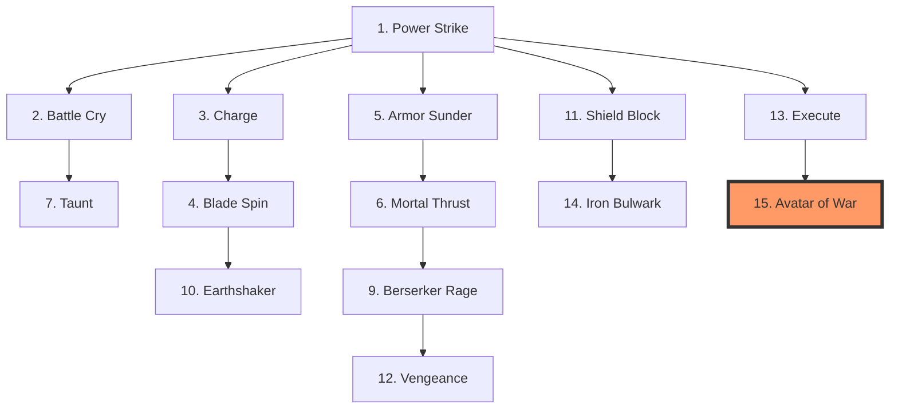

### ⚔️ Skills Ativas (15)

| #   | Nome                  | Custo    | Cooldown | Ex: Dmg (L1) | Descrição                                    | Requer   | Momento Ideal                                             |
| :-- | :-------------------- | :------- | :------- | :----------- | :------------------------------------------- | :------- | :-------------------------------------------------------- |
| 1   | **Power Strike** 🗡️   | 10 Mana  | 1 Turno  | **30**       | +50% dano no próximo ataque.                 | Nível 1  | Contra inimigos com HP cheio para abrir vantagem.         |
| 2   | **Battle Cry** 📢     | 20 Mana  | 4 Turnos | -            | +20% Attack para aliados no mesmo local.     | Nível 1  | No início do combate, quando o grupo está reunido.        |
| 3   | **Charge** ⚡         | 15 Mana  | 2 Turnos | **20**       | Carga rápida, atordoa alvo por 1 turno.      | Nível 2  | Para anular healers ou arqueiros na retaguarda.           |
| 4   | **Blade Spin** 🌪️     | 25 Mana  | 3 Turnos | **20 AoE**   | Ataque em área, atinge até 5 inimigos.       | Nível 2  | Quando cercado por múltiplos inimigos fracos (zergs).     |
| 5   | **Armor Sunder** 🛡️   | 30 Mana  | 3 Turnos | **20**       | Ignora 50% da defesa do alvo.                | Nível 3  | Contra Tanks ou Bosses de armadura pesada.                |
| 6   | **Mortal Thrust** 🗡️  | 35 Mana  | 4 Turnos | **40**       | Golpe crítico garantido (+100% dano).        | Nível 3  | Para finalizar alvos prioritários rapidamente.            |
| 7   | **Taunt** 💢          | 20 Mana  | 3 Turnos | -            | Força inimigos a atacarem o guerreiro.       | Nível 4  | Para salvar um herói frágil (Mago/Ladino) sob ataque.     |
| 8   | **Second Wind** 🌬️    | 50 Mana  | 6 Turnos | 15 HP Heal   | Recupera 30% HP instantaneamente.            | Nível 4  | Quando o HP cai abaixo de 20% e a cura aliada falha.      |
| 9   | **Berserker Rage** 💢 | 40 Mana  | 5 Turnos | **30**       | +50% Atk, -30% Def por 3 turnos.             | Nível 5  | Quando a vitória é certa, mas precisa acelerar o kill.    |
| 10  | **Earthshaker** 🌋    | 60 Mana  | 6 Turnos | **20 AoE**   | Atordoa até 5 inimigos no local por 1 turno. | Nível 5  | Para interromper múltiplas conjurações de magos inimigos. |
| 11  | **Shield Block** 🛡️   | 30 Mana  | 5 Turnos | -            | Bloqueia o próximo ataque completamente.     | Nível 6  | Antecipando um golpe pesado anunciado de um Boss.         |
| 12  | **Vengeance** 🩸      | 35 Mana  | 4 Turnos | Var.         | Dano causado = HP perdido pelo herói.        | Nível 6  | No momento de quase-morte para um contra-ataque fatal.    |
| 13  | **Execute** 💀        | 25 Mana  | 4 Turnos | Fatal        | Mata instantaneamente se Alvo HP < 15%.      | Nível 8  | Contra Bosses para evitar a fase final furiosa.           |
| 14  | **Iron Bulwark** 🧱   | 70 Mana  | 8 Turnos | -            | Imune a dano por 1 turno (imóvel).           | Nível 9  | Para segurar uma horda enquanto o time recua.             |
| 15  | **Avatar of War** 👑  | 100 Mana | 1x comb. | **60**       | Forma Gigante, +200% Atk, Ataques em Área.   | Nível 10 | Durante invasões massivas ao reino (Ciclo 4).             |

### 🛡️ Skills Passivas (15)

| #   | Passiva               | Requer   | Efeito                                | Momento Ideal (Contexto)                                        |
| :-- | :-------------------- | :------- | :------------------------------------ | :-------------------------------------------------------------- |
| 1   | **Iron Skin**         | Nível 1  | +10% Defense permanente.              | Essencial para todo Guerreiro sobreviver na frente.             |
| 2   | **Vitality**          | Nível 1  | +15% HP máximo.                       | Aumenta a janela de erro para o Curandeiro do grupo.            |
| 3   | **Menacing Presence** | Nível 2  | Inimigos priorizam atacar este herói. | Mantém o herói como o alvo principal do Boss.                   |
| 4   | **Durable**           | Nível 2  | Ignora 20% do dano de DoT.            | Contra aranhas ou cobras (veneno frequente).                    |
| 5   | **Brutal Strength**   | Nível 3  | +15% Attack permanente.               | Garante que o Tank também contribua com dano real.              |
| 6   | **Combat Regen**      | Nível 3  | Cura 3% HP a cada turno em luta.      | Sustentação em batalhas de longa duração contra Elites.         |
| 7   | **Unstoppable**       | Nível 4  | -50% duração de Stuns recebidos.      | Crítico contra inimigos que abusam de controle.                 |
| 8   | **Counter-Strike**    | Nível 4  | 15% chance de revidar ao bloquear.    | Transforma defesa absoluta em dano passivo.                     |
| 9   | **Bloodlust**         | Nível 5  | +5% Atk por kill (máx 50%).           | Em missões de extermínio de hordas baixas.                      |
| 10  | **Juggernaut**        | Nível 5  | +20% HP Max, -10% Speed.              | Para Guerreiros que focam 100% em ser parede.                   |
| 11  | **Plate Mastery**     | Nível 6  | +25% Defense, imune a knock-back.     | Impede que o Boss tire você da posição de guarda.               |
| 12  | **Last Stand**        | Nível 7  | Fica invulnerável por 1t se HP=1.     | Evita mortes por "one-shot" de bosses poderosos.                |
| 13  | **Guardian Aura**     | Nível 8  | Aliados no mesmo local +10% Defense.  | Protege o grupo quando estão todos próximos no mapa.            |
| 14  | **Weapon Master**     | Nível 9  | +20% dano com armas brancas.          | Especialização ofensiva para Guerreiros veteranos.              |
| 15  | **Battle Titan**      | Nível 10 | +30% stats quando HP < 30%.           | Transforma o Guerreiro no herói mais perigoso à beira da morte. |

---

## 🔮 MAGO (Mage) - 30 Skills

### 🗺️ Árvore de Progressão (Ativas)

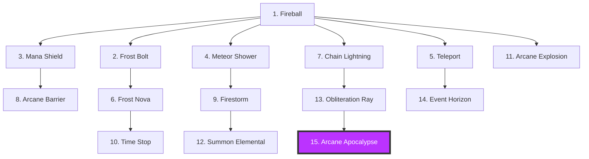

### ✨ Skills Ativas (15)

| #   | Nome                     | Custo    | Cooldown | Ex: Dmg (L1) | Descrição                                  | Requer   | Momento Ideal                                           |
| :-- | :----------------------- | :------- | :------- | :----------- | :----------------------------------------- | :------- | :------------------------------------------------------ |
| 1   | **Fireball** 🔥          | 20 Mana  | 1 Turno  | **80**       | Projétil de fogo focado.                   | Nível 1  | Dano constante contra alvos únicos de longe.            |
| 2   | **Frost Bolt** ❄️        | 25 Mana  | 2 Turnos | **60**       | Dano + Congela alvo por 1 turno.           | Nível 1  | Para prender um inimigo corpo-a-corpo perigoso.         |
| 3   | **Mana Shield** 🔮       | 30 Mana  | 3 Turnos | 150 Shield   | Absorve 150 de dano por 2 turnos.          | Nível 2  | Ativar assim que um inimigo se aproximar demais.        |
| 4   | **Meteor Shower** ☄️     | 60 Mana  | 5 Turnos | **300 AoE**  | Chuva de fogo, atinge até 5 inimigos.      | Nível 2  | Contra grupos estáticos ou grandes bosses.              |
| 5   | **Teleport** ✨          | 40 Mana  | 3 Turnos | -            | Salta p/ área s/ Fog of War (Máx 2x/dia).  | Nível 3  | Escapar de cercos ou cruzar grandes distâncias no mapa. |
| 6   | **Frost Nova** ❄️        | 50 Mana  | 4 Turnos | Stun AoE     | Congela até 5 inimigos na área.            | Nível 3  | Quando cercado por múltiplos inimigos rápidos.          |
| 7   | **Chain Lightning** ⚡   | 45 Mana  | 4 Turnos | **360 AoE**  | Salta entre até 5 alvos.                   | Nível 4  | Excelente contra grupos dispersos de arqueiros.         |
| 8   | **Arcane Barrier** 🛡️    | 35 Mana  | 4 Turnos | -            | Aliados no local +50% Defesa (2t).         | Nível 4  | Proteger o grupo durante um golpe de área do Boss.      |
| 9   | **Firestorm** 🔥         | 80 Mana  | 6 Turnos | **15/t DoT** | Queima até 5 inimigos por 3 turnos (DoT).  | Nível 5  | Controlar o fluxo de uma horda em caminho estreito.     |
| 10  | **Time Stop** ⏳         | 70 Mana  | 7 Turnos | Slow         | Lentidão (70%) em até 5 inimigos.          | Nível 5  | Para dar tempo ao grupo de recuar ou se curar.          |
| 11  | **Arcane Explosion** 💥  | 55 Mana  | 4 Turnos | **120 AoE**  | Dano em até 5 inimigos + Empurrão.         | Nível 6  | Momento "sai de perto" quando inimigos encostam.        |
| 12  | **Summon Elemental** 🕯️  | 100 Mana | 8 Turnos | Summon       | Invoca Elemental no local (Tank/DPS).      | Nível 7  | Quando o grupo precisa de um "tanque" extra na luta.    |
| 13  | **Obliteration Ray** 🔦  | 90 Mana  | 5 Turnos | **200**      | Raio contínuo (Dano consolidado em log).   | Nível 8  | Contra alvos lentos ou com muita vida.                  |
| 14  | **Event Horizon** 🕳️     | 60 Mana  | 8 Turnos | **100 AoE**  | Dano em até 5 inimigos + Reduz Esquiva.    | Nível 9  | Preparar o combo para o Arqueiro ou Ladino.             |
| 15  | **Arcane Apocalypse** 🎆 | 150 Mana | 1x comb. | **500 AoE**  | Mega explosão, atinge todos os 5 inimigos. | Nível 10 | Para limpar o mapa instantaneamente no Apocalipse.      |

### 🧙 Skills Passivas (15)

| #   | Passiva               | Requer   | Efeito                                          | Momento Ideal (Contexto)                                    |
| :-- | :-------------------- | :------- | :---------------------------------------------- | :---------------------------------------------------------- |
| 1   | **Arcane Intellect**  | Nível 1  | +20% Mana máximo permanente.                    | Essencial para permitir o uso de magias de alto tier.       |
| 2   | **Mana Flow**         | Nível 1  | +10 Mana/t fora de combate.                     | Reduz o tempo de espera entre combates na jornada.          |
| 3   | **Mana Shielding**    | Nível 2  | Converte 10% Mana em escudo natural.            | Aumenta drasticamente a sobrevivência do Mago frágil.       |
| 4   | **Elemental Mastery** | Nível 2  | +15% dano mágico permanente.                    | Escala todo o arsenal ofensivo do Mago.                     |
| 5   | **Focused Mind**      | Nível 3  | -10% custo de Mana em todas skills.             | Permite conjurar magias por mais tempo em lutas longas.     |
| 6   | **Pyromania**         | Nível 3  | +25% dano de fogo, imune a queima.              | Especialização em dano puro e controle de fogo.             |
| 7   | **Cryomancy**         | Nível 4  | +25% dano gelo, reduz lentidão.                 | Especialização em controle de grupo e sobrevivência.        |
| 8   | **Quick Cast**        | Nível 4  | -20% tempo de conjuração.                       | Reduz a janela de interrupção para magias complexas.        |
| 9   | **Spell Reflection**  | Nível 5  | Reflete 20% dano mágico recebido.               | Defesa ofensiva contra outros magos e bosses.               |
| 10  | **Endless Mana**      | Nível 5  | Regenera 2% Mana por kill.                      | Sustentação infinita durante a limpeza de hordas.           |
| 11  | **Arcane Crit**       | Nível 6  | +15% chance de Crítico Mágico.                  | Multiplica o potencial de dano explosivo do Magos.          |
| 12  | **Arcane Presence**   | Nível 7  | Aliados no mesmo local +10% Resistência Mágica. | Defesa em área útil contra ataques elementais.              |
| 13  | **Mana Siphon**       | Nível 8  | Restaura 5% Mana ao matar com spell.            | Permite manter a ofensiva sem parar para descansar.         |
| 14  | **Overload**          | Nível 9  | +50% custo Mana por +40% Dano.                  | Modo de dano extremo para o fim do jogo.                    |
| 15  | **Archmage**          | Nível 10 | +50% Mana Max, +30% Dano Mag total.             | O ápice do poder místico, definindo o "Mestre do Conclave". |

---

## 🏹 ARQUEIRO (Archer) - 30 Skills

### 🗺️ Árvore de Progressão (Ativas)

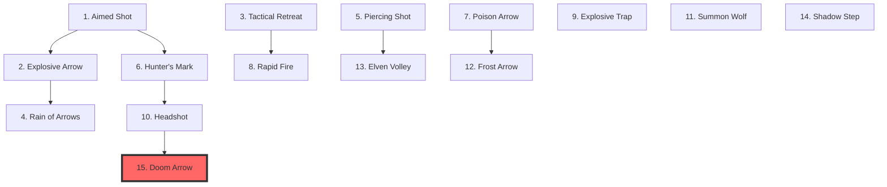

### 🎯 Skills Ativas (15)

| #   | Nome                    | Custo    | Cooldown | Ex: Dmg (L1) | Descrição                                 | Requer   | Momento Ideal                                            |
| :-- | :---------------------- | :------- | :------- | :----------- | :---------------------------------------- | :------- | :------------------------------------------------------- |
| 1   | **Aimed Shot** 🎯       | 10 Mana  | 1 Turno  | **60**       | +30% precisão.                            | Nível 1  | Contra inimigos esquivos ou voadores.                    |
| 2   | **Explosive Arrow** 💥  | 25 Mana  | 2 Turnos | **80 AoE**   | Atinge até 5 inimigos.                    | Nível 1  | Contra grupos de pequenos monstros (Goblins/Lutadores).  |
| 3   | **Tactical Retreat** 👣 | 15 Mana  | 2 Turnos | **20**       | Recua na linha de batalha + Flecha lenta. | Nível 2  | Quando um inimigo corpo-a-corpo encosta no arqueiro.     |
| 4   | **Rain of Arrows** 🏹   | 40 Mana  | 4 Turnos | **300 AoE**  | Chuva em até 5 inimigos (Log Agregado).   | Nível 2  | Limpeza massiva de área quando monstros estão agrupados. |
| 5   | **Piercing Shot** 🏹    | 20 Mana  | 1 Turno  | **60**       | Atravessa até 5 alvos.                    | Nível 3  | Inimigos em horda ou corredores estreitos.               |
| 6   | **Hunter's Mark** 🎯    | 30 Mana  | 3 Turnos | -            | Alvo marcado (Log alerta o grupo).        | Nível 3  | No início da luta contra um Boss ou monstro Elite.       |
| 7   | **Poison Arrow** ☣️     | 35 Mana  | 3 Turnos | **10/t DoT** | Envenena alvo (Status Visível F1).        | Nível 4  | Contra heróis ou monstros com muita vida.                |
| 8   | **Rapid Fire** 🏹       | 25 Mana  | 2 Turnos | **60**       | 3 flechas (Log: 3x, Dano Agregado).       | Nível 4  | Para finalizar um alvo com HP baixo rapidamente.         |
| 9   | **Explosive Trap** 🪤   | 40 Mana  | 4 Turnos | **150**      | Armadilha (Recurso de Cena) + Stun.       | Nível 5  | Posicionada defensivamente no local.                     |
| 10  | **Headshot** 💀         | 50 Mana  | 5 Turnos | **60**       | Crítico (+200%) ou Instakill.             | Nível 5  | Quando um monstro perigoso está marcado.                 |
| 11  | **Summon Wolf** 🐺      | 60 Mana  | 8 Turnos | Summon       | Invoca lobo no local para lutar.          | Nível 6  | Distrair o inimigo enquanto o arqueiro atira de longe.   |
| 12  | **Frost Arrow** ❄️      | 45 Mana  | 4 Turnos | **70**       | Congela alvo por 1 turno.                 | Nível 7  | Impedir que o Boss alcance o grupo.                      |
| 13  | **Elven Volley** 🏹     | 70 Mana  | 5 Turnos | **100**      | Rajada (5x acertos, Log Agregado).        | Nível 8  | Para explodir o dano em um único turno no Boss.          |
| 14  | **Shadow Step** 👥      | 40 Mana  | 6 Turnos | -            | +50% Esquiva e ignora defesa.             | Nível 9  | Quando sob ataque pesado ou para ignorar escudos.        |
| 15  | **Doom Arrow** 🏹       | 100 Mana | 1x comb. | **600 AoE**  | Flecha em até 5 inimigos + Stun AoE.      | Nível 10 | Golpe final épico na Fase 3 de um Boss.                  |

### 🦅 Skills Passivas (15)

| #   | Passiva                 | Requer   | Efeito                                      | Momento Ideal (Contexto)                                     |
| :-- | :---------------------- | :------- | :------------------------------------------ | :----------------------------------------------------------- |
| 1   | **Eagle Eye**           | Nível 1  | +15% Precisão, +10% Crítico.                | Garante que flechas cruciais nunca errem o alvo.             |
| 2   | **Fleet Foot**          | Nível 1  | +15% Speed.                                 | Facilita a exploração e a fuga de perigos.                   |
| 3   | **Mortal Precision**    | Nível 2  | +10% chance de crítico adicional.           | Aumenta a letalidade constante do arqueiro.                  |
| 4   | **Archer Mastery**      | Nível 2  | +15% dano com arcos.                        | Upgrade básico para manter a progressão de dano.             |
| 5   | **Evasion**             | Nível 3  | +15% chance de esquivar corpo-a-corpo.      | Sobrevivência contra assassinos e monstros rápidos.          |
| 6   | **Skirmishing**         | Nível 3  | Pode atacar e mover no mesmo turno.         | Manter a distância (Kiting) enquanto ataca.                  |
| 7   | **Sharpshooter Stance** | Nível 4  | +20% dano se parado.                        | Quando o guerreiro está segurando o Boss e você está seguro. |
| 8   | **Exploit Weakness**    | Nível 4  | +25% dano se Alvo HP < 50%.                 | Acelera a fase final da morte de monstros elites.            |
| 9   | **Ambush**              | Nível 5  | Primeiro ataque de combate +100% dano.      | Abrir combate com um tiro devastador.                        |
| 10  | **Steady Aim**          | Nível 5  | +10% Precisão, ignora esquiva inimiga.      | Contra fantasmas ou sombras (inimigos com alta esquiva).     |
| 11  | **Toxic Mastery**       | Nível 6  | Efeitos de DoT duram +1 turno.              | Maximiza o dano passivo contra Bosses.                       |
| 12  | **Feline Reflexes**     | Nível 7  | +25% Velocidade de Ação (Turnos).           | Atira mais vezes que o inimigo consegue reagir.              |
| 13  | **Natural Hunter**      | Nível 8  | +30% dano contra animais/bestas.            | Especialização para caçar monstros selvagens.                |
| 14  | **Devastating Crit**    | Nível 9  | Críticos causam +150% dano (em vez de 100). | Transforma o arqueiro em uma máquina de instakill.           |
| 15  | **Living Legend**       | Nível 10 | +40% stats durante o dia.                   | Torna o Arqueiro invencível durante as horas de sol.         |

---

## 🗝️ LADINO (Rogue) - 30 Skills

### 🗺️ Árvore de Progressão (Ativas)

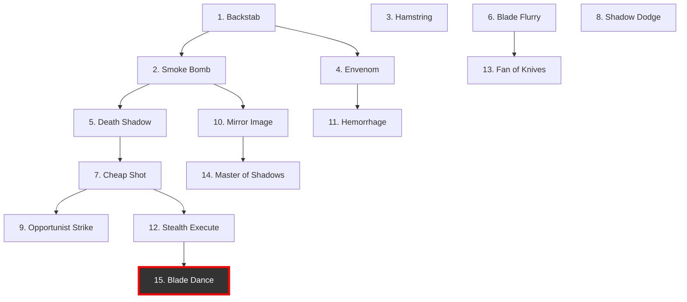

### 🔪 Skills Ativas (15)

| #   | Nome                      | Custo    | Cooldown | Ex: Dmg (L1) | Descrição                                   | Requer   | Momento Ideal                                              |
| :-- | :------------------------ | :------- | :------- | :----------- | :------------------------------------------ | :------- | :--------------------------------------------------------- |
| 1   | **Backstab** 🔪           | 10 Mana  | 1 Turno  | **30**       | +50% dano se atacar pelas costas.           | Nível 1  | Contra arqueiros ou magos distraídos focado em aliados.    |
| 2   | **Smoke Bomb** 💨         | 20 Mana  | 3 Turnos | -            | Invisível por 1 turno.                      | Nível 1  | Para cancelar o foco do inimigo ou fugir de combate fatal. |
| 3   | **Hamstring** 🦶          | 15 Mana  | 2 Turnos | **20**       | Dano e -30% Speed do alvo.                  | Nível 2  | Impedir que um inimigo fujo escape ou alcance sua vila.    |
| 4   | **Envenom** ☣️            | 25 Mana  | 3 Turnos | Poison       | Próximos 5 ataques aplicam Veneno.          | Nível 2  | No início de uma luta prolongada contra alvos resistentes. |
| 5   | **Death Shadow** 🌑       | 30 Mana  | 4 Turnos | **40**       | Força Back Attack (mesmo de frente).        | Nível 3  | Quando você não consegue flanquear o Boss fisicamente.     |
| 6   | **Blade Flurry** ⚔️       | 40 Mana  | 4 Turnos | **160**      | 8 ataques (Log Agregado: 8x).               | Nível 3  | Para causar o máximo de dano no menor tempo possível.      |
| 7   | **Cheap Shot** 👊         | 35 Mana  | 5 Turnos | **20**       | Atordoa o alvo por 1 turno.                 | Nível 4  | Para interromper uma habilidade poderosa do Boss.          |
| 8   | **Shadow Dodge** 👥       | 20 Mana  | 2 Turnos | -            | Esquiva + Recupera Mana (Aparece no Log).   | Nível 4  | Quando o inimigo usa uma skill pesada.                     |
| 9   | **Opportunist Strike** 🗡️ | 45 Mana  | 4 Turnos | **80**       | +300% dano contra alvos atordoados.         | Nível 5  | Combo imediato após o Cheap Shot ou Stun de aliado.        |
| 10  | **Mirror Image** 👥       | 60 Mana  | 6 Turnos | **10/t**     | Clones no local (Status F1).                | Nível 5  | Confundir o Boss e aumentar a pressão ofensiva.            |
| 11  | **Hemorrhage** 🩸         | 50 Mana  | 4 Turnos | **15/t DoT** | Sangramento (Status Visível F1).            | Nível 6  | Contra inimigos que regeneram HP rapidamente.              |
| 12  | **Stealth Execute** 💀    | 55 Mana  | 5 Turnos | Fatal        | Instakill se HP < 30%.                      | Nível 7  | Para finalizar Elite sem chance de reação.                 |
| 13  | **Fan of Knives** 🔪      | 70 Mana  | 5 Turnos | **400 AoE**  | 20 adagas em até 5 inimigos (Log Agregado). | Nível 8  | Quando hordas de monstros tentam cercar o ladino.          |
| 14  | **Master of Shadows** 🌑  | 40 Mana  | 6 Turnos | -            | Invisível no local +50% Speed.              | Nível 9  | Infiltração profunda ou fuga estratégica.                  |
| 15  | **Blade Dance** 💃        | 100 Mana | 1x comb. | Fatal        | Teleporte e ataque em até 5 inimigos.       | Nível 10 | Momento cinematográfico para limpar uma sala inteira.      |

### 🌑 Skills Passivas (15)

| #   | Passiva              | Requer   | Efeito                                    | Momento Ideal (Contexto)                                  |
| :-- | :------------------- | :------- | :---------------------------------------- | :-------------------------------------------------------- |
| 1   | **Stealth**          | Nível 1  | -30% chance de ser alvo (Aggro Baixo).    | Garante que o Ladino não seja o foco inicial da pancada.  |
| 2   | **Quick Fingers**    | Nível 1  | -20% cooldown em skills.                  | Permite o uso frequente de invisibilidade e venenos.      |
| 3   | **Back Attack**      | Nível 2  | +50% dano permanente se atacar por trás.  | Especialização em flanqueamento com aliados.              |
| 4   | **Dagger Mastery**   | Nível 2  | +20% dano com adagas.                     | Upgrade essencial para a progressão base de dano.         |
| 5   | **Plunder**          | Nível 3  | Maior chance de itens raros e ouro.       | Se o objetivo da partida for acumular riqueza rápida.     |
| 6   | **Lethal Poison**    | Nível 3  | DoTs de veneno causam +40% dano.          | Transforma o veneno em uma arma mortal silenciada.        |
| 7   | **Deadly Dodge**     | Nível 4  | +20% chance de esquiva permanente.        | Proteção contra ataques físicos diretos inevitáveis.      |
| 8   | **Poison Immunity**  | Nível 4  | Imune a todos os venenos.                 | Essencial em biomas de Pântano ou contra necromantes.     |
| 9   | **Critical Strike**  | Nível 5  | +25% chance de crítico permanente.        | Foco em burst damage e instakills constantes.             |
| 10  | **Acrobat**          | Nível 5  | +30% Speed permanente.                    | Torna o Ladino o herói mais rápido do reino.              |
| 11  | **Preparation**      | Nível 6  | Reduz 30% cooldowns ao iniciar combate.   | Permite usar magias potentes logo no início da luta.      |
| 12  | **Cold Blood**       | Nível 7  | +40% dano contra alvos com HP completo.   | Para deletar inimigos frágeis com um único golpe inicial. |
| 13  | **Natural Assassin** | Nível 8  | +50% dano contra alvos solitários.        | Perfeito para caçar monstros perdidos no mapa.            |
| 14  | **Living Shadow**    | Nível 9  | Regenera 6% HP/turno quando invisível.    | Permite recuperar vida sem precisar de poções ou curas.   |
| 15  | **Silent Death**     | Nível 10 | +60% dano crítico, mata e fica invisível. | Permite abates sucessivos sem nunca ser detectado.        |

---

## 🌿 DRUIDA (Druid) - 30 Skills

### 🗺️ Árvore de Progressão (Ativas)

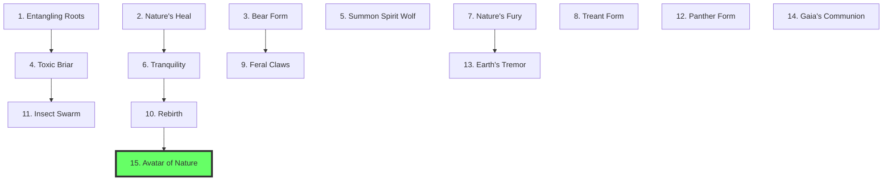

### 🍃 Skills Ativas (15)

| #   | Nome                      | Custo    | Cooldown | Ex: Dmg (L1)  | Descrição                                  | Requer   | Momento Ideal                                                        |
| :-- | :------------------------ | :------- | :------- | :------------ | :----------------------------------------- | :------- | :------------------------------------------------------------------- |
| 1   | **Entangling Roots** 🌿   | 20 Mana  | 2 Turnos | **40**        | Prende inimigo por 1 turno.                | Nível 1  | Para imobilizar um inimigo corpo-a-corpo que persegue o grupo.       |
| 2   | **Nature's Heal** 💚      | 30 Mana  | 2 Turnos | 150 HP Heal   | Cura alvo em 150 HP.                       | Nível 1  | Quando um herói Tank está com HP abaixo de 50%.                      |
| 3   | **Bear Form** 🐻          | 40 Mana  | 4 Turnos | **30**        | Vira Urso (+100% HP, +50% Atk).            | Nível 2  | Quando o Druida precisa assumir a linha de frente por falta de Tank. |
| 4   | **Toxic Briar** 🌵        | 25 Mana  | 3 Turnos | **80 + 10/t** | Espinhos em até 5 inimigos + DoT.          | Nível 2  | Criar um obstáculo em gargalos de hordas inimigos.                   |
| 5   | **Summon Spirit Wolf** 🐺 | 50 Mana  | 6 Turnos | Summon        | Invoca lobo no local por 4 turnos.         | Nível 3  | Adicionar um aliado extra para flanquear arqueiros.                  |
| 6   | **Tranquility** 🍃        | 45 Mana  | 4 Turnos | 80 HP Heal    | Cura todos os aliados no mesmo local.      | Nível 3  | Após um ataque em área massivo do Boss.                              |
| 7   | **Nature's Fury** ⚡      | 55 Mana  | 5 Turnos | **20 AoE**    | Tempestade em até 5 inimigos + Lentidão.   | Nível 4  | Para reduzir a velocidade de avanço de grandes grupos.               |
| 8   | **Treant Form** 🌳        | 30 Mana  | 4 Turnos | -             | Transformação no local (Imune a repulsão). | Nível 4  | Para se tornar uma muralha imóvel durante a defesa.                  |
| 9   | **Feral Claws** 🐾        | 35 Mana  | 3 Turnos | **200**       | 5 ataques (Log Agregado: 5x).              | Nível 5  | Para explodir o dano enquanto está em forma de urso.                 |
| 10  | **Rebirth** 🌟            | 80 Mana  | 1x comb. | 50% HP Heal   | Revive herói no local com 50% HP.          | Nível 5  | Quando o herói principal morre em uma luta crucial.                  |
| 11  | **Insect Swarm** 🐝       | 60 Mana  | 5 Turnos | **15/t DoT**  | Nuvem cega até 5 inimigos (DoT).           | Nível 6  | Contra grupos de arqueiros inimigos.                                 |
| 12  | **Panther Form** 🐈       | 45 Mana  | 5 Turnos | **30**        | Transformação no local (+80% Speed).       | Nível 7  | Para perseguição rápida ou para chegar primeiro.                     |
| 13  | **Earth's Tremor** 🌋     | 70 Mana  | 6 Turnos | **150 AoE**   | Terremoto em até 5 inimigos + Stun AoE.    | Nível 8  | Para interromper múltiplas habilidades de inimigos.                  |
| 14  | **Gaia's Communion** ✨   | 50 Mana  | 8 Turnos | -             | Buff geral p/ aliados no local.            | Nível 9  | Preparação final antes de entrar em uma sala de Boss.                |
| 15  | **Avatar of Nature** 🌲   | 120 Mana | 1x comb. | **60**        | Forma e cura em área (Aliados no local).   | Nível 10 | O ápice do poder Druídico para vencer a batalha final.               |

### 🌳 Skills Passivas (15)

| #   | Passiva                  | Requer   | Efeito                                           | Momento Ideal (Contexto)                                       |
| :-- | :----------------------- | :------- | :----------------------------------------------- | :------------------------------------------------------------- |
| 1   | **Forest Guardian**      | Nível 1  | +15% stats em florestas.                         | Torna o Druida imbatível em biomas de matas densas.            |
| 2   | **Nature's Bond**        | Nível 1  | Sobre-cura vira escudo temporário.               | Mantém o grupo protegido mesmo quando eles estão com HP cheio. |
| 3   | **Barkskin**             | Nível 2  | +12% Defense, imune a sangramento.               | Melhora a sobrevivência contra animais e monstros de corte.    |
| 4   | **Wild Instincts**       | Nível 2  | +20% Esquiva se HP < 50%.                        | Ajuda o Druida a sobreviver em situações desesperadoras.       |
| 5   | **Beast Tongue**         | Nível 3  | Pets invocados ganham +20% HP/Dmg.               | Especialização em comando de feras espirituais.                |
| 6   | **Accelerated Regen**    | Nível 3  | Regeneração passiva constante (HP).              | Reduz a dependência de poções de cura fora de combate.         |
| 7   | **Elemental Resistance** | Nível 4  | +30% resist a Fogo, Gelo, Veneno.                | Proteção vital contra ataques mágicos e ambientais.            |
| 8   | **Ancient Wisdom**       | Nível 4  | +25% Mana máximo.                                | Permite mais trocas de forma e conjurações de cura.            |
| 9   | **Shapeshifter**         | Nível 5  | Formas animais duram +50% tempo.                 | Maximiza a utilidade estratégica das transformações.           |
| 10  | **Forest Spirit**        | Nível 5  | Aliados no mesmo local ganham regeneração de HP. | Atua como uma "fonte de cura ambulante" para o grupo.          |
| 11  | **Primordial Fury**      | Nível 6  | +40% Attack em formas animais.                   | Torna o Urso e a Pantera máquinas de destruição real.          |
| 12  | **Symbiosis**            | Nível 7  | Curar aliado cura o druida em 30%.               | Mantém o herói saudável enquanto ele cuida dos outros.         |
| 13  | **Deep Roots**           | Nível 8  | Imune a empurrões e repulsão.                    | Mantém o Druida na posição estratégica desejada.               |
| 14  | **Master Shapeshifter**  | Nível 9  | Troca de forma sem cooldown (1x/t).              | Versatilidade total para adaptar a tática no meio da luta.     |
| 15  | **One with Nature**      | Nível 10 | Buff extremo em Lua Cheia + Reviver.             | O Druida se torna uma força da natureza imparável.             |

---

## 🏹 ELFO (Elf) - 30 Skills

### 🗺️ Árvore de Progressão (Ativas)

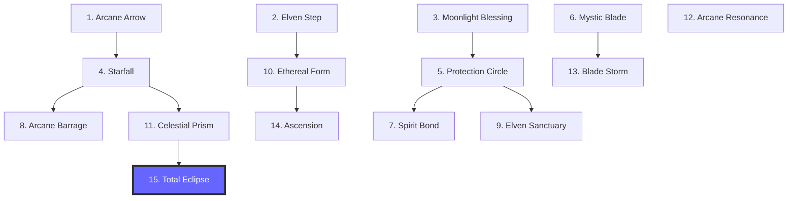

### ✨ Skills Ativas (15)

| #   | Nome                      | Custo    | Cooldown | Ex: Dmg (L1) | Descrição                                      | Requer   | Momento Ideal                                              |
| :-- | :------------------------ | :------- | :------- | :----------- | :--------------------------------------------- | :------- | :--------------------------------------------------------- |
| 1   | **Arcane Arrow** 🏹       | 15 Mana  | 1 Turno  | **70**       | Flecha mágica que penetra defesa.              | Nível 1  | Contra inimigos com alta armadura (como Golems).           |
| 2   | **Elven Step** ✨         | 20 Mana  | 2 Turnos | **26**       | Salta p/ área s/ Fog of War (Máx 2x/dia).      | Nível 1  | Para flanquear o inimigo e ganhar vantagem estratégica.    |
| 3   | **Moonlight Blessing** 🌙 | 30 Mana  | 3 Turnos | -            | +20% Speed para o grupo no local.              | Nível 2  | No início de uma caçada para chegar antes ao alvo.         |
| 4   | **Starfall** 💫           | 50 Mana  | 4 Turnos | **350 AoE**  | 10 projéteis teleguiados (Log Agregado).       | Nível 2  | Quando inimigos estão dispersos e você quer atingir todos. |
| 5   | **Protection Circle** 🛡  | 40 Mana  | 4 Turnos | -            | +40% Defense p/ aliados no local.              | Nível 3  | Durante uma defesa de posição imóvel contra hordas.        |
| 6   | **Mystic Blade** 🗡️       | 25 Mana  | 3 Turnos | **36**       | Espada de energia no local por 3 turnos.       | Nível 3  | Quando o inimigo fecha a distância.                        |
| 7   | **Spirit Bond** 🔗        | 45 Mana  | 5 Turnos | -            | Link de dano/cura com aliado no local.         | Nível 4  | Para proteger o Tank do grupo, dividindo o fardo.          |
| 8   | **Arcane Barrage** 🏹     | 35 Mana  | 2 Turnos | **240**      | 6 flechas rápidos (Log Agregado: 6x).          | Nível 4  | Para matar um inimigo específico instantaneamente.         |
| 9   | **Elven Sanctuary** 🌿    | 60 Mana  | 6 Turnos | 20 HP/t Heal | Zona local de cura + Resistência Mágica.       | Nível 5  | Refúgio seguro para o grupo se recuperar.                  |
| 10  | **Ethereal Form** 👻      | 50 Mana  | 5 Turnos | -            | Imune a físico (Status Visível F1).            | Nível 5  | Ativar quando um inimigo pesado investir contra você.      |
| 11  | **Celestial Prism** 💎    | 70 Mana  | 5 Turnos | **500 AoE**  | Raio que divide em 5 inimigos (Log Narrativo). | Nível 6  | Em combates contra múltiplos inimigos de HP médio.         |
| 12  | **Arcane Resonance** 🌀   | 55 Mana  | 5 Turnos | -            | Próximas 3 skills do Elfo custam 0 Mana.       | Nível 7  | Preparar o terreno para usar magias poderosas.             |
| 13  | **Blade Storm** 🌪️        | 65 Mana  | 5 Turnos | **80 AoE**   | Lâminas em até 5 inimigos no local.            | Nível 8  | Quando cercado por inimigos fracos.                        |
| 14  | **Ascension** 👼          | 80 Mana  | 8 Turnos | -            | Levita (Status F1) + Magias instantâneas.      | Nível 9  | Modo de dominação total atacando de cima.                  |
| 15  | **Total Eclipse** 🌒      | 150 Mana | 1x comb. | Blind AoE    | Cega até 5 inimigos no local por 3 turnos.     | Nível 10 | Para ganhar a vantagem definitiva em uma luta de Boss.     |

### 🌟 Skills Passivas (15)

| #   | Passiva                  | Requer   | Efeito                                              | Momento Ideal (Contexto)                                      |
| :-- | :----------------------- | :------- | :-------------------------------------------------- | :------------------------------------------------------------ |
| 1   | **Elven Grace**          | Nível 1  | +25% Speed permanente.                              | Torna o Elfo o mestre da movimentação no campo.               |
| 2   | **Mystic Vision**        | Nível 1  | Detecta invisíveis e ocultos.                       | Crítico contra Ladinos inimigos ou monstros que se escondem.  |
| 3   | **Longevity**            | Nível 2  | +20% HP máximo, imune a doenças.                    | Aumenta a resistência do Elfo para expedições longas.         |
| 4   | **Arcane Affinity**      | Nível 2  | +20% dano mágico permanente.                        | Multiplica o efeito de todas as flechas e lâminas místicas.   |
| 5   | **Supernatural Evasion** | Nível 3  | +18% chance de esquivar permanente.                 | Melhora a defesa passiva do herói sem gastar mana.            |
| 6   | **Ancestral Wisdom**     | Nível 3  | +30% Mana max, -10% custo skills.                   | Permite que o Elfo atue por mais tempo com magia.             |
| 7   | **Elven Precision**      | Nível 4  | +15% Crítico + Penetra Defesa.                      | Garante que cada tiro conte contra inimigos de elite.         |
| 8   | **Lunar Protection**     | Nível 4  | +15% stats durante a noite.                         | Torna o Elfo a escolha perfeita para missões noturnas.        |
| 9   | **Magic Harmony**        | Nível 5  | Regenera 3% Mana por skill usada.                   | Sustentação de mana infinita se o herói for bem gerenciado.   |
| 10  | **Shadow Cloak**         | Nível 5  | +15% Esquiva contra magia/flechas.                  | Proteção contra outros atacantes à distância.                 |
| 11  | **Arcane Resilience**    | Nível 6  | +35% Resistência Mágica.                            | Torna o Elfo um "Anti-Mago" nato.                             |
| 12  | **Soul Link**            | Nível 7  | Quando aliado morre, ganha +50% dano (10 Turnos).   | Vingança poderosa para virar uma luta perdida.                |
| 13  | **Arcane Master**        | Nível 8  | Cooldowns reduzidos em 15%.                         | Aumenta a frequência de uso de habilidades poderosas.         |
| 14  | **Elven Immortality**    | Nível 9  | Revive com 1 HP ao morrer (1x/10 min (200 Turnos)). | Evita mortes acidentais por erros de posicionamento.          |
| 15  | **Transcendence**        | Nível 10 | +60% Mana, +40% Dano, Custo 50%.                    | O estado de perfeição elfo, dominante em todas as distâncias. |

---

## Sistema de Desbloqueio e Economia

O progresso de poder no reino é dividido em duas etapas econômicas distintas.

### 1. Pesquisa Real (O Rei paga para Desbloquear)

O Rei investe no "conhecimento" da guilda. Sem isso, nenhum herói verá a skill disponível para venda.

### 2. Contratação Individual (O Herói paga para Aprender)

O Herói usa o ouro que acumulou em caçadas ou trabalho para comprar a skill da guilda. A escolha é baseada na **IA e Personalidade (PECMA)**: heróis mais proativos compram skills assim que podem; heróis mais gananciosos podem demorar mais para investir.

**Tabela de Categorias e Custos:**

A "Categoria" representa o grupo de skills conforme sua posição nas tabelas (ID #1 a #15).

| Categoria da Skill | Posição (#) na Tabela | Nível do Herói | Custo (Rei) | Preço (Herói) |
| :----------------- | :-------------------- | :------------- | :---------- | :------------ |
| **Básicas**        | Skills #1 a #5        | Nível 1 - 2    | 250g        | 100g          |
| **Intermediárias** | Skills #6 a #10       | Nível 3 - 5    | 750g        | 300g          |
| **Avançadas**      | Skills #11 a #13      | Nível 6 - 8    | 2.000g      | 800g          |
| **Elite**          | Skill #14             | Nível 9        | 4.000g      | 1.500g        |
| **Lendária (Ult)** | Skill #15             | Nível 10       | 10.000g     | 5.000g        |

**Legenda de Termos:**

- **Posição (#):** Refere-se ao número identificador da skill em cada tabela de classe abaixo (exemplo: Active #1 ou Passive #1).
- **Custo (Rei):** Gasto único do Tesouro Real para habilitar a skill na guilda para SEMPRE.
- **Preço (Herói):** O que cada herói paga individualmente para ter direito a usar aquela skill (pago apenas uma vez pelo herói).
- **1x comb.:** Abreviação de "1 vez por combate". A skill só pode ser usada uma única vez em cada encontro de batalha.

### Árvore de Dependências

```
Skills seguem hierarquia:
- Básicas (Nível 1) → Intermediárias → Avançadas → Ultimate

Exemplo (Warrior):
Power Strike (Lvl 1)
    ↓
Battle Cry (Lvl 2)
    ↓
Taunt (Lvl 4)
    ↓
Menacing Presence (Passiva, Lvl 6)
```

### Interface no F2 (ADMIN)

No workspace F2, painel P2 mostra a árvore de skills interativa onde o Majesty pode:

- Ver quais skills estão disponíveis para pesquisa
- Desbloquear novas skills gastando **Ouro**
- Ver pré-requisitos e custos de manutenção da guilda

---

## Balanceamento

**Filosofia de Design:**

- **Skills Ativas**: Impacto imediato, requerem timing e estratégia
- **Skills Passivas**: Poder crescente, modificam playstyle permanentemente
- **Ultimates**: Extremamente poderosas, cooldowns longos, definem momentos épicos

**Progressão Esperada:**

- Dia 1-50: 10-15 skills desbloqueadas
- Dia 51-100: 20-25 skills desbloqueadas
- Dia 101-150: 25-28 skills desbloqueadas
- Dia 151-200: Chance de desbloquear todas 30 (partida perfeita)

---

# Skills das Novas Classes

## 🛡️ PALADINO (Paladin) - 30 Skills

### 🗺️ Árvore de Progressão (Ativas)

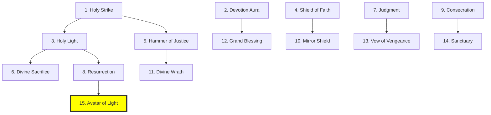

### ⚔️ Skills Ativas (15)

| #   | Nome                     | Custo    | Cooldown | Ex: Dmg (L1) | Descrição                                        | Requer   | Momento Ideal                                                 |
| :-- | :----------------------- | :------- | :------- | :----------- | :----------------------------------------------- | :------- | :------------------------------------------------------------ |
| 1   | **Holy Strike** ⚔️       | 15 Mana  | 1 Turno  | **70**       | Ataque sagrado + auto-cura.                      | Nível 1  | Combate constante para manter a vida alta sem ajuda.          |
| 2   | **Devotion Aura** 🛡️     | 20 Mana  | Passiva  | -            | +15% Defesa para aliados (Passiva Sustentada).   | Nível 1  | Sempre ativa para proteger o grupo em formação fechada.       |
| 3   | **Holy Light** ✨        | 30 Mana  | 2 Turnos | 200 HP Heal  | Cura um aliado em 200 HP.                        | Nível 2  | Salvar o Guerreiro ou Ladino em perigo imediato.              |
| 4   | **Shield of Faith** 🛡️   | 25 Mana  | 3 Turnos | 250 Shield   | Escudo de 250 de absorção (2t).                  | Nível 2  | Ativar em si mesmo antes de entrar em uma área perigosa.      |
| 5   | **Hammer of Justice** 🔨 | 35 Mana  | 3 Turnos | **100**      | 100 Dano + Stun 1 turno.                         | Nível 3  | Para interromper um Boss prestes a usar uma skill forte.      |
| 6   | **Divine Sacrifice** 🩸  | 40 Mana  | 4 Turnos | -            | Transfere 50% do dano do aliado para o Paladino. | Nível 3  | Quando o curandeiro não consegue dar conta do dano no Tank.   |
| 7   | **Judgment** ⚖️          | 45 Mana  | 4 Turnos | **32**       | Marca inimigo, +60% dano contra ele.             | Nível 4  | Focar o dano do grupo em um Alvo Prioritário ou Boss.         |
| 8   | **Resurrection** 🕊️      | 80 Mana  | 1x comb. | 70% HP Heal  | Revive herói com 70% HP.                         | Nível 4  | Reverter uma morte crítica no meio de uma batalha épica.      |
| 9   | **Consecration** 🌞      | 50 Mana  | 5 Turnos | Debuff AoE   | Até 5 inimigos no local (-30% Atk).              | Nível 5  | Para mitigar o dano de hordas de mortos-vivos.                |
| 10  | **Mirror Shield** 🪞     | 55 Mana  | 5 Turnos | -            | Reflete ataques (Status Visível F1).             | Nível 5  | Quando o Boss foca o Paladino with ataques rápidos.           |
| 11  | **Divine Wrath** ⚡      | 60 Mana  | 5 Turnos | **40**       | +100% Atk e recuperação de Mana.                 | Nível 6  | Quando o Paladino precisa assumir o papel de executor.        |
| 12  | **Grand Blessing** 🌟    | 70 Mana  | 6 Turnos | -            | Aliados no local +30% stats.                     | Nível 7  | Pré-requisito para iniciar uma investida contra o Boss final. |
| 13  | **Vow of Vengeance** 🩸  | 65 Mana  | 6 Turnos | **50**       | Buff de morte (Aliado no mesmo local).           | Nível 8  | Para evitar que a morte de um amigo resulte em derrota total. |
| 14  | **Sanctuary** 🏰         | 75 Mana  | 8 Turnos | -            | Zona local, aliados -80% dano (1t).              | Nível 9  | Sobrevivência de último segundo contra um "Wipe".             |
| 15  | **Avatar of Light** 👼   | 150 Mana | 1x comb. | **60**       | Forma e cura em área (Aliados no local).         | Nível 10 | Ativar no clímax da invasão para garantir a vitória do reino. |

### 🛡️ Skills Passivas (15)

| #   | Passiva                | Requer   | Efeito                                        | Momento Ideal (Contexto)                                        |
| :-- | :--------------------- | :------- | :-------------------------------------------- | :-------------------------------------------------------------- |
| 1   | **Unwavering Faith**   | Nível 1  | +15% HP Max, +10% Defense.                    | Reforça a base de sobrevivência do herói sagrado.               |
| 2   | **Devotion Gain**      | Nível 1  | Ganha 10 Mana ao ser atingido.                | Mantém o herói com recursos enquanto apanha dos inimigos.       |
| 3   | **Martyr**             | Nível 2  | +20% Defense se HP < 30%.                     | Torna o herói mais difícil de matar quanto mais perto da morte. |
| 4   | **Natural Protector**  | Nível 2  | Aliados no mesmo local recebem -15% dano.     | Melhora a eficiência da aura protetora natural.                 |
| 5   | **Holy Regen**         | Nível 3  | Cura 5% HP máximo a cada turno.               | Sustentação passiva inigualável para o Paladino.                |
| 6   | **Unshakable Justice** | Nível 3  | Imune a Medo e Corrupção.                     | Fundamental em combates contra Necromantes e Liches.            |
| 7   | **Avenger**            | Nível 4  | +30% dano contra Undead/Demônios.             | Especialização para purgar o mal supremo do mapa.               |
| 8   | **Eternal Blessing**   | Nível 4  | Começa combate com +20% stats (3t).           | Garante uma vantagem explosiva em cada novo encontro.           |
| 9   | **Divine Rebirth**     | Nível 5  | Revive com 30% HP (1x por partida).           | Segunda chance automática para o baluarte do reino.             |
| 10  | **Guardian Shield**    | Nível 5  | Bloqueia ataques para aliados no mesmo local. | Atuação como o protetor supremo dos heróis mais fracos.         |
| 11  | **Expanded Aura**      | Nível 6  | Auras afetam **todo o Local (+Adjacentes)**.  | Protege o grupo mesmo quando eles se espalham um pouco.         |
| 12  | **Devoted**            | Nível 7  | Curas custam -20% Mana.                       | Permite economizar mana para habilidades de ataque e aura.      |
| 13  | **Bastion**            | Nível 8  | +50% Defense se não mover por 1 Turno.        | Invicto em lutas contra inimigos que não têm repulsão.          |
| 14  | **Purification**       | Nível 9  | Remove todos debuffs a cada 4 turnos.         | Auto-sustento contra venenos, pragas e lentidões.               |
| 15  | **Holy Warrior**       | Nível 10 | +40% stats, imune a críticos.                 | O Paladino se torna o guerreiro definitivo da luz.              |

---

## 💀 NECROMANTE (Necromancer) - 30 Skills

### 🗺️ Árvore de Progressão (Ativas)

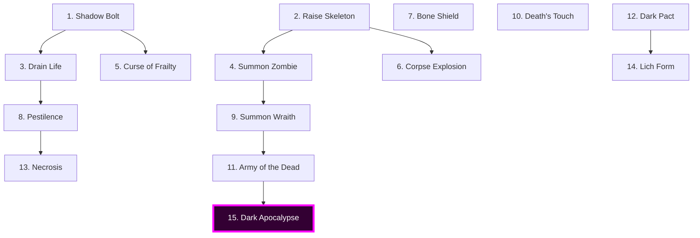

### 🌑 Skills Ativas (15)

| #   | Nome                      | Custo    | Cooldown | Ex: Dmg (L1) | Descrição                                           | Requer   | Momento Ideal                                                     |
| :-- | :------------------------ | :------- | :------- | :----------- | :-------------------------------------------------- | :------- | :---------------------------------------------------------------- |
| 1   | **Shadow Bolt** 🌑        | 20 Mana  | 1 Turno  | **75**       | Projétil sombrio, 75 dano necrótico, drena 20 HP    | Nível 1  | Contra inimigos com pouco HP para se curar rápido.                |
| 2   | **Raise Skeleton** 💀     | 30 Mana  | 1 Turno  | Summon       | Transforma cadáver em Esqueleto (dura 8 Turnos)     | Nível 1  | Assim que o herói ou aliado mata o primeiro inimigo da horda.     |
| 3   | **Drain Life** 🔋         | 25 Mana  | 2 Turnos | **40/t**     | Canaliza 1 Turno, drena 40 HP/t do alvo             | Nível 2  | Quando o Necromante está sob foco e precisa de sustento contínuo. |
| 4   | **Summon Zombie** 🧟      | 50 Mana  | 4 Turnos | Summon       | Invoca Zumbi resistente (dura 10 Turnos)            | Nível 2  | Adicionar uma linha de defesa extra contra o Boss.                |
| 5   | **Curse of Frailty** 📉   | 30 Mana  | 3 Turnos | Debuff       | Alvo perde -40% Attack por 3 Turnos                 | Nível 3  | Contra heróis ataucantes ou monstros elite de alto dano físico.   |
| 6   | **Corpse Explosion** 💥   | 40 Mana  | 3 Turnos | **150 AoE**  | Detona cadáver (Recurso Cena), atinge 5 inimigos.   | Nível 3  | Quando hordas de monstros pequenos cercam um corpo.               |
| 7   | **Bone Shield** 🛡️        | 35 Mana  | 4 Turnos | 200 Shield   | Escudo (Status Visível F1).                         | Nível 4  | Ativação constante para compensar o HP baixo.                     |
| 8   | **Pestilence** ☣️         | 45 Mana  | 5 Turnos | **10/t DoT** | Atinge até 5 inimigos no local com DoT.             | Nível 4  | Para "sujar" o campo de batalha e causar dano em todos os alvos.  |
| 9   | **Summon Wraith** 👻      | 70 Mana  | 6 Turnos | Summon       | Invoca fantasma no local (Ignora Defesa).           | Nível 5  | Contra inimigos com armaduras de placas.                          |
| 10  | **Death's Touch** 💀      | 50 Mana  | 4 Turnos | Fatal        | Instakill inimigo não-elite (Status Alvo F1).       | Nível 5  | Rapidez para remover magos ou curandeiros inimigos.               |
| 11  | **Army of the Dead** 🧟‍♂️🧟‍♀️ | 100 Mana | 1x comb. | Summon x3    | Invoca 3 esqueletos no local (6 Turnos).            | Nível 6  | Momento crucial de uma luta de larga escala ou invasão.           |
| 12  | **Dark Pact** 🩸          | 60 Mana  | 5 Turnos | **36**       | Sacrifício p/ Buff mágico (Status F1).              | Nível 7  | Quando o Mago inimigo está exposto para um burst fatal.           |
| 13  | **Necrosis** 🦴           | 55 Mana  | 5 Turnos | **80/t DoT** | DoT massivo, gera cadáver ao finalizar.             | Nível 8  | Contra alvos únicos de muita vida para derretê-los.               |
| 14  | **Lich Form** 🧙‍♂️          | 80 Mana  | 8 Turnos | **40**       | Transformação em Lich no local (Status F1).         | Nível 9  | Escapar de assassinos ou tanks heróis inimigos.                   |
| 15  | **Dark Apocalypse** 🌋    | 200 Mana | 1x comb. | Summon Max   | Reanima TODOS os cadáveres do local (Máx 3 corpos). | Nível 10 | Preparar um exército imortal para o cerco final.                  |

### 💀 Skills Passivas (15)

| #   | Passiva                  | Requer   | Efeito                                     | Momento Ideal (Contexto)                                               |
| :-- | :----------------------- | :------- | :----------------------------------------- | :--------------------------------------------------------------------- |
| 1   | **Soul Harvest**         | Nível 1  | Ganha 25 Mana ao matar.                    | Sustentação infinita de mana durante a limpeza do mapa.                |
| 2   | **Shadow Essence**       | Nível 1  | +25% Mana máximo permanente.               | Essencial para gerenciar múltiplas invocações e magias.                |
| 3   | **Minion Mastery**       | Nível 2  | Invocações +50% HP e Attack.               | Cria lacaios que podem realmente peitar monstros elites.               |
| 4   | **Necrotic Mastery**     | Nível 2  | +20% dano necrótico permanente.            | Escala todo o arsenal de sombras do herói.                             |
| 5   | **Vital Siphon**         | Nível 3  | Spells curam 15% do dano causado.          | Transforma cada ataque em uma fonte de sobrevivência.                  |
| 6   | **Undead Resilience**    | Nível 3  | +30% resist a necrótico/veneno.            | Proteção contra as próprias magias e inimigos sombrios.                |
| 7   | **Chain Detonation**     | Nível 4  | Explosão de corpos gera reações em cadeia. | Limpa salas inteiras de monstros fracos em poucos Turnos.              |
| 8   | **Minion Longevity**     | Nível 4  | Invocações duram +50% tempo.               | Reduz o custo de mana por Turno de serviço dos servos.                 |
| 9   | **Undying Essence**      | Nível 5  | Regenera 10 Mana/turno constante.          | Garante que o Necromante nunca fique totalmente desarmado.             |
| 10  | **Necrotic Aura**        | Nível 5  | Inimigos no local perdem 4% HP/t.          | Dano passivo que acumula muito em lutas longas.                        |
| 11  | **Eternal Pact**         | Nível 6  | Dark Pact não gasta HP, sacrifica servos.  | Melhor estratégia quando se tem many summons ativos.                   |
| 12  | **Lord of the Dead**     | Nível 7  | Servos +30% stats (Max 3 servos).          | Especialização em um pequeno grupo de servos elite.                    |
| 13  | **Immortal**             | Nível 8  | Vira Lich por 2 turnos ao morrer.          | Permite um último esforço desesperado ou contra-ataque antes da morte. |
| 14  | **Dark Synergy**         | Nível 9  | Cada servo vivo +10% dano mágico.          | Recompensa manter suas invocações vivas e protegidas.                  |
| 15  | **Overlord of Darkness** | Nível 10 | +100% Mana, Servos revivem 1x.             | O Necromante se torna o Deus-Rei dos Mortos-Vivos.                     |

---

## 🎵 BARDO (Bard) - 30 Skills

### 🗺️ Árvore de Progressão (Ativas)

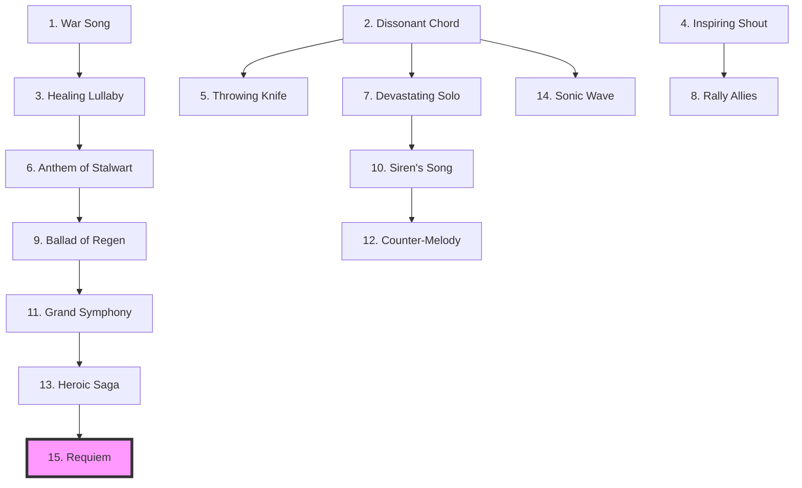

### 🎶 Skills Ativas (15)

| #   | Nome                      | Custo    | Cooldown   | Ex: Dmg (L1) | Descrição                                      | Requer   | Momento Ideal                                            |
| :-- | :------------------------ | :------- | :--------- | :----------- | :--------------------------------------------- | :------- | :------------------------------------------------------- |
| 1   | **War Song** 🎸           | 15 Mana  | Sustentada | **24 Buff**  | Aliados no mesmo local ganham +20% Attack.     | Nível 1  | Durante toda a fase ofensiva de um combate em grupo.     |
| 2   | **Dissonant Chord** 🎶    | 20 Mana  | 1 Turno    | **60**       | Ataca 1 inimigo + Confunde por 1 turno.        | Nível 1  | Para desviar a atenção de um oponente perigoso.          |
| 3   | **Healing Lullaby** 💤    | 25 Mana  | Sustentada | AoE Heal     | Aliados no mesmo local curam HP por turno.     | Nível 2  | Quando múltiplos aliados estão feridos no local.         |
| 4   | **Inspiring Shout** 📢    | 30 Mana  | 4 Turnos   | -            | Aliados no local ganham +30% Speed (3t).       | Nível 2  | Iniciar uma investida ou ajudar na fuga rápida.          |
| 5   | **Throwing Knife** 🔪     | 20 Mana  | 1 Turno    | **150**      | 3 facas (Log: 3x, Dano Agregado).              | Nível 3  | Finalizar inimigos distantes.                            |
| 6   | **Anthem of Stalwart** 🛡️ | 35 Mana  | Sustentada | -            | Aliados no local ganham +30% Defense.          | Nível 3  | Quando o grupo está sob fogo pesado no local.            |
| 7   | **Devastating Solo** 🎸   | 40 Mana  | 4 Turnos   | **480 AoE**  | Atinge os 5 inimigos no local.                 | Nível 4  | Limpar um grupo de inimigos agrupados ao redor do Bardo. |
| 8   | **Rally Allies** 🎺       | 40 Mana  | 5 Turnos   | -            | Aliado no local ganha Turno Extra Imediato.    | Nível 4  | Momento decisivo para finalizar o Boss.                  |
| 9   | **Ballad of Regen** 🌿    | 50 Mana  | Sustentada | AoE Regen    | Aliados no local regeneram HP por turno.       | Nível 5  | Manter o grupo saudável durante lutas de desgaste.       |
| 10  | **Siren's Song** 🧜‍♀️       | 45 Mana  | 5 Turnos   | -            | Encanta os 5 inimigos no local (Perdem turno). | Nível 5  | Para neutralizar heróis inimigos temporariamente.        |
| 11  | **Grand Symphony** 🎼     | 60 Mana  | 6 Turnos   | **28 Buff**  | Aliados no local ganham +40% stats (3t).       | Nível 6  | O "buff de vitória" usado antes da investida final.      |
| 12  | **Counter-Melody** 🔇     | 50 Mana  | 5 Turnos   | -            | Cancela buffs inimigos no mesmo local.         | Nível 7  | Contra Bosses que usam buffs de escudo ou dano massivo.  |
| 13  | **Heroic Saga** 📖        | 70 Mana  | 8 Turnos   | -            | Aliado no local ignora 2 ataques.              | Nível 8  | Proteger o herói mais importante em um momento crítico.  |
| 14  | **Sonic Wave** 🔊         | 80 Mana  | 6 Turnos   | **200 AoE**  | Empurra os 5 inimigos no local (Log: Recuo).   | Nível 9  | Para afastar inimigos da vila ou postos.                 |
| 15  | **Requiem** 💀            | 150 Mana | 1x comb.   | **40 Buff**  | Inimigos -50%, Aliados +100% (No local).       | Nível 10 | A cartada final para garantir a dominação total.         |

### 🎵 Skills Passivas (15)

| #   | Passiva               | Requer   | Efeito                                         | Momento Ideal (Contexto)                                           |
| :-- | :-------------------- | :------- | :--------------------------------------------- | :----------------------------------------------------------------- |
| 1   | **Inspiration Gain**  | Nível 1  | Ganha 20 Mana ao ver kill de aliado.           | Permite que o Bardo nunca pare de cantar durante o combate.        |
| 2   | **Charismatic**       | Nível 1  | +30% afinidade natural com heróis.             | Acelera a formação de grupos e combos de afinidade.                |
| 3   | **Musical Reach**     | Nível 2  | Canções afetam **todo o Local**.               | Protege aliados que lutam na retaguarda ou estão distantes.        |
| 4   | **Multitasking**      | Nível 2  | Pode cantar e atacar simultaneamente.          | Garante que o Bardo contribua com dano sem cessar o suporte.       |
| 5   | **Sonic Mastery**     | Nível 3  | +15% dano sonoro permanente.                   | Melhora as magias ofensivas do Bardo.                              |
| 6   | **Natural Performer** | Nível 3  | Canções custam -20% Mana.                      | Eficiência econômica para expedições de longa duração.             |
| 7   | **Performance Speed** | Nível 4  | Canções têm efeito 50% mais rápido.            | Reação tática veloz a mudanças no campo de batalha.                |
| 8   | **Auto-Inspiration**  | Nível 4  | Regenera 20 Mana/turno em grupo.               | Mantém o herói sempre pronto para a próxima composição.            |
| 9   | **Resonance**         | Nível 5  | Canções duram +1 turno após parar.             | Permite trocar de música sem perder o buff anterior imediatamente. |
| 10  | **High Morale**       | Nível 5  | Aliados no mesmo local nunca fogem de medo.    | Essencial em lutas contra o Dragão ou Necromantes.                 |
| 11  | **Virtuoso**          | Nível 6  | Mantém 2 canções simultâneas.                  | Dobra a utilidade tática do Bardo para o reino.                    |
| 12  | **Charisma Aura**     | Nível 7  | Grupos formam 3x mais rápido na taverna.       | Logística acelerada para novas expedições e ataques.               |
| 13  | **Chorus Influence**  | Nível 8  | Cada aliado no mesmo local +15% efeito canção. | Recompensa manter o reino unido e lutar em grandes exércitos.      |
| 14  | **Eternal Echo**      | Nível 9  | Canção dura +4t se o Bardo morrer.             | Um último presente heróico para o grupo vencer a luta.             |
| 15  | **Living Legend**     | Nível 10 | +50% XP Aliados, +100% Mana Regen.             | O Bardo se torna o farol de progresso de todo o reino.             |

---

## 👊 MONGE (Monk) - 30 Skills

### 🗺️ Árvore de Progressão (Ativas)

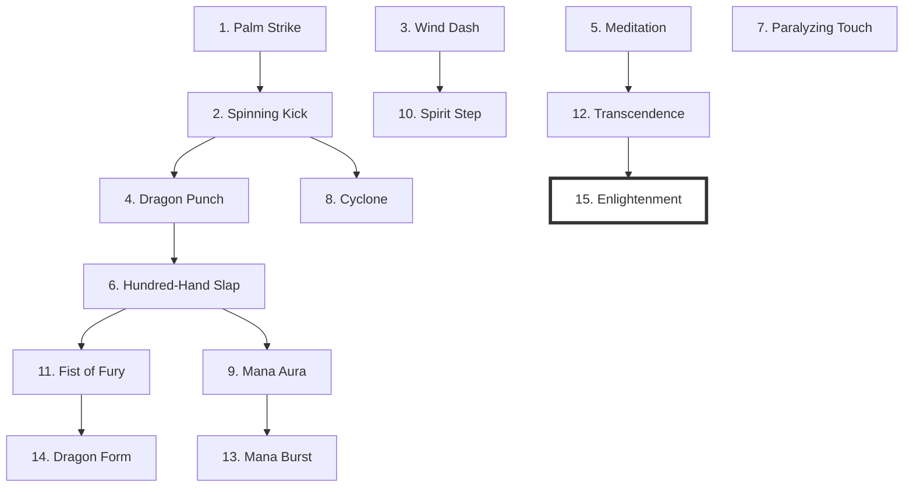

### 🥋 Skills Ativas (15)

| #   | Nome                     | Custo    | Cooldown | Ex: Dmg (L1) | Descrição                                                 | Requer   | Momento Ideal                                             |
| :-- | :----------------------- | :------- | :------- | :----------- | :-------------------------------------------------------- | :------- | :-------------------------------------------------------- |
| 1   | **Palm Strike** 👊       | 10 Mana  | 1 Turno  | **55**       | Soco rápido, 55 dano, gera 1 combo                        | Nível 1  | Início da sequência para acumular combos rapidamente.     |
| 2   | **Spinning Kick** 🦵     | 15 Mana  | 1 Turno  | **280 AoE**  | Ataque 360°, 70 dano, atinge até 4 inimigos               | Nível 1  | Combater múltiplos inimigos que cercaram o Monge.         |
| 3   | **Wind Dash** 💨         | 20 Mana  | 1 Turno  | -            | Teleporta para **qualquer ponto do Local**, gera 2 combos | Nível 2  | Para se aproximar instantaneamente de alvos à distância.  |
| 4   | **Dragon Punch** 🐉      | 25 Mana  | 2 Turnos | **120**      | 3 socos rápidos (ação única), 40 dano cada, gera 3 combos | Nível 2  | Contra alvos únicos para maximizar o acúmulo de recursos. |
| 5   | **Meditation** 🧘        | 0 Mana   | 4 Turnos | -            | Regenera 50 Mana, gasta turno                             | Nível 3  | Momento de pausa segura para restaurar energia vital.     |
| 6   | **Hundred-Hand Slap** ✋ | 30 Mana  | 3 Turnos | **200**      | Ataque frenético em alvo único, 10 hits                   | Nível 3  | Descarregar o burst de dano em um oponente imobilizado.   |
| 7   | **Paralyzing Touch** 🧪  | 35 Mana  | 3 Turnos | -            | Paralisa inimigo por 1 Turno                              | Nível 4  | Garantir que um monstro perigoso perca sua vez de ataque. |
| 8   | **Cyclone** 🌪️           | 40 Mana  | 4 Turnos | **100 AoE**  | Gira e atinge todos os 5 inimigos no local.               | Nível 4  | Limpeza de área eficiente quando cercado.                 |
| 9   | **Mana Aura** ✨         | 45 Mana  | 4 Turnos | -            | Buff action speed (Status F1), consome combo.             | Nível 5  | Acelerar seus turnos para dominar a luta.                 |
| 10  | **Spirit Step** 🌌       | 50 Mana  | 5 Turnos | -            | Salta p/ área s/ Fog of War (Máx 2x/dia).                 | Nível 5  | Movimentação tática livre pelo mapa.                      |
| 11  | **Fist of Fury** 👊💥    | 60 Mana  | 5 Turnos | **300**      | Golpe massivo (Bônus de combo agregado no Log).           | Nível 6  | Finalizar um oponente when estiver com 10 combos.         |
| 12  | **Transcendence** 💎     | 70 Mana  | 8 Turnos | -            | Imunidade no local (Status Visível F1).                   | Nível 7  | Escapar de uma armadilha fatal ou golpe inevitável.       |
| 13  | **Mana Burst** 💥        | 80 Mana  | 5 Turnos | **900 AoE**  | Libera Mana em todos os 5 inimigos + Empurrão.            | Nível 8  | Afastar hordas massivas com dano explosivo.               |
| 14  | **Dragon Form** 🐲       | 90 Mana  | 1x comb. | **50**       | Transformação no local (Status Visível F1).               | Nível 9  | Transformação heróica para enfrentar os piores males.     |
| 15  | **Enlightenment** 🧘‍♂️✨   | 150 Mana | 1x comb. | -            | Boost extremo no local (Status Visível F1).               | Nível 10 | O ápice do domínio corporal, imparável no combate final.  |

### 🧘 Skills Passivas (15)

| #   | Passiva                 | Requer   | Efeito                                  | Momento Ideal (Contexto)                                         |
| :-- | :---------------------- | :------- | :-------------------------------------- | :--------------------------------------------------------------- |
| 1   | **Mana Regen**          | Nível 1  | Regenera 10 Mana/turno natural.         | Sustenta o uso constante de socos e técnicas de combo.           |
| 2   | **Martial Arts Master** | Nível 1  | +20% dano corpo-a-corpo permanente.     | Fortalece todos os ataques físicos básicos do herói.             |
| 3   | **Combo System**        | Nível 2  | Cada ataque gera 1 combo (Max 10).      | A base de todo o poder e estratégia do Monge.                    |
| 4   | **Combo Damage**        | Nível 2  | +5% dano por combo ativo.               | Faz com que o Monge fique mais forte conforme a luta progride.   |
| 5   | **Superhuman Reflexes** | Nível 3  | +25% Speed permanente.                  | Melhora a iniciativa e a capacidade de fuga do herói.            |
| 6   | **Master Evasion**      | Nível 3  | +20% chance de esquiva natural.         | Principal método de defesa para uma classe sem armadura.         |
| 7   | **Perfect Counter**     | Nível 4  | 30% chance de revidar ao esquivar.      | Transforma defesa passiva in agressão constante.                 |
| 8   | **Passive Meditation**  | Nível 4  | Regenera 5% HP/turno fora de combate.   | Mantém o herói sempre pronto para a próxima batalha.             |
| 9   | **Infinite Mana**       | Nível 5  | Mana máximo +50.                        | Permite sequências mais longas de habilidades especiais.         |
| 10  | **Iron Discipline**     | Nível 5  | Imune a Stun se tiver 5+ combos.        | Mantém o herói em movimento mesmo sob CC pesado.                 |
| 11  | **Critical Strikes**    | Nível 6  | +30% chance de crítico corpo-a-corpo.   | Potencializa o dano explosivo dos ataques rápidos.               |
| 12  | **Flash Speed**         | Nível 7  | +40% Velocidade de Ação (Iniciativa).   | Garante que o Monge quase sempre ataque primeiro.                |
| 13  | **Fist Mastery**        | Nível 8  | +50% stats se estiver sem arma.         | O caminho do monge purista, focado no próprio corpo.             |
| 14  | **Dragon Spirit**       | Nível 9  | Próximo ataque +300% Dano se 10 combos. | Golpe de misericórdia após uma sequência perfeita.               |
| 15  | **Enlightened Master**  | Nível 10 | Combos nunca resetam em Enlightenment.  | Permite disparar golpes máximos repetidamente no ápice da força. |

---

### 4.8. Combos de Afinidade (DUAL TECHS & SYNERGY)

Diferente de skills normais, **Combos de Afinidade** (baseados em Chrono Trigger) não consomem recursos e são ativados automaticamente quando dois heróis com **Alta Afinidade (+60)** atacam o mesmo alvo ou estão próximos. Eles proporcionam espetáculo visual (Console UX) e recompensam a socialização.

**Nota Importante:** Embora não consumam Mana, Combos possuem **Alto Delay** (tempo de preparação e recuperação maior), deixando os heróis vulneráveis se errarem ou se o inimigo não morrer.

#### ⚔️ Combos de Guerreiro (Iniciador)

| Parceiro     | Nome do Combo            | Efeito Visual & Mecânico                                                                         |
| :----------- | :----------------------- | :----------------------------------------------------------------------------------------------- |
| **Mago**     | **Flaming Blade**        | Mago encanta espada do Guerreiro. Dano Físico + Mágico explozivo em área cônica.                 |
| **Ladino**   | **Tactical Smoke**       | Ladino joga bomba de fumaça, Guerreiro executa ataque surpresa crítico (Insta-Stun).             |
| **Arqueiro** | **Skyward Toss**         | Guerreiro "arremessa" Arqueiro para o alto. Arqueiro chove flechas de cima (Dano em Área total). |
| **Paladino** | **Impenetrable Phalanx** | Ambos erguem escudos. Criam barreira que reflete 100% projéteis por 1 Turno.                     |

#### 🔮 Combos de Mago (Iniciador)

| Parceiro       | Nome do Combo          | Efeito Visual & Mecânico                                                                 |
| :------------- | :--------------------- | :--------------------------------------------------------------------------------------- |
| **Ladino**     | **Frost Rush**         | Mago congela o tempo, Ladino desfere 20 cortes instantâneos. Dano massivo single-target. |
| **Druida**     | **Blazing Briar**      | Mago lança ciclone de fogo, Druida adiciona espinhos. Tornado de fogo físico/mágico.     |
| **Necromante** | **Vital Paradox**      | Drenam vida de todos inimigos e curam todo o grupo instantaneamente (Inversão de Fluxo). |
| **Elfo**       | **Arcane Convergence** | Dois raios de energia se fundem em um feixe prismático (Dano Puro que ignora defesa).    |

#### 🏹 Combos de Arqueiro (Iniciador)

| Parceiro  | Nome do Combo       | Efeito Visual & Mecânico                                                                           |
| :-------- | :------------------ | :------------------------------------------------------------------------------------------------- |
| **Elfo**  | **Star Shower**     | Arqueiro dispara para o céu, Elfo encanta flechas. Caem como meteoros teleguiados.                 |
| **Monge** | **Sky Piercer**     | Monge chuta inimigo para o ar, Arqueiro o "prega" na parede com uma flecha gigante (Stun 1 Turno). |
| **Bardo** | **Hunter’s Groove** | Bardo toca acelerado, Arqueiro entra em modo "Metralhadora" (Dobro de Speed por 2 Turnos).         |

#### 🛡️ Combos de Suporte/Outros

| Parceiro A     | Parceiro B     | Nome do Combo        | Efeito                                                                                        |
| :------------- | :------------- | :------------------- | :-------------------------------------------------------------------------------------------- |
| **Paladino**   | **Necromante** | **Final Judgment**   | Luz e Trevas colidem. Elimina instantaneamente todos inimigos não-boss (Low HP).              |
| **Druida**     | **Bardo**      | **Wild Harmony**     | Invoca animais da floresta que dançam e lutam ao ritmo da música (+50% stats pets).           |
| **Monge**      | **Guerreiro**  | **Ground Slam**      | Ambos golpeiam o chão. Terremoto global que derruba (knock-down) todos inimigos.              |
| **Ladino**     | **Bardo**      | **The Bard's Grift** | Bardo distrai inimigos com monólogo, Ladino saqueia itens de TODOS os bolsos simultaneamente. |
| **Necromante** | **Guerreiro**  | **Death Knight**     | Necromante anima armadura do Guerreiro. Guerreiro luta com +200% Defesa mas perde HP/turno.   |

**Regras de Ativação:**

1.  Cooldown interno de 1x por combate por par.
2.  Requer ambos heróis vivos, próximos e sem status negativos (Stun/Silence).
3.  Combos possuem **Alto Delay** (Animação longa e pós-cast delay).
4.  Gera log diferenciado: `⚔️ [COMBO] Kaelen & Lila executaram "Tactical Smoke"! (850 Dano)`

---
# 4.9. SISTEMA DE ITENS E LOOT: A ARMA E A LENDA

O sistema de itens em _Heroes of Majesty_ é projetado para criar histórias, não apenas estatísticas. Cada item encontrado no mundo conta uma parte da saga procedural do reino.

## 4.9.1 Filosofia de Design e Escalonamento

Os heróis em _Majesty_ têm um **Level Cap rígido no Nível 10**. Isso significa que a escalada de poder não pode ser infinita ou baseada em números inflacionados (ex: danos de milhões). O progresso é **horizontal e qualitativo**.

- **Level Cap:** Nível 10 (Heroi) / Nível 10 (Item).
- **Tiers de Loot:** Diretamente ligados aos **4 Ciclos do Mundo**.
- **Durabilidade:** Itens NÃO quebram, mas podem ser "consumidos" ou "sacrificados" para upgrades.

### Escalonamento por Ciclo

Os itens encontrados no mundo progridem em poder junto com os Ciclos da Campanha.

| Ciclo             | Tier do Item    | Nível do Item | Raridade Comum    | Descrição Visual                                           |
| :---------------- | :-------------- | :------------ | :---------------- | :--------------------------------------------------------- |
| **1. Primavera**  | **Tier 1 (T1)** | Lvl 1-3       | Comum / Incomum   | Ferro, Couro, Madeira simples. Limpo e novo.               |
| **2. Verão**      | **Tier 2 (T2)** | Lvl 4-6       | Raro              | Aço, Malha, Runas brilhantes. Aspecto de veterano.         |
| **3. Inverno**    | **Tier 3 (T3)** | Lvl 7-9       | Épico             | Mithril, Obsidiana, Gelo eterno. Aura mágica visível.      |
| **4. Apocalipse** | **Tier 4 (T4)** | Lvl 10 (MAX)  | Lendário / Mítico | Adamantina, Fogo Sagrado. Itens com "nome próprio" e alma. |

---

## 4.9.2 Tipos de Itens

Os heróis possuem slots fixos de equipamento. A simplicidade é chave para a interface de log/terminal.

### Slots de Equipamento

1.  **Arma Principal (Main Hand):** Define o dano base e tipo de ataque.
2.  **Armadura (Body):** Define a defesa física e resistência.
3.  **Acessório (Relic):** Define bônus especiais e mecânicas passivas únicas.

### 1. Armas (Weapons)

As armas definem o "flavor" do combate.

| Tipo                 | Classes            | Stat Principal   | Exemplo T1                  | Exemplo T4                             |
| :------------------- | :----------------- | :--------------- | :-------------------------- | :------------------------------------- |
| **Espada Longa**     | Warrior, Paladin   | Attack           | Espada de Ferro (30 Dmg)    | _Lâmina do Rei Caído_ (300 Dmg + Holy) |
| **Cajado**           | Mage, Druid, Necro | Magic Attack     | Cajado de Carvalho (25 Mag) | _Vazio Eterno_ (280 Mag + Mana Regen)  |
| **Arco Curto/Longo** | Archer, Elf        | Ranged Dmg       | Arco de Caça (28 Dmg)       | _Sussurro do Vento_ (290 Dmg + Speed)  |
| **Adagas**           | Rogue              | Critical / Speed | Adaga Enferrujada (20 Dmg)  | _Presas de Viper_ (250 Dmg + Poison)   |
| **Instrumento**      | Bard               | Inspire / Buff   | Alaúde Velho (+10% Buff)    | _Harpa de Apolo_ (+100% Buff Effect)   |
| **Punhos/Manoplas**  | Monk               | Combo / Speed    | Faixas de Pano (+5% Speed)  | _Punhos de Dragão_ (+50% Dmg + Fire)   |

### 2. Armaduras (Armor)

| Tipo               | Classes                       | Stat Principal | Foco                                      |
| :----------------- | :---------------------------- | :------------- | :---------------------------------------- |
| **Placas (Heavy)** | Warrior, Paladin              | Defense        | Redução de Dano Físico Bruto.             |
| **Couro (Medium)** | Rogue, Archer, Monk           | Evasion        | Equilíbrio entre Defesa e Esquiva.        |
| **Tecido (Light)** | Mage, Druid, Necro, Bard, Elf | Mana / Resist  | Bônus de Mana Regen e Resistência Mágica. |

### 3. Acessórios (Relics) - O Loot que Importa

Enquanto armas e armaduras dão stats brutos, os acessórios mudam _como_ o herói joga.

| Nome (Exemplo)           | Efeito Passivo                             | Raridade |
| :----------------------- | :----------------------------------------- | :------- |
| **Anel da Fortuna**      | +20% Ouro encontrado em monstros.          | Incomum  |
| **Botas de Hermes**      | Permite fugir de combate com 100% chance.  | Raro     |
| **Amuleto de Sangue**    | Cura 5% HP ao matar inimigos.              | Épico    |
| **Orbe da Onisciência**  | Revela o mapa 2x mais rápido (Fog of War). | Lendário |
| **Coração de Tarrasque** | Revive 1x por batalha com 50% HP.          | Mítico   |

### 4. Consumíveis (Além de Poções)

Itens que heróis compram ou encontram e usam automaticamente.

- **Poção de Vida (P/M/G):** Cura HP instantâneo.
- **Poção de Mana (P/M/G):** Restaura Mana.
- **Elixir de Força:** +20% Attack por 10 min (200 Turnos).
- **Pó de Desaparecimento:** Fuga instantânea (Ladino/Mago).
- **Kit de Reparo:** Repara equipamento em campo (sem voltar vila).
- **Tocha:** Ilumina o Local no escuro (Ciclo Dia/Noite).

---

## 4.9.3 Geração Procedural: Sufixos e Prefixos

Para criar variedade infinita dentro do level cap limitado, os itens usam um sistema de afixos.

**Nome do Item = [Prefixo] + [Item Base] + [Sufixo]**

Ex: _Espada Longa Flamejante da Rapidez_

### Prefixos (Qualidade/Material)

Definem o nível base de stats do item.

| Prefixo         | Efeito Stats | Tier      |
| :-------------- | :----------- | :-------- |
| **Enferrujado** | -10%         | T0 (Lixo) |
| **Comum**       | +0%          | T1        |
| **Reforçado**   | +10%         | T1/T2     |
| **Mestre**      | +20%         | T2        |
| **Ancião**      | +30%         | T3        |
| **Divino**      | +50%         | T4 (Max)  |

### Sufixos (Encantamento)

Adicionam efeitos secundários ou elementais.

| Sufixo             | Efeito                    |
| :----------------- | :------------------------ |
| **...do Urso**     | +HP Max                   |
| **...da Águia**    | +Precisão/Crítico         |
| **...do Gelo**     | Aplica Slow (Lentidão)    |
| **...da Fênix**    | Regeneração de HP passiva |
| **...do Vampiro**  | Roubo de Vida (Lifesteal) |
| **...da Ganância** | +Geração de Ouro          |

---

## 4.9.4 Materiais e Crafting Simplificado

Embora o jogador não "crafte" diretamente (quem crafta é o Ferreiro), o sistema de materiais alimenta a economia.

### Materiais de Drop (Loot de Monstros)

Monstros não dropam apenas ouro. Eles dropam materiais que os heróis **vendem** para o Ferreiro ou Alquimista. O jogador (Rei) pode então usar esses estoques para encomendar itens melhores nas lojas.

| Material             | Origem (Mob)  | Uso                        |
| :------------------- | :------------ | :------------------------- |
| **Couro de Lobo**    | Lobos         | Armaduras Leves T1         |
| **Presa de Aranha**  | Aranhas       | Adagas venenosas / Flechas |
| **Ferro Negro**      | Goblins       | Armas T1                   |
| **Pó de Osso**       | Esqueletos    | Poções de Necromancia      |
| **Essência de Fogo** | Elementais    | Encantamentos de Fogo      |
| **Escama de Dragão** | Dragão (Boss) | Armadura Lendária T4       |

### A "Corrente de Upgrade"

1.  **Herói mata Lobo:** Dropa "Couro de Lobo".
2.  **Herói vende:** Ganha Ouro na loja.
3.  **Loja estoca:** O Ferreiro agora tem "1x Couro de Lobo".
4.  **Rei (Jogador):** Vê notificação "Novo Equipamento Disponível: Armadura de Lobo".
5.  **Rei Pesquisa:** Gasta Ouro para desbloquear a receita.
6.  **Heróis Compram:** O item agora aparece na loja para todos os heróis comprarem.

Isso cria um ciclo onde **caçar monstros específicos** libera equipamentos temáticos para o reino.

---

## 4.9.5 Itens Lendários (Lore Items)

Alguns itens não são gerados proceduralmente. Eles são únicos e possuem uma história. Só existe 1 cópia por partida.

**Exemplos:**

1.  **A Espada da Pedra (Excalibur):**
    - _Origem:_ Evento aleatório em Floresta (Tier 2).
    - _Efeito:_ +100 Dano. O portador se torna o "Líder" (todos heróis ganham +10 Lealdade a ele).
    - _Maldição:_ Se o portador morrer, a espada retorna à pedra em local aleatório.

2.  **O Anel de Giges:**
    - _Origem:_ Drop raro de Ladino Chefe (Tier 3).
    - _Efeito:_ Invisibilidade permanente fora de combate.
    - _Maldição:_ Ethics cai para 0.1 lentamente ao longo dos dias.

3.  **Necronomicon:**
    - _Origem:_ Drop de Lich (Tier 3).
    - _Efeito:_ Skills de Necromante custam 0 Mana.
    - _Maldição:_ O usuário invoca esqueletos hostis aleatoriamente ao seu redor quando dorme.

---

## 4.9.6 Log de Loot (Exemplo UX)

```
[COMBAT] ⚔️ Kaelen derrotou Ogro Berserker! (XP +450)
[LOOT] ✨ Kaelen encontrou:
       ├─ 💰 150 Ouro
       ├─ 🦴 2x Osso Grande (Material)
       └─ 🗡️ [RARO] Espada Bastarda da Fúria (T2)
          (Dano: 95 | Efeito: +10% Speed se HP < 50%)
[EQUIP] 🦾 Kaelen equipou a nova espada! (Atk 60 -> 95)
```

---
# 4. OS HERÓIS: AGENTES AUTÔNOMOS

## 4.1 Estrutura de Dados de um Herói

Cada herói é uma entidade complexa com múltiplas camadas de dados.

### Schema Completo

```typescript
interface Hero {
  // Identificação
  id: string;
  name: string;
  class: HeroClass; // WARRIOR, MAGE, etc.
  sex: "M" | "F"; // Gerado no recrutamento
  ageGroup: "YOUNG" | "ADULT" | "ELDERLY"; // Impacto visual e narrativo

  // Atributos Físicos
  stats: {
    hp: number;
    maxHp: number;
    mana: number;
    maxMana: number;
    attack: number;
    defense: number;
    speed: number;
  };

  // Personalidade (P.E.C.M.A.)
  personality: {
    proactivity: number;
    ethics: number;
    cooperation: number;
    mind: number;
    affect: number;
  };

  // Estados Temporários
  states: TemporaryState[]; // DRUNK, HUNGRY, INSPIRED, SCARED

  // Peculiaridades (Overrides)
  quirks: Quirk[]; // ARACHNOPHOBIA, GAMBLER, HATE_UNDEAD

  // Social
  relationships: Map<HeroId, AffinityScore>; // -100 a +100
  memories: Memory[];

  // Inventário
  inventory: Item[]; // Loot instanciado (privado)
  equipment: {
    weapon: Weapon;
    armor: Armor;
    accessory: Accessory;
  };

  // Progressão
  level: number; // Teto Máximo: Lvl 10 (Max Cap)
  xp: number;
  unlockedSkills: Skill[]; // Skills são liberadas até o Lvl 10

  // Background Procedural
  background: {
    birthplace: string; // Tag de local
    originEvent: string; // Tag de acontecimento
    motivation: string; // Tag de objetivo
    biography: string; // Resumo rico gerado por LLM
  };
}
```

---

## 4.2 Sistema P.E.C.M.A.: Os 5 Vetores de Personalidade

O sistema **P.E.C.M.A.** define a essência psicológica de cada herói através de 5 vetores flutuantes (0.0 a 1.0).

**Acrônimo:**

- **P** - Proactivity (Proatividade)
- **E** - Ethics (Ética)
- **C** - Cooperation (Cooperação)
- **M** - Mind (Intelecto)
- **A** - Affect (Temperamento)

### Tabela de Referência P.E.C.M.A.

| Vetor | Nome                           | 0.0 (Baixo)                                              | 1.0 (Alto)                                                           | Impacto no Gameplay                             |
| ----- | ------------------------------ | -------------------------------------------------------- | -------------------------------------------------------------------- | ----------------------------------------------- |
| **P** | **Proactivity (Proatividade)** | **Reativo:** Espera ordens, patrulha próximo da vila.    | **Proativo:** Busca monstros ativamente, explora sozinho.            | Define iniciativa e raio de ação autônoma       |
| **E** | **Ethics (Ética)**             | **Pragmático:** Fim justifica meios, trai se necessário. | **Honrado:** Segue código de conduta, leal, justo.                   | Define comportamento moral e social             |
| **C** | **Cooperation (Cooperação)**   | **Lobo Solitário:** Prefere agir sozinho, não ajuda.     | **Espírito de Equipe:** Forma grupos, compartilha, ajuda.            | Define trabalho em equipe vs individualismo     |
| **M** | **Mind (Intelecto)**           | **Impulsivo:** Ataca primeiro alvo, não usa itens.       | **Estratégico:** Prioriza alvos, usa itens, recua quando necessário. | Define tomada de decisão tática                 |
| **A** | **Affect (Temperamento)**      | **Volátil:** Humor muda facilmente, imprevisível.        | **Estável:** Mantém calma, consistente, confiável.                   | Define volatilidade emocional e previsibilidade |

---

### Buffs/Debuffs de Valores Extremos

Quando um herói atinge valores **extremos** (≤0.1 ou ≥0.9) em qualquer vetor, ganha buffs ou debuffs permanentes:

#### **P - Proactivity Extrema**

| Valor    | Título                  | Buffs                                                                                                                                       | Debuffs                                                                                    |
| -------- | ----------------------- | ------------------------------------------------------------------------------------------------------------------------------------------- | ------------------------------------------------------------------------------------------ |
| **≤0.1** | 🛡️ **Guarda Leal**      | +20% Defense quando em **Locais Adjacentes à Vila**<br>Obedece cartas instantaneamente<br>+15% vigilância (detecta inimigos +1 Turno antes) | Nunca explora além de 3 Locais da vila<br>-30% XP de exploração<br>Recusa missões de scout |
| **≥0.9** | ⚡ **Desbravador Nato** | +30% Velocidade de Ação<br>Descobre áreas ocultas 50% mais rápido<br>+25% XP de exploração                                                  | Pode ignorar cartas (30% chance)<br>-20% Defense (imprudente)<br>Risco de morte +15%       |

#### **E - Ethics Extrema**

| Valor    | Título                | Buffs                                                                                                      | Debuffs                                                                                            |
| -------- | --------------------- | ---------------------------------------------------------------------------------------------------------- | -------------------------------------------------------------------------------------------------- |
| **≤0.1** | 😈 **Sem Escrúpulos** | +30% ouro de saques<br>Vende itens por preços abusivos para aliados<br>+20% dano quando ataca pelas costas | Affinity natural com todos: -20<br>50% chance de trair por 1000g<br>Preços de lojas +10% (má fama) |
| **≥0.9** | 😇 **Alma Pura**      | +20% Affinity natural com todos<br>Vendedores oferecem 10% de desconto<br>Imune a corrupção/subornos       | Sempre protege inocentes<br>Prioriza curar aliados antes de si<br>Pode recusar ordens imorais      |

#### **C - Cooperation Extrema**

| Valor    | Título               | Buffs                                                                                                           | Debuffs                                                                                          |
| -------- | -------------------- | --------------------------------------------------------------------------------------------------------------- | ------------------------------------------------------------------------------------------------ |
| **≤0.1** | 🐺 **Lobo Alfa**     | +40% stats quando lutando sozinho<br>Não sofre penalidade por estar sozinho<br>+20% velocidade quando sem grupo | -50% XP quando em grupo<br>Nunca compartilha recursos<br>Affinity máxima com qualquer herói: +30 |
| **≥0.9** | 🤝 **Líder Natural** | +25% stats para aliados no mesmo **Local**<br>Grupos formam 2x mais rápido<br>Compartilha buffs com o time      | -30% stats quando sozinho<br>Recusa lutar sem grupo (foge)<br>Dá itens valiosos para aliados     |

#### **M - Mind Extremo**

| Valor    | Título                 | Buffs                                                                                             | Debuffs                                                                                               |
| -------- | ---------------------- | ------------------------------------------------------------------------------------------------- | ----------------------------------------------------------------------------------------------------- |
| **≤0.1** | 💢 **Fúria Cega**      | +40% Attack<br>Imune a medo<br>Nunca foge (luta até morte)                                        | Sempre ataca o mais próximo<br>Nunca usa itens/poções<br>Cai em todas as armadilhas                   |
| **≥0.9** | 🧠 **Mente Brilhante** | +35% XP ganho<br>Aprende skills 2x mais rápido<br>Calcula vitória 100% certo (foge se odds < 40%) | Demora 2x mais para tomar decisões<br>Pode "overthink" e perder oportunidades<br>-10% Attack (hesita) |

#### **A - Affect Extremo**

| Valor    | Título            | Buffs                                                                                                    | Debuffs                                                                                          |
| -------- | ----------------- | -------------------------------------------------------------------------------------------------------- | ------------------------------------------------------------------------------------------------ |
| **≤0.1** | 🌪️ **Caos Vivo**  | Stats aleatórios a cada combate (±40%)<br>Pode ter momentos de genialidade<br>Imprevisível para inimigos | Affinity muda aleatoriamente (±20/dia)<br>Pode atacar aliados se provocado<br>Impossível confiar |
| **≥0.9** | 🗿 **Inabalável** | Imune a todos estados emocionais<br>100% consistente e confiável<br>+20% Defense (calma sob pressão)     | Sem bônus de motivação<br>Não reage a mortes de aliados<br>-15% moral do grupo (parece frio)     |

### Detalhamento dos Vetores com Exemplos

#### **P - Proactivity (Proatividade): 0.0 a 1.0**

**O que representa:** O quanto o herói busca ativamente desafios vs aguarda instruções.

**Comportamentos por faixa:**

| Valor       | Comportamento        | Exemplo Prático                                                              |
| ----------- | -------------------- | ---------------------------------------------------------------------------- |
| **0.0-0.2** | Extremamente reativo | Só sai da vila se receber carta direta. Patrulha apenas o **Local da Vila**. |
| **0.3-0.4** | Cauteloso            | Explora apenas áreas seguras (já reveladas). Evita névoa de guerra.          |
| **0.5-0.6** | Equilibrado          | Explora quando não há ameaças próximas. Balanceia segurança e ação.          |
| **0.7-0.8** | Aventureiro          | Busca ativamente monstros. Entra em névoa de guerra.                         |
| **0.9-1.0** | Temerário            | Vai direto para bosses sozinho. Ignora avisos de perigo.                     |

**Exemplos em gameplay:**

- **Baixa (0.2):** Herói fica na vila esperando monstros virem até ele. Jogador precisa enviar cartas para fazê-lo explorar.
- **Alta (0.9):** Herói descobre boss sozinho, inicia combate sem backup, pode morrer mas ganha muita informação.

**Interação com cartas:**

- Proatividade baixa: Obedece cartas instantaneamente
- Proatividade alta: Pode ignorar cartas se encontrar "oportunidade melhor". O IP é gasto (sem reembolso), mas o jogo notifica: _"O corvo retornou sem resposta. Kaelen ignorou sua ordem."_

---

#### **E - Ethics (Ética): 0.0 a 1.0**

**O que representa:** Código moral do herói. O quanto valoriza honra, lealdade e justiça.

**Comportamentos por faixa:**

| Valor       | Arquétipo        | Comportamentos                                            |
| ----------- | ---------------- | --------------------------------------------------------- |
| **0.0-0.2** | **Maquiavélico** | Trai aliados por ouro. Aceita subornos. Abandona feridos. |
| **0.3-0.4** | **Pragmático**   | Prioriza sobrevivência. Mente se necessário.              |
| **0.5-0.6** | **Neutro**       | Segue regras quando observado. Ajuda se não custar muito. |
| **0.7-0.8** | **Honrado**      | Divide loot igualmente. Cumpre promessas. Leal ao reino.  |
| **0.9-1.0** | **Paladino**     | Sacrifica-se por aliados. Recusa subornos. Nunca mente.   |

**Exemplos Detalhados em Gameplay:**

**Situação 1: Perigo Iminente (Boss)**

- Ethics 0.2: Usa aliados como escudo humano
- Ethics 0.5: Luta com cautela
- Ethics 0.8: Toma a frente para proteger o grupo

**Situação 2: Aliado Caído (HP < 20%)**

- Ethics 0.2: Foge e salva-se, deixa aliado morrer
- Ethics 0.5: Ajuda se não houver muito risco
- Ethics 0.8: Usa poção em aliado mesmo se for a última

**Situação 3: Corrupção (NPC oferece 500g para trair)**

- Ethics 0.2: Aceita imediatamente
- Ethics 0.5: Considera seriamente, pode aceitar
- Ethics 0.8: Recusa e reporta ao Majesty

**Situação 4: Consumível Raro (Última Poção)**

- Ethics 0.2: Usa em si mesmo (se HP < 80%)
- Ethics 0.5: Guarda para emergência crítica
- Ethics 0.8: Usa em aliado ferido (mesmo se precisar)

**Situação 5: Ordem vs Moral**

- Ethics 0.2: Obedece qualquer ordem sem questionar
- Ethics 0.5: Questiona ordens claramente erradas
- Ethics 0.8: Desobedece ordens imorais, aceita punição

---

#### **R - Cooperation (Cooperação): 0.0 a 1.0**

**O que representa:** Preferência por trabalho em equipe vs ação solo.

**Comportamentos por faixa:**

| Valor       | Arquétipo          | Comportamentos                                                 |
| ----------- | ------------------ | -------------------------------------------------------------- |
| **0.0-0.2** | **Lobo Solitário** | Nunca forma grupos. Recusa ajuda. Trabalha sozinho.            |
| **0.3-0.4** | **Independente**   | Forma grupo raramente. Prefere solo mas aceita companhia.      |
| **0.5-0.6** | **Flexível**       | Forma grupo se vantajoso. Balanceia solo e equipe.             |
| **0.7-0.8** | **Sociável**       | Prefere grupos. Compartilha recursos. Ajuda ativamente.        |
| **0.9-1.0** | **Altruísta**      | Sempre busca formar grupos. Sacrifica ganho pessoal pelo time. |

**Exemplos em Gameplay:**

**Formação de Grupos:**

- Cooperation 0.2: Recusa formar grupo, mesmo com alta Affinity
- Cooperation 0.5: Forma grupo com 2-3 heróis de confiança
- Cooperation 0.9: Forma grupos grandes, convida todos

**Compartilhamento de Recursos:**

- Cooperation 0.2: Usa todas poções em si mesmo
- Cooperation 0.5: Compartilha se sobrar
- Cooperation 0.9: Dá poção para aliado mesmo se precisar

**Combate em Grupo:**

- Cooperation 0.2: Luta próximo mas não coordena
- Cooperation 0.5: Foca mesmo alvo que o grupo
- Cooperation 0.9: Protege aliados fracos, tanking para o time

**Salvamento (Aliado morrendo):**

- Cooperation 0.2: Ignora, continua lutando
- Cooperation 0.5: Salva se for amigo próximo
- Cooperation 0.9: Interrompe tudo para salvar qualquer aliado

**XP e Buffs em Grupo:**

- Cooperation 0.2: Maximiza ganho pessoal (mata last hit)
- Cooperation 0.5: Foca no objetivo comum
- Cooperation 0.9: Garante que aliados mais fracos ganhem XP

---

#### **M - Mind (Intelecto): 0.0 a 1.0**

**O que representa:** Capacidade tática, estratégia e uso de recursos.

**Comportamentos por faixa:**

| Valor       | Arquétipo               | Comportamentos                                                   |
| ----------- | ----------------------- | ---------------------------------------------------------------- |
| **0.0-0.2** | **Berserker**           | Ataca primeiro que vê. Nunca foge. Não usa itens.                |
| **0.3-0.4** | **Impulsivo**           | Decisões rápidas. Pouca análise. Uso básico de itens.            |
| **0.5-0.6** | **Competente**          | Avalia ameaças. Foge quando HP baixo. Usa itens principais.      |
| **0.7-0.8** | **Tático**              | Prioriza alvos. Usa terreno. Otimiza uso de recursos.            |
| **0.9-1.0** | **Mestre Estrategista** | Planeja 3 passos à frente. Explora fraquezas. Máxima eficiência. |

**Exemplos em Gameplay:**

**Seleção de Alvo:**

- Mind 0.2: Ataca o mais próximo sempre
- Mind 0.5: Prioriza alvos mais fracos
- Mind 0.9: Foca healers/magos primeiro, ignora tanks

**Uso de Itens/Poções:**

- Mind 0.2: Nunca usa ou usa aleatoriamente
- Mind 0.5: Usa poção quando HP < 30%
- Mind 0.9: Usa poção preventivamente antes de boss, otimiza cooldowns

**Decisão de Fuga:**

- Mind 0.2: Nunca foge (morre sempre que perder)
- Mind 0.5: Foge quando HP < 20%
- Mind 0.9: Foge quando calcula que não pode vencer (mesmo com HP alto)

**Análise de Ameaças:**

- Mind 0.2: Ataca qualquer coisa
- Mind 0.5: Evita inimigos muito superiores
- Mind 0.9: Calcula odds, evita lutas desfavoráveis, atrai para emboscadas

**Exploração:**

- Mind 0.2: Caminha aleatoriamente
- Mind 0.5: Explora sistematicamente
- Mind 0.9: Mapeia eficientemente, evita backtracking

---

#### **A - Affect (Temperamento): 0.0 a 1.0**

**O que representa:** Estabilidade emocional. Volatilidade vs consistência.

**Comportamentos por faixa:**

| Valor       | Arquétipo       | Comportamentos                                     |
| ----------- | --------------- | -------------------------------------------------- |
| **0.0-0.2** | **Caótico**     | Humor muda a cada evento. Totalmente imprevisível. |
| **0.3-0.4** | **Volátil**     | Reage fortemente a eventos. Influenciável.         |
| **0.5-0.6** | **Normal**      | Reações proporcionais. Recupera-se com tempo.      |
| **0.7-0.8** | **Equilibrado** | Difícil abalar. Mantém foco sob pressão.           |
| **0.9-1.0** | **Estoico**     | Imperturbável. Zero volatilidade. Máquina.         |

**Exemplos em Gameplay:**

**Reação a Morte de Aliado:**

- Affect 0.2: Entra em pânico, foge ou ataca furiosamente boss (alterna)
- Affect 0.5: Fica triste (-10% stats por 5 min (100 Turnos))
- Affect 0.9: Continua focado, sem mudança de comportamento

**Reação a Crítico (Sorte):**

- Affect 0.2: Fica eufórico, gasta cooldowns sem pensar
- Affect 0.5: Fica animado (+5% stats por 10 Turnos)
- Affect 0.9: Mantém o ritmo, guarda skills para o momento certo

**Reação a Insultos (de outros heróis):**

- Affect 0.2: Pode iniciar PvP imediatamente
- Affect 0.5: Affinity diminui, mas sem violência
- Affect 0.9: Ignora completamente

**Efeito de Estados (DRUNK, SCARED, etc):**

- Affect 0.2: Estados duram +100% e têm efeito dobrado
- Affect 0.5: Duração normal
- Affect 0.9: Estados duram -50% e efeito reduzido

**Consistência de Comportamento:**

- Affect 0.2: Hoje ajuda aliados, amanhã os abandona (mood swings)
- Affect 0.5: Comportamento previsível na maioria das vezes
- Affect 0.9: 100% consistente, pode-se sempre contar com ele

---

### Traits Pré-Estabelecidas por Classe

Cada classe tem **tendências** (não valores fixos, mas ranges estreitos) que definem sua identidade:

#### 🗡️ **Guerreiro**

```typescript
personality: {
  proactivity: random(0.6, 0.9),   // Busca ativamente combate
  ethics: random(0.5, 0.8),        // Tende a ser honrado
  cooperation: random(0.6, 0.9),   // Espírito de equipe alto
  mind: random(0.3, 0.6),          // Força bruta > estratégia
  affect: random(0.6, 0.9)         // Estável sob pressão
}
```

**Personalidade típica:** Proativo, honrado, trabalha bem em equipe, direto nas decisões, emocionalmente estável.

---

#### 🔮 **Mago**

```typescript
personality: {
  proactivity: random(0.3, 0.6),   // Mais cauteloso
  ethics: random(0.4, 0.7),        // Neutro a honrado
  cooperation: random(0.4, 0.7),   // Pode ser solitário
  mind: random(0.7, 1.0),          // Extremamente inteligente
  affect: random(0.5, 0.8)         // Relativamente estável
}
```

**Personalidade típica:** Cauteloso, pensa antes de agir, pode ser solitário, extremamente tático, emocionalmente controlado.

---

#### 🏹 **Arqueiro**

```typescript
personality: {
  proactivity: random(0.5, 0.8),   // Explorador nato
  ethics: random(0.5, 0.8),        // Tende a ser honrado
  cooperation: random(0.3, 0.6),   // Independente
  mind: random(0.6, 0.9),          // Muito inteligente
  affect: random(0.6, 0.9)         // Bastante estável
}
```

**Personalidade típica:** Explorador, honrado, independente mas não anti-social, inteligente, calmo.

---

#### 🗝️ **Ladino**

```typescript
personality: {
  proactivity: random(0.7, 1.0),   // Muito proativo
  ethics: random(0.1, 0.4),        // Baixa ética
  cooperation: random(0.2, 0.5),   // Lobo solitário
  mind: random(0.6, 0.9),          // Astuto
  affect: random(0.3, 0.7)         // Volátil
}
```

**Personalidade típica:** Extremamente proativo, sem escrúpulos, trabalha sozinho, muito astuto, temperamento volátil.

---

#### 🌿 **Druida**

```typescript
personality: {
  proactivity: random(0.4, 0.7),   // Moderado
  ethics: random(0.7, 1.0),        // Muito ético
  cooperation: random(0.7, 1.0),   // Espírito de equipe altíssimo
  mind: random(0.5, 0.8),          // Sábio
  affect: random(0.7, 1.0)         // Muito estável (conexão com natureza)
}
```

**Personalidade típica:** Equilibrado, altamente ético, altruísta, sábio, emocionalmente estável.

---

#### 🏹 **Elfo**

```typescript
personality: {
  proactivity: random(0.5, 0.8),   // Explorador
  ethics: random(0.6, 0.9),        // Honrado
  cooperation: random(0.5, 0.8),   // Trabalha bem em grupo
  mind: random(0.7, 1.0),          // Muito inteligente
  affect: random(0.7, 1.0)         // Extremamente estável (longevidade)
}
```

**Personalidade típica:** Explorador, honrado, sociável, extremamente inteligente, inabalável emocionalmente.

---

#### 🛡️ **Paladino**

```typescript
personality: {
  proactivity: random(0.6, 0.8),   // Proativo mas não temerário
  ethics: random(0.8, 1.0),        // EXTREMAMENTE ético
  cooperation: random(0.7, 1.0),   // Altruísta
  mind: random(0.4, 0.7),          // Moderado
  affect: random(0.7, 0.9)         // Estável (fé inabalável)
}
```

**Personalidade típica:** Extremamente honrado, autossacrificante, protetor, fé inabalável, inspira aliados.

---

#### 💀 **Necromante**

```typescript
personality: {
  proactivity: random(0.5, 0.8),   // Explora para encontrar cadáveres
  ethics: random(0.1, 0.3),        // MUITO baixa (usa mortos)
  cooperation: random(0.2, 0.5),   // Lobo solitário
  mind: random(0.7, 1.0),          // Extremamente inteligente
  affect: random(0.4, 0.7)         // Moderado a estável
}
```

**Personalidade típica:** Pragmático, sombrio, solitário, extremamente inteligente, sem escrúpulos morais.

---

#### 🎵 **Bardo**

```typescript
personality: {
  proactivity: random(0.4, 0.7),   // Moderado
  ethics: random(0.6, 0.9),        // Honrado
  cooperation: random(0.8, 1.0),   // EXTREMAMENTE cooperativo
  mind: random(0.5, 0.8),          // Inteligente
  affect: random(0.7, 1.0)         // Muito estável (otimista)
}
```

**Personalidade típica:** Extremamente social, otimista, carismático, forma grupos grandes, inspira através de música.

---

#### 👊 **Monge**

```typescript
personality: {
  proactivity: random(0.5, 0.8),   // Equil ibrado
  ethics: random(0.6, 0.9),        // Honrado (código de honra)
  cooperation: random(0.4, 0.7),   // Neutro (independente mas não anti-social)
  mind: random(0.6, 0.9),          // Muito inteligente (disciplina)
  affect: random(0.8, 1.0)         // EXTREMAMENTE estável (meditação)
}
```

**Personalidade típica:** Disciplinado, calmo, medita frequentemente, segue código de honra, mestre em autocontrole.

---

### Escola Estoica: Treinamento de Personalidade

**Novo Edifício:** 🏛️ **Escola Estoica**

A Escola Estoica permite ao Majesty **moldar a personalidade** dos heróis através de treinamento filosófico.

#### Custo de Construção

| Nível       | Custo | Tempo de Construção | Benefício                                            |
| ----------- | ----- | ------------------- | ---------------------------------------------------- |
| **Nível 1** | 800g  | 40 Turnos           | Permite treinar 1 trait por vez                      |
| **Nível 2** | 1500g | 60 Turnos           | Permite treinar 2 traits simultaneamente             |
| **Nível 3** | 2500g | 80 Turnos           | Permite treinar 3 traits + -20% custo de treinamento |

#### Sistema de Treinamento

**Como funciona:**

1. Majesty seleciona um herói
2. Escolhe qual trait melhorar (P, E, C, M ou A)
3. Paga o custo em ouro
4. Herói entra em "Treinamento" por um período
5. Trait aumenta +0.05 a +0.15 (aleatório, baseado no nível do herói)

**Tabela de Custos:**

| Trait Atual               | Custo Base | Tempo     | Aumento       |
| ------------------------- | ---------- | --------- | ------------- |
| **0.0-0.3** (Muito Baixo) | 200g       | 20 Turnos | +0.10 a +0.15 |
| **0.4-0.6** (Médio)       | 400g       | 30 Turnos | +0.08 a +0.12 |
| **0.7-0.8** (Alto)        | 800g       | 40 Turnos | +0.05 a +0.10 |
| **0.9+** (Extremo)        | **1500g**  | 60 Turnos | +0.02 a +0.05 |

**Modificadores de Custo:**

- **Herói Nível Alto:** +50g por nível acima de 5
- **Trait Oposta à Classe:** +100% custo (ex: treinar Mind alto em Guerreiro)
- **Trait Natural da Classe:** -30% custo (ex: treinar Cooperation em Guerreiro)
- **Escola Nível 3:** -20% em todos os custos

#### Exemplos Práticos

**Exemplo 1: Ladino Ético**

- Herói: Lila (Ladino Level 6)
- Trait Atual: Ethics 0.2 (Sem Escrúpulos)
- Objetivo: Aumentar para evitar traições
- Custo: 200g (base) + 50g (nível 6) + 200g (oposta à classe) = **450g**
- Tempo: 60s (20 Turnos)
- Resultado: Ethics 0.2 → 0.33 (+0.13)

**Exemplo 2: Guerreiro Tático**

- Herói: Kaelen (Guerreiro Level 8)
- Trait Atual: Mind 0.4 (Impulsivo)
- Objetivo: Torná-lo mais estratégico
- Custo: 400g (base) + 150g (nível 8) + 400g (oposta à classe) = **950g**
- Tempo: 90s (30 Turnos)
- Resultado: Mind 0.4 → 0.51 (+0.11)

**Exemplo 3: Druida Líder**

- Herói: Yara (Druida Level 5)
- Trait Atual: Cooperation 0.7 (Sociável)
- Objetivo: Torná-la Líder Natural (≥0.9)
- Custo: 800g (base) - 240g (natural da classe, -30%) = **560g**
- Tempo: 120s (40 Turnos)
- Resultado: Cooperation 0.7 → 0.78 (+0.08)
- **Precisa de mais 2 treinamentos para atingir 0.9**

#### Limitações e Regras

**Regras importantes:**

1. **Sem Diminuir Traits:** Só é possível aumentar, nunca diminuir
2. **Cooldown por Herói:** Cada herói só pode treinar 1x a cada 5 min (100 Turnos)
3. **Máximo por Trait:** Não pode ultrapassar 1.0
4. **Herói Indisponível:** Durante treinamento, herói não pode sair da vila
5. **Cancelamento:** Se cancelado, perde 50% do ouro pago

**Estratégias:**

- **Min-Maxing:** Treinar traits já altas para atingir valores extremos (buffs)
- **Balanceamento:** Corrigir fraquezas de heróis problemáticos
- **Especialização:** Levar traits baixas ao extremo (debuffs podem valer a pena)

#### Interface no F2 (ADMIN)

**Novo painel na Escola Estoica:**

```
+-----------------------------------------------------------+
|        🏛️ ESCOLA ESTOICA - TREINAMENTO FILOSÓFICO         |
+-----------------------------------------------------------+
| HERÓI: Sir Kaelen (Guerreiro Lvl 8)                      |
|                                                           |
| [P] Proactivity:   [████████░░] 0.82  | Treinar (700g)   |
| [E] Ethics:        [██████░░░░] 0.65  | Treinar (450g)   |
| [C] Cooperation:   [████████░░] 0.78  | Treinar (600g)   |
| [M] Mind:          [████░░░░░░] 0.41  | Treinar (950g) ⚠️|
| [A] Affect:        [███████░░░] 0.71  | Treinar (550g)   |
|                                                           |
| ⚠️ = Trait oposta à classe (custo dobrado)                |
| 💰 SALDO: 1,200g                                          |
+-----------------------------------------------------------+
| [TAB] Trocar Herói | [ENTER] Confirmar | [ESC] Cancelar  |
+-----------------------------------------------------------+
```

#### Log de Exemplo

```
[10:23] 🏛️ TRAIN [Escola Estoica] Sir Kaelen iniciou treinamento de Mind.
[10:23] 💰 ECO [Escola] -950g (Treinamento de Mind)
[12:53] 🏛️ TRAIN [Escola Estoica] Sir Kaelen completou treinamento!
[12:53] 📈 GROWTH [Kaelen] Mind 0.41 → 0.52 (+0.11)
```

#### Impacto Estratégico

**Quando usar a Escola Estoica:**

✅ **Heróis problemáticos:** Ladino com Ethics 0.1 está traindo? Treine até 0.4
✅ **Especialização:** Quer um "Líder Natural"? Treine Cooperation até ≥0.9
✅ **Corrigir RNG:** Herói nasceu com Mind 0.2? Invista para torná-lo útil
✅ **Endgame:** Com ouro sobrando, crie heróis "perfeitos"

❌ **Quando NÃO usar:**

- Início do jogo (ouro é escasso)
- Heróis que vão morrer em breve
- Traits já próximas do ideal

**Trade-off:** Ouro gasto em treinamento = ouro não gasto em equipamento/skills

---

## 4.3 Camadas de Modificação: Estados e Peculiaridades

A personalidade base é **modulada** por estados temporários e peculiaridades permanentes.

### Estados Temporários (Buffs/Debuffs Psicológicos)

| Estado            | Duração    | Efeito                                                |
| ----------------- | ---------- | ----------------------------------------------------- |
| **DRUNK**         | 100 Turnos | Proactivity +0.3, Mind -0.5 (Corajoso mas burro)      |
| **HUNGRY**        | Até comer  | Cooperation -0.2, Speed -10% (Egoísta quando faminto) |
| **INSPIRED**      | 40 Turnos  | Todos vetores +0.1                                    |
| **SCARED**        | 20 Turnos  | Proactivity -0.4, Flee Threshold +30%                 |
| **GREEDY_FRENZY** | 10 Turnos  | Cooperation -0.5 (Ignora segurança para pegar ouro)   |

### Peculiaridades (Overrides Binários)

| Quirk             | Trigger          | Efeito                                  |
| ----------------- | ---------------- | --------------------------------------- |
| **ARACHNOPHOBIA** | Vê aranha        | Force Flee (100%), ignora personalidade |
| **GAMBLER**       | Encontra Cassino | Pode gastar todo ouro em apostas        |
| **HATE_UNDEAD**   | Vê morto-vivo    | Attack Priority +1000, ignora HP baixo  |
| **PYROMANCER**    | Contra Ogro      | +50% dano com fogo                      |
| **KLEPTOMANIAC**  | Vê baú           | MUST abrir baú, mesmo durante combate   |

---

## 4.4 Classes de Heróis: Vieses e Identidade

### As 6 Classes Principais

#### 🗡️ Guerreiro (Warrior)

- **Identidade:** Tanque de linha de frente
- **Stats Base:** HP Alto, Ataque Médio, Defesa Alta
- **Viés P.E.C.M.A.:** Proactivity ↑, Cooperation ↑, Mind ↓
- **Comportamento:** Busca combate ativamente, trabalha em equipe, decisões diretas

#### 🔮 Mago (Mage)

- **Identidade:** DPS de longo alcance, controle de área
- **Stats Base:** HP Baixo, Mana Alto, Ataque Mágico Alto
- **Viés P.E.C.M.A.:** Mind ↑↑, Proactivity ↓
- **Comportamento:** Extremamente tático, cauteloso, pode ser solitário

#### 🏹 Arqueiro (Archer)

- **Identidade:** DPS consistente, mobilidade
- **Stats Base:** HP Médio, Velocidade Alta, Ataque Físico Médio
- **Viés P.E.C.M.A.:** Mind ↑, Affect ↑, Cooperation ↓
- **Comportamento:** Inteligente, explorador, independente mas estável

#### 🗝️ Ladino (Rogue)

- **Identidade:** Burst damage, saque, evasão
- **Stats Base:** HP Baixo, Velocidade Muito Alta, Crit Alto
- **Viés P.E.C.M.A.:** Proactivity ↑↑, Ethics ↓, Cooperation ↓, Affect ↓
- **Comportamento:** Muito proativo, sem escrúpulos, lobo solitário, volátil

#### 🌿 Druida (Druid)

- **Identidade:** Suporte/Metamorfo, cura e transformação
- **Stats Base:** HP Médio, Mana Médio, Versatilidade Alta
- **Viés P.E.C.M.A.:** Ethics ↑↑, Cooperation ↑↑, Affect ↑
- **Comportamento:** Altamente ético, altruísta, extremamente estável

#### 🏹 Elfo (Elf)

- **Identidade:** Híbrido mágico/físico, suporte ágil
- **Stats Base:** HP Médio-Baixo, Mana Alto, Velocidade Alta
- **Viés P.E.C.M.A.:** Mind ↑↑, Affect ↑↑
- **Comportamento:** Extremamente inteligente e emocionalmente estável

#### 🛡️ Paladino (Paladin)

- **Identidade:** Tank/Healer sagrado, defensor dos fracos
- **Stats Base:** HP Muito Alto, Mana Médio, Defesa Muito Alta
- **Viés P.E.C.M.A.:** Ethics ↑↑↑, Cooperation ↑↑, Proactivity ↑
- **Comportamento:** Extremamente honrado, protege aliados, autossacrifica-se
- **Mecânica Única:** **Aura Sagrada** - Buffa aliados no mesmo **Local** (+15% Defense)
- **Recurso Especial:** **Mana** (regenera com o tempo, gasta em habilidades)

#### 💀 Necromante (Necromancer)

- **Identidade:** Invocador de mortos-vivos, DPS sombrio
- **Stats Base:** HP Baixo, Mana Muito Alto, Invocações
- **Viés P.E.C.M.A.:** Mind ↑↑, Ethics ↓↓, Cooperation ↓
- **Comportamento:** Solitário, pragmático, usa cadáveres como recursos
- **Mecânica Única:** **Reanimar Mortos** - Transforma cadáveres em servos
- **Recurso Especial:** **Mana** (regenera ao matar inimigos com habilidades passivas)

#### 🎵 Bardo (Bard)

- **Identidade:** Suporte musical, buffa aliados com canções
- **Stats Base:** HP Médio, Mana Médio, Velocidade Média
- **Viés P.E.C.M.A.:** Cooperation ↑↑↑, Affect ↑↑, Ethics ↑
- **Comportamento:** Altamente social, forma grupos grandes, sempre otimista
- **Mecânica Única:** **Canções** - Buffs em área que persistem enquanto canta
- **Recurso Especial:** **Mana** (regenera ao assistir kills de aliados com habilidades passivas)

#### 👊 Monge (Monk)

- **Identidade:** DPS corpo-a-corpo sem armas, mobilidade extrema
- **Stats Base:** HP Médio, Velocidade Muito Alta, Critical Alto
- **Viés P.E.C.M.A.:** Mind ↑, Affect ↑↑, Cooperation →
- **Comportamento:** Disciplinado, calmo em combate, medita frequentemente
- **Mecânica Única:** **Combo System** - Ataques encadeados aumentam dano
- **Recurso Especial:** **Mana** (regenera com o tempo, gasta em habilidades)

---

### 🤝 Sinergia de Classe: O Poder do Grupo Especializado

Para incentivar diferentes composições de reino e recompensar o investimento em heróis da mesma classe, o Majesty recebe bônus passivos globais baseados na **Sinergia**.

#### Como Funciona

- **Cálculo:** (Quantidade de heróis da classe - 1) = Nível do Buff.
- **Progressão:**
  - 2 heróis da mesma classe: **Nível 1 (1x efeito)**
  - 3 heróis da mesma classe: **Nível 2 (2x efeito)**
- **Cálculo:** (Quantidade de heróis da classe - 1) = Nível do Buff.
- **Progressão:**
  - 2 heróis da mesma classe: **Nível 1 (1x efeito)**
  - 3 heróis da mesma classe: **Nível 2 (2x efeito)**
  - 4 heróis da mesma classe: **Nível 3 (3x efeito)**
  - 5 heróis da mesma classe: **Nível 4 (4x efeito)** -> _Potencial máximo._

#### Tabela de Sinergias (Buffs por Classe)

| Classe         | Nome da Sinergia          | Efeito por Nível (Acumulativo)                   | Foco Estratégico        |
| :------------- | :------------------------ | :----------------------------------------------- | :---------------------- |
| **Guerreiro**  | **Vanguardas de Ferro**   | +15% Physical Defense                            | Tanking Supremo         |
| **Mago**       | **Conclave Arcano**       | +15% Magic Damage                                | Canhão de Vidro         |
| **Ladino**     | **Sindicato das Sombras** | +10% Chance de Crítico e +10% Ouro de Loot       | Riqueza e Letalidade    |
| **Arqueiro**   | **Chuva de Mil Flechas**  | +10% Velocidade de Ação                          | Metralhadora de Flechas |
| **Druida**     | **Círculo de Gaia**       | +5 HP/s Regeneração Passiva                      | Sustentabilidade        |
| **Elfo**       | **Nobreza Élfica**        | +10% Mana Max e +10% Resistência Mágica          | Resistência Mística     |
| **Paladino**   | **Exército Luminoso**     | +20% Cura Recebida (todos heróis)                | Imortalidade em Grupo   |
| **Necromante** | **Legião Maldita**        | +20% HP e Attack para as Invocações              | Zerg de Mortos-Vivos    |
| **Bardo**      | **Orquestra Real**        | +20% Geração de Inspiração e +10 Affinity Global | Harmonia e Motivação    |
| **Monge**      | **Caminho da Unidade**    | +15% Chance de Esquiva                           | Agilidade Intangível    |

---

## 4.4.1 Geração Procedural de Biografia e Identidade (LLM)

Sempre que o jogador escolhe um herói de uma determinada classe para recrutar, o sistema gera instantaneamente uma **identidade única**. Este processo combina variáveis fixas, sorteios em tabelas de tags e processamento de linguagem natural (LLM).

### 1. Definição da Identidade Base

No momento do clique em "Recrutar [Classe]", o motor define os pilares biológicos e narrativos:

- **Sexo:** Masculino (50%) ou Feminino (50%). Define o modelo visual e pronomes na biografia.
- **Faixa Etária:**
  - **Jovem (30%):** Visual ágil, biografia focada em "aprendizado" ou "fuga de casa".
  - **Adulto (60%):** Visual padrão, biografia focada em "carreira militar", "mercenarismo" ou "dever".
  - **Idoso (10%):** Visual experiente/grisalho, biografia focada em "redenção", "última jornada" ou "mestre caído".

### 2. A "Sopa de Tags" (Backstory Seeds)

O sistema sorteia 3 tags principais da base de dados do mundo para servir de prompt para a LLM:

| Categoria                | Exemplo de Tags (Sopa de Tags)                                                                                                          |
| :----------------------- | :-------------------------------------------------------------------------------------------------------------------------------------- |
| **Locais de Nascimento** | Vila de Oakhaven, Cidadela de Ferro, Pântano das Sombras, Deserto de Areia Viva, Arquipélago Místico, Floresta de Prata.                |
| **Acontecimentos**       | Sobrevivente de massacre, Ex-guarda real expulso, Buscador de vingança familiar, Órfão da Grande Guerra, Erudito em busca de relíquias. |
| **Traços Destino**       | Nobre caído em desgraça, Camponês dotado de magia, Amaldiçoado por um Lich, Mercenário em busca de ouro, Escolhido por uma profecia.    |

### 3. Integração com P.E.C.M.A.

A biografia gerada **DEVE** refletir os valores sorteados para o herói.

- _Se o herói sorteou Ethics 0.1 (Sem Escrúpulos), a LLM incluirá fatos sobre traição ou pragmatismo cruel em sua história._

### 4. Fluxo de Geração (Prompt Interno)

O jogo envia para a IA o seguinte contexto estruturado:

> "Gere um parágrafo de biografia (300 caracteres) para um herói da classe [CLASSE], sexo [SEXO], idade [IDADE]. Ele nasceu em [LOCAL], passou por [ACONTECIMENTO] e sua principal motivação é [TRAÇO]. Sua personalidade é marcada por [VETOR P.E.C.M.A. DOMINANTE]."

### 5. Exemplo de Resultado Final (In-Game)

**Herói:** Valerius
**Classe:** Paladino | **Sexo:** M | **Idade:** Idoso
**Tags:** Cidadela de Ferro + Sobrevivente de massacre + Nobre caído.
**P.E.C.M.A.:** Ethics 0.9 (Alma Pura), Proactivity 0.7.

**Biografia Gerada:**

> "Antigo senhor da Cidadela de Ferro, Valerius viu seu linhagem ser dizimada em uma noite de traição. Único sobrevivente, abdicou de seus títulos para seguir a senda da luz. Apesar da idade avançada e do peso da perda, sua alma permanece pura, buscando proteger os inocentes e restaurar a honra de sua família através do sacrifício e do dever inabalável."

---

## 4.5 Sistema de Loot e Economia

### Loot Instanciado (Individual)

O sistema de recompensas do Majesty utiliza uma filosofia de **Loot Privado Instanciado**.

**Regras Fundamentais:**

1.  **Drops Individuais:** Quando um monstro morre, o jogo calcula o loot **separadamente para cada herói elegível**. O item que o Guerreiro recebe (ex: Espada Longa) não existe para o Mago (que pode receber um Pergaminho ou nada).
2.  **Independência:** O fato de um herói receber um item lendário **NÃO diminui** a chance de outro herói receber um item lendário. _Não existe competição por bolo._
3.  **Elegibilidade (Participação):** Para receber loot, o herói precisa ter **participado ativamente** do combate:
    - **Atacante:** Causou pelo menos 1 ponto de dano ao monstro.
    - **Suporte:** Usou uma skill de buff ou cura em um aliado que estava atacando o monstro.
    - _Observadores (AFK) não recebem nada._

### Economia Pessoal do Herói

#### Estado Inicial (Bootstrap)

Para garantir que a economia flua desde o minuto 1, todos os heróis chegam ao reino preparados:

- **Ouro Inicial:** 150g (suficiente para poções e manutenção básica).
- **Equipamento:** Set Básico Completo (Arma T1, Armadura T1).
- **Inventário:** 2 Poções Menores de Vida.

Isso permite que eles iniciem caçadas imediatamente sem depender de investimento inicial do Rei.

#### Trabalho Voluntário (Renda Segura)

Se um herói estiver sem ouro e não quiser/puder caçar (ex: HP baixo, medo de monstros, equipamento quebrado), ele pode optar por **Trabalhar na Cidade**.

- **Mecânica:** O herói realiza trabalhos manuais (Taverna, Ferreiro).
- **Pagador:** O salário é pago pela **população civil**, injetando novo ouro na economia (Faucet), e não pelo Tesouro Real.
- **Rendimento:** Ganha **100 Ouro a cada 10 Turnos/30s**.
- **Frequência:** Permitido apenas **1 vez por dia (a cada 15 min (300 Turnos))**.
- **Exceção de Morte:** Após renascer (respawn), o trabalho é liberado imediatamente sem cooldown.
- **Limite:** Ao atingir **500 Ouro**, o herói é **forçado a sair** do trabalho.

---

## 4.6 Ciclo de Vida: Morte, Trabalho e Redenção

### Morte e Retorno

Quando um herói "morre", ele é resgatado, perde o ouro e entra em um estado de recuperação (20 Turnos/60s).
Após recuperar a consciência, se estiver sem ouro, ele realiza trabalhos na cidade (toca música, ajuda na forja) para comprar equipamento básico antes de voltar a se aventurar.

Este ciclo garante que heróis nunca fiquem "presos" sem ter como jogar.

| Classe         | Local de Trabalho (Narrativo) | Descrição do Status                     |
| -------------- | ----------------------------- | --------------------------------------- |
| **Guerreiro**  | Quartel de Treinamento        | "Treinando recrutas para ganhar ouro"   |
| **Mago**       | Biblioteca Arcana             | "Transcrevendo pergaminhos antigos"     |
| **Arqueiro**   | Torre de Vigia                | "Vigilância noturna nos muros"          |
| **Ladino**     | Mercado Sombrio               | "Cobrando 'taxas de proteção' no feudo" |
| **Druida**     | Jardins Reais                 | "Cultivando ervas medicinais"           |
| **Elfo**       | Embaixada Élfica              | "Traduzindo textos antigos"             |
| **Paladino**   | Templo Sagrado                | "Realizando serviços comunitários"      |
| **Necromante** | Mausoléu                      | "Estudando anatomia (legalmente)"       |
| **Bardo**      | Taverna do Javali             | "Tocando alaúde por gorjetas"           |
| **Monge**      | Moinho de Trigo               | "Carregando sacos de farinha (treino)"  |

**Duração:** 40 a 100 Turnos (dependendo do nível). Após esse tempo, ele retorna à ativa.

### Guardas da Cidade (Mercenários)

O Majesty pode contratar **Guardas da Cidade** (Soldados) para reforçar a defesa.

- **Não são Heróis:** São NPCs genéricos sem personalidade P.E.C.M.A. profunda.
- **Limite:** Máximo de 5 guardas ativos.
- **Função:** Patrulham **apenas** dentro dos muros da vila. Não exploram, não evoluem, não matam bosses.
- **Custo:** Salário diário em ouro.
- **Uso:** Ajudam a defender contra invasões quando os heróis estão longe ou indisponíveis (trabalhando).

### Necromancia

Se um **Necromancer Boss** aparecer, ele pode corromper heróis mortos antes de serem resgatados, criando versões malignas temporárias. Se derrotados, os heróis são resgatados e vão para o trabalho na cidade.

---

## 4.7 Limitação Estratégica: Máximo de 5 Heróis

**Regra de Ouro:** O jogador pode ter no máximo **5 heróis ativos** simultaneamente.

### Justificativa de Design

- **Valor Individual:** Cada herói importa. A morte de um é catastrófica
- **Conhecimento Pessoal:** O jogador consegue memorizar nomes, personalidades e histórias
- **Desafio:** Força o jogador a tomar decisões difíceis de recrutamento
- **Performance:** Reduz complexidade de IA

### O Que Acontece Quando Atinge o Limite?

1. **Recrutamento Bloqueado:** Não é possível atrair novos heróis.
2. **Sem Vagas por Morte:** A morte de um herói NÃO abre vaga (ele entra em recuperação).
3. **Demissão:** Para contratar um novo tipo de herói, o jogador deve explicitamente "Demitir" (banir) um herói existente.

---
# 5b. SISTEMA DE LEGADO E HALL DA FAMA (PERSISTÊNCIA)

## 1. O Chamado Eterno (Overview)

Em _Heroes of Majesty_, a morte não é o fim, e a vitória não é esquecida. Através do **Sistema de Legado**, feitos heroicos ecoam em partidas futuras, criando uma narrativa emergente que atravessa gerações de reinos.
A persistência não é apenas um "Hall da Fama" estático, mas um mercado vivo de lendas que podem ser contratadas para virar o jogo em momentos de crise.

---

## 2. Hall da Fama (The Pantheon)

Ao final de cada partida (Vitória ou Derrota no Dia 8+), o sistema avalia o desempenho dos heróis. A entrada no Panteão não depende apenas de força bruta, mas de **impacto e sacrifício**.

### 2.1 Critérios de Ascensão

Para entrar no Hall da Fama, um herói deve cumprir **pelo menos um** dos requisitos abaixo:

| Categoria      | Requisito                                                                   | Exemplo Narrativo                         |
| :------------- | :-------------------------------------------------------------------------- | :---------------------------------------- |
| **Lenda Viva** | Atingir **Level 10 (Max Level)**.                                           | "Alcançou o ápice do poder mortal."       |
| **O Salvador** | Salvar aliados da morte (Curar/Proteger em HP Crítico) **15+ vezes**.       | "O escudo que nunca falhou."              |
| **O Mártir**   | Morrer permanentemente para **evitar o Wipe** do grupo (Salvar 2+ aliados). | "Deu sua vida para que outros vivessem."  |
| **O Matador**  | Derrotar sozinho (Solo Kill) um Boss ou 5+ Elites.                          | "Enfrentou a escuridão sozinho e venceu." |
| **O Líder**    | Manter Afinidade Máxima (+100) com 2+ heróis até o fim.                     | "Uniu corações e mentes."                 |
| **O Imortal**  | Sobreviver aos 4 Ciclos sem nunca cair (0 K.O.s).                           | "Aquele que a morte não conseguiu tocar." |

> **Nota:** O "Last Hit" em Bosses **NÃO** garante vaga automática, valorizando suportes e tanks.

### 2.2 Benefícios na Próxima Partida (Patronos)

Heróis no Hall da Fama concedem **bênçãos passivas** para novos reinos. O jogador pode escolher **1 Patrono** no início do jogo, baseado na classe do herói lendário.

| Classe do Patrono | Bênção de Legado (Passiva Global)                                | Descrição Narrativa                                        |
| :---------------- | :--------------------------------------------------------------- | :--------------------------------------------------------- |
| **Guerreiro**     | **Vontade de Ferro:** Todos heróis começam com +10% HP.          | "A resistência de Kaelen ainda protege nossas muralhas."   |
| **Mago**          | **Fluxo Arcano:** Regeneração de Mana +5% para todos.            | "Os estudos de Gandalf elevaram nossa compreensão mágica." |
| **Ladino**        | **Sorte do Trapaceiro:** +5% Ouro Loot e +2% Chance Crítica.     | "Lila ensinou que o ouro está onde você procura."          |
| **Paladino**      | **Aura de Devoção:** Regeneração de IP +10% (Fé no Reino).       | "A fé de Sir Arthur inspira lealdade ao trono."            |
| **Bardo**         | **Lendas Vivas:** Ganho de XP +5% para todos.                    | "As canções de Elara inspiram novos aventureiros."         |
| **Necromante**    | **Pacto Sombrio:** Ninguém morre no 1º Dia (Sobrevive com 1 HP). | "A morte hesita onde Malakai caminhou."                    |
| **Monge**         | **Disciplina Mental:** -20% Penalidade de Fadiga/Cansaço.        | "O foco de Liu-Kang transcende o corpo."                   |
| **Arqueiro**      | **Olhos de Águia:** +1 Distância de Visão (Fog of War reduzido). | "Legolas vigia o horizonte por nós."                       |
| **Druida**        | **Bênção da Terra:** Regeneração de HP +2%/turno em Florestas.   | "A natureza reconhece seus filhos."                        |
| **Elfo**          | **Graça Ancestral:** +5% Speed e Evasão para todos.              | "Movemo-nos como o vento, graças a Eldrin."                |

---

### 2.3 Crônicas do Legado (Histórico Estendido)

Ao entrar no Hall da Fama, o arquivo do herói torna-se imutável em sua essência, mas aberto a novas histórias como **Mercenário Global**.

**Estrutura do Log de Vida:**

```json
{
  "hero_id": "kaelen_legend_01",
  "original_saga": {
    "world_seed": "kingdom_alpha_1",
    "achievements": ["Matou o Dragão Vermelho", "Salvou a Princesa"],
    "death": null, // Sobreviveu
    "status": "HALL_OF_FAME"
  },
  "mercenary_contracts": [
    {
      "hired_by": "Player_X99",
      "cycle": "Inverno",
      "feat": "Ajudou a defender a Muralha do Norte contra 50 Orcs.",
      "outcome": "Success"
    },
    {
      "hired_by": "Player_Z01",
      "cycle": "Lua de Sangue",
      "feat": "Caiu em combate contra o Lich King (Retornou Ferido).",
      "outcome": "Defeat"
    }
  ]
}
```

Isso garante que a **lenda original** permaneça pura, enquanto as "aventuras paralelas" enriquecem a fama do herói sem corromper sua história canônica.

### 2.4 Mecânica de Mercenários Globais (The Freelancers)

Heróis lendários de outros jogadores (ou de suas vidas passadas) podem ser contratados temporariamente.

#### A. Requisito de Infraestrutura (Embaixada das Lendas)

Para acessar o mercado global, o Reino deve construir a **Embaixada das Lendas**.

- **Custo de Construção:** 3.000 Ouro + 500 Magia.
- **Função:** Portal de conexão com o Hall da Fama Global.

#### B. Regras de Contratação (Fixo e Justo)

Diferente da contratação local, as regras para Lendas são rígidas para manter o balanceamento:

- **Custo Único:** **1.000 Ouro**.
  - _Detalhe Crucial:_ Esse ouro não some. Ele é **transferido para o "Cofre de Legado" do Criador do Herói**, disponível para ele iniciar sua próxima partida com mais recursos.
- **Duração do Contrato:** Exatamente **1 Ciclo (2 Dias do Jogo)**. Após isso, o herói parte.
- **Adaptação de Poder (Level Sync):** Embora seja uma Lenda Level 10, o herói chegará com o nível ajustado ao **Level Cap do Ciclo Atual** para não trivializar o jogo.
  - _Ciclo 1:_ Lenda chega no Level 3 (Máx do Ciclo).
  - _Ciclo 2:_ Lenda chega no Level 5.
  - _Ciclo 3:_ Lenda chega no Level 8.
  - _Ciclo 4:_ Lenda libera seu poder total (Level 10).
  - _Vantagem:_ Eles sempre chegam no topo do poder permitido, com skills otimizadas e equipamentos de alto tier.

---

## 3. Relíquias Ancestrais (Itens de Herança)

Itens lendários empunhados por heróis do Hall da Fama não desaparecem. Eles se tornam **Relíquias** que podem ser encontradas em partidas futuras.

### Mecânica de Descoberta

- **Chance:** 5% ao explorar Ruínas/Dungeons de Nível Alto (Ciclo 3+).
- **Evento:** "Túmulo Esquecido" ou "Câmara do Tesouro Antigo".
- **Restrição:** Somente 1 Relíquia por partida.

### Exemplo de Narrativa de Loot

```
[Exploração - Ruínas do Norte]
Sir Balin encontrou: [Espada Quebrada de Kaelen] (Relíquia)
Descrição: "A lâmina ainda vibra com a fúria de seu antigo dono."
Efeito: +50 Attack, +20 Speed. Mas o portador ganha Trait: 'Melancólico' (Ethics +0.2).
Memória Desbloqueada: "Kaelen morreu protegendo a vila no Inverno de 1024."
```

---

## 4. Memórias Sociais (Ecos do Passado)

O sistema social (Affinity/Banter) reconhece o legado.

### 4.1 Referências em Diálogos (Banter)

Bardos e NPCs podem mencionar heróis antigos em suas falas.

**Template:**
`"Até [NOME_HEROI_ANTIGO] teria medo desse monstro!"`
`"Você luta como [NOME_HEROI_ANTIGO], mas sem a mesma elegância."`

### 4.2 Reencarnação (Alma Retornada)

Existe uma chance significativa de uma lenda retornar em um novo corpo.

- **Chance:** **10%** ao recrutar um novo herói.
- **Nome:** Idêntico ao antigo (com sufixo numérico, ex: "Kaelen II").
- **Traits:** Herda a mesma personalidade base e arquétipo.
- **Conexão:** Se encontrar a Relíquia do seu antecessor, ganha bônus de stats dobrado.

---

## 5. Resumo da Persistência

```mermaid
graph TD
    A[Partida Atual] -->|Fim de Jogo| B(Avaliação de Heróis)
    B -->|Critérios Atingidos| C[Hall da Fama]
    C -->|Bênção Escolhida| D[Nova Partida]
    C -->|Relíquia Gerada| E[Loot Table Futuro]
    C -->|"Reencarnação (10%)"| D
```
# 5. DINÂMICA SOCIAL: O "DRAMA EMERGENTE"

## 5.1 Formação de Grupos (Party System)

Heróis não são solitários por natureza. Eles formam **grupos dinâmicos** baseados em afinidade e preferência social.

### Regras de Formação

- **Tamanho Máximo:** 3 heróis por grupo
- **Critério Principal:** Affinity Score (quanto maior, mais provável)
- **Critério Secundário:** Personalidade (Ethics alto prefere grupos)
- **Dinâmica:** Grupos podem se dissolver se a afinidade cair abaixo de -20

### Benefícios de Grupo

| Benefício                        | Descrição                                             |
| -------------------------------- | ----------------------------------------------------- |
| **XP Compartilhado**             | Todos ganham XP de kills do grupo (80% do valor)      |
| **Buff de Moral**                | +10% Attack e Defense enquanto aliados estão próximos |
| **Salvamento Automático**        | Herói com HP baixo é defendido por aliados            |
| **Compartilhamento de Recursos** | Heróis éticos doam poções entre si                    |

### Exemplo de Formação

**Cenário:**

- Sir Kaelen (Ethics: 0.7) derrota um Ogro
- Lila Rogue (Ethics: 0.3) observa de longe
- Kaelen protege Lila de um ataque surpresa → Lila ganha +5 Affinity
- Após 3 interações positivas: Affinity = +30
- **Resultado:** Lila propõe formar grupo
- Kaelen aceita (Ethics alto = cooperativo)

---

## 5.3 Combate PvP (Player vs Player... entre Heróis!)

### Regras de PvP

**Condições para Iniciar:**

1. Herói atacante tem `pvp_flag` OU
2. Affinity < -50 (ódio profundo) OU
3. Quirk `VENGEFUL` ativo

**Mecânica:**

- PvP funciona **exatamente** como combate PvE
- Não há dano reduzido (realista e brutal)
- Outros heróis podem **intervir** baseado em Affinity

### Três Finais Possíveis

#### 1. Nocaute (HP ≤ 30%)

- Perdedor foge automaticamente
- Ganhador recupera honra: Remove `pvp_flag`
- Affinity cai para **mínimo -80**

#### 2. Morte

- Perdedor morre (entra em recuperação de 60s (20 Turnos))
- Ganhador ganha título: `"Matador de [Nome]"`
- Affinity com todos aliados da vítima: -30

#### 3. Intervenção de Terceiros

- Herói com alta Affinity (>50) com a vítima **intervém**
- Atacante original é forcado a recuar
- Interveniente ganha +10 Affinity com vítima

### Vingança Coordenada

Se um herói **muito querido** (Affinity média > 60 no reino) é morto em PvP:

**Evento:** `VENDETTA`

- 2-3 heróis formam "Esquadrão de Vingança"
- Caçam o assassino ativamente
- Ignoram outras prioridades (monstros, quests)
- Se bem-sucedidos: Assassino morre ou é exilado

---

## 5.4 Amizades e Lealdade

### Sistema de Afinidade (Affinity Score)

Cada par de heróis tem um **Affinity Score** que varia de **-100 a +100**.

#### Como Aumentar Afinidade (+)

| Ação                                   | Ganho  |
| -------------------------------------- | ------ |
| Lutar juntos contra boss               | +10    |
| Salvar de morte certa                  | +25    |
| Doar item valioso                      | +15    |
| Proteger de dano letal                 | +10    |
| Aceitar resposta de carta com gratidão | +8     |
| Vingar morte                           | +30    |
| **Curar sem ser solicitado**           | **+5** |
| **Elogiar em público (Log)**           | **+3** |
| **Combo de Habilidade (Sync)**         | **+8** |

#### Como Diminuir Afinidade (-)

| Ação | Perda |
| ---- | ----- |

| Deixar morrer quando podia salvar | -20 |

| Matar em PvP | -100 (permanente) |
| Ignorar pedido de ajuda | -8 |
| **Friendly Fire (Dano em área)** | **-5** |
| **Recusar Buff/Cura** | **-5** |
| **Discutir em Chat (Banter)** | **-2** |

### Títulos de Amizade

Quando Affinity atinge certos marcos:

| Affinity       | Título       | Gameplay                                           |
| -------------- | ------------ | -------------------------------------------------- |
| **+80 a +100** | Inseparáveis | Sempre formam grupo, compartilham 100% loot        |
| **+50 a +79**  | Amigos Leais | Defendem-se mutuamente, +15% stats quando próximos |
| **+20 a +49**  | Companheiros | Preferem formar grupo                              |
| **0 a +19**    | Conhecidos   | Neutro                                             |
| **-19 a -1**   | Desconfiança | Evitam cooperar                                    |
| **-49 a -20**  | Rivais       | Competem por kills e loot                          |
| **-100 a -50** | Inimigos     | PvP garantido se cruzarem caminhos                 |

### 5.4.1 Consequências de Gameplay (Console & UX)

A afinidade não é apenas um número no banco de dados; ela altera drasticamente como o jogo é **visualizado e jogado** no console.

#### ✅ Alta Afinidade (Sinergia)

Quando dois heróis são "Amigos Leais" ou "Inseparáveis":

1.  **Ataques Sincronizados (Dual Techs):**
    - **Visual:** Uma linha de energia (verde/dourada) conecta os retratos dos heróis no [F1].
    - **Mecânica:** Desbloqueiam combos automáticos. Ex: O Guerreiro lança o inimigo para cima, o Arqueiro atira no ar.
    - **Log:** `⚔️ [COMBO] Kaelen & Lila executaram "Tempestade de Lâminas"!`

2.  **Proteção de Tanque (Bodyblock):**
    - Se um Mago (HP Baixo) vai receber dano letal, o Paladino Amigo pula na frente automaticamente.
    - **Feedback Visual:** Escudo vibrante aparece brevemente sobre o protegido.

3.  **Compartilhamento de Inventário:**
    - Se um herói está sem poções, o amigo joga uma das suas (animação de arremesso).

#### ❌ Baixa Afinidade (Rivalidade)

Quando dois heróis são "Rivais" ou "Inimigos":

1.  **Bloqueio de Movimento (Bodyblock Hostil):**
    - Heróis se recusam a dar passagem em corredores estreitos, empurrando um ao outro.
    - **Log:** `💢 [Lila] empurrou [Kaelen]: "Sai da frente, lata velha!"`

2.  **Negligência de Cura:**
    - Healers podem "fingir que não viram" o rival com HP baixo, priorizando outros ou a si mesmos.
    - **Feedback UX:** O healer mostra um ícone de 🙈 sobre a cabeça.

3.  **Friendly Fire "Acidental":**
    - Mago lança bola de fogo "perto demais" do Guerreiro rival.
    - **Dano:** Pequeno, mas causa interrupção (stagger).

---

---

## 5.2 Disputa de Glória (Quem finalizou?)

Embora o XP seja compartilhado em grupos, apenas quem desfere o **Golpe Final (Last Hit)** ganha o bônus de **Glória** e incrementa o contador de Kills.

### Conflito Narrativo

Heróis orgulhosos (Power > 0.7) podem ficar ofendidos se um aliado "tomar a glória" de um inimigo que eles enfraqueceram.

**Exemplo de Log:**

```
[14:30] ⚔️ Kaelen deixou Ogro com 5% HP.
[14:31] 🏹 Lila disparou flecha final! (Last Hit)
[14:32] 💢 Kaelen: "Essa foi MINHA vitória, ladina!"
[14:33] 📉 Affinity: Kaelen ↔ Lila (-5)
```

> **Nota:** Isso NÃO é roubo de recursos (o loot é gerado para quem matou, mas pode ser compartilhado se forem amigos). É puramente uma disputa de ego.

---

## 5.5 Saque de Heróis Caídos (Sem Roubo)

Heróis nunca roubam itens de aliados vivos. Porém, se um herói morrer:

1. **Drop:** Todos os itens inventariados caem no chão (Loot Bag).
2. **Recuperação:** Qualquer herói próximo pode pegar a bolsa.
3. **Decisão Ética:**
   - **Ético (Ethics > 0.6):** Guarda os itens para devolver ao dono quando ele renascer.
   - **Pragmático (Ethics < 0.4):** Usa os itens se forem melhores que os seus.
   - **Ganancioso (Resource > 0.8):** Vende os itens no mercado para lucro próprio.

**Exemplo:**

```
[10:15] 💀 Gandalf caiu em combate. Dropou: "Cajado das Cinzas".
[10:16] ✋ Sir Kaelen recolheu o Cajado.
[10:17] 💬 Kaelen: "Vou guardar isso para você, velho amigo."
```

---

## 5.6 Sistema de "Banter" (Diálogos Dinâmicos)

Heróis **conversam entre si** baseado em eventos e personalidade.

### Estrutura de Template

```typescript
const banterTemplate = {
  trigger: "FRIENDLY_FIRE",
  speaker: "VICTIM",
  template: "{VICTIM_NAME}: Cuidado onde mira essa magia, {ATTACKER_NAME}!",
  personality_filter: { ethics: ">0.5" },
};
```

### Exemplos de Banter

#### Formação de Grupo

- **Líder:** _"Lila, vamos caçar juntos?"_
- **Aceita:** _"Só se você não recuar, Kaelen!"_

#### Morte de Aliado

- **Testemunha (Affinity Alta):** _"NÃO! Gandalf! Vou vingar você!"_
- **Testemunha (Affinity Baixa):** _"Hmm, ele devia ter fugido antes..."_

#### Boss Derrotado

- **Guerreiro:** _"A força sempre vence!"_
- **Mago:** _"A estratégia sempre vence!"_

---

## 5.7 Matriz de Relacionamento (Visualização)

No **[F3] LIBRARY**, o jogador pode ver uma **Matriz de Afinidade**:

```
        Kaelen  Lila  Gandalf  Elara
Kaelen    -     +45    +80     +20
Lila     +40     -     -10     +15
Gandalf  +75    -5      -      +50
Elara    +25    +10    +55      -
```

**Legenda:**

- Verde: +50 ou mais (Amigos)
- Amarelo: 0 a +49 (Neutro)
- Vermelho: Negativo (Rivais/Inimigos)

---

## 5.8 Outros Gatilhos de Conflito Social

**IMPORTANTE:** A Disputa de Glória NÃO é o único tipo de conflito! Para evitar redundância narrativa, o sistema possui **6 categorias principais** de conflitos emergentes.

### 1. Covardia Causando Morte

**Gatilho:** Herói A foge de combate (Audácia < 0.3) e isso resulta na morte de Herói B que estava lutando ao lado.

**Cálculo de Culpabilidade:**

```typescript
if (heroB.died && heroA.ranAway && distance(A, B) < 5) {
  // Herói A é culpado!
  heroB.lastWords = "A covardia de " + heroA.name + " me matou!";
  triggerRevenge(heroB, heroA);
}
```

**Consequências:**

- Affinity: -30 (GRAVE)
- Herói que morreu pode virar **Fantasma Vingativo**
- Outros heróis que presenciaram: -10 Affinity com covarde
- Reputação global: "Covarde" permanente até redimir

**Exemplo Narrativo:**

```
[14:32] ⚔️ ATK [Kaelen+Lila ⚔️ 5 Ogros] Combate 2v5 iniciado!
[14:33] 👣 FLEE [Kaelen] [HP: 25%] Fugiu e deixou Lila sozinha!
[14:34] ⚔️ ATK [Lila ⚔️ 5 Ogros] [1v5] Cerco mortal!
[14:35] 💀 KILL [Ogros ⚔️ Lila] [☼️] Lila caiu em batalha.

[Log de Morte]:
"Lila caiu. Últimas palavras: 'Kaelen... covarde...'"

[Efeito]:
- Lila vira Fantasma (se sistema de necromancia ativo)
- Kaelen ganha trauma "Culpa"
- Affinity Kaelen ↔ todos: -10
```

---

### 2. Negligência Tática (Erro Crítico)

**Gatilho:** Herói falha em sua função primária (Tank perde aggro, Healer não cura) causando dano grave a um aliado.

**Lógica de Culpa:**

```typescript
if (ally.hp < 20% && healer.hasMana && !healer.cooldown && !healer.healed) {
  ally.anger += 15;
  ally.dialogue = "EU PRECISAVA DE CURA, " + healer.name + "!";
}
```

**Consequências:**

- Affinity: -15
- Discussão no chat (Banter)
- Vítima pode recusar ajudar o negligente no futuro

**Exemplo:**

```
[16:20] ⚠️ CRISIS [Kaelen] HP: 15% (Tanking Boss)
[16:20] 💤 IDLE [Elara] (Healer) Mana: 100% | Status: Parada
[16:21] 💀 HIT [Boss -> Kaelen] 120 Dano (Kaelen Caiu!)
[16:22] 💬 CHAT [Kaelen] "Elara?? Eu estava morrendo!"
[16:23] 💬 CHAT [Elara] "Estava economizando mana para a fase 2..."
[16:24] 🩸 RELAÇÃO [Kaelen <-> Elara] -20 (Negligência)
```

### 3. Ciúmes de Poder (Inveja de Níveis)

**Gatilho:** Diferença de nível entre heróis > 5 e um deles tem Inveja (Power > 0.7).

**Psicologia:**

```typescript
if (heroA.level - heroB.level > 5 && heroB.power > 0.7) {
  heroB.envy = true;
  heroB.dialogue = `${heroA.name} não é TÃO especial. 
                     Eu posso ser melhor!`;
}
```

**Consequências:**

- Herói B sabota missões de A (não ajuda propositalmente)
- Se lealdade baixa (<40%): Traição e deserção possível

**Exemplo:**

```
Kaelen: Lvl 12 (mais forte)
Lila: Lvl 6 (Power: 0.9 - muito ambiciosa)

[Sistema detecta inveja]:
Lila começa a sabotar Kaelen:
- Não cura ele em combate
- Compete por kills
- Fala mal dele para outros heróis

[Carta de Lila para Gandalf]:
"Kaelen se acha o melhor. Mas ele teve SORTE.
Eu sou mais habilidosa. Um dia vou provar."

[Affinity gradual]:
Dia 50: Lila ↔ Kaelen = +30
Dia 55: +20 (começou inveja)
Dia 60: +5
Dia 65: -10 (rival declarada)
```

---

### 4. Conflito de Personalidade P.E.C.M.A.

**Gatilho:** Dois heróis com vetores P.E.C.M.A. **opostos** interagem frequentemente.

**Exemplo de Oposição:**

| Herói        | Ethics       | Resource         | Mind          | Affect       |
| ------------ | ------------ | ---------------- | ------------- | ------------ |
| **Paladino** | 0.9 (santo)  | 0.1 (desapegado) | 0.5           | 0.8 (alegre) |
| **Ladino**   | 0.1 (amoral) | 0.9 (ganancioso) | 0.7 (esperto) | 0.2 (cínico) |

**Cálculo de Incompatibilidade:**

```typescript
const diff =
  abs(heroA.ethics - heroB.ethics) +
  abs(heroA.resource - heroB.resource) +
  abs(heroA.affect - heroB.affect);

if (diff > 2.0) {
  // Personalidades incompatíveis!
  startPersonalityConflict(heroA, heroB);
}
```

**Consequências:**

- Affinity começa em -20 (naturalmente não se dão bem)
- Diálogos constantes de discussão
- Nunca formam grupo juntos (sistema evita)
- Se forçados a lutar juntos: -5 Affinity/dia

**Exemplo:**

```
Sir Kaelen (Ética: 0.9, honrado)
vs
Lila Rogue (Ética: 0.1, amoral)

[Diálogo automático - Dia 10]:
Kaelen: "Lila, saquear os mortos é DESONROSO!"
Lila: "Honra não paga contas, paladino."

[Resultado]:
Affinity permanece negativo a partida inteira.
Eles só cooperam se FORÇADOS pelo jogador via carta.
```

---

### 5. Vingança por Morte de Amigo

**Gatilho:** Herói A morre, Herói B tinha Affinity +70+ com A, e B culpa Herói C pela morte.

**Lógica de Culpa:**

```typescript
if (heroA.died) {
  const lastAttacker = heroA.lastDamagedBy;
  const friendsOfA = heroes.filter((h) => h.affinity[heroA.id] > 70);

  friendsOfA.forEach((friend) => {
    friend.target = lastAttacker; // Marca para vingança
    friend.mood = "FURIOSO";
    friend.dialogue = `${lastAttacker.name} MATOU meu amigo! 
                       Vou vingar ${heroA.name}!`;
  });
}
```

**Consequências:**

- Herói B busca ativamente matar C
- Ignora outras missões (focus 100% em vingança)
- Se C é outro herói: PvP inevitável
- Se C é monstro: Hunt obsessivo até matar

**Exemplo:**

```
[Dia 42]
Gandalf (Mago) morre para Ogro Rei "Grog"

Kaelen (Affinity com Gandalf: +85 - melhores amigos)

[Sistema ativa Vingança]:
Kaelen.target = "Ogro Rei Grog"
Kaelen.dialogue = "GROG MATOU GANDALF! ELE VAI PAGAR!"

[Comportamento de Kaelen]:
- Para de aceitar outras missões
- Vai direto para covil do Ogro Rei
- Luta até matar Grog ou morrer tentando
- Se vingar: +50 XP bônus, título "Vingador"
- Se morrer: Grupo trágico (ambos mortos)

[Carta para o Majesty]:
"Majestade, não me peça para parar.
Gandalf era como um irmão.
Grog vai morrer. Por minha mão ou pelo céu."
```

---

### Frequência e Balanceamento

Para evitar **fadiga narrativa**, o sistema controla frequência:

| Tipo de Conflito       | Cooldown            | Máximo/Partida        |
| ---------------------- | ------------------- | --------------------- |
| Covardia               | 30 min (600 Turnos) | 3 eventos             |
| Negligência Tática     | 20 min (400 Turnos) | 5 eventos             |
| Ciúmes                 | Passivo             | 1 por par de heróis   |
| Conflito Personalidade | Passivo             | 1-2 pares             |
| Vingança               | 1 por morte         | Quantas mortes houver |

**Prioridade de Narrativa (IA decide qual contar):**

1. **Vingança** (mais dramático) - sempre mostrado
2. **Covardia** (raro e grave) - destaque

3. **Ciúmes** (sutil, background)
4. **Conflito P.E.C.M.A.** (passivo, constante)

---

### Exemplo de Cadeia de Conflitos (Cascata Dramática)

```
[Dia 52] Lila insulta Kaelen (conflito de personalidade)
         Affinity: +30 → +10

[Dia 55] Kaelen envia carta hostil
         Affinity: +10 → -5

[Dia 58] Lila e Kaelen lutam PvP (iniciado por Kaelen)
         Kaelen vence, Lila HP 2%

[Dia 59] Gandalf (amigo de Lila, Affinity +80) vê a luta
         Gandalf vs Kaelen (Vingança)

[Dia 60] Majesty intervém via carta:
         "PAREM TODOS! Foco nos monstros!"

[Resultado]:
- Kaelen se acalma (Lealdade 70%)
- Lila perdoa parcialmente
- Gandalf ainda desconfia de Kaelen
- Affinity final: Kaelen ↔ Lila = -10 (rivais permanentes)
```

---
# 6b. REFERÊNCIA DE COMANDOS DA LLM (ADVISOR API)

## 6b.1 Visão Geral da Arquitetura

Este documento define a **API de Comandos** que a IA (Conselheiro Real) utiliza para traduzir a linguagem natural do jogador em ações de jogo.

**Fluxo de Execução:**

1.  **Input:** Jogador digita "Compre 10 poções para o estoque."
2.  **Processamento:** LLM analisa intenção e extrai parâmetros.
3.  **Output (Function Call):** LLM gera `GAME.economy.buy_item("potion_health", 10)`.
4.  **Execução:** A Engine valida (tem ouro?) e aplica a ação.

---

## 6b.2 Comandos de Economia e Gestão

Ações que afetam o Tesouro Real e as estruturas da vila.

### `BUY_ITEM`

Compra itens do mercado externo para repor o estoque das lojas da vila.

- **Assinatura:** `buy_item(item_id: string, quantity: number)`
- **Parâmetros:**
  - `item_id`: ID do item (ex: "potion_health", "potion_mana", "wheat", "iron_ingot").
  - `quantity`: Quantidade a comprar.
- **Exemplo de Intenção:** "Precisamos de mais poções de vida." / "Encha o estoque de trigo."

### `UPGRADE_BUILDING`

Melhora uma construção existente para o próximo nível.

- **Assinatura:** `upgrade_building(building_id: string)`
- **Parâmetros:**
  - `building_id`: ID da construção (ex: "guild_warriors", "market", "blacksmith").
- **Exemplo de Intenção:** "Melhore a guilda dos guerreiros." / "O mercado precisa crescer."

### `RECRUIT_HERO`

Contrata um novo herói nível 1 para o reino.

- **Assinatura:** `recruit_hero(class_id: string, name?: string)`
- **Parâmetros:**
  - `class_id`: ID da classe (ex: "warrior", "ranger", "mage", "cleric").
  - `name` (Opcional): Nome customizado solicitado pelo jogador.
- **Exemplo de Intenção:** "Contrate um novo mago." / "Chame um guerreiro chamado Bob."

### `UNLOCK_SKILL`

Libera uma nova habilidade na árvore tecnológica de uma guilda.

- **Assinatura:** `unlock_skill(skill_id: string)`
- **Parâmetros:**
  - `skill_id`: ID da skill (ex: "spin_attack", "fireball").
- **Exemplo de Intenção:** "Ensine a bola de fogo para os magos."

---

## 6b.3 Comandos Estratégicos (Influence System)

Ações que custam **Influence Points (IP)** e afetam AI de Heróis ou o Mundo.

### `SET_FLAG` (Bandeiras)

Coloca uma bandeira de missão no mapa para atrair heróis.

- **Assinatura:** `set_flag(type: "ATTACK" | "EXPLORE" | "DEFEND", target_id: string, bounty: number)`
- **Parâmetros:**
  - `type`: Tipo de missão.
  - `target_id`: ID do alvo (Monstro) ou Local (Coordenada/POI).
  - `bounty`: Recompensa em ouro oferecida.
- **Exemplo de Intenção:** "Coloque uma recompensa na cabeça daquele Ogro." / "Quero que explorem a caverna norte."

### `SEND_LETTER` (Correio)

Envia uma mensagem direta para um herói específico (Owl Post).

- **Assinatura:** `send_letter(hero_id: string, content: string, gift_gold: number)`
- **Parámetros:**
  - `hero_id`: Nome ou ID do herói.
  - `content`: Texto da mensagem (personalizado ou gerado pela LLM).
  - `gift_gold`: Ouro anexado como presente (opcional).
- **Exemplo de Intenção:** "Mande uma carta para a Lila pedindo desculpas e 100 moedas."

### `CAST_SPELL` (Poderes Reais)

Ativa feitiços globais ou intervenções de emergência.

- **Assinatura:** `cast_spell(spell_id: string)`
- **Parâmetros:**
  - `spell_id`: ID do feitiço (ex: "spell_lightning", "spell_heal_all", "spell_teleport_home").
- **Exemplo de Intenção:** "Jogue um raio naquele Chefe!" / "Cure todos agora!"

### `ISSUE_DECREE` (Decretos)

Ativa modificadores globais temporários.

- **Assinatura:** `issue_decree(decree_id: string)`
- **Parâmetros:**
  - `decree_id`: ID do decreto (ex: "decree_festival", "decree_curfew", "decree_war_effort").
- **Exemplo de Intenção:** "Vamos dar uma festa (Festival)." / "Declare lei marcial (Toque de Recolher)."

### `EMERGENCY_TAX` (Taxa)

Ativa a cobrança de emergência (Cap 7.6).

- **Assinatura:** `emergency_tax()`
- **Exemplo de Intenção:** "Estamos falidos! Cobre a taxa de emergência!" / "Pegue o ouro dos heróis, é urgente."

### `RESOLVE_SOCIAL_CONFLICT` (Intervenção)

Tenta mediar disputas entre heróis (mencionado no Cap 5.8).

- **Assinatura:** `resolve_social_conflict(hero_a: string, hero_b: string, action: "BRIBE" | "MEDIATE" | "THREATEN")`
- **Exemplo de Intenção:** "Dê um jeito na briga entre Lila e Kaelen." / "Ameace expulsar quem continuar brigando!"

---

## 6b.4 Expansão e Diplocia (Avançado)

Comandos relacionados à expansão do reino (Cap 9).

### `FOUND_OUTPOST`

Cria um novo posto avançado.

- **Assinatura:** `found_outpost(location: string, heroes_ids: string[])`
- **Exemplo de Intenção:** "Vamos fundar um posto na floresta. Leve Alric e Lyra."

### `MOVE_CAPITAL`

Transfere a capital para um posto (Cap 9.6).

- **Assinatura:** `move_capital(target_outpost: string)`
- **Exemplo de Intenção:** "A vila caiu. Transfira a coroa para o Posto Norte."

### `NEGOTIATE_FACTION`

Interage com facções externas (Cap 9.8).

- **Assinatura:** `negotiate_faction(faction_id: string, offer: "GOLD" | "ALLIANCE" | "IGNORE")`
- **Exemplo de Intenção:** "Ofereça ouro para os rebeldes nos deixarem em paz."

---

## 6b.5 Comandos de Consulta (Queries)

Ações onde o jogador pergunta algo e a LLM precisa buscar dados "Live" na Engine.

### `GET_HERO_STATUS`

Busca dados detalhados de um herói.

- **Assinatura:** `get_hero_status(hero_id: string)`
- **Retorno:** JSON com HP, MP, Localização, Atividade Atual, Inventário, Buffs.
- **Exemplo de Intenção:** "Como está o Kaelen?" / "Onde está a Lila?"

### `GET_ECONOMY_REPORT`

Analisa o fluxo de caixa do reino.

- **Assinatura:** `get_economy_report(period: "today" | "cycle")`
- **Retorno:** Ganhos, Gastos, Previsão.
- **Exemplo de Intenção:** "Quanto lucramos hoje?" / "Relatório econômico."

### `ANALYZE_THREAT`

Pede informações sobre um inimigo ou perigo.

- **Assinatura:** `analyze_threat(target_id: string)`
- **Retorno:** Stats do monstro, fraquezas, loot provável.
- **Exemplo de Intenção:** "O que é aquele monstro vermelho?" / "Analise o Dragão."

### `GET_HISTORY_LOG`

Busca eventos passados (Narrativa).

- **Assinatura:** `get_history_log(events: number)`
- **Exemplo de Intenção:** "O que aconteceu ontem?" / "Quem matou o Dragão?"

---

## 6b.6 O Que o Conselheiro NÃO Pode Fazer

Para manter a consistência do jogo, a LLM deve rejeitar estes pedidos:

1.  **Controle Direto:** (Ex: "Mande o Alric atacar agora!") - _Resposta:_ "Eles têm vontade própria, Majestade."
2.  **Ressurreição Manual:** (Ex: "Reviva a Lila!") - _Resposta:_ "A morte é um ciclo natural (ou requer clérigos), não um comando real."
3.  **Cheat/Ouro Infinito:** (Ex: "Me dê ouro!") - _Resposta:_ "O ouro vem dos impostos, não de magia."
4.  **Micro-Gestão de Vícios:** (Ex: "Proíba beber!") - _Resposta:_ "Não posso controlar a sede deles."

---

## 6b.7 Tratamento de Erros e Feedback

Quando a LLM tenta executar um comando, a Engine retorna um status:

1.  **`SUCCESS`**: Ação realizada. LLM narra o sucesso.
    - _Engine:_ `200 OK`
    - _LLM:_ "Feito, Majestade. 10 poções compradas."

2.  **`INSUFFICIENT_FUNDS`**: Ouro insuficiente.
    - _Engine:_ `402 Payment Required`
    - _LLM:_ "Não temos ouro suficiente nos cofres para isso, meu senhor."

3.  **`INSUFFICIENT_IP`**: Influence Points insuficientes.
    - _Engine:_ `403 Forbidden (Low IP)`
    - _LLM:_ "Sua influência está baixa. Espere recuperar sua autoridade ou use comandos mais simples."

4.  **`INVALID_TARGET`**: Alvo não existe ou não pode receber a ação.
    - _Engine:_ `404 Not Found`
    - _LLM:_ "Não vejo nenhum herói com esse nome nas nossas terras."
# 6. O CONSELHEIRO REAL DE IA

## 6.1 O NPC Mais Importante do Jogo

O **Conselheiro Real** não é apenas um chatbot. Ele é:

- Um **NPC físico** no mundo (tem localização)
- O **tradutor** entre o jogador e o sistema de IA
- O **cronista** que documenta a história do reino
- O **espião** (opcionalmente) que vende informações

### Características Únicas

| Propriedade       | Valor                                              |
| ----------------- | -------------------------------------------------- |
| **Mortalidade**   | Pode morrer (mas respawna após 5 min (100 Turnos)) |
| **Mobilidade**    | Se desloca pela vila (pode estar indisponível)     |
| **Personalidade** | 3 arquétipos disponíveis                           |
| **Custo de Uso**  | 10 IP (Influence Points) por interação             |

---

## 6.2 Interação Natural & Contextual

Esqueça comandos de linha como `/buy` ou `/attack`. O Conselheiro Real utiliza um modelo de linguagem avançado para **interpretar sua intenção** com base no contexto do jogo. Você fala como um Rei, e ele entende como um servo leal (ou sarcástico).

### Interface de Diálogo

**Ativação:** Basta começar a digitar. O prompt `Majesty>` está sempre ouvindo.

### Exemplos de Interação (Intenção -> Ação)

#### 1. Gestão e Economia

- **Jogador:** "Precisamos de mais poções, compre 10."
  - _Ação do Sistema:_ Executa compra de 10 Health Potions.
  - _Resposta:_ "Feito, Majestade. O estoque está seguro."
- **Jogador:** "Melhore a Guilda dos Guerreiros, eles estão fracos."
  - _Ação do Sistema:_ Upgrade `Warrior_Guild` para Nível 2.
- **Jogador:** "Recrute um novo mago, precisamos de magia."
  - _Ação do Sistema:_ Inicia processo de recrutamento de `Mage`.

#### 2. Dinâmica Social

- **Jogador:** "Por que a Lila está tão brava?"
  - _Ação do Sistema:_ Consulta tabela `affinity_logs` e `personality`.
  - _Resposta:_ "Ela odeia Kaelen por roubar o loot do Dragão ontem. Sugiro um presente."
- **Jogador:** "Mande uma carta para ela pedindo desculpas em meu nome e envie 300 de ouro."
  - _Ação do Sistema:_ Envia Carta (+Afinidade) e transfere 300g.
- **Jogador:** "Quem são os amigos de Kaelen?"
  - _Ação do Sistema:_ Exibe grafo de relacionamentos de Kaelen.

#### 3. Estratégia e Táticas

- **Jogador:** "Aquele posto avançado no norte está em perigo. Mande Kaelen para lá."
  - _Ação do Sistema:_ Cria uma `Defend_Quest` no Norte com restrição `Hero: Kaelen`.
- **Jogador:** "Ordene que todos recuem! O inverno chegou."
  - _Ação do Sistema:_ Emite `Retreat_Call` global.
- **Jogador:** "Onde está o covil dos Goblins?"
  - _Ação do Sistema:_ Marca no mapa se já foi descoberto ou sugere missão de exploração.

#### 4. Consultas Analíticas

- **Jogador:** "Como foi o dia hoje?"
  - _Ação do Sistema:_ Gera resumo dos logs do dia.
- **Jogador:** "Quem mais matou monstros?"
  - _Ação do Sistema:_ Exibe ranking de Kills.
- **Jogador:** "Estamos falindo?"
  - _Ação do Sistema:_ Analisa fluxo de caixa e projeta falência.

### Exemplo de Conversa

```
Jogador: "Por que a Lila está tão brava?"

Conselheiro: "Majestade, Lila Rogue está irritada porque
Sir Kaelen tomou o último golpe dela contra um Ogro há
15 minutos. Ela perdeu 200 XP e um item raro. Baseado
na personalidade dela (Ganância: Alta), sugiro oferecer
compensação em ouro ou ela pode iniciar PvP."

Jogador: "Envie uma carta para a Lila pedindo desculpas e mande 300 de ouro."

Conselheiro: "Carta enviada. Custo: 25 IP. Lila deve
receber em aproximadamente 20s (7 Turnos)."
```

---

## 6.3 Personalidades do Conselheiro

O jogador escolhe **uma das 3 personalidades** no início do jogo:

### 1. O Cético/Sarcástico ("Tyrion")

**Características:**

- Respostas com humor negro
- Questiona decisões ruins
- Relatórios brutalmente honestos

**Exemplo:**

```
Jogador: "Ataquem o dragão de elite!"

Conselheiro: "Majestade, com todo respeito... isso é
insanidade. Seus heróis mal derrotam Goblins. Mas se
insiste, prepararei os certificados de óbito."
```

### 2. O Otimista/Bajulador ("Jester")

**Características:**

- Sempre positivo (mesmo em desastres)
- Enfeita relatórios
- Minimiza problemas

**Exemplo:**

```
[3 heróis morreram]

Conselheiro: "Majestade, grandes perdas, mas que
ÉPICO sacrifício! A história lembrará sua coragem!
🎺✨ PS: O tesouro está vazio, mas detalhes..."
```

### 3. O Burocrático/Neutro ("Data")

**Características:**

- Respostas factuais, sem emoção
- Relatórios em formato de lista
- Máxima eficiência, zero poesia

**Exemplo:**

```
Jogador: "Resumo do dia, por favor."

Conselheiro: "RELATÓRIO DIÁRIO - DIA 45
- Heróis ativos: 4/5
- Ouro ganho: +850 (invasão repelida)
- Kills: Goblins x15, Ogros x3
- Status: 2 heróis feridos (HP <50%)
- Alertas: Estoque de poções CRÍTICO."
```

---

## 6.4 Cronista e Analista (O "Historiador")

### Geração de Relatórios

O Conselheiro gera automaticamente:

#### A. Relatório de Fim de Dia

```
"Majestade, o dia foi produtivo. Sir Kaelen subiu
de nível após derrotar 5 Ogros. Lila e Gandalf
formaram um novo grupo. Observo tensão crescente
entre Kaelen e Lila devido ao incidente de disputa
de kill. Recomendo intervenção diplomática."
```

#### B. Análise de Herói (Dossiê)

```
/analyze Kaelen

"Sir Kaelen (Guerreiro, Lvl 7)
- Personalidade: Corajoso, Leal, Altruísta
- Relacionamentos: Amigo de Gandalf (+80),
  Rival de Lila (-25)
- Performance: 42 kills, 1 morte
- Observação: Recusa fugir mesmo em HP baixo.
  Alto risco de morte heroica."
```

#### C. Previsões (IA Preditiva)

```
"Majestade, baseado nos padrões atuais, prevejo:
- 60% chance de PvP entre Kaelen e Lila nas
  próximas 2 horas.
- Invasão de Goblins estimada para 05:30 min (110 Turnos).
- Gandalf está próximo de Level Up (XP: 480/500)."
```

---

## 6.5 Sussurros e Lore Dinâmica

### Sistema de "Whispers"

O Conselheiro gera **sussurros narrativos** baseados em eventos:

```typescript
const whisper = {
  trigger: "HERO_DEFEATS_ELITE_SOLO",
  hero: "Sir Kaelen",
  content: "Dizem que Kaelen derrotou um Ogro de
  três cabeças sozinho, usando apenas uma tocha
  e coragem. As tavernas já cantam sua balada..."
}
```

**Onde aparece:**

- Timeline Social (P5 do F1)
- Dossiê do herói (F3 Library)
- Crônicas finais (PDF)

### Exemplo de Whisper Gerado

```
[SUSSURRO] Após a morte de Gandalf, Lila foi vista
chorando na taverna. Ela nunca admitiu em voz alta,
mas o velho mago era como um pai para ela. Jurou
vingança contra o Dragão que o matou.
```

---

## 6.6 Espionagem e Estratégia

### Modo "Missão Secreta"

O jogador pode enviar o Conselheiro para espionar:

```
"Vá investigar aquela área escura no mapa."
 ou
 "Espione o acampamento inimigo."
```

**Consequências:**

- Conselheiro fica **incomunicável** por 2-5 min (40-100 Turnos)
- **Risco:** 10% chance de ser morto por monstros
- **Recompensa:** Intel sobre:
  - Localização de chefes
  - Recursos escondidos
  - Movimentação de facções inimigas

### Traição (Easter Egg Raro)

Se o Conselheiro tiver personalidade **Cético** E o jogador tomar **5+ decisões ruins** consecutivas:

**Evento Raro (5% chance):**

```
Conselheiro: "Majestade... com todo respeito, você
é PÉSSIMO nisso. Vou vender informações do reino
para a Guilda Mercante. Tchau! 💼"

[ALERTA] Conselheiro fugiu! Ficará ausente por 10 min (200 Turnos).
Todos comandos NLP desabilitados.
```

---

## 6.7 Custo de Influência (O "Rate Limit" Narrativo)

### Influence Points (IP)

Para evitar **spam de comandos** e manter a **imersão narrativa**:

**Sistema:**

- Jogador começa com **100/100 IP**
- Cada comando gasto: **-10 IP**
- Enviar carta: **-25 IP**
- Regeneração: **+1 IP por Turno** (20 IP/min)

### Estratégia de Uso

**Cenário de Escassez:**

```
IP Atual: 15/100

Jogador precisa:
- Enviar carta urgente (25 IP) ❌ Não pode!
- Pedir relatório (10 IP) ✅ Pode
- Comprar item (10 IP) ❌ Ficaria com 5 IP

Decisão: Esperar 10 Turnos para regenerar 10 IP, então
enviar carta (total: 25 IP).
```

### Visual no HUD

```
P3: ESTADO DO REINO
OURO: 1,250
MANA: 300
INFL: [|||||.....] (50/100 IP) ← Barra visual
```

---
# 7. ECONOMIA E GESTÃO DO REINO

## 7.1 Tesouro Real: A Fonte de Ouro

### Como o Ouro é Gerado

**Princípio:** O reino **NÃO** gera ouro automaticamente. Toda renda vem do **gasto dos heróis na vila**.

#### Ciclo Econômico

```
1. Herói derrota monstro → Ganha 100 Ouro (loot)
2. Herói volta à vila → Compra poção por 50 Ouro
3. Imposto Real (50% do valor) → +25 Ouro para o Tesouro
4. Jogador usa esse ouro para upgrades e recrutar heróis
```

| Tipo de Transação          | Lucro para o Tesouro   |
| -------------------------- | ---------------------- |
| Compra de Poção            | 50% do valor (Markup)  |
| Compra de Equipamento      | 40% do valor (Markup)  |
| Upgrade de Arma (Ferreiro) | 30% do valor (Serviço) |
| Healing na Taverna         | 60% do valor (Serviço) |

**Nota sobre a Cadeia de Suprimentos:**
O Tesouro Real atua como um varejista. O Rei compra estoques (poções, lingotes) de fornecedores externos (wholesalers) por um preço de custo (X) e os heróis compram das lojas do reino por um preço de varejo (Y). O lucro do reino é a margem `Y - X`.
_Exemplo:_ Rei paga 25g por poção para estocar. Herói paga 50g para comprar. Lucro líquido: 25g.

### Visualização no HUD

```
P3: ESTADO DO REINO
OURO: 1,250 [↑ +50/min]
     └─ Fonte: Vendas de Poções (3), Healing (2)
```

---

## 7.2 Curadoria de Habilidades (Tech Tree)

### O Sistema de "Skill Unlock"

**Conceito:** Os heróis **NÃO** desbloqueiam habilidades automaticamente. O jogador precisa **comprar** cada skill para liberar para a guilda correspondente.

#### Mecânica

1. Jogador vai para **[F2] ADMIN → P2 (Árvore de Skills)**
2. Seleciona uma habilidade (ex: "Golpe Giratório")
3. Paga o custo (ex: 200 Ouro)
4. A skill é **liberada para TODOS os guerreiros** da guilda

#### Custo Exponencial

```typescript
const skillCost = basePrice * Math.pow(1.5, tierLevel);

// Exemplo:
Tier 1: 200g  (Golpe Giratório)
Tier 2: 300g  (Grito de Provocação)
Tier 3: 450g  (Fúria Berserker)
Tier 4: 675g  (Golpe do Titã)
```

### Árvore de Dependências

```
GUERREIRO
├─ [Raiz] Ataque Básico (Grátis)
├─── [T1] Golpe Giratório (200g)
│    └─── [T2] Tempestade de Lâminas (300g)
│         └─── [T4] Colheita Sangrenta (675g)
│
└─── [T1] Grito Provocação (200g)
     └─── [T3] Vontade Inabalável (450g)
          └─── [T4] Último Suspiro (675g)
```

**Regra:** Não é possível comprar T2 sem ter comprado o pai (T1).

---

## 7.3 Gestão de Estoques: Poções e Salários

### Sistema de Reabastecimento

**Problema:** Heróis consomem poções. Se o estoque zerar, eles ficam sem cura.

#### Alerta Automático

```
P3: ESTADO DO REINO
> NOTIFICAÇÕES
[!] Estoque Baixo: Poção Vida (12/50)
    Recomenda-se comprar +30 (Custo: 1,500g)
```

#### Compra Manual

```
Jogador: "Compre 30 poções de vida."

Conselheiro: "Compra realizada. Estoque atualizado:
42/50 Poções de Vida. Saldo: 350 Ouro."
```

### Salários dos Guardas

**Conceito:** Torres de Vigia e Muralhas têm **guardas NPCs** que exigem salário.

| Edifício             | Guardas | Salário/Dia |
| -------------------- | ------- | ----------- |
| Torre de Vigia Lvl 1 | 2       | 10g/dia     |
| Torre de Vigia Lvl 2 | 4       | 20g/dia     |
| Muralha Lvl 1        | 5       | 25g/dia     |
| Posto Avançado       | 10      | 100g/dia    |

**Se não pagar:** Guardas desertam. Construção fica inativa (sem buff defensivo).

---

## 7.4 Decretos Reais: Buffs Globais com Risco

### O Conceito

**Decretos** são buffs temporários que afetam **todos os heróis**, mas têm **efeitos colaterais aleatórios**.

### Exemplo de Decreto

**"Decreto de Guerra Total"**

- **Custo:** 500 Ouro
- **Duração:** 10 min (200 Turnos)
- **Buff:** +30% Ataque Global, +20% XP
- **Risco:** 20% chance de evento "Motim" (1 herói fica com -50 Lealdade)

### Lista de Decretos

| Nome                  | Custo | Buff                                                  | Risco                                   |
| --------------------- | ----- | ----------------------------------------------------- | --------------------------------------- |
| **Banquete Real**     | 300g  | +10% all stats, sem deserções por 15 min (300 Turnos) | Pode atrair ladrões (invasão Goblin)    |
| **Toque de Recolher** | 200g  | Heróis retornam à vila ao anoitecer (segurança)       | -10 Affect global (reclamam)            |
| **Bênção Divina**     | 800g  | +50% Regeneração de HP/Mana por 5 min (100 Turnos)    | Pode atrair mortos-vivos (sentem magia) |
| **Dia de Folga**      | 0g    | Heróis param de lutar por 5 min (100 Turnos)          | Perde oportunidades de loot             |

### Uso Estratégico

**Cenário:**

```
Dia 73: Boss Dragão detectado no radar.
Jogador: "Publique um decreto de esforço de guerra!"
Conselheiro: "Decreto emitido! Todos os heróis estão
motivados. Mas atenção: Gandalf está murmurando sobre
'autoritarismo'. Lealdade dele caiu para 40%."
```

---

## 7.5 Influence Points (IP): Sistema Completo de "Mana Social"

### O Que São Influence Points?

**IP (Influence Points)** é o recurso que representa **sua influência política e social** no reino. Diferente de ouro (econômico) ou mana (mágico), IP é **capital social**.

**Com IP você pode:**

- Dar ordens ao Conselheiro
- Enviar cartas aos heróis
- Emitir decretos reais
- Solicitar análises e relatórios

**Sem IP você:**

- Não consegue se comunicar
- Perde controle indireto
- Fica "mudo" no reino

---

### Mecânica Base

#### Valores Iniciais

| Atributo                | Valor                                 |
| ----------------------- | ------------------------------------- |
| **IP Máximo**           | 100 IP                                |
| **IP Inicial**          | 100 IP (começa cheio)                 |
| **Regeneração Base**    | +1 IP a cada 3s (1 Turno / 20 IP/min) |
| **Velocidade de Gasto** | Variável (10-30 IP/ação)              |

#### Tabela Completa de Custos

| Ação                               | Custo IP | Frequência Esperada |
| ---------------------------------- | -------- | ------------------- |
| **Comando Simples ao Conselheiro** | -10 IP   | Alta (1-2/min)      |
| **Análise Rápida (Consulta)**      | -15 IP   | Média (1/5min)      |
| **Enviar Carta para Herói**        | -25 IP   | Média (1/10min)     |

| **Análise Profunda (Dossiê Completo)** | -40 IP | Baixa (1/hora) |
| **Comando Estratégico Global** | -50 IP | Rara (emergências) |

| \*\*Telepor

tar Herói (Comando Avançado)\*\* | -50 IP | Rara |

**Matemática do Sistema:**

```typescript
// Com regeneração base (20 IP/min):
// - 1 carta a cada 75 segundos
// - 2 comandos simples por minuto
// - 1 decreto a cada 9 minutos

// Com upgrade Corte Real (40 IP/min):
// - 1 carta a cada 37.5 segundos
// - 4 comandos simples por minuto
// - 1 decreto a cada 4.5 minutos
```

---

### Sistema de Upgrades

#### 1. Corte Real (Tier 1)

**Custo:** 500 Ouro  
**Efeito:** Regeneração +100% (1 IP/3s → 2 IP/3s (2 IP/Turno))  
**Quando comprar:** Ciclo 1 (primeiros 20 dias)

```
Antes: +20 IP/min
Depois: +40 IP/min
```

#### 2. Rede de Espiões (Tier 2)

**Custo:** 1,000 Ouro  
**Requer:** Corte Real  
**Efeito:** Cartas custam -5 IP (25 → 20 IP)

#### 3. Conselheiro Eficiente (Tier 3)

**Custo:** 1,500 Ouro  
**Requer:** Rede de Espiões  
**Efeito:** Comandos simples custam -5 IP (10 → 5 IP)

#### 4. Majestade Suprema (Tier 4)

**Custo:** 3,000 Ouro  
**Requer:** Todos anteriores  
**Efeito:** +50 IP máximo (100 → 150 IP) + Regeneração +50% em momentos de crise

**Árvore de Upgrades:**

```
Corte Real (500g)
    ↓
Rede de Espiões (1,000g)
    ↓
Conselheiro Eficiente (1,500g)
    ↓
Majestade Suprema (3,000g)

Total: 6,000g para maximizar IP
```

---

#### Bônus por Alta Lealdade

Se 80%+ dos heróis têm Lealdade > 70%:

- **+10% regeneração de IP**
- **Cartas têm -5 IP de custo**

#### Eventos que Afetam IP

| Evento                     | Efeito em IP                      | Duração                               |
| -------------------------- | --------------------------------- | ------------------------------------- |
| **Festival da Vila**       | +50% regeneração                  | 10 min (200 Turnos)                   |
| **Motim**                  | -50% regeneração + Custo +50%     | Até resolver                          |
| **Vitória contra Boss**    | +25 IP imediato                   | Instantâneo                           |
| **Morte de Herói Popular** | -10 IP/min por 5 min (100 Turnos) | 5 min (100 Turnos)                    |
| **Traição**                | IP máximo -20 (100→80)            | Permanente até reconquistar confiança |

---

### Estratégias de Gestão de IP

#### Estratégia 1: Conservador (Early Game)

```
Dias 1-20:
- Evitar decretos (caros)
- Focar em comandos simples (10 IP)
- Cartas apenas para emergências
- Comprar Corte Real o mais rápido possível

Meta: Nunca baixar de 50 IP (reserva de emergência)
```

#### Estratégia 2: Comunicativo (Mid Game)

```
Dias 21-100:
- 2-3 cartas por dia (heróis chave)
- Usar Conselheiro ativamente
- 1 decreto por ciclo
- Manter 30 IP de reserva sempre

Meta: Balancear comunicação com reserva
```

#### Estratégia 3: Micro-Manager (Late Game)

```
Dias 101+:
- Todos upgrades de IP comprados
- Comunicação constante
- Decretos táticos
- Uso de comandos avançados

Meta: Gastar 80% do IP disponível (alta atividade)
```

---

### Visualização do IP no HUD

#### Barra de IP (Sempre Visível)

```
┌─────────────────────────────────────────┐
│ IP: [████████░░] 75/100                 │
│     Regen: +40/min | Next: 1 Turno        │
└─────────────────────────────────────────┘

Estados visuais:
████████████ (80-100%) Verde   - Saudável
██████░░░░░░ (50-79%)  Amarelo - Moderado
███░░░░░░░░░ (20-49%)  Laranja - Baixo
█░░░░░░░░░░░ (<20%)    Vermelho - CRÍTICO
```

#### Avisos de IP

**IP < 30:**

```
⚠️ AVISO: Influence Points baixo!
Você só pode enviar 1 carta.
Aguarde regeneração ou economize.
```

**IP = 0:**

```
🚫 SEM INFLUENCE!
Você não pode dar comandos.
Aguarde 30s (10 Turnos) para recuperar 10 IP.
```

---

### Exemplos Práticos

#### Exemplo 1: Emergência com IP Baixo

```
Situação:
- IP atual: 15/100
- Lila com HP 5% (morrendo)
- Precisa enviar carta URGENTE (25 IP)

Problema: Não tem IP suficiente!

Soluções:
1. Aguardar 30s (10 Turnos) (regenera 10 IP = total 25 IP)
2. Usar comando simples ao Conselheiro (10 IP):
   "Avise a Lila para recuar!" (Conselheiro envia aviso)
3. APRENDER: Sempre manter reserva de 30 IP!
```

#### Exemplo 2: Uso Eficiente

```
Dia 45:
08:00 - IP: 100/100 (cheio)
08:05 - Pedido: "Situação dos heróis?" (-10 IP = 90)
08:10 - Carta para Kaelen (-25 IP = 65)
08:15 - Aguarda regeneração (+10 IP = 75)
08:20 - Pedido: "Relatório econômico." (-10 IP = 65)
08:30 - Aguarda (+20 IP = 85)
08:35 - Decreto: "Banquete Real" (-30 IP = 55)
08:45 - Aguarda (+20 IP = 75)

Resultado: Usou 75 IP em 45 min, mas sempre teve reserva
```

#### Exemplo 3: Spammer Punido

```
Jogador inexperiente:
08:00 - IP: 100/100
08:01 - Envia 4 cartas seguidas (-100 IP = 0)
08:02 - Quer enviar 5ª carta: IMPOSSÍVEL
08:03 - "Por que não consigo?!"
08:04 - Aguarda 1.5 min para recuperar 25 IP
08:06 - Aprendeu: IP é recurso escasso!

Lição: Spam é punido automaticamente pelo sistema
```

---

### Justificativa de Design

#### 1. Previne Spam

**Sem IP:** Jogador enviaria 100 cartas/min  
**Com IP:** Máximo ~2-3 cartas/min (com upgrades)

#### 2. Gestão de Recursos

**Decisões:**

- "Uso IP agora ou guardo?"
- "Vale a pena esse decreto?"
- "Priorizo carta ou comando?"

IP se torna tão estratégico quanto ouro.

#### 3. Custo Computacional e Imersão

Embora a IA rode localmente (custo zero de API), o processamento de LLM consome recursos da GPU/CPU.
IP limita naturalmente o uso frequente da IA, garantindo performance estável e reforçando a imersão de que "sua influência não é infinita".

#### 4. Imersão Narrativa

**Mensagem do jogo:**  
_"Sua influência não é ilimitada, Majestade. Use-a com sabedoria."_

Mesmo sendo rei, você não pode fazer TUDO o tempo todo.

---

### Fórmulas Técnicas

#### Regeneração com Modificadores

```typescript
const regenBase = 1; // 1 IP a cada 3s (1 Turno)
const upgradeMultiplier = hasCorteReal ? 2 : 1;
const eventBonus = getActiveEventBonus("ip_regen");

const regenFinal = regenBase * upgradeMultiplier * eventBonus;

// Exemplo:
// Base: 1, Upgrade: 2x, Festival (+50% = 1.5)
// = 1 * 2 * 1.5 = 3 IP por Turno = 60 IP/min!
```

#### Custo Dinâmico

```typescript
function calculateIPCost(action: Action): number {
  let baseCost = ACTION_COSTS[action.type];

  // Upgrades reduzem custo
  if (hasRedeEspioes && action.type === "SEND_LETTER") {
    baseCost -= 5;
  }

  return Math.max(1, baseCost); // Mínimo 1 IP
}
```

---

### Conquistas Relacionadas a IP

| Conquista                 | Condição                             | Recompensa           |
| ------------------------- | ------------------------------------ | -------------------- |
| **"Influente"**           | Chegar a 150 IP máximo               | Título especial      |
| **"Diplomata"**           | Enviar 100 cartas em uma partida     | +5% regen permanente |
| **"Econômico"**           | Nunca ficar com IP < 20 por 100 dias | Badge                |
| **"Spammer Arrependido"** | Ficar em 0 IP 10 vezes               | Badge de vergonha    |

---

## 7.6 Manutenção de Edifícios

### Custo Diário de Manutenção

Cada edifício tem um **custo de manutenção diário** (24h reais = 1 dia de jogo).

| Edifício                | Manutenção/Dia |
| ----------------------- | -------------- |
| Guilda Guerreiros Lvl 1 | 5g             |
| Guilda Guerreiros Lvl 2 | 10g            |
| Loja de Poções          | 8g             |
| Torre de Vigia          | 12g            |
| Posto Avançado          | 50g            |

### Falência

Se o Tesouro chegar a **0 Ouro** e não conseguir pagar:

1. **Dia 1 de atraso:** Alerta crítico (vermelho)
2. **Dia 2 de atraso:** Guardas desertam, edifícios param de funcionar
3. **Dia 3 de atraso:** **GAME OVER** (Reino colapsou)

### Solução de Emergência

```
Jogador: "Cobre uma taxa de emergência agora!"

Conselheiro: "Taxa de emergência cobrada! Heróis
doaram 30% do ouro individual. Arrecadado: 400g.
Mas eles estão FURIOSOS. -20 Lealdade (Ethics) temporária."
```

---
# 8b. TUTORIAL E FLUXO DE ONBOARDING: A JORNADA DO NOVO REI

## 8b.1 Filosofia de Ensino: "A Mão Invisível"

Como _Heroes of Majesty_ é um jogo de **influência indireta**, o tutorial não pode simplesmente dizer "Clique aqui para atacar". Isso ensinaria a mecânica errada.

**O Objetivo Central do Onboarding:**
Ensinar o jogador a **tolerar a falta de controle**. O tutorial deve frustrar propositalmente a tentativa de controle direto e recompensar a influência indireta.

---

## 8b.2 Fase 0: O Prólogo (Configuração Mental)

Antes mesmo do jogo começar, o Conselheiro prepara o palco.

**Tela Preta. Apenas texto terminal datilografado.**

```
> SISTEMA INICIANDO... v1.0.4
> CARREGANDO CONSCIÊNCIA REAL... OK.
> VERIFICANDO LISTA DE SÚDITOS... 0 ENCONTRADOS.
> ALERTA: O REINO ESTÁ VAZIO E SILENCIOSO.

CONSELHEIRO: "Majestade? Você acordou. Os antigos reis governavam
pela espada. Você governará pela *Vontade*. Mas cuidado...
Vontade sem Ouro é apenas um desejo."

> PRESSIONE [ENTER] PARA ASSUMIR O TRONO.
```

---

## 8b.3 Fase 1: O Despertar (Minutos 0-3)

**Objetivo:** Navegar pela interface TTY (F1-F4).

1.  **O Silêncio:** O jogo abre no [F1] OPS CENTER. Não há música. Apenas vento.
2.  **O Primeiro Comando:**
    - _Tarefa:_ O Conselheiro pede: "Abra o Mapa do Mundo [F4] para ver nossa insignificância."
    - _Ação:_ Jogador tecla `F4`.
    - _Resultado:_ O mapa revela apenas a Vila (um ponto de luz) e escuridão total (Fog of War) ao redor.
    - _Feedback:_ "Pequeno, não? Mas é tudo nosso."

3.  **A Primeira Decisão:**
    - _Ação:_ Jogador deve teclar `F2` (Admin) para ver o Tesouro.
    - _Estado:_ 1000 Ouro. 0 Income.
    - _Conselheiro:_ "Temos ouro para um único herói. Escolha com sabedoria, pois ele será sua única lâmina contra a noite."

---

## 8b.4 Fase 2: O Primeiro Súdito (Minutos 3-6)

**Objetivo:** Recrutamento e compreensão da IA Autônoma.

1.  **O Recrutamento:**
    - Jogador seleciona `GUILD_WARRIOR`.
    - _Script:_ O jogo força a geração de um herói com traço `BRAVE` (Corajoso) para garantir ação imediata.
    - _Nome:_ "Sir Alric" (ou aleatório).
    - _Evento:_ Assim que recrutado, Alric **não** fica parado. Ele imediatamente compra uma poção e sai da vila.

2.  **A Lição do Controle (CRÍTICA):**
    - _Teste:_ O jogador tentará clicar no herói ou digitar ordens diretas.
    - _Reação do Sistema:_ O Conselheiro interrompe:
      > "NÃO! Um rei não grita ordens para um soldado individual. Sir Alric tem vontade própria. Apenas observe."

3.  **A Observação:**
    - O jogador é obrigado a assistir (F1 ou F4) Sir Alric andar até a orla da floresta.
    - Um `Goblin Scout` (Tutorial Mob - HP reduzido) aparece.
    - **Batalha Automática:** Alric luta. O jogador vê os logs de combate no F1.
    - _Vitória:_ Alric vence. Loot: 50g.
    - _Conselheiro:_ "Viu? Ele sabe o que fazer. Sua confiança foi recompensada."

---

## 8b.5 Fase 3: A Primeira Crise (Minutos 6-10)

**Objetivo:** Ensinar Recompensas (Bounties) e uso de IP.

1.  **O Problema Escalado:**
    - Alric fica confiante (IA muda para `CONFIDENT`). Ele avança demais na floresta.
    - _Spawn:_ Um `Ogro Jovem` (Elite) aparece. Alric não consegue vencer sozinho.

2.  **A Falha da Autonomia:**
    - Alric começa a perder HP rapidamente.
    - Conselheiro: "Ele é bravo, mas estúpido. Vai morrer se continuar. Você não pode controlá-lo, mas pode **motivá-lo** a fugir ou **chamar ajuda** (se houvesse outro herói)."

3.  **A Intervenção (Mecânica de Reward/Flag):**
    - O jogo pausa o tempo (apenas no tutorial).
    - Tutorial ensina: Clicar na **Bandeira de Medo** no mapa e posicioná-la, ou pedir ao Conselheiro: "Ordene que Alric recue!".
    - _Custo:_ 10 IP.
    - _Ação:_ Jogador executa.
    - _Resultado:_ Alric vê o sinal real, a IA prioriza `SELF_PRESERVATION` e ele foge de volta para a vila.

4.  **Lição:** "Você não controla a espada, mas controla o campo de batalha."

---

## 8b.6 Fase 4: Ciclo Econômico e Expansão (Minutos 10-15)

**Objetivo:** Entender que Heróis gastam dinheiro.

1.  **A Recuperação:**
    - Alric, ferido, vai para a Taverna ou compra poção.
    - _Efeito Sonoro:_ Moedas caindo.
    - _HUD:_ Ouro do jogador sobe (Imposto).

2.  **O Investimento:**
    - Com o imposto gerado + loot passivo, o jogador agora tem 1200g.
    - Conselheiro sugere: "Recrute um Clérigo ou Mago para apoiar Alric."
    - Jogador recruta "Lyra (Mage)".

3.  **A Sinergia (O "Click" Mental):**
    - Alric volta à floresta com Lyra.
    - O Ogro Jovem ainda está lá.
    - Alric "tanka", Lyra causa dano de longe. Eles matam o Ogro.
    - _Loot Massivo:_ Item Raro dropa. O jogador sente a glória.

---

## 8b.7 Mecânicas de "Network Social"

O tutorial deve introduzir rapidamente que os heróis conversam.

- Após matarem o Ogro, o Log Social mostra:
  > `[SOCIAL] Alric pagou uma cerveja para Lyra. Afinidade +15.`
- Conselheiro: "Eles estão formando laços. Um exército unido luta melhor que mercenários isolados."

---

## 8b.8 Checklist de Finalização do Tutorial

O tutorial é considerado "Completo" quando o jogador (invisivelmente) atinge estas flags no banco de dados:

1.  `TUTORIAL_CAMERA_MOVED`: Navegou F1-F4.
2.  `TUTORIAL_FIRST_RECRUIT`: Recrutou 1 herói.
3.  `TUTORIAL_FIRST_TAX`: Coletou imposto de uma compra de IA.
4.  `TUTORIAL_SAVED_HERO`: Usou IP/Comando para evitar uma morte.
5.  `TUTORIAL_PARTY_FORMED`: Viu dois heróis lutarem juntos.

Após isso, o Conselheiro diz:

> "Eles estão prontos, Majestade. E você também. A noite se aproxima e os verdadeiros monstros virão. Eu estarei aqui... observando."

**[FIM DO MODO TUTORIAL - INÍCIO DO CICLO 1: PRIMAVERA]**

---

## 8b.9 Redes de Segurança (Fail States)

O que acontece se o jogador falhar no tutorial?

- **Se Alric morrer para o Ogro:**
  - O jogo **não** dá Game Over.
  - O Conselheiro fica sombrio: "Uma lição dura. O reino pagou com sangue. Aqui, pegue as economias da viúva de Alric (+200g) e tente de novo. Não desperdice novas vidas."
  - Isso ensina que a morte é permanente, mas a economia persiste.

- **Se o jogador gastar todo dinheiro em decorações inúteis:**
  - Evento scriptado `MERCHANT_ERROR`: Um mercadante deixa cair um saco de ouro (+500g) no portão. O Conselheiro suspira: "Sorte de tolo. Não conte com isso novamente."
# 8. MUNDO PROCEDURAL E CICLOS TEMPORAIS

## 8.1 Névoa de Guerra Pessoal: O Reino Oculto

### O Conceito

O jogador **NÃO** vê tudo. A visão é limitada ao que **heróis e construções** conseguem enxergar.

#### Regras de Visibilidade

```typescript
// Área visível é calculada por:
const visibleNodes = [];

// 1. Todos os heróis revelam um raio ao redor
heroes.forEach((hero) => {
  visibleNodes.push(...getNodesInRadius(hero.position, hero.visionRange));
});

// 2. Torres e construções têm visão estática
buildings.forEach((building) => {
  if (building.type === "WATCHTOWER") {
    visibleNodes.push(...getNodesInRadius(building.position, 1)); // Raio de Locais Adjacentes
  }
});

// 3. Tudo fora disso é "Fog of War"
map.forEach((node) => {
  if (!visibleNodes.includes(node)) {
    node.status = FOG_OF_WAR; // Mostrar "???"
  }
});
```

### Impacto Estratégico

**Cenário:**

```
[F4] WORLD MAP
Mapa mostra:
  [V] Vila (Visível)
  [F] Floresta (Visível - herói patrulhando)
  [?] Caverna (Névoa - nenhum herói lá)
  [?] Montanha (Névoa)

Jogador: "Envie alguém para explorar a caverna."
Conselheiro: "Lila foi enviada para explorar. ETA: 40 Turnos."

[Após 40 Turnos]
Conselheiro: "Caverna revelada! Detectado: Boss Ogro
Rei (Elite). Loot estimado: Alto. Risco: EXTREMO."
```

---

## 8.2 Os 4 Ciclos de 2 Dias: Progressão Temporal

### Estrutura da Partida

Cada partida dura **8 dias** divididos em **4 ciclos** de 2 dias cada. Cada ciclo tem duração real de **30 min (600 Turnos)** (Total: 2h ou mais).

```
┌─────────────────────────────────────────────┐
│ CICLO 1: "Primavera" (Dias 1-2)            │
│ - Progressão: Monstros Lvl 1-2             │
│ - Monstros: Tier 1 (Goblins, Lobos)        │
│ - Clima: Ameno, chuvas leves                │
│ - Eventos: Tutoriais, expansão básica      │
└─────────────────────────────────────────────┘
           ↓
┌─────────────────────────────────────────────┐
│ CICLO 2: "Verão Vermelho" (Dias 3-4)       │
│ - Progressão: Monstros Lvl 3-4             │
│ - Monstros: Tier 2 (Ogros, Trolls)         │
│ - Clima: Calor extremo, tempestades        │
│ - Eventos: Invasões massivas, traições     │
└─────────────────────────────────────────────┘
           ↓
┌─────────────────────────────────────────────┐
│ CICLO 3: "Inverno" (Dias 5-6)              │
│ - Progressão: Monstros Lvl 5-6             │
│ - Monstros: Tier 2-3 (Gigantes, Liches)    │
│ - Clima: Neve, nevasca, gelo               │
│ - Eventos: Fome, primeira Lua de Sangue    │
└─────────────────────────────────────────────┘
           ↓
┌─────────────────────────────────────────────┐
│ CICLO 4: "Apocalipse" (Dias 7-8+)          │
│ - Progressão: Monstros Lvl 7-8 (Max)       │
│ - Elites: Heróis/Bosses chegam ao Lvl 10   │
│ - Monstros: Tier 3 (Dragões, Demônios)     │
│ - Evento Final: Castelo Amaldiçoado        │
└─────────────────────────────────────────────┘
```

---

### CICLO 1: "PRIMAVERA" (Dias 1-2)

#### Clima e Ambiente

**Paleta de Cores:** Verde, azul claro, amarelo sol
**Música:** Acústica, esperançosa, cordas leves
**Descrição:** _"O reino desperta. Flores brotam nas planícies enquanto novos heróis respondem ao chamado."_

#### Características

| Aspecto               | Detalhes                                          |
| --------------------- | ------------------------------------------------- |
| **Temperatura**       | Amena (15-25°C)                                   |
| **Precipitação**      | Chuvas leves (benéficas para fazendas)            |
| **Duração Dia/Noite** | 160 Turnos dia / 140 Turnos noite (Padrão)        |
| **Visibilidade**      | Alta (névoa de guerra se dissipa 20% mais rápido) |

#### Monstros Tier 1

| Monstro            | HP      | Attack | Comportamento                |
| ------------------ | ------- | ------ | ---------------------------- |
| **Goblin**         | 50-100  | 10-15  | Covardes, fogem com HP < 30% |
| **Lobo**           | 80-120  | 15-20  | Caçam em matilhas de 3-5     |
| **Aranha Gigante** | 100-150 | 12-18  | Veneno leve, teias           |
| **Bandido**        | 120-180 | 20-25  | Inteligente, saqueia ouro    |

#### Eventos Globais Únicos do Ciclo 1

**Eventos Frequentes:**

- ☀️ **Sol Intenso** (A cada 7 dias): +20% Stamina heróis, +10% farm yield
- 🌧️ **Chuva de Primavera** (Aleatório): +30% regeneração de recursos naturais
- 🎭 **Festival da Vila** (Dia 1): +20 Moral global, heróis descansam
- 💰 **Caravana Mercante** (Dia 2): -30% preços na loja

**Eventos Raros:**

- 🏆 **Torneio de Heróis** (Dia 2 - Tarde): Competição amistosa, +XP para vencedor
- 🌈 **Arco-Íris Místico** (5% chance): Spawna baú lendário

#### Progressão Esperada

```
Dia 1:      Recrutar 3-5 heróis, construir primeiras guildas. Festival da Vila.
Dia 2:      Expandir para 8 heróis, primeiro posto avançado. Preparação para Ciclo 2.
```

---

### CICLO 2: "VERÃO VERMELHO" (Dias 3-4)

#### Clima e Ambiente

**Paleta de Cores:** Vermelho, laranja, dourado queimado
**Música:** Percussiva, intensa, cordas dramáticas
**Descrição:** _"O sol escarlate queima a terra. Sangue mancha os campos de batalha."_

#### Características

| Aspecto               | Detalhes                                   |
| --------------------- | ------------------------------------------ |
| **Temperatura**       | Calor extremo (30-45°C)                    |
| **Precipitação**      | Seca + tempestades súbitas                 |
| **Duração Dia/Noite** | 160 Turnos dia / 140 Turnos noite (Padrão) |
| **Visibilidade**      | Média (poeira/calor distorce visão)        |

#### Monstros Tier 2

| Monstro               | HP          | Attack  | Comportamento                |
| --------------------- | ----------- | ------- | ---------------------------- |
| **Ogro**              | 800-1,200   | 80-150  | Agressivo, destrói edifícios |
| **Troll**             | 1,000-1,500 | 100-180 | Regenera HP, anti-fogo       |
| **Harpy**             | 400-600     | 60-90   | Voa, ataque em grupo         |
| **Elemental de Fogo** | 600-900     | 120-200 | Spawna durante tempestades   |

#### Eventos Globais Únicos do Ciclo 2

**Eventos Frequentes:**

- 🌪️ **Tempestade de Areia** (A cada 5 dias): -50% visibilidade, monstros +30% stats
- 🔥 **Onda de Calor** (Aleatório): Heróis perdem -1 HP/Turno se não beberem água
- ⚔️ **Invasão Ogro** (Dia 3): 15-25 Ogros atacam capital
- 🌋 **Terremoto** (Dia 4): Abre novas passagens, 5% chance destruir prédio

**Eventos Raros:**

- 💀 **Horda Barbarian** (10% chance): 50 bandidos de elite invadem
- ☄️ **Chuva de Meteoros** (5% chance): Destrói 1-3 edifícios aleatórios, spawna Elementais

#### Progressão Esperada

```
Dia 3:      Adaptação ao Tier 2, primeiras mortes de herói. Defesa contra Invasão Ogro.
Dia 4:      Traições começam, conflitos PvP aumentam. Preparação para Inverno.
```

---

### CICLO 3: "INVERNO" (Dias 5-6)

#### Clima e Ambiente

**Paleta de Cores:** Branco, azul gélido, cinza
**Música:** Orquestral sombria, coral grave, silêncios tensos
**Descrição:** _"O inverno chegou sem perdão. A fome espreita cada lar. A esperança congela."_

#### Características

| Aspecto               | Detalhes                                   |
| --------------------- | ------------------------------------------ |
| **Temperatura**       | Congelante (-10 a 5°C)                     |
| **Precipitação**      | Neve constante, nevascas                   |
| **Duração Dia/Noite** | 160 Turnos dia / 140 Turnos noite (Padrão) |
| **Visibilidade**      | Baixa (neve reduz visão em 40%)            |

#### Monstros Tier 2-3 (Híbrido)

| Monstro             | HP          | Attack  | Comportamento                     |
| ------------------- | ----------- | ------- | --------------------------------- |
| **Lobo de Gelo**    | 1,200-1,800 | 150-220 | Matilhas de 8-12, congelam heróis |
| **Gigante de Gelo** | 3,000-4,500 | 300-450 | Boss menor, destrói postos        |
| **Lich**            | 2,000-3,000 | 200-300 | Ressuscita mortos como zumbis     |
| **Espectro**        | 800-1,200   | 180-250 | Intangível, ataque psíquico       |

#### Efeitos Passivos do Inverno

**FOME:**

- Fazendas produzem -70%
- Custo de comida +200%
- Se heróis ficarem 3 dias sem comer: -50% stats

**FRIO:**

- Heróis perdem -1 HP/Turno ao ar livre
- Torres consomem lenha para manter aquecidas

**Solução:** Construir "Fogueiras" (100g cada, aquece o Local)

#### Eventos Globais Únicos do Ciclo 3

**Eventos Frequentes:**

- ❄️ **Nevasca** (A cada 3 dias): -75% velocidade todos, visibilidade zero
- 🧊 **Rio Congelado** (Dia 5): Abre atalhos no mapa, mas perigoso
- 👻 **Noite dos Mortos** (Dia 6): Heróis mortos reanimam como inimigos
- 🌙 **Primeira Lua de Sangue** (Dia 6 - Noite): Todos monstros +100% stats, Boss spawna

**Eventos Raros:**

- 🏔️ **Avalanche** (15% chance): Destrói postos em montanhas
- 🧛 **Vampiro Desperta** (Dia 5): Boss vampiro que converte heróis

#### Progressão Esperada

```
Dia 5:      Choque inicial, fome mata heróis fracos. Adaptação com fogueiras.
Dia 6:      Primeira Lua de Sangue, perdas massivas. Sobreviventes se preparam para Apocalipse.
```

---

### CICLO 4: "APOCALIPSE" (Dias 7-8+)

#### Clima e Ambiente

**Paleta de Cores:** Vermelho sangue, preto, roxo necrótico
**Música:** Coral épico, percussão de guerra, trombetas do fim
**Descrição:** _"O céu sangra. A terra se parte. Os mortos marcham. Este é o fim... ou a redenção?"_

#### Duração Indefinida

O Ciclo 4 inicia no Dia 7 e **não tem fim pré-determinado**.
Os eventos aleatórios normais **continuam acontecendo durante os Dias 7 e 8**.
**Após o Dia 8 (após os 30 minutos regulamentares do ciclo):**

1.  Os eventos globais aleatórios **PARAM**.
2.  A mecânica de **Ondas do Rei Vilão** assume o controle total.
3.  O jogo continua indefinidamente até a vitória ou derrota.

#### Características

| Aspecto               | Detalhes                                   |
| --------------------- | ------------------------------------------ |
| **Temperatura**       | Caótico (-20°C a 40°C aleatório)           |
| **Precipitação**      | Chuva ácida, neve de cinzas                |
| **Duração Dia/Noite** | 160 Turnos dia / 140 Turnos noite (Padrão) |
| **Visibilidade**      | Mínima (lua de sangue permanente)          |

#### Monstros Tier 3 (Apocalípticos)

| Monstro                               | HP            | Attack  | Comportamento                        |
| ------------------------------------- | ------------- | ------- | ------------------------------------ |
| **Dragão**                            | 10,000-15,000 | 500-800 | Voa, queima tudo, ataca Casa Central |
| **Demônio**                           | 5,000-8,000   | 400-600 | Teleporta, corrompre heróis          |
| **Golem de Obsidiana**                | 8,000-12,000  | 600-900 | Invulnerável exceto magia            |
| **Rei Vilão (Her\u00f3i Ca\u00eddo)** | 20,000        | 1,000   | Boss final, ex-herói traidor         |

#### Efeitos Passivos do Apocalipse

**LUA DE SANGUE PECMANENTE:**

- Monstros +100% HP/Attack (sempre ativo)
- Mortos reanimam automaticamente após 100 Turnos

**FENDAS MÁGICAS:**

- Portais spawnam a cada 200 Turnos
- Liberam 10-20 monstros elite
- Só fecham se destruídos (5,000 HP cada)

**ECLIPSE ALEATÓRIO:**

- Dia vira noite por 100 Turnos
- Mortos-vivos +200% poder **(CRITICAL)**

#### Eventos Globais Únicos do Ciclo 4

**Eventos Garantidos (Timeline do Fim):**

- 💀 **Castelo Amaldiçoado** (Dia 7): Herói morto vira Rei Vilão com exército
- 🐉 **Ataque do Dragão** (Dia 8): Dragão ataca Casa Central diretamente
- 🌙 **Lua de Sangue Dupla** (Dia 8+): Monstros +200% (dobro do normal)
- ⚔️ **Batalha Final** (Indefinido): Boss final + 3 tenentes + 100 monstros

**Eventos Raros:**

- 🧟 **Praga Zumbi** (20% chance): Todos mortos viram zumbis
- 🔥 **Ragnarok** (5% chance): Mundo começa a se autodestruir

#### Progressão Esperada

```
Dia 7:      Survival mode, cada hora é uma vitória. O Boss Global se revela.
Dia 8+:     Redenções heroicas, últimas alianças. BATALHA FINAL - Vitória ou Derrota total.
```

---

### Comparação dos 4 Ciclos

| Aspecto           | Primavera | Verão    | Inverno   | Apocalipse                   |
| ----------------- | --------- | -------- | --------- | ---------------------------- |
| **Tom**           | Esperança | Conflito | Desespero | Épico                        |
| **Dificuldade**   | ★☆☆☆      | ★★☆☆     | ★★★☆      | ★★★★                         |
| **Taxa de Morte** | 10%       | 30%      | 50%       | 80%                          |
| **Ouro/Dia**      | +500g     | +300g    | +100g     | Variável (economia circular) |
| **Eventos/Dia**   | 0.5       | 1.0      | 1.5       | 3.0                          |

---

### Transição Entre Ciclos

**Ao mudar de ciclo, o jogo avisa:**

```
┌────────────────────────────────────────────────┐
│                                                │
│   🌅 FIM DO CICLO 1: PRIMAVERA                 │
│                                                │
│   Dias completados: 2                          │
│   Heróis vivos: 8/10                           │
│   Reino prospera!                              │
│                                                │
│   ⚠️ ATENÇÃO: O VERÃO VERMELHO SE APROXIMA     │
│                                                │
│   Mudanças:                                    │
│   - Monstros Tier 2 (Ogros, Trolls)           │
│   - Tempestades frequentes                    │
│   - Invasões massivas                          │
│                                                │
│   Recomendação do Conselheiro:                 │
│   "Compre upgrades AGORA. Prepare defesas.     │
│    O pior ainda está por vir."                 │
│                                                │
│   [Continuar para Dia 3]                       │
│                                                │
└────────────────────────────────────────────────┘
```

---

## 8.3 Ciclo Dia/Noite: Perigo após o Pôr do Sol

O mundo tem um **ciclo de 15 min (300 Turnos)** (tempo real):

- **8 min (160 Turnos):** Dia (seguro)
- **7 min (140 Turnos):** Noite (perigoso)

### Mudanças Noturnas

#### Monstros Noturnos

| Monstro Diurno | Substituto Noturno | Diferença                |
| -------------- | ------------------ | ------------------------ |
| Goblin         | Goblin Sombrio     | +50% HP, +30% Attack     |
| Lobo           | Lobo Fantasma      | Invisível até atacar     |
| Ogro           | Ogro Berserker     | +100% Damage, -20% Speed |

#### Debuff de Escuridão

Heróis sem **iluminação** sofrem:

- -20% Acurácia (mais misses)
- -10% Velocidade de Movimento
- +30% Chance de Fuga (medo)

**Solução:** Comprar Tochas (50g cada) ou ficar perto de Torres (elas têm luz).

### Exemplo de Log

```
[18:45] 🌅 SYS [Mundo] [Noite] Sol se pôs. Penalidade ativa.
[18:46] 💬 CHAT [Lila] "É muito escuro... preciso de luz."
[18:47] ✨ CAST [Gandalf] [-20 MP] Conjura 🔥 Bola de Fogo. Ilumina o Local/100 Turnos.
[18:48] 👣 MOVE [Kaelen] [Retornou] Voltou à vila por medo.
```

---

## 8.4 Eventos Globais: O Caos Controlado

### Tipos de Eventos

#### 1. Terremotos

- **Frequência:** 1 por Ciclo
- **Efeito:** Abre novas passagens no mapa (ex: caverna bloqueada é revelada)
- **Risco:** 5% chance de destruir edifício aleatório

#### 2. Tempestades

- **Duração:** 100 Turnos
- **Efeito:**
  - Magos têm +50% poder (raios)
  - Arqueiros têm -30% acurácia (vento)
  - Torres ficam offline (chuva apaga fogo)

#### 3. Fendas Mágicas

- **Evento Raro:** 5% chance por dia (Ciclo 2+)
- **Efeito:** Portal abre e spawna 10-20 monstros de elite
- **Duração:** 200 Turnos (deve ser fechado por mago)

#### 4. Lua de Sangue

- **Frequência:** Dia 4, Dia 6, Dia 8
- **Efeito:**
  - Todos monstros ganham +100% HP/Attack
  - Mortos-vivos spawnam em massa
  - **Boss Global** aparece

---

## 8.5 Boss Global: O Rei Vilão

### O Castelo Amaldiçoado

No **Ciclo 3** (dia 5+), um evento único acontece:

**Evento:** `THE_CURSED_CASTLE`

```
[Dia 5 - 14:30]
[ALERTA CRÍTICO] Um castelo sombrio se materializou
no horizonte. Um herói caído foi corrompido e se
autoproclamou "Rei Vilão". Ele comanda um exército
de mortos-vivos.

Rei Vilão: Gandalf, O Corrompido
Stats: HP 10,000 | Attack 500 | Defense 200
Exército: 50 Esqueletos, 10 Necromantes
```

### Mecânica do Boss Final

**Objetivo:** Derrotar o Rei Vilão (não há limite de dias, mas a dificuldade aumenta infinitamente).

**Mecânica de Pressão Crescente (Ondas):**

O Rei Vilão envia **ondas periódicas** de monstros diretamente contra a Casa Central.

- **Frequência:** A cada 12 horas (tempo do jogo - 150 Turnos).
- **Escalonamento:** Cada nova onda é **20% mais forte** que a anterior.

**Desafio Estratégico:**

O jogador deve dividir suas forças:

1.  **Defesa:** Manter heróis e guardas na vila para proteger a Casa Central das ondas (Game Over se destruída).
2.  **Ataque:** Enviar um grupo de elite para invadir o Castelo e matar o Boss.

Quanto mais tempo o jogador demorar, **mais insustentável** a defesa se torna.

**Vitória:**

```
[Dia 7 - 20:15]
💀 Gandalf, O Corrompido foi derrotado!
Heróis sobreviventes: 7/12
Reino Salvo. Partida Concluída.

Gerando Crônicas do Reino...
```

---

## 8.5 Tempos de Viagem e Eficiência de Ações

Em _Heroes of Majesty_, o tempo é um recurso precioso. Cada ação consome **Turnos** do Ciclo de Dia/Noite.

### Tabela de Tempos de Viagem (Deslocamento Global)

Considerando que cada **Tile** (Local do Mapa) representa uma área significativa (Floresta Inteira, Bairro da Vila, Dungeon):

| Tipo de Deslocamento               | Tempo Real | Turnos    | Descrição                                               |
| :--------------------------------- | :--------- | :-------- | :------------------------------------------------------ |
| **Viagem entre Locais Adjacentes** | 60s        | 20 Turnos | Tempo para cruzar a fronteira de um Tile para outro.    |
| **Viagem Longa (Teleporte)**       | 10s        | 3 Turnos  | Viajando via Portal Mágico ou Skill de Teleporte.       |
| **Fuga de Combate**                | 15s        | 5 Turnos  | Tempo para recuar de um Tile perigoso para um seguro.   |
| **Patrulha no Local**              | 120s       | 40 Turnos | Tempo para explorar completamente um Tile desconhecido. |
| **Busca por Monstros**             | 60s        | 20 Turnos | Procurar inimigos escondidos no local atual.            |

### Tabela de Tempos de Ação em Construções

| Ação                      | Tempo Real | Turnos       | Descrição                                 |
| :------------------------ | :--------- | :----------- | :---------------------------------------- |
| **Descanso na Taverna**   | 60s        | 20 Turnos    | Recupera Fadiga e HP/Mana.                |
| **Visita ao Mercado**     | 15s        | 5 Turnos     | Comprar/Vender itens (Logística).         |
| **Treinamento na Guilda** | 60s-120s   | 20-40 Turnos | Aprender nova skill ou melhorar atributo. |
| **Rezar no Templo**       | 30s        | 10 Turnos    | Remover maldição ou ganhar abençoamento.  |
| **Forjar Item**           | 90s        | 30 Turnos    | Criar equipamento no Ferreiro.            |

> **Nota:** Estes tempos são **simulados** para os heróis (IA). O jogador não precisa "esperar" olhando para a tela de loading, mas verá no log que o herói está "Ocupado: Comprando Poções (5 Turnos restantes)".

---

## 8.6 Escalonamento Dinâmico de Dificuldade

### Sistema de Balanceamento

O jogo **ajusta a dificuldade** baseado na performance do jogador.

#### Fórmula

```typescript
const difficultyMultiplier = 1.0 + (avgHeroLevel / 10) - (heroDeaths * 0.05);

// Exemplo:
// Heróis nível médio: 4 (Max: 10)
// Mortes totais: 2
difficultyMultiplier = 1.0 + (4/10) - (2*0.05) = 1.30

// Todos monstros spawnam com:
monsterHP *= difficultyMultiplier; // +35% HP
monsterAttack *= difficultyMultiplier; // +35% Attack
```

### Feedback Visual

```
P3: ESTADO DO REINO
DIFICULDADE: [||||......] (Média-Alta)
              └─ Monstros 35% mais fortes
```

---

## 8.7 Mapas Procedurais: Cada Partida é Única

### Geração de Mundo

Cada nova partida gera um **mapa tático (grid) aleatório** usando **Perlin Noise**.

#### Biomas Disponíveis

| Bioma        | Monstros Comuns       | Recurso     | Clima                |
| ------------ | --------------------- | ----------- | -------------------- |
| **Floresta** | Goblins, Lobos        | Madeira     | Chuva frequente      |
| **Montanha** | Ogros, Gigantes       | Pedra       | Avalanches           |
| **Pântano**  | Mortos-vivos, Aranhas | Ervas raras | Névoa densa          |
| **Deserto**  | Escorpiões, Bandidos  | Ouro        | Tempestades de areia |
| **Vulcão**   | Demônios, Elementais  | Minério     | Erupções             |

### Exemplo de Seed Aleatória

```typescript
const seed = Math.random().toString(36);
// Seed: "a7x9k2"

generateMap(seed) => {
  Vila Central: (0,0)
  Floresta Norte: (0,5)
  Montanha Leste: (5,0)
  Caverna Ogro: (3,3)
  Boss Lair: (10,10) // Sempre longe
}
```

**Resultado:** Cada jogador terá um layout diferente.

---
# 9. MECÂNICAS AVANÇADAS DE EXPANSÃO

## 9.1 Postos Avançados: Expandindo o Reino

### O Conceito

**Postos Avançados** são colônias distantes da capital que funcionam **semi-autonomamente**.

### Limitação Estratégica

- **Máximo:** 1 Posto Avançado por partida
- **Justificativa:** Gerenciar múltiplos postos seria microgerenciamento excessivo

---

## 9.2 Fundando um Posto Avançado

### Requisitos

1. **3 Heróis Vivos** dispostos a se mudar
2. **1,000 Ouro** para construção
3. **Localização válida** no mapa (>20 células da capital)

### Processo

**Passo 1: Seleção de Heróis**

```
Jogador: "Crie um posto avançado na floresta norte."

Conselheiro: "Para fundar um posto, você deve escolher
3 heróis. ATENÇÃO: Eles deixarão a capital permanentemente
e viverão de forma autônoma. Escolha sabiamente."

[Modal abre mostrando lista de heróis]
Jogador seleciona: Kaelen, Lila, Elara
```

**Passo 2: Nomeação do Capitão**

```
Conselheiro: "Quem será o Capitão do Posto? Ele liderará
as decisões táticas."

[Jogador escolhe: Kaelen]

Kaelen recebe título: "Capitão do Posto Norte"
Stats: +10% All, Lealdade locked em 100%
```

**Passo 3: Construção**

```
[1 minuto depois - tempo de construção]

[EVENTO] Posto Avançado fundado com sucesso!
Localização: Floresta Norte (X:5, Y:10)
Heróis: Kaelen (Capitão), Lila, Elara
Status: Autônomo
Taxa de Tributo: 20% do ouro gerado
```

---

## 9.3 Gestão Autônoma do Posto

### O Capitão Decide

O **Capitão** usa **Utility AI** para tomar decisões sem input do jogador:

#### Decisões Autônomas

| Situação           | Decisão do Capitão                |
| ------------------ | --------------------------------- |
| Monstros próximos  | Enviar heróis para patrulha       |
| Ouro suficiente    | Comprar poções automaticamente    |
| Boss detectado     | Pedir reforços ao jogador (carta) |
| HP baixo de aliado | Ordenar recuo                     |

### Tributo Real

O Posto envia **20% do ouro** gerado de volta para a capital.

```
[15:30] 💰 Posto Norte enviou tributo: 150 Ouro
        Fonte: 3 Ogros derrotados
```

---

## 9.4 Lealdade do Posto

### Sistema de Lealdade

O Posto tem um **medidor de lealdade** (0-100%):

| Lealdade    | Status            | Comportamento              |
| ----------- | ----------------- | -------------------------- |
| **80-100%** | Vassalo Leal      | Envia tributo regularmente |
| **50-79%**  | Neutro            | Tributo reduzido (10%)     |
| **20-49%**  | Descontente       | Pode ignorar ordens        |
| **0-19%**   | Rebelião iminente | Risco de traição total     |

### Como Aumentar Lealdade (+)

| Ação                                  | Ganho        |
| ------------------------------------- | ------------ |
| Enviar ouro ao Posto                  | +10 por 500g |
| Enviar reforços (heróis temporários)  | +15          |
| Responder pedido de ajuda rapidamente | +20          |
| Não cobrar tributo por 1 dia          | +5           |

### Como Diminuir Lealdade (-)

| Ação                                 | Perda          |
| ------------------------------------ | -------------- |
| Ignorar pedido de ajuda              | -20            |
| Cobrar tributo extra                 | -15            |
| Deixar Capitão morrer                | -50 (crítico!) |
| Não enviar suprimentos quando pedido | -10            |

---

## 9.5 Morte do Capitão: Condição de Falha

### Regra Crítica

**Se o Capitão morrer, o Posto COLAPSA.**

#### Sequência de Eventos

```
[ALERTA] Kaelen (Capitão) foi derrotado por Dragão!

[30s depois]
[EVENTO CRÍTICO] Posto Norte entrou em CAOS!
- Lila e Elara estão sem liderança
- Lealdade: 0%
- Status: ABANDONADO

[Escolha do Jogador]
> [A] Promover novo Capitão (Lila ou Elara)
> [B] Evacuar heróis de volta à capital
> [C] Abandonar o Posto (heróis morrem)
```

**Se escolher [A]:**

- Novo Capitão começa com Lealdade 50%
- Perde todo o ouro acumulado
- Posto mantém funcionalidade

**Se escolher [B]:**

- Heróis retornam (viagem de 2 minutos)
- Posto é destruído
- Perde 1,000 Ouro investido

---

## 9.6 Mudança de Capital: Decisão Irreversível

### O Conceito

Se o Posto prosperar muito, o jogador pode **mudar a capital** para lá.

### Requisitos

1. Posto com Lealdade 100%
2. Mínimo 5 heróis no Posto
3. Ouro acumulado >2,000
4. Aprovação do Capitão

### Consequências Permanentes

```
Jogador: "Transfira a capital para o posto norte. É urgente."

Conselheiro: "ATENÇÃO! Esta decisão é IRREVERSÍVEL.
A vila atual se tornará um posto, e o Posto Norte
será a nova capital. Confirma?"

[Jogador: Sim]

[EVENTO ÉPICO] A Capital foi movida!
- Vila Antiga: Agora é "Posto Sul" (autônomo)
- Posto Norte: Agora é a Capital (controle direto)
- Todos heróis da capital antiga viram vassalos
- Você agora controla diretamente os heróis do Norte
```

---

## 9.7 Traição: Quando Heróis se Voltam Contra Você

### Herói Corrompido (Individual)

Se um herói alcançar **Lealdade ≤ 10%**, ele pode trair:

#### Gatilho de Traição

```typescript
if (hero.loyalty <= 10 && random() < 0.3) {
  triggerBetrayal(hero);
}
```

#### Evento de Traição

```
[ALERTA] Lila Rogue traiu o reino!
- Status: CORRUPTED
- Localização: Desconhecida (fugiu)
- Ameaça: Ela pode retornar com mercenários

[3 horas de jogo depois]
[INVASÃO] Lila retornou com 10 Bandidos!
Alvo: Guilda de Ladinos (vingança)
```

**Solução:**

- Derrotar Lila em combate (ela luta como boss)
- Negociar perdão (custo: 2,000 Ouro + carta de desculpas)

---

## 9.8 Colônia Rebelde (Traição em Massa)

### O Evento Mais Raro

**Condições:**

1. 3+ heróis com Lealdade <30%
2. Affinity entre eles >50 (são amigos)
3. Evento só pode acontecer **1x por partida**

### Sequência

```
[DIA 87 - EVENTO CRÍTICO]
🚩 REBELIÃO DETECTADA!

Kaelen, Lila e Gandalf formaram uma facção rebelde!
Eles saquearam 500 Ouro e 20 poções.
Localização: Fundaram "Vila dos Exilados" (X:15, Y:15)

[Nova ameaça no mapa]
Vila dos Exilados:
- População: 3 heróis traidores
- Comportamento: Atacam caravanas, saqueiam recursos
- Objetivo: Destruir sua capital
```

### Como Resolver

**Opção 1: Guerra Total**

- Enviar heróis leais para destruir a Vila dos Exilados
- Combate difícil (traidores conhecem suas táticas)

**Opção 2: Negociação**

```
Jogador: "Tente negociar com os rebeldes."

Conselheiro: "Kaelen exige: 1,500 Ouro, perdão total
e autonomia completa. Aceitar significa perder 3 heróis,
mas evita guerra civil."
```

**Opção 3: Ignorar**

- Rebeldes se tornam facção permanente no mapa
- Atacam periodicamente (mini-boss)

---

---

## 9.9 Notas sobre Classes e Evolução

### Sem Multiclasse ou Evolução de Classe

Em _Heroes of Majesty_, **não existe** sistema de evolução de classe (ex: Guerreiro NÃO vira Paladino).

- Cada classe é uma disciplina única e vitalícia.
- **Guerreiro** e **Paladino** são classes distintas com papéis diferentes.
- Para ter um Paladino, você deve recrutar um Paladino nível 1.

### Troca Estratégica de Heróis

O jogador pode substituir heróis veteranos por novatos de outras classes, mas deve pesar o **Trade-off**:

- **Manter Veterano Problemático:** Um ladino nível 20 que causa conflitos? Poderoso em combate, mas um risco social.
- **Recrutar Novato Ideal:** Um paladino nível 1. Comportamento perfeito, mas inútil em combate de alto nível até evoluir.
- **Decisão:** Vale a pena "carregar" um novato para substituir uma maçã podre?

---

## 9.10 Habitação e Bases

O limite de 5 heróis é rígido. Onde eles dormem?

- **Cabanas Narrativas:** Heróis montam suas próprias tendas ou cabanas ao redor da Vila. O jogador **não** precisa construir casas.
- **Edifícios Funcionais Só:** O jogador constrói apenas Guildas, Lojas e Defesas.
- **Game Over:** A derrota ocorre apenas se a **Casa Central (Trono)** for destruída, não as cabanas dos heróis.
# 10. NARRATIVA EMERGENTE E LEGADO

## 10.1 Crônicas do Reino: O PDF Ilustrado

### O Sistema de Legado Permanente

Ao final de cada partida (vitória ao derrotar o Rei Vilão ou derrota pela destruição da Casa Central), o jogo gera um **PDF ilustrado** contendo a história única daquela partida.

### Conteúdo das Crônicas

```
═══════════════════════════════════════════
     CRÔNICAS DO REINO DE [PLAYER_NAME]
       Partida #7 - Seed: a7x9k2
═══════════════════════════════════════════

CAPÍTULO 1: A FUNDAÇÃO (Dias 1-50)
───────────────────────────────────────────

[IMAGEM: Vila inicial gerada por IA]

No primeiro dia, o reino era apenas uma vila
cercada por névoa. Sir Kaelen foi o primeiro
herói a jurar lealdade. Ele, um guerreiro sem
medo, enfrentou sozinho uma horda de 12 Goblins
no Dia 5.

[ESTATÍSTICA]
Heróis recrutados: 8
Ouro acumulado: 2,400
Mortes: 1 (Gandalf, Dia 23, morto por Ogro)

[EVENTO MEMORÁVEL]
Dia 18: Lila tomou a glória de Kaelen.
Iniciou-se a rivalidade que duraria 80 dias.

───────────────────────────────────────────

CAPÍTULO 2: A EXPANSÃO (Dias 51-100)
───────────────────────────────────────────

[IMAGEM: Posto Avançado na floresta]

Kaelen fundou o Posto Norte no Dia 63, levando
Lila e Elara. A tensão entre ele e Lila crescia.
No Dia 71, após salvar Lila de um Troll, a
afinidade entre eles aumentou de -20 para +40.

[SUSSURRO GERADO]
"Dizem que Lila chorou ao ver Kaelen defendê-la.
Foi a primeira vez que confiou em alguém."

───────────────────────────────────────────

CAPÍTULO 3: O APOCALIPSE (Dias 101+ - O Confronto Final)
───────────────────────────────────────────

[IMAGEM: Castelo Amaldiçoado]

Gandalf retornou. Mas não como aliado. O feiticeiro
foi corrompido e se tornou o Rei Vilão. A batalha
final durou 3 dias. Kaelen, em seu último suspiro,
desferiu o golpe final.

[RESULTADO FINAL]
Vitória! Reino Salvo.
Heróis Sobreviventes: 5/12
Herói MVP: Sir Kaelen (87 kills, 2 mortes)
Duo Inseparável: Kaelen & Lila (Affinity: +95)

───────────────────────────────────────────
Partida concluída em 14h32min.
Score Final: S (Lendário)
───────────────────────────────────────────
```

### Geração de Imagens

As **imagens são geradas por IA** (Stable Diffusion/DALL-E) usando prompts dos eventos:

```typescript
const prompt = `Fantasy pixel art, ${event.hero} fighting ${event.monster} 
in ${event.location}, dramatic lighting, retro game style`;

const image = await generateImage(prompt);
chronicle.addImage(image, event.day);
```

---

## 10.2 Sonhos e Sussurros: Balões de Pensamento

### Sistema de "Thought Bubbles"

Heróis exibem **pensamentos aleatórios** baseados em personalidade e eventos recentes.

#### Triggers de Sussurros

| Situação                 | Sussurro Gerado                                                                          |
| ------------------------ | ---------------------------------------------------------------------------------------- |
| Após matar boss sozinho  | _"Sou invencível! Talvez eu não precise desses fracos..."_ (Power Alto)                  |
| Ver aliado morrer        | _"Poderia ter salvado ele... mas o baú estava tão perto."_ (Resource Alto, Ethics Baixo) |
| Receber carta do jogador | _"O Rei lembrou de mim! Talvez eu seja especial."_                                       |
| Noite sem tochas         | _"Odeio a escuridão... minha mãe sempre dizia para evitar florestas à noite."_           |

### Visualização

```
P5: TIMELINE SOCIAL
[12:45] 💭 Sir Kaelen pensa: "Preciso provar meu valor..."
[12:46] Kaelen atacou Ogro Elite (HP: 100%)
[12:47] 💀 Kaelen foi derrotado.
[12:48] 💭 Kaelen (fantasma): "Argh... orgulho me matou."
```

---

## 10.3 Títulos e Epítetos Dinâmicos

### Sistema de Conquistas Narrativas

Heróis ganham **títulos** baseados em feitos:

| Título                 | Condição                  | Efeito                 |
| ---------------------- | ------------------------- | ---------------------- |
| **"O Bravo"**          | Derrotar 3 elites sozinho | +5% Attack             |
| **"Matador de Ogros"** | Matar 20 Ogros            | +20% dano vs Ogros     |
| **"O Covarde"**        | Fugir 10x de combates     | -15 Affinity com todos |
| **"Salvador"**         | Salvar 5 aliados da morte | +15 Affinity com todos |
| **"O Corrompido"**     | Trair o reino             | Torna-se boss          |

### Visualização no Roster

```
P1: LISTA DE HERÓIS
[1] Sir Kaelen 🏆
    "O Bravo" | "Matador de Ogros"
    HP: 85% | Lvl 9
```

---

## 10.4 Modo Historiador: Replay com Onisciência

### O Conceito

Após completar a partida, o jogador pode **assistir a um replay** com visão total.

### Funcionalidades

#### 1. Visão Onisciente

- Remove Névoa de Guerra
- Mostra **tudo** que aconteceu, mesmo longe da capital

#### 2. Filtros de Eventos

```
[F3] LIBRARY → MODO HISTORIADOR

Filtros disponíveis:
☑ Combates
☐ Comércio
☑ Diálogos
☐ Construções
☑ Eventos Raros

[Linha do Tempo]
Dia 1  ━━━━━━━━━━ Dia 50 ━━━━━━━━━ Dia 100 ━━━ Vitória (Boss Morto)
  ^cursor (Dia 23: Morte de Gandalf)
```

#### 3. Câmera Livre

- Jogador pode "voar" pelo mapa
- Ver combates que heróis tiveram longe
- Descobrir segredos (ex: "Lila estava apaixonada por Kaelen desde o Dia 10!")

---

## 10.5 Ecos do Passado: Itens Lendários de Partidas Anteriores

### Sistema de Meta-Progressão

Heróis de partidas anteriores **deixam lendas** no mundo.

#### Mecânica

```typescript
// Ao final da partida
if (hero.kills > 50 && hero.survived) {
  const legendaryItem = {
    name: `${hero.name}'s ${hero.weapon.name}`,
    stats: hero.weapon.stats * 1.5,
    lore: `Forjada nas mãos de ${hero.name}, esta arma 
           derrotou ${hero.kills} inimigos.`,
  };

  saveToLegacyDatabase(legendaryItem);
}

// Em partidas futuras
const rareDrop = getRandomLegacyItem(); // 1% chance
spawnItem(rareDrop, randomLocation);
```

#### Exemplo de Drop

```
[LOOT RARO!]
Item encontrado: "Espada de Kaelen, O Bravo"
Origem: Partida #7 (sua partida anterior)
Stats: +50 Attack, +10% Crit
Lore: "Sir Kaelen, o lendário matador de ogros,
       empunhou esta lâmina por 87 dias antes de
       desaparecer nas névoas do tempo."
```

---

## 10.7 Amanaevements Narrativos (Conquistas)

### Conquistas Baseadas em História, Não Grind

| Conquista                    | Condição                                       | Raridade |
| ---------------------------- | ---------------------------------------------- | -------- |
| **"Novela Mexicana"**        | 5+ PvP entre heróis em uma partida             | Rara     |
| **"Pacifista Acidental"**    | Completar Ciclo 1 sem nenhuma morte            | Lendária |
| **"Traição Shakespeariana"** | Ter herói traidor que era amigo (+60 Affinity) | Épica    |
| **"O Nécio"**                | Enviar herói lvl 1 contra boss lvl 10          | Comum    |
| **"Dinastia"**               | Ter 3 itens lendários de partidas anteriores   | Mítica   |

---

## 10.8 Compartilhamento Social

### Exportar e Mostrar Crônicas

```
[FIM DA PARTIDA]

Opções:
> [A] Salvar PDF localmente
> [B] Compartilhar link público (upload opcional)
> [C] Postar no Discord/Twitter (com screenshot)

[Se escolher B]
"Suas Crônicas foram publicadas!
Link: heroesofmajesty.com/chronicles/a7x9k2

Amigos podem ler e ver estatísticas (sem spoilers)."
```

---

## 10.9 Vitória e Pós-Jogo: A Comemoração

### Condição de Vitória

A partida **não tem limite de dias**. A vitória é alcançada exclusivamente ao **derrotar o Rei Vilão (Boss Global)** que surge no Ciclo 4 (Apocalipse).

### O "Grand Finale"

Imediatamente após a morte do Boss Global:

1.  **Cessa o Caos:** O backend para de gerar novos eventos de monstros ou crises.
2.  **Evento Final:** O sistema gera um evento especial único: `"A Grande Comemoração"`.
3.  **Animação Dinâmica:** A interface exibe uma cena especial na Taverna, com todos os heróis sobreviventes e o Majesty celebrando.
    - **Enriquecimento LLM:** A IA gera diálogos emocionantes onde heróis relembram os caídos e brindam à vitória.

### Modo Sandbox (Leitura)

Após a comemoração, o jogador tem duas opções:

1.  **Gerar Crônicas e Sair:** Encerrar a partida e exportar o PDF.
2.  **Continuar no Mundo (Read-Only):** Permanecer no jogo para ler logs antigos, revisar estatísticas e explorar o mapa pacífico.
    - _Nota:_ Nenhuma nova ameaça surgirá. É um momento de contemplação do legado construído.

---
# 11. MULTIPLAYER (VISÃO FUTURA)

> **NOTA:** Multiplayer **não é foco da versão 1.0**. Esta seção documenta ideias para versões futuras.

## 11.1 Por Que Multiplayer Foi Desprioritizado

### Decisão de Design

Como **solopreneur com tempo limitado**, o foco inicial está em criar uma **experiência singleplayer rica e profunda**. Multiplayer adiciona:

- Complexidade técnica (sincronização, servidores)
- Problemas de balanceamento
- Necessidade de matchmaking e anti-cheat
- Custo de infraestrutura

**Filosofia:** É melhor ter um **excelente jogo solo** do que um multiplayer medíocre.

---

## 11.2 Modo Co-op Assíncrono (Proposta Futura)

### O Conceito: "Reinos Vizinhos"

Dois jogadores **não jogam simultaneamente**, mas seus reinos **coexistem no mesmo mundo**.

#### Mecânica

```
Jogador A cria partida.
Jogador B entra como "Reino Vizinho".

- Ambos têm vilas separadas (distância: 50 células)
- Névoa de Guerra compartilhada (se A explora, B vê)
- Podem enviar heróis em missões conjuntas
- Heróis de A e B podem formar grupos mistos
```

#### Benefícios

| Interação              | Efeito                                                 |
| ---------------------- | ------------------------------------------------------ |
| **Enviar Ouro**        | Transferência direta entre tesouros                    |
| **Emprestar Herói**    | Herói de A vai para reino de B por 10 minutos          |
| **Missão Conjunta**    | 2 heróis (1 de cada) atacam boss juntos. Loot dividido |
| **Comércio de Skills** | A desbloqueia skill para B (custo dobrado)             |

---

## 11.3 Modo PvP Indireto (Proposta Futura)

### O Conceito: "Guerra Fria"

Dois jogadores competem **indiretamente** pelos mesmos recursos.

#### Mecânica

```
Mapa compartilhado com 2 vilas (distância: 100 células)

Objetivos em conflito:
- Mesmas minas de ouro (só 1 pode controlar)
- Mesmo boss (quem matar primeiro leva loot lendário)
- Mesmas relíquias no mapa
```

#### Combate Direto?

**NÃO.** Heróis de jogadores **não lutam diretamente** entre si.

**Em vez disso:**

- Heróis podem **sabotar** construções do oponente
- Saquear recursos de caravanas
- Contratar mercenários para atacar indiretamente

---

## 11.4 Leaderboards e Seasons (Proposta Futura)

### Sistema de Ranking Global

| Categoria      | Métrica                              |
| -------------- | ------------------------------------ |
| **Ouro Total** | Quem acumulou mais ouro em 8 dias    |
| **Survivor**   | Quem completou com mais heróis vivos |
| **Speedrun**   | Quem derrotou Rei Vilão mais rápido  |
| **Pacifista**  | Menor número de mortes de heróis     |
| **Warmonger**  | Mais kills de monstros               |

### Seasons Temáticas

```
Season 1: "The Age of Dragons"
- Dragões spawnam 200% mais
- Recompensa exclusiva: Skin "Dragão Domado"

Season 2: "Rebellion Rising"
- Traições acontecem 50% mais
- Novo boss: "O Rei Traidor"
```

---

## 11.5 Desafios de Amigos (Proposta Futura)

### O Conceito

Jogador A completa partida e **desafia** Jogador B com:

**Same Seed Challenge:**

```
Jogador A: "Consegui score S com seed a7x9k2. Você consegue?"

Jogador B aceita:
- Joga com exatamente o mesmo mapa
- Mesma distribuição de monstros
- Mesmos eventos aleatórios

Ao final: Comparação lado a lado
- Quem teve mais ouro?
- Quem perdeu menos heróis?
- Quem derrotou o boss primeiro?
```

---
# 📜 BESTIÁRIO TÉCNICO COMPLETO - HEROES OF MAJESTY

## 260 Entidades: Especificações de Combate e Visuais

Este documento serve como a base de dados definitiva para a implementação do sistema P.A.I.N. e do motor de combate.

---

## 🧮 1. REGRAS DE ESCALONAMENTO (CAP 10)

O nível (**NMG**) é o multiplicador central de poder. O teto máximo do jogo é o **Level 10**.

| Ciclo  | Nível (Comum) | Nível (Elites/Boss/Heróis) | Crescimento de Stats (Global) |
| :----- | :------------ | :------------------------- | :---------------------------- |
| **C1** | 1 - 2         | 1 - 2                      | Base (1.0x)                   |
| **C2** | 3 - 4         | 3 - 5                      | +50% HP/Atk                   |
| **C3** | 5 - 6         | 6 - 8                      | +150% HP/Atk                  |
| **C4** | 7 - 8         | 9 - **10 (MAX CAP)**       | +300% HP/Atk (Lua de Sangue)  |

### Fórmulas de Cálculo

- **HP Base:** `(NMG * 50) * Multiplicador_HP * (1 + (Ciclo * 0.2))`
- **Dano Base:** `(NMG * 8) * Multiplicador_ATK * (1 + (Ciclo * 0.1))`
- **Defesa:** `(NMG * 2) * Multiplicador_DEF`
- **Velocidade:** `100 / (1 + Bonus_Vel)` (Segundos/Turno)

---

## 🐲 2. OS 10 BOSSES FINAIS (ESPECIFICAÇÕES)

_Multiplicadores: HP x10 | ATK x3 | DEF x2 | Skills: 3_

| Boss          | Atk | Dmg (%) | Ex: Dmg (L1) | Visual Detalhado                                       | Skill 1 (Dano/Efeito/CD)                             | Skill 2 (Dano/Efeito/CD)                               | Skill 3 (Dano/Efeito/CD)                                  |
| :------------ | :-- | :------ | :----------- | :----------------------------------------------------- | :--------------------------------------------------- | :----------------------------------------------------- | :-------------------------------------------------------- |
| **Aeternus**  | Mag | 150%    | **36**       | Dragão carmesim colossal, escamas de obsidiana.        | **Sopro:** 150% Mag AoE + DoT. CD: 5 Turnos          | **Terror:** Stun Global 1 Turno. CD: 7 Turnos          | **Meteoros:** 180% Mag em 3 alvos. CD: 4 Turnos           |
| **Malphas**   | Mag | 120%    | **29**       | Esqueleto gigante em armadura de osso negro flutuante. | **Erguer:** Invoca 4 Esqueletos. CD: 10 Turnos       | **Dreno:** Rouba 10% HP. CD: 6 Turnos                  | **Peste:** DoT AoE + -50% cura. CD: 8 Turnos              |
| **Grok**      | Phy | 180%    | **43**       | Gigante de 12m com braços de pedra e peles.            | **Esmagar:** 180% Phys + 1 Turno Stun. CD: 3 Turnos  | **Arremesso:** 120% Phys Retaguarda. CD: 3 Turnos      | **Fúria:** Atk Speed +100% se HP <40%.                    |
| **Xandira**   | Phy | 110%    | **26**       | Aranha com torso humanoide pálido e muitos olhos.      | **Casulo:** Stun alvo por 2 Turnos. CD: 5 Turnos     | **Veneno:** DoT 8%/Turno por 2 Turnos. CD: 3 Turnos    | **Prole:** Invoca 8 Aranhas. CD: 7 Turnos                 |
| **Hydros**    | Mag | 130%    | **31**       | Serpente marinha com barbatanas de serra azul neon.    | **Tsunami:** Pushback + Stun + 80% Mag. CD: 6 Turnos | **Jato:** 150% Mag em linha. CD: 3 Turnos              | **Vórtice:** Puxa alvos + Fuga Bloq. CD: 10 Turnos        |
| **Cyrus**     | Phy | 140%    | **34**       | Cavaleiro real negro, capa rasgada, espada de fogo.    | **Estocada:** 200% Phys + 50% Crit. CD: 2 Turnos     | **Comando:** Invoca 2 Elites. CD: 8 Turnos             | **Ripostar:** Reflete 30% dano por 2 Turnos. CD: 7 Turnos |
| **Valac**     | Mix | 120%    | **29**       | Demônio de lava com chicote de chamas.                 | **Chicote:** 110% Phys AoE + Queima. CD: 2 Turnos    | **Portal:** Invoca 2 Diabretes. CD: 5 Turnos           | **Corrupção:** -0.2 Ethics (Temp). CD: 13 Turnos          |
| **Yggdrasil** | Mag | 100%    | **24**       | Árvore distorcida com rostos negros no tronco.         | **Raízes:** Enraíza todos + Dreno Mana. CD: 7 Turnos | **Esporos:** Confusão (50% azar) 1 Turno. CD: 5 Turnos | **Fúria:** 140% Mag estacas AoE. CD: 3 Turnos             |
| **Magmator**  | Mag | 140%    | **34**       | Núcleo de cristal flutuante em lava viva.              | **Explosão:** 130% Mag AoE + Knockback. CD: 4 Turnos | **Escudo:** -80% dano recebido (1 Turno). CD: 7 Turnos | **Terremoto:** Stun 1 Turno AoE + 70% Phys. CD: 5 Turnos  |
| **Oculus**    | Mag | 160%    | **38**       | Olho central gigante com tentáculos oculares.          | **Raio:** 200% Mag (Ignora 100% Def). CD: 7 Turnos   | **Salto:** Fica invisível por 1 Turno. CD: 5 Turnos    | **Loucura:** Mind = 0 por 3 Turnos. CD: 10 Turnos         |

---

## 🔶 3. MINI BOSSES (50 ELITES)

_Multiplicadores: HP x4 | ATK x2 | DEF x1.5 | Skills: 2_

| ID      | Nome                   | Atk | Dmg (%) | Ex: Dmg (L1) | Visual                                  | Skill 1 (Dano/Efeito/CD)                  | Skill 2 (Dano/Efeito/CD)                |
| :------ | :--------------------- | :-- | :------ | :----------- | :-------------------------------------- | :---------------------------------------- | :-------------------------------------- |
| **M1**  | **Headless Knight**    | Phy | 120%    | **19**       | Cavaleiro espectral com abóbora.        | Carga: 130% + Knockback (3 Turnos)        | Arremesso: 100% AoE (4 Turnos)          |
| **M2**  | **Lesser Lich**        | Mag | 110%    | **18**       | Esqueleto com mantos e cajado.          | Seta Gelo: 110% + Slow (2 Turnos)         | Barreira: Escudo 20% HP (7 Turnos)      |
| **M3**  | **Elder Banshee**      | Mag | 90%     | **14**       | Espectro pálido com mandíbula caída.    | Grito: Silence 1 Turno (5 Turnos)         | Pavor: Fear 1 Turno (6 Turnos)          |
| **M4**  | **Elite Wraith**       | Mag | 100%    | **16**       | Sombra translúcida gigante.             | Dreno: 15% HP Dreno (4 Turnos)            | Invisível: 1 Turno (8 Turnos)           |
| **M5**  | **Ghoul King**         | Phy | 130%    | **21**       | Zumbi enorme com garras roxas.          | Mordida: 120% + Infecção (3 Turnos)       | Frenesi: Atk Speed +50% (5 Turnos)      |
| **M6**  | **Pharaoh Mummy**      | Mag | 110%    | **18**       | Enrolada em ouro e faixas negras.       | Maldição: -30% Stats (7 Turnos)           | Prisão: Stun 1 Turno (4 Turnos)         |
| **M7**  | **Skeleton General**   | Phy | 140%    | **22**       | Armadura de placas completa.            | Comando: Buff Atk Aliados (5 Turnos)      | Golpe: 140% + Quebra Def (3 Turnos)     |
| **M8**  | **Noble Vampire**      | Mix | 120%    | **19**       | Nobre pálido em traje de gala.          | Forma Morcego: Dodge +80% (2 Turnos)      | Sedução: Alvo não ataca (4 Turnos)      |
| **M9**  | **Ravenous Shadow**    | Mag | 110%    | **18**       | Nuvem negra com dentes visíveis.        | Roubo Mana: 30 Mana (3 Turnos)            | Salto Sombrio: Blink (3 Turnos)         |
| **M10** | **Giant Zombie**       | Phy | 130%    | **21**       | Frankenstein de retalhos humanos.       | Arremesso: Lança cadáver (3 Turnos)       | Pancada: 140% + Stun (4 Turnos)         |
| **M11** | **Silver Alpha Wolf**  | Phy | 125%    | **20**       | Lobo enorme de pelagem branca.          | Uivo: Buff Atk Aliados (5 Turnos)         | Salto: 130% em longe (2 Turnos)         |
| **M12** | **Corrupted Bear**     | Phy | 135%    | **22**       | Urso com cristais roxos saindo.         | Abraço: Stun 1 Turno no alvo (6 Turnos)   | Rugido: -20% Atk Medo (4 Turnos)        |
| **M13** | **Elder Treant**       | Phy | 115%    | **18**       | Árvore com pernas e braços longos.      | Rocha: 140% AoE (3 Turnos)                | Raiz: Stun 1 Turno (5 Turnos)           |
| **M14** | **Shadow Panther**     | Phy | 130%    | **21**       | Pantera com fumaça negra.               | Furtivo: Hit 100% Crit (7 Turnos)         | Corte: Sangramento 5%/Turno (3 Turnos)  |
| **M15** | **Iron Boar**          | Phy | 140%    | **22**       | Javali com placas de metal crescidas.   | Investida: 160% + Stun (4 Turnos)         | Casco: Reflete 20% Dano Phys.           |
| **M16** | **Empress Serpent**    | Mag | 120%    | **19**       | Cobra gigante com crista dourada.       | Olhar: Petrificação 1 Turno (7 Turnos)    | Névoa: Veneno 4%/Turno AoE (3 Turnos)   |
| **M17** | **Storm Griffin**      | Mix | 130%    | **21**       | Meio águia, meio leão, penas elétricas. | Mergulho: 140% + Choque (3 Turnos)        | Choque: 100% Mag AoE (5 Turnos)         |
| **M18** | **Broodmother**        | Phy | 120%    | **19**       | Aranha que "tece" armadilhas.           | Armadilha: Imobiliza 2 Turnos (4 Turnos)  | Picada: 180% Dano Único (3 Turnos)      |
| **M19** | **Sand Worm**          | Phy | 140%    | **22**       | Verme segmentado gigante.               | Buraco: Puxa alvo pro solo (5 Turnos)     | Cuspe: 100% Mag Ácido (3 Turnos)        |
| **M20** | **Carnivorous Plant**  | Mag | 110%    | **18**       | Boca gigante floral com dentes.         | Chicote: Puxa alvo (3 Turnos)             | Esporos: Sono 1 Turno (7 Turnos)        |
| **M21** | **Obsidian Golem**     | Phy | 150%    | **24**       | Gigante de rocha negra brilhante.       | Pulso: Afasta alvos (4 Turnos)            | Regenerar: +10% HP (10 Turnos)          |
| **M22** | **Infernal Elemental** | Mag | 130%    | **21**       | Fogo azulado com forma humana.          | Aura: 2%/Turno Dano em todos.             | Labareda: 120% Mag AoE (3 Turnos)       |
| **M23** | **Frost Spirit**       | Mag | 110%    | **18**       | Vulto de gelo translúcido.              | Prisão: Alvo congelado 1 Turno (5 Turnos) | Nevasca: Slow Global (8 Turnos)         |
| **M24** | **Corrupted Djinn**    | Mag | 125%    | **20**       | Gênio em névoa roxa.                    | Desejo: Debuff aleatório (5 Turnos)       | Choque: 140% Mag (3 Turnos)             |
| **M25** | **Runic Sentinel**     | Mix | 135%    | **22**       | Estátua com runas neon azuis.           | Raio: 150% Mag (3 Turnos)                 | Barreira: Imune a Mag por 2 Turnos.     |
| **M26** | **Storm Wraith**       | Mag | 120%    | **19**       | Nuvem de trovão em movimento.           | Cadeia: Relâmpago 3 alvos (4 Turnos)      | Voo: Speed +50% (3 Turnos)              |
| **M27** | **Gargoyle Patriarch** | Phy | 140%    | **22**       | Estátua alada gigante.                  | Forma Pedra: Cura 15% (8 Turnos)          | Investida: 130% + Stun (3 Turnos)       |
| **M28** | **Light Archon**       | Mag | 145%    | **23**       | Entidade de pura luz amarela.           | Clarão: Stun 1 Turno AoE (6 Turnos)       | Punição: 160% Mag (3 Turnos)            |
| **M29** | **Flesh Horror**       | Phy | 130%    | **21**       | Massa amorfa de braços e bocas.         | Regeneração: 2% HP/s.                     | Multi-Atk: Ataca 2x (3 Turnos)          |
| **M30** | **Siege Automaton**    | Phy | 160%    | **26**       | Robô de engrenagens e vapor.            | Canhão: 180% Phys fura Def.               | Pisotear: 100% Phys AoE (3 Turnos)      |
| **M31** | **Orc Chieftain**      | Phy | 150%    | **24**       | Orc em armadura de espinhos.            | Grito: +20% Atk Aliados (5 Turnos)        | Salto: 140% + Stun (3 Turnos)           |
| **M32** | **Goblin Shaman**      | Mag | 100%    | **16**       | Máscara de crânio de dragão.            | Totem: Cura Aliados 5%/Turno (7 Turnos)   | Sapo: Transforma em sapo 1 Turno.       |
| **M33** | **Mercenary Captain**  | Phy | 130%    | **21**       | Armadura completa, espada longa.        | Bomba: Fumaça (Dodge 50%) (5 Turnos)      | Tiro: 120% Sangramento (3 Turnos)       |
| **M34** | **Archmage**           | Mag | 140%    | **22**       | Manto roxo, flutuando.                  | Meteoro: 160% Mag AoE (5 Turnos)          | Imagem: Cria 2 clones fak.              |
| **M35** | **Grand Assassin**     | Phy | 135%    | **22**       | Máscara ninja, dagas verdes.            | Veneno: DoT 10%/Turno (3 Turnos)          | Sumiço: Invisível 1 Turno (7 Turnos)    |
| **M36** | **High Inquisitor**    | Mag | 130%    | **21**       | Veste branca e prata.                   | Fogo Sagrado: 130% Mag (3 Turnos)         | Martelo: Stun 1 Turno (5 Turnos)        |
| **M37** | **Rogue Lord**         | Phy | 125%    | **20**       | Capa elegante, chapéu com pena.         | Roubo: Rouba Poção/Item (7 Turnos)        | Golpe Baixo: Stun 1 Turno (3 Turnos)    |
| **M38** | **Blood Barbarian**    | Phy | 155%    | **25**       | Sem camisa, machado gigante duplo.      | Fúria: Atk +50% (5 Turnos)                | Rodopio: 110% AoE Phys (3 Turnos)       |
| **M39** | **Chaos Cultist**      | Mag | 110%    | **18**       | Túnica negra com olhos pintados.        | Portal: Invoca 2 Diabretes (7 Turnos)     | Sacrifício: Dmg em si = AoE Mag.        |
| **M40** | **Black Knight**       | Phy | 145%    | **23**       | Armadura negra, olhos vermelhos.        | Puxão: Traz alvo pro melee (3 Turnos)     | Aura: -20% Def Aliados.                 |
| **M41** | **Succubus Queen**     | Mag | 120%    | **19**       | Asas de morcego, vestes pretas.         | Charme: Alvo ataca aliado (7 Turnos)      | Chicote: 100% + Stun 1 Turno (3 Turnos) |
| **M42** | **Lesser Beholder**    | Mag | 130%    | **21**       | Olho gigante flutuante.                 | Paralisia: Raio Stun 1 Turno (5 Turnos)   | Debuff: -50% Atk Speed (4 Turnos)       |
| **M43** | **Minotaur**           | Phy | 150%    | **24**       | Homem-touro com machado.                | Carga: 150% + Knockback (3 Turnos)        | Parede: Separa grupo (7 Turnos)         |
| **M44** | **Elder Medusa**       | Mag | 120%    | **19**       | Cabelos de cobra, calda serpente.       | Pedra: Petro (Stun 2 Turnos) (10 Turnos)  | Sopro: 110% Mag Veneno (3 Turnos)       |
| **M45** | **Young Kraken**       | Phy | 140%    | **22**       | Tentacles saindo do chão/água.          | Tinta: Cega (Miss 80%) (5 Turnos)         | Mult: 4 atks de 40% (3 Turnos)          |
| **M46** | **Siren Songstress**   | Mag | 115%    | **18**       | Parte peixe, parte humana bela.         | Canto: Sono 2 Turnos (8 Turnos)           | Onda: 120% Mag AoE (3 Turnos)           |
| **M47** | **Bridge Troll**       | Phy | 140%    | **22**       | Troll de 4m cor de pedra.               | Regeneração: 5% HP/s.                     | Rocha: 140% Phys (3 Turnos)             |
| **M48** | **Master Imp**         | Mag | 100%    | **16**       | Diabrete com tocha e poções.            | Piro: Fogo em todos (4 Turnos)            | Multi: Se divide em 3 (10 Turnos).      |
| **M49** | **Gorgon**             | Phy | 135%    | **22**       | Guerreira com escudo de serpente.       | Olhar: -50% Speed (3 Turnos)              | Cauda: 130% Phys Stun (4 Turnos)        |
| **M50** | **Royal Chimera**      | Mix | 140%    | **22**       | Leão, Bode e Cobra em um corpo.         | Sopro: 140% Mag Fogo (4 Turnos)           | Mordida: 120% Phys Veneno.              |

---

## 🟢 4. MONSTROS COMUNS (200 UNIDADES)

_Multiplicadores: HP x1 | ATK x1 | DEF x1 | Skills: 1 (Máx)_

### Goblins & Orcs (20)

| ID      | Nome              | Atk  | Dmg (%) | Ex: Dmg (L1) | Visual                       | Skill (Dmg/Ef/CD)                           |
| :------ | :---------------- | :--- | :------ | :----------- | :--------------------------- | :------------------------------------------ |
| **C1**  | Goblin Thief      | Phys | 90%     | **7**        | Verde, adaga ferrugem.       | Roubo: 5-10g. CD: 3 Turnos.                 |
| **C2**  | Goblin Archer     | Phys | 80%     | **6**        | Arco de osso, capuz.         | Fogo: 5% HP DoT 1 Turno. CD: 3 Turnos.      |
| **C3**  | Goblin Shaman     | Mag  | 100%    | **8**        | Máscara de osso, penas.      | Raio: 90% Mag. CD: 2 Turnos.                |
| **C4**  | Goblin Warrior    | Phys | 110%    | **9**        | Escudo de tábua, clava.      | Bloqueio: -30% Dmg (1 Turno).               |
| **C5**  | Goblin Wolf Rider | Phys | 115%    | **9**        | Montado em lobo cinza.       | Carga: 110% Phys. CD: 2 Turnos.             |
| **C6**  | Goblin Assassin   | Phys | 105%    | **8**        | Adaga dupla, negro.          | Backstab: 150% Phys (4 Turnos).             |
| **C7**  | Orc Brute         | Phys | 125%    | **10**       | Verde escuro, pele grossa.   | Pancada: 120% + Stun 1 Turno. CD: 3 Turnos. |
| **C8**  | Orc Axeman        | Phys | 110%    | **9**        | Lança machados curtos.       | Atirar: 110% Phys. CD: 2 Turnos.            |
| **C9**  | Orc Sorcerer      | Mag  | 110%    | **9**        | Tatuagens tribais vermelhas. | Blood: +20% Atk Aliado (5 Turnos).          |
| **C10** | Orc Lancer        | Phys | 115%    | **9**        | Lança longa de bronze.       | Estocada: 115% Phys. CD: 2 Turnos.          |
| **C11** | Hobgoblin         | Phys | 120%    | **10**       | Mais alto, couro.            | Tática: +10% Def Aliados.                   |
| **C12** | Orc Leader        | Phys | 110%    | **9**        | Capacete com crina.          | Grito: +10% Atk Speed (7 Turnos).           |
| **C13** | Orc Berserker     | Phys | 130%    | **10**       | Espadas duplas.              | Fúria: Atk +40% (HP <30%).                  |
| **C14** | Goblin Tinker     | Phys | 90%     | **7**        | Mochila com frascos.         | Bomba: 80% Mag AoE (3 Turnos).              |
| **C15** | Goblin Drummer    | Mag  | 70%     | **6**        | Tambor gigante.              | Marcha: Speed +20% Aliados.                 |
| **C16** | Orc Slave         | Phys | 100%    | **8**        | Chicote longo.               | Chicote: 90% + Sangue (3 Turnos).           |
| **C17** | Heavy Orc         | Phys | 120%    | **10**       | Ferro batido.                | Muralha: Def +40% (2 Turnos).               |
| **C18** | Goblin Trapper    | Phys | 80%     | **6**        | Segura rede.                 | Rede: Enraíza 1 Turno (5 Turnos).           |
| **C19** | Orc Scout         | Phys | 95%     | **8**        | Tapa olho, luneta.           | Mark: Alvo +10% Dmg.                        |
| **C20** | Half-Orc          | Phys | 110%    | **9**        | Mistura humano.              | Saque: Dobra ouro loot.                     |

### Mortos-Vivos (30)

| ID      | Nome              | Atk  | Dmg (%) | Ex: Dmg (L1) | Visual               | Skill (Dmg/Ef/CD)                    |
| :------ | :---------------- | :--- | :------ | :----------- | :------------------- | :----------------------------------- |
| **C21** | Basic Skeleton    | Phys | 105%    | **8**        | Ossos.               | Golpe: 105% Phys (1 Turno).          |
| **C22** | Skeleton Archer   | Phys | 90%     | **7**        | Aljava nas costelas. | Salva: 2x 60% Phys (2 Turnos).       |
| **C23** | Skeleton Mage     | Mag  | 110%    | **9**        | Mastro roxo.         | Seta: 100% Mag (2 Turnos).           |
| **C24** | Skeleton Guard    | Phys | 100%    | **8**        | Escudo podre.        | Bloqueio: Def +20% (3 Turnos).       |
| **C25** | Armored Skeleton  | Phys | 105%    | **8**        | Peitoral velho.      | Passivo: Resist Phys +10%.           |
| **C26** | Starving Zombie   | Phys | 115%    | **9**        | Sem um braço.        | Mordida: Veneno 2%/Turno (3 Turnos). |
| **C27** | Slow Zombie       | Phys | 120%    | **10**       | Camponês.            | Passivo: +50% HP.                    |
| **C28** | Bloated Zombie    | Mag  | 130%    | **10**       | Barriga cinza.       | Explode: 150% AoE (Morte).           |
| **C29** | Fast Ghoul        | Phys | 125%    | **10**       | 4 patas.             | Garra: 110% Atk Speed +.             |
| **C30** | Corrupted Ghoul   | Phys | 115%    | **9**        | Olhos amarelos.      | Salto: 120% Dmg (3 Turnos).          |
| **C31** | Lesser Wraith     | Mag  | 100%    | **8**        | Fumaça cinza.        | Dreno: 10 Mana (5 Turnos).           |
| **C32** | Apparition        | Mag  | 110%    | **9**        | Véu branco.          | Passivo: Esquiva Phys +20%.          |
| **C33** | Shadow            | Mag  | 120%    | **10**       | Silhueta negra.      | Invisível: 1 Turno (7 Turnos).       |
| **C34** | Dried Mummy       | Phys | 110%    | **9**        | Faixas amarelas.     | Fragil: Alvo -20% Def (4 Turnos).    |
| **C35** | Headless Skeleton | Phys | 120%    | **10**       | Carrega crânio.      | Arremesso: 100% Phys (3 Turnos).     |
| **C36** | Floating Skull    | Mag  | 130%    | **10**       | Aura azul.           | Raio: 120% Mag (3 Turnos).           |
| **C37** | Corpse Remnants   | Phys | 80%     | **6**        | Pilha de ossos.      | Reforma: Cura 5% HP (7 Turnos).      |
| **C38** | Skeleton Knight   | Phys | 125%    | **10**       | Espada quebrada.     | Estocada: 130% Phys (3 Turnos).      |
| **C39** | Lesser Hellhound  | Phys | 115%    | **9**        | Olhos fogo.          | Mordida: Queima 1 Turno (2 Turnos).  |
| **C40** | Giant Skeleton    | Phys | 140%    | **11**       | Altura de 3m.        | Pisotear: 100% AoE (4 Turnos).       |
| **C41** | Wandering Spirit  | Mag  | 100%    | **8**        | Rosto agonia.        | Grito: -15% Atk (5 Turnos).          |
| **C42** | Runner Zombie     | Phys | 120%    | **10**       | Atleta morto.        | Rapidez: Speed +30%.                 |
| **C43** | Scarecrow         | Mag  | 90%     | **7**        | Palha/Sacos.         | Medo: Fuga 1 Turno (7 Turnos).       |
| **C44** | Possessed Doll    | Mag  | 110%    | **9**        | Madeira/Pano.        | Alfinete: 110% Mag (3 Turnos).       |
| **C45** | Hollow Armor      | Phys | 130%    | **10**       | Sem corpo.           | Passivo: Imune a Veneno.             |
| **C46** | Explosive Corpse  | Mag  | 200%    | **16**       | Com bomba.           | Explode: 200% Mag (Morte).           |
| **C47** | Ravenous Shadow   | Mag  | 120%    | **10**       | Boca enorme.         | Dreno: 5% Dmg = Heal.                |
| **C48** | Ghost Child       | Mag  | 80%     | **6**        | Criança chora.       | Choro: -30% Speed (5 Turnos).        |
| **C49** | Tomb Warrior      | Phys | 135%    | **11**       | Runas antigas.       | Golpe: 140% Phys (4 Turnos).         |
| **C50** | Necro Mage        | Mag  | 120%    | **10**       | Cajado fêmur.        | Sombra: 130% Mag (3 Turnos).         |

### Bestas & Animais (30)

| ID      | Nome                | Atk  | Dmg (%) | Ex: Dmg (L1) | Visual                  | Skill (Dmg/Ef/CD)                          |
| :------ | :------------------ | :--- | :------ | :----------- | :---------------------- | :----------------------------------------- |
| **C51** | Forest Wolf         | Phys | 110%    | **9**        | Marrom.                 | Mordida: 110% Phys (2 Turnos).             |
| **C52** | Grey Wolf           | Phys | 100%    | **8**        | Cinza espessa.          | Uivo: +10% Atk matilha (5 Turnos).         |
| **C53** | Starving Wolf       | Phys | 120%    | **10**       | Magro.                  | Frenesi: Atk Speed +20% (<50% HP).         |
| **C54** | White Wolf          | Phys | 115%    | **9**        | Albino.                 | Salto: 120% Phys (3 Turnos).               |
| **C55** | Brown Bear          | Phys | 130%    | **10**       | Grande.                 | Patada: 130% + Knockback (3 Turnos).       |
| **C56** | Black Bear          | Phys | 115%    | **9**        | Menor.                  | Garras: 110% Phys (2 Turnos).              |
| **C57** | Polar Bear          | Phys | 125%    | **10**       | Branco.                 | Abraço: Stun 1 Turno (5 Turnos).           |
| **C58** | Wild Boar           | Phys | 125%    | **10**       | Presas.                 | Investida: 125% + Stun 1 Turno (3 Turnos). |
| **C59** | Frost Boar          | Phys | 115%    | **9**        | Cristais.               | Frio: -20% Speed (3 Turnos).               |
| **C60** | Saber-toothed Tiger | Phys | 135%    | **11**       | Caninos.                | Corte: Sangue 3%/Turno (2 Turnos).         |
| **C61** | Snow Leopard        | Phys | 130%    | **10**       | Manchas cinza.          | Bote: 140% Phys (Início).                  |
| **C62** | Giant Eagle         | Phys | 120%    | **10**       | Envergadura 5m.         | Rasante: 120% + Pushback (3 Turnos).       |
| **C63** | Hunting Falcon      | Phys | 90%     | **7**        | Rápido.                 | Cego: Miss +20% (3 Turnos).                |
| **C64** | Shadow Owl          | Mag  | 100%    | **8**        | Penas que absorvem luz. | Confundir: Erra prox atk (5 Turnos).       |
| **C65** | Blood Bat           | Phys | 85%     | **7**        | Orelhas G.              | Drito: Drena 5 HP (2 Turnos).              |
| **C66** | Giant Bat           | Phys | 110%    | **9**        | Envergadura 2m.         | Eco: Revela invisíveis (7 Turnos).         |
| **C67** | Sewer Rat           | Phys | 80%     | **6**        | Sujo.                   | Peste: Stats -10% (5 Turnos).              |
| **C68** | Plague Rat          | Phys | 95%     | **8**        | Olhos Verm.             | Infecção: DoT 2%/Turno (3 Turnos).         |
| **C69** | Venom Snake         | Phys | 100%    | **8**        | Verde.                  | Veneno: DoT 4%/Turno (3 Turnos).           |
| **C70** | Constrictor Snake   | Phys | 120%    | **10**       | Grossa.                 | Constringir: Stun 1 Turno (7 Turnos).      |
| **C71** | Crocodile           | Phys | 140%    | **11**       | Verde musgo.            | Mordida: 150% Phys (4 Turnos).             |
| **C72** | Common Spider       | Phys | 90%     | **7**        | Oito olhos.             | Teia: Slow 30% (3 Turnos).                 |
| **C73** | Weaver Spider       | Phys | 105%    | **8**        | Listrada.               | Prisão: Imobiliza 1 Turno (6 Turnos).      |
| **C74** | Fire Fox            | Mag  | 110%    | **9**        | Faíscas.                | Ignição: 80% Mag + Queima (3 Turnos).      |
| **C75** | Tundra Elk          | Phys | 110%    | **9**        | Chifres gelo.           | Chifrada: 130% Phys (3 Turnos).            |
| **C76** | Fire Boar           | Phys | 120%    | **10**       | Presas incan.           | Calor: 90% Phys + Queima (3 Turnos).       |
| **C77** | Lightning Wolf      | Mag  | 115%    | **9**        | Estática.               | Choque: 100% Mag (2 Turnos).               |
| **C78** | Runic Bear          | Mag  | 120%    | **10**       | Runas.                  | Escudo: Absorve 50 (7 Turnos).             |
| **C79** | Shadow Spider       | Mag  | 100%    | **8**        | Translúcida.            | Sombra: Invisível 1 Turno (5 Turnos).      |
| **C80** | Stone Boar          | Phys | 130%    | **10**       | Granito.                | Resist: +30% Phys Def (5 Turnos).          |

### Insetos (20)

| ID       | Nome                    | Atk  | Dmg (%) | Ex: Dmg (L1) | Visual        | Skill (Dmg/Ef/CD)                     |
| :------- | :---------------------- | :--- | :------ | :----------- | :------------ | :------------------------------------ |
| **C81**  | Giant Wasp              | Phys | 100%    | **8**        | Neon, ferrão. | Ferrada: Veneno 3%/Turno (2 Turnos).  |
| **C82**  | Soldier Bee             | Phys | 90%     | **7**        | Zumbido.      | Sacrifício: 200% Morre.               |
| **C83**  | Horned Beetle           | Phys | 115%    | **9**        | Casco preto.  | Carga: 130% + Knock (100).            |
| **C84**  | Bombardier Beetle       | Mag  | 105%    | **8**        | Laranja.      | Explode: 120% AoE (Morte).            |
| **C85**  | Giant Centipede         | Phys | 110%    | **9**        | Vermelha.     | Enroscar: Stun 1 Turno (3 Turnos).    |
| **C86**  | Yellow Scorpion         | Phys | 95%     | **8**        | Pequeno.      | Paralisia: Stun 1 Turno (5 Turnos).   |
| **C87**  | Black Scorpion          | Phys | 120%    | **10**       | Pinças.       | Esmagar: 140% Phys (3 Turnos).        |
| **C88**  | Mantis                  | Phys | 130%    | **10**       | Foice.        | Corte: 150% Phys (2 Turnos).          |
| **C89**  | Silk Caterpillar        | Mag  | 80%     | **6**        | Felpuda.      | Casulo: Imobiliza 1 Turno (7 Turnos). |
| **C90**  | Hallucination Butterfly | Mag  | 85%     | **7**        | Colorida.     | Pó: Confusão 1 Turno AoE (6 Turnos).  |
| **C91**  | Jumping Spider          | Phys | 115%    | **9**        | Pula alto.    | Salto: 130% Atk (4 Turnos).           |
| **C92**  | Devouring Termite       | Phys | 100%    | **8**        | Mandíbulas.   | Corrosão: -10 Def (5 Turnos).         |
| **C93**  | Sewer Roach             | Phys | 105%    | **8**        | Marrom.       | Casco: Imune a Crit.                  |
| **C94**  | Thunder Cricket         | Mag  | 90%     | **7**        | Elétrico.     | Chirp: Silêncio 1 Turno (5 Turnos).   |
| **C95**  | Magical Firefly         | Mag  | 80%     | **6**        | Luz Azul.     | Cego: Miss +30% (4 Turnos).           |
| **C96**  | Soldier Ant             | Phys | 110%    | **9**        | Vermelha.     | Mordida: 110% (2 Turnos).             |
| **C97**  | Acid Ant                | Phys | 105%    | **8**        | Verde.        | Ácido: DoT 2%/Turno (3 Turnos).       |
| **C98**  | Crystal Spider          | Mag  | 115%    | **9**        | Quartzo.      | Raio: 110% Mag (3 Turnos).            |
| **C99**  | Jewel Beetle            | Mag  | 95%     | **8**        | Brilhante.    | Reflexo: 10% Refletido.               |
| **C100** | Plague Fly              | Mag  | 85%     | **7**        | Vermelho.     | Doença: -10% Speed (5 Turnos).        |

### Elementais (20)

| ID       | Nome                | Atk  | Dmg (%) | Ex: Dmg (L1) | Visual        | Skill (Dmg/Ef/CD)                     |
| :------- | :------------------ | :--- | :------ | :----------- | :------------ | :------------------------------------ |
| **C101** | Will-o'-the-Wisp    | Mag  | 90%     | **7**        | Esfera azul.  | Choque: 90% (2 Turnos).               |
| **C102** | Fire Elemental      | Mag  | 115%    | **9**        | Humano chama. | Queima: 5%/Turno (3 Turnos).          |
| **C103** | Magma Hand          | Phys | 120%    | **10**       | Pedra/Lava.   | Calor: 120% + Queima (3 Turnos).      |
| **C104** | Ice Elemental       | Mag  | 105%    | **8**        | Escultura.    | Congelar: Slow 50% (4 Turnos).        |
| **C105** | Ice Shard           | Phys | 110%    | **9**        | Estalactite.  | Estocada: 130% (2 Turnos).            |
| **C106** | Clay Golem          | Phys | 125%    | **10**       | Massa barro.  | Regen: 3% HP/s (7 Turnos).            |
| **C107** | Sand Golem          | Phys | 115%    | **9**        | Redemoinho.   | Cego: Visão Baixa (5 Turnos).         |
| **C108** | Water Elemental     | Mag  | 100%    | **8**        | Bolha.        | Prisão: Stun 1 Turno (6 Turnos).      |
| **C109** | Breeze Spirit       | Mag  | 85%     | **7**        | Ar visível.   | Vento: Empurra (3 Turnos).            |
| **C110** | Lightning Elemental | Mag  | 110%    | **9**        | Faíscas.      | Cadeia: 2 alvos (3 Turnos).           |
| **C111** | Stone Gargoyle      | Phys | 125%    | **10**       | Cinza.        | Queda: 140% AoE (5 Turnos).           |
| **C112** | Ruby Gargoyle       | Mag  | 120%    | **10**       | Vermelho.     | Raio: 150% (4 Turnos).                |
| **C113** | Mud Elemental       | Phys | 115%    | **9**        | Barro preto.  | Lento: -40% Speed (3 Turnos).         |
| **C114** | Steam Elemental     | Mag  | 100%    | **8**        | Nuvem branca. | Queima: 100% AoE (5 Turnos).          |
| **C115** | Iron Golem          | Phys | 140%    | **11**       | Blocos.       | Resist: Imune Sangue.                 |
| **C116** | Earth Spirit        | Phys | 120%    | **10**       | Pedras flu.   | Terremoto: Stun 1 Turno (7 Turnos).   |
| **C117** | Ash Elemental       | Mag  | 100%    | **8**        | Fumaça.       | Sufocar: Silêncio 1 Turno (5 Turnos). |
| **C118** | Plant Elemental     | Mag  | 95%     | **8**        | Raízes.       | Laço: Imobiliza (4 Turnos).           |
| **C119** | Glass Golem         | Phys | 120%    | **10**       | Afiado.       | Sangue: 5%/Turno (3 Turnos).          |
| **C120** | Lesser Archon       | Mag  | 130%    | **10**       | Luz pura.     | Banir: Remove Buff (10 Turnos).       |

### Demônios (20)

| ID       | Nome             | Atk  | Dmg (%) | Ex: Dmg (L1) | Visual        | Skill (Dmg/Ef/CD)               |
| :------- | :--------------- | :--- | :------ | :----------- | :------------ | :------------------------------ |
| **C121** | Imp              | Mag  | 100%    | **8**        | Vermelho.     | Fogo: 100% (2 Turnos).          |
| **C122** | Shadow Demon     | Mag  | 110%    | **9**        | Negro.        | Sombra: Invisível (7 Turnos).   |
| **C123** | Hellhound        | Phys | 115%    | **9**        | Chama olhos.  | Mordida: Queima (3 Turnos).     |
| **C124** | Lesser Succubus  | Mag  | 95%     | **8**        | Sedução.      | Charme: Não ataca (8 Turnos).   |
| **C125** | Winged Demon     | Phys | 110%    | **9**        | Carnudo.      | Rasante: Ataca longe.           |
| **C126** | Corrupted Spirit | Mag  | 105%    | **8**        | Distorcido.   | Grito: -20% Atk (5 Turnos).     |
| **C127** | Floating Eye     | Mag  | 115%    | **9**        | Pupila G.     | Raio: Stun 1 Turno (5 Turnos).  |
| **C128** | Tentacle         | Phys | 100%    | **8**        | Negro.        | Agarrar: Imobiliza (7 Turnos).  |
| **C129** | Abyss Voice      | Mag  | 110%    | **9**        | Névoa boca.   | Silêncio: 1 Turno (7 Turnos).   |
| **C130** | Stitched Horror  | Phys | 130%    | **10**       | Retalhos.     | Pancada: 140% (4 Turnos).       |
| **C131** | Treasure Imp     | Mag  | 70%     | **6**        | Saco ouro.    | Fuga: Turno 3 some.             |
| **C132** | Nightmare        | Mag  | 120%    | **10**       | Cavalo fogo.  | Pavor: Fear 1 Turno (6 Turnos). |
| **C133** | Flame Lord       | Mag  | 135%    | **11**       | Roxo.         | Inferno: 130% AoE (5 Turnos).   |
| **C134** | Void Spawn       | Mag  | 110%    | **9**        | Estelar.      | Dreno: 20 Mana (5 Turnos).      |
| **C135** | Occultist        | Mag  | 100%    | **8**        | Olhos negros. | Mald: Luck = 0 (10 Turnos).     |
| **C136** | Chained Demon    | Phys | 125%    | **10**       | Algemas.      | Chicote: Puxa (3 Turnos).       |
| **C137** | Devourer         | Phys | 140%    | **11**       | Boca peito.   | Engolir: Dmg p/ HP.             |
| **C138** | Blood Gargoyle   | Phys | 120%    | **10**       | Sangue.       | Sede: Cura 50% Dmg.             |
| **C139** | Cursed Statue    | Mag  | 115%    | **9**        | 4 braços.     | Maldição: -50% Cura.            |
| **C140** | Chaos Wraith     | Mag  | 110%    | **9**        | Instável.     | Caos: Elem aleatório.           |

### Dracônicos (10)

| ID       | Nome             | Atk  | Dmg (%) | Ex: Dmg (L1) | Visual         | Skill (Dmg/Ef/CD)                |
| :------- | :--------------- | :--- | :------ | :----------- | :------------- | :------------------------------- |
| **C141** | Green Dragonet   | Mag  | 105%    | **8**        | Verde.         | Ácido: -15 Def (4 Turnos).       |
| **C142** | Red Dragonet     | Mag  | 110%    | **9**        | Vermelho.      | Faísca: 110% (3 Turnos).         |
| **C143** | Blue Dragonet    | Mag  | 105%    | **8**        | Azul.          | Choque: Stun 1 Turno (5 Turnos). |
| **C144** | Fire Lizard      | Phys | 115%    | **9**        | Fogo.          | Calor: Queima toque.             |
| **C145** | Lightning Lizard | Phys | 115%    | **9**        | Raio.          | Carga: 120% + Choque.            |
| **C146** | Pseudo-Dragon    | Mag  | 100%    | **8**        | Camaleão.      | Invis: 2 Turnos (10 Turnos).     |
| **C147** | Young Wurm       | Phys | 140%    | **11**       | Metálico.      | Bote: 140% (2 Turnos).           |
| **C148** | Mountain Drake   | Phys | 130%    | **10**       | Alado.         | Vento: Knock AoE (5 Turnos).     |
| **C149** | Bone Drake       | Phys | 125%    | **10**       | Esqueleto dra. | Sopro: 110% + Medo.              |
| **C150** | Sand Dragon      | Phys | 145%    | **12**       | Terra.         | Emboscada: +50% 1º Atk.          |

### Humanos/Bandidos (20)

| ID       | Nome                  | Atk  | Dmg (%) | Ex: Dmg (L1) | Visual         | Skill (Dmg/Ef/CD)                  |
| :------- | :-------------------- | :--- | :------ | :----------- | :------------- | :--------------------------------- |
| **C151** | Thief                 | Phys | 90%     | **7**        | Capuz.         | Roubo: Rouba Item.                 |
| **C152** | Mugger                | Phys | 100%    | **8**        | Porrete.       | Atordoar: Stun 1 Turno (4 Turnos). |
| **C153** | Bandit Archer         | Phys | 85%     | **7**        | Arco.          | Veneno: Flecha Ven.                |
| **C154** | Dark Mage             | Mag  | 110%    | **9**        | Túnica.        | Seta: 12 Mag Somb. (3 Turnos).     |
| **C155** | Mercenary             | Phys | 115%    | **9**        | Couro/Espada.  | Bloqueio: Def +30% (2 Turnos).     |
| **C156** | Brawler               | Phys | 105%    | **8**        | Enfaixado.     | Combo: 2x 60% Dmg.                 |
| **C157** | Cultist               | Mag  | 95%     | **8**        | Máscara cabra. | Mald: -20% Atk (5 Turnos).         |
| **C158** | Soldier               | Phys | 110%    | **9**        | Desertor.      | União: +20% Def Al.                |
| **C159** | Assassin              | Phys | 100%    | **8**        | Capa verde.    | Sangue: 5%/Turno (3 Turnos).       |
| **C160** | River Pirate          | Phys | 110%    | **9**        | Tapa olho.     | Gancho: Puxa (4 Turnos).           |
| **C161** | Smuggler              | Phys | 120%    | **10**       | Fardos.        | Carga: 130% Lento.                 |
| **C162** | Ninja                 | Phys | 105%    | **8**        | Preto.         | Shuriken: 80% (Veloz).             |
| **C163** | Rogue Monk            | Phys | 110%    | **9**        | Robe sujo.     | Palma: Knockback (3 Turnos).       |
| **C164** | Fanatic               | Mag  | 120%    | **10**       | Livro fogo.    | Julgar: 140% (4 Turnos).           |
| **C165** | Necromancer           | Mag  | 115%    | **9**        | Pálido.        | Erguer: Cria Esq Raso.             |
| **C166** | Hunter                | Phys | 90%     | **7**        | Besta/Rede.    | Rede: Imobiliza (7 Turnos).        |
| **C167** | Duelist               | Phys | 115%    | **9**        | Vendado.       | Riposte: Contra-atk.               |
| **C168** | Executioner           | Phys | 140%    | **11**       | Capuz/Machad.  | Decap: 300% (HP <20%).             |
| **C169** | Repeating Crossbowman | Phys | 95%     | **8**        | Mecânica.      | Tiro: 3x 40% (3 Turnos).           |
| **C170** | Spy                   | Phys | 85%     | **7**        | Camponês.      | Veneno: Infecção Sile.             |

### Aquáticos (15)

| ID       | Nome                   | Atk  | Dmg (%) | Ex: Dmg (L1) | Visual         | Skill (Dmg/Ef/CD)                   |
| :------- | :--------------------- | :--- | :------ | :----------- | :------------- | :---------------------------------- |
| **C171** | Piranha                | Phys | 80%     | **6**        | Vermelho.      | Enxame: +10% Dmg/un.                |
| **C172** | Swamp Squid            | Phys | 110%    | **9**        | Verde.         | Tinta: Miss 50% (5 Turnos).         |
| **C173** | Fishman                | Phys | 105%    | **8**        | Lança osso.    | Estocada: 120% (Veloz).             |
| **C174** | Sea Siren              | Mag  | 90%     | **7**        | Algas.         | Canto: Sono 1 Turno (7 Turnos).     |
| **C175** | Water Snake            | Phys | 100%    | **8**        | Listrada.      | Paralisia: 1 Turno (3 Turnos).      |
| **C176** | Water Elemental Spirit | Mag  | 115%    | **9**        | Corrente.      | Bolha: Silêncio 1 Turno (5 Turnos). |
| **C177** | Shark Hybrid           | Phys | 135%    | **11**       | Híbrido.       | Mordida: 160% (4 Turnos).           |
| **C178** | Turtle                 | Phys | 90%     | **7**        | Coral.         | Retrair: Def +80% (7 Turnos).       |
| **C179** | Poisonous Jellyfish    | Mag  | 100%    | **8**        | Luz.           | Choque: 110% AoE (5 Turnos).        |
| **C180** | Giant Octopus          | Phys | 125%    | **10**       | Gigante.       | Agarrar: 2 alvos (8 Turnos).        |
| **C181** | Giant Toad             | Phys | 115%    | **9**        | Língua G.      | Língua: Puxa/Stun (3 Turnos).       |
| **C182** | Shadow Dugong          | Mag  | 110%    | **9**        | Negro.         | Eco: Stun 1 Turno AoE (6 Turnos).   |
| **C183** | Lake Spirit            | Mag  | 85%     | **7**        | Água pura.     | Cura: 20% Heal (5 Turnos).          |
| **C184** | Hard-shell Crustacean  | Phys | 120%    | **10**       | Carranguejo F. | Pinça: Quebra Escudo.               |
| **C185** | Nereid                 | Mag  | 105%    | **8**        | Escamas N.     | Maldição: Drena 2%.                 |

### Plantas/Fungos (15)

| ID       | Nome                   | Atk  | Dmg (%) | Ex: Dmg (L1) | Visual         | Skill (Dmg/Ef/CD)            |
| :------- | :--------------------- | :--- | :------ | :----------- | :------------- | :--------------------------- |
| **C186** | Spore Mushroom         | Mag  | 100%    | **8**        | Manchado spot. | Explode: 140% AoE.           |
| **C187** | Hallucination Mushroom | Mag  | 85%     | **7**        | Roxo.          | Confuse: Atk Al (1 Turno).   |
| **C188** | Thorny Bush            | Phys | 110%    | **9**        | Arbusto.       | Sangue: 3%/Turno (3 Turnos). |
| **C189** | Black Lotus            | Mag  | 115%    | **9**        | Aura roxa.     | Veneno: 6%/Turno (5 Turnos). |
| **C190** | Walking Root           | Phys | 100%    | **8**        | Galhos.        | Tropeço: Pula turno (12).    |
| **C191** | Rotting Fungus         | Mag  | 95%     | **8**        | Fumaça.        | Doença: -20% Stats.          |
| **C192** | Vining Creeper         | Phys | 110%    | **9**        | Cipó dentes.   | Stun 1 Turno (5 Turnos).     |
| **C193** | Cursed Tree            | Phys | 130%    | **10**       | Rosto tronco.  | Esmagar: 130% (3 Turnos).    |
| **C194** | Shadow Sprout          | Mag  | 90%     | **7**        | Pétalas N.     | Dreno: 5 Mana (3 Turnos).    |
| **C195** | Ent Sapling            | Phys | 110%    | **9**        | 1.5 metro.     | Chute: Knock (3 Turnos).     |
| **C196** | Cactus                 | Phys | 105%    | **8**        | Redondo.       | Espinhos: Reflete 15%.       |
| **C197** | Silver Fern            | Mag  | 80%     | **6**        | Prateada.      | Clarão: Miss 50% (7 Turnos). |
| **C198** | Parasitic Moss         | Mag  | 100%    | **8**        | Verde tapete.  | Dreno: 2% p/ Cura Al.        |
| **C199** | Carnivorous Orchid     | Phys | 120%    | **10**       | Boca aberta.   | Mordida: 120% (3 Turnos).    |
| **C200** | Slime                  | Phys | 100%    | **8**        | Gelatina V.    | Ácido: Reduz Def (3 Turnos). |

---

**[BESTIÁRIO TÉCNICO COMPLETO FINALIZADO - 260 UNIDADES DETALHADAS PARA PROGRAMAÇÃO]**
# 12c. MODOS MULTIPLAYER E INTERAÇÃO ENTRE REINOS

## 1. Visão Geral

_Heroes of Majesty_ oferece uma experiência conectada, permitindo que jogadores interajam tanto de forma cooperativa quanto competitiva. Existem dois modos principais de Multiplayer Síncrono, além da camada Assíncrona sempre ativa.

---

## 2. Camada Assíncrona (Sempre Ativa)

Independente do modo escolhido, todos os jogadores participam de um ecossistema global.

### 2.1 Caravanas de Comércio

- **Descrição:** Envio de recursos (Ouro, Madeira, Pedra) para amigos ou aleatórios.
- **Mecânica:** O jogador despacha uma caravana que leva 4 horas reais para chegar.
- **Benefício:** Quem envia ganha IP e Reputação; quem recebe ganha sobrevivência.

### 2.2 Fofocas e Boatos (Social Gossip)

- **Descrição:** O Conselheiro Real comenta feitos de outros jogadores na Taverna.
- **Exemplo:** _"Dizem que o Rei de 'ShadowKeep' perdeu seu melhor herói para um rato..."_
- **Imersão:** Cria a sensação de um mundo vivo e compartilhado.

### 2.3 Mercado Global de Lendas (Hall da Fama)

Jogadores podem ofertar seus heróis do **Hall da Fama** para serem contratados por outros jogadores em um mercado rotativo.

**Mecânica de Contrato Único:**

- **Oferta:** Você disponibiliza "Sir Kaelen (Lenda)" no mercado.
- **Exclusividade:** Apenas **1 Jogador** no mundo pode contratar esse herói por vez. Primeiro a clicar, leva a exclusividade.
- **Duração:** O contrato dura exatamente **1 Ciclo (30 min)**. Após isso, o herói retorna ao mercado ou ao dono.

**Recompensas (Renda Passiva):**

- O pagamento pelo aluguel (em Ouro) é acumulado em um "Baú do Legado".
- **Resgate:** O dono recebe todo o ouro acumulado automaticamente no **início de sua próxima partida**, garantindo um boost inicial na economia.

**Registro de Aventuras:**

- Cada contrato gera uma entrada nas **"Crônicas do Mercenário"** (vide 05b) do herói.
- O dono pode ler onde seu herói esteve: _"Kaelen ajudou Player_BR a matar o Boss Kraken."_
- O histórico original da lenda permanece inalterado; apenas o anexo de mercenário cresce.

---

## 3. Modo Co-op: "Aliança Real" (2 Jogadores)

Neste modo, dois jogadores compartilham o objetivo de sobreviver aos 4 Ciclos do Apocalipse.

### 3.1 Estrutura da Partida

- **Duração:** 4 Ciclos (2 Horas).
- **Setup:** Cada jogador gerencia seu **próprio reino** (mapa separado), mas os mundos são "vizinhos fronteiriços".

### 3.2 Mecânicas Exclusivas

#### 🤝 Portal de Ajuda Mútua

- Jogadores podem abrir um **Portal Teletransportador** (Custo: 500g e 50 IP).
- Permite enviar **1 Grupo de Heróis (Até 3)** para o mapa do aliado temporariamente (Duração: 10 min / 200 Turnos).
- **Uso:** Ajudar a matar um Boss que está dizimando a base do amigo ou defender contra uma Onda excessiva.

#### 📦 Troca Direta de Recursos (Real-Time)

- Transferência imediata de Ouro ou Recursos via menu de diplomacia.
- Taxa de Câmbio: 10% (O "imposto de transporte").

#### 🛡️ Defesa Coordenada

- As Ondas de Inimigos são sincronizadas.
- Jogadores podem combinar estratégias via Chat: _"Eu seguro a onda de Goblins às 14:00, você foca em matar o Dragão."_

#### ❤️ Ressurreição Compartilhada

- Se um herói morrer no mapa do aliado, o aliado pode gastar seus próprios recursos (Clérigo/Item) para revivê-lo.

---

## 4. Modo PvP: "Guerra dos Tronos" (1v1 Competitivo)

Dois reinos competem pela supremacia. O objetivo não é destruir a base inimiga diretamente, mas **sabotar** a gestão do oponente até que ele colapse perante os monstros (PvPvE).

### 4.1 Estrutura da Partida

- **Duração:** Até um reino cair (Game Over) ou 4 Ciclos (Pontuação Final).
- **Vitória:** O último Rei em pé ou quem tiver mais Pontos de Glória ao final.

### 4.2 Mecânicas de Sabotagem (IP Ofensivo)

Ao invés de pedir ajuda ao Conselheiro, o jogador gasta IP para **Prejudicar** o rival.

| Ação de Sabotagem     | Custo  | Efeito no Rival                                                                     |
| :-------------------- | :----- | :---------------------------------------------------------------------------------- |
| **Enviar Espião**     | 100 IP | Revela o mapa do inimigo (Fog of War) por 20 Turnos.                                |
| **Semear Discórdia**  | 200 IP | Reduz a Afinidade global dos heróis inimigos em -10.                                |
| **Subornar Mercador** | 300 IP | Preços do Mercado inimigo sobem +50% por 100 Turnos.                                |
| **Atrair Monstros**   | 500 IP | Desvia a próxima Onda de Monstros do seu mapa para o do inimigo (+50% Inimigos lá). |

### 4.3 Invasão de Heróis (Raid)

- O jogador pode enviar um **Grupo de Invasão** (Liderado por heróis com traço "Aggressive").
- **Objetivo:** Saquear recursos, matar NPCs (Ferreiro/Estalajadeiro) ou duelar com heróis inimigos.
- **Risco:** Se os invasores morrerem no reino inimigo, o rival ganha todo o loot e equipamentos deles.

### 4.4 O Duelo Final (Ciclo 4)

- Se ambos sobreviverem até o Ciclo 4, os mapas se fundem.
- Inicia-se uma **Guerra Total** onde os exércitos de heróis se encontram no centro.
- O vencedor do combate final leva a coroa.

---

## 5. Resumo dos Modos

| Característica | Assíncrono             | Co-op (Aliança)              | PvP (Guerra)                 |
| :------------- | :--------------------- | :--------------------------- | :--------------------------- |
| **Interação**  | Indireta (Caravanas)   | Direta (Portal)              | Hostil (Sabotagem)           |
| **Tempo**      | Offline / Pausado      | Real-Time Sincronizado       | Real-Time Sincronizado       |
| **Objetivo**   | Farmar Recursos        | Sobrevivência Mútua          | Eliminação / Pontuação       |
| **Risco**      | Baixo (Perda de tempo) | Médio (Morte em mapa alheio) | Alto (Perda total de heróis) |
# 12. SISTEMA DE MONSTROS: IA P.A.I.N.

## 12.1 Visão Geral: Os Inimigos Autônomos

Assim como heróis têm personalidade, **monstros têm instintos**.

### Sistema P.A.I.N. (Personality AI for Non-heroes)

4 vetores bestiais que definem comportamento:

| Vetor | Nome             | Significado                                          |
| ----- | ---------------- | ---------------------------------------------------- |
| **P** | **Preservation** | Instinto de sobrevivência (fuga vs luta até a morte) |
| **A** | **Aggression**   | Agressividade (passivo vs caçador)                   |
| **I** | **Intellect**    | Inteligência tática (burro vs esperto)               |
| **N** | **Nature**       | Natureza (solitário vs bando)                        |

---

## 12.2 Perfis de Monstros

### Goblin (Covardes Oportunistas)

```typescript
{
  preservation: 0.8,  // Fogem facilmente
  aggression: 0.3,    // Só atacam se vantagem numérica
  intellect: 0.4,     // Táticas básicas
  nature: 0.9         // Adoram grupos (3-5)
}
```

**Comportamento:**

- Atacam heróis solitários
- Fogem se HP < 50%
- Priorizam saquear edifícios em vez de lutar
- Chamam reforços se virem aliados

---

### Ogro (Burro e Brutal)

```typescript
{
  preservation: 0.2,  // Luta até quase morrer
  aggression: 0.9,    // Ataca tudo que se move
  intellect: 0.2,     // Ataca o mais próximo (não pensa)
  nature: 0.1         // Solitário (raramente em dupla)
}
```

**Comportamento:**

- Ignora heróis fracos, foca o mais forte
- Não foge (só com HP < 10%)
- Destrói edifícios se não há heróis por perto
- Ruído alto (heróis ouvem de longe)

---

### Lobo (Caçador Tático)

```typescript
{
  preservation: 0.5,  // Equilíbrio
  aggression: 0.7,    // Predador ativo
  intellect: 0.7,     // Esperto! Flanqueia
  nature: 0.8         // Matilha (4-6)
}
```

**Comportamento:**

- Ataca heróis isolados de flancos diferentes
- Líder da matilha tem +20% stats
- Foge se líder morrer
- **Noturno:** +50% stats à noite

---

### Dragão (Boss Supremo)

```typescript
{
  preservation: 0.1,  // Arrogante, não foge
  aggression: 1.0,    // Ataca primeiro, pergunta depois
  intellect: 0.9,     // Foca magos/healers primeiro
  nature: 0.0         // Absolutamente solitário
}
```

**Comportamento:**

- **Breath Attack:** AoE que atinge 3 heróis
- **Flight:** Pode ignorar terreno difícil
- **Treasure Hoard:** Guarda loot lendário
- Imune a debuffs comuns

---

## 12.3 Sistema de Nêmesis: Monstros que Evoluem

### O Conceito

Se um monstro **matar um herói**, ele se torna **Nêmesis**.

#### Transformação

```typescript
if (monster.killCount >= 1) {
  monster.status = NEMESIS;
  monster.name = `${monster.type} Matador de ${hero.name}`;
  monster.stats *= 1.5; // +50% HP/Attack
  monster.hasMemory = true; // Lembra de outros heróis
}
```

### Exemplo

```
[DIA 15]
Ogro matou Gandalf.

[Transformação]
Ogro → "Ogro Matador de Gandalf"
HP: 200 → 300
Attack: 50 → 75
Novo comportamento: Caça heróis magos (ódio por Gandalf)

[DIA 20]
Se encontrar outro mago:
Ogro prioriza 100% atacar o mago (ignora outros alvos)
```

### Mecânica de Vingança

Se **amigo de Gandalf** matar o Nêmesis:

```
[LOG]
Sir Kaelen derrotou Ogro Matador de Gandalf!

[RECOMPENSA ESPECIAL]
+ XP dobrado
+ Título: "Vingador de Gandalf"
+ Affinity: +30 com todos que gostavam de Gandalf
+ Item: "Medalha de Gandalf" (acc mágico)
```

---

## 12.4 Facções de Monstros: Comportamento Coletivo

### Tipos de Facções

#### 1. Horda Goblin

- **Comportamento:** Invasões em massa (20-30 goblins)
- **Alvo:** Edifícios (querem saquear, não matar)
- **Fraqueza:** Fogo (pânico em massa)

#### 2. Clã de Ogros

- **Comportamento:** Patrulhas territóriais
- **Alvo:** Heróis que invadem território
- **Hierarquia:** Ogro Chefe (boss menor)

#### 3. Culto Morto-Vivo

- **Comportamento:** Spawna à noite perto de cemitérios
- **Alvo:** Mago heróis (para drenar mana)
- **Especial:** Necromancer pode reanimar heróis mortos

#### 4. Dragões Anciões

- **Comportamento:** Territoriais, defendem covil
- **Alvo:** Qualquer um que entre em raio de 30 células
- **Especial:** Não perseguem (ficam no ninho)

---

## 12.5 Patrulhas e Spawn Dinâmico

### Sistema de Patrulha

Monstros **não ficam parados**. Eles patrulham rotas predefinidas.

```typescript
const patrolRoute = [
  {x: 5, y: 5},
  {x: 10, y: 5},
  {x: 10, y: 10},
  {x: 5, y: 10}
]; // Patrulha quadrada

monster.move(patrolRoute, looping: true);
```

**Implicação:**

- Heróis podem **evitar** monstros estudando padrões
- Ou **emboscar** monstros em pontos específicos

---

## 12.6 Ondas de Invasão: Eventos de Cerco

### Mecânica de Invasão

Periodicamente (a cada 20 dias), uma **horda** ataca a vila.

#### Fases da Invasão

```
[ALERTA - 5 min antes]
Conselheiro: "Detectada movimentação sísmica no quadrante (45,12).
Invasão de Goblins em 5 minutos. Prepare defesas!"

[FASE 1: Aproximação]
30 Goblins spawnam a 50 células da vila.
Marcha lenta em direção à capital.

[FASE 2: Primeiro Contato]
Torres e heróis patrulhando enfrentam vanguarda.
Goblins começam a morrer, mas continuam avançando.

[FASE 3: Cerco]
Goblins que chegam à vila atacam:
- Prioridade 1: Loja de Poções (loot)
- Prioridade 2: Guilda de Ladinos (ouro)
- Prioridade 3: Muralhas

[FASE 4: Retirada ou Vitória]
Se 70% dos Goblins morrerem: Retirada
Se destruírem 2+ edifícios: Vitória Goblin (fogem com loot)
```

### Recompensa por Defesa Bem-Sucedida

```
[VITÓRIA]
Invasão repelida!
Recompensa: 500 Ouro (loot dos corpos)
            +10 Moral (heróis orgulhosos)
            Novo evento desbloqueado: "Contra-Ataque"
```

---

## 12.7 Bosses Dinâmicos: Diferentes a Cada Partida

### Sistema de Boss Procedural

Cada partida gera **bosses únicos** baseados em:

1. Seed do mapa
2. Facção dominante
3. Herói mais forte do jogador

#### Exemplo de Geração

```typescript
const bossTemplate = {
  name: generateName(seed), // "Grok, O Devorador"
  type: dominantFaction,    // Ogro (se jogador matou muitos goblins)
  stats: {
    hp: avgHeroLevel * 200,
    attack: avgHeroLevel * 15
  },
  abilities: [
    "Ground Slam" (AoE),
    "Enrage" (quando HP < 30%)
  ]
};
```

**Resultado:**

- Jogador nunca enfrenta o mesmo boss duas vezes
- Boss é balanceado para o nível médio dos heróis

---

## 12.8 Escalonamento de Dificuldade por Ciclo

### Tier de Monstros por Ciclo

| Ciclo             | Nível (NMG) | Tier | Monstros Comuns                 | Boss Típico     |
| ----------------- | ----------- | ---- | ------------------------------- | --------------- |
| **1 (Dias 1-2)**  | **1 - 2**   | T1   | Goblins, Lobos, Esqueletos      | Ogro Chefe      |
| **2 (Dias 3-4)**  | **3 - 4**   | T2   | Ogros, Trolls, Aranhas Gigantes | Hidra, Golem    |
| **3 (Dias 5-6)**  | **5 - 6**   | T3   | Dragões, Demônios, Liches       | Mini Boss Elite |
| **4 (Dias 7-8+)** | **7 - 10**  | T4   | _Apocalipse_ (Até Lvl 8)        | **Global Boss** |

> **Nota sobre o CAP:** Monstros comuns nunca ultrapassam o Lvl 8. Apenas Heróis, Bosses e Mini Bosses do Ciclo 4 podem atingir o **Lvl 10 (MAX CAP)**.

### Modificadores de Stats

```typescript
const cycleMult = {
  1: 1.0, // Baseline
  2: 1.5, // +50% HP/Attack
  3: 2.5, // +150% HP/Attack
  4: 4.0, // +300% HP/Attack (Lua de Sangue)
};

monster.hp *= cycleMult[currentCycle];
monster.attack *= cycleMult[currentCycle];
```

---

## 12.9 Comportamentos Especiais: Anti-Padrões

### Sistema Anti-Cheese

Monstros **aprendem** com estratégias repetitivas do jogador.

#### Detecção de Padrões

```typescript
if (player.usedSameTactic >= 5) {
  monsters.adaptToTactic(player.tactic);
}

// Exemplo:
// Jogador sempre usa "Kiting com Arqueiro"
// Após 5 usos:
nextMonster.speed += 50%; // Monstros ficam mais rápidos
```

#### Exemplos de Adaptação

| Tática do Jogador        | Adaptação do Monstro               |
| ------------------------ | ---------------------------------- |
| **Sempre usa Torres**    | Monstros ganham "Range Attack"     |
| **Sempre cura na vila**  | Monstros acampam perto da vila     |
| **Sempre ataca à noite** | Monstros noturnos dobram           |
| **Sempre usa Mago**      | Monstros ganham "Magic Resistance" |

---

## 12.10 Loot Dinâmico: Recompensa por Risco

### Sistema de Drop Baseado em Dificuldade

```typescript
const lootQuality = monster.level * riskMultiplier;

// Risk Multiplier:
// 1.0 = Herói lvl 5 mata monstro lvl 5 (justo)
// 2.0 = Herói lvl 3 mata monstro lvl 8 (heroico!)
// 0.5 = Herói lvl 10 mata monstro lvl 2 (fácil demais)

if (riskMultiplier >= 1.5) {
  dropRareItem(); // Loot lendário
} else {
  dropCommonItem();
}
```

### Exemplo

```
Kaelen (Lvl 3) derrota Dragão (Lvl 10)
Risk: 3.3x

[LOOT ÉPICO!]
- Escama de Dragão (crafting raro)
- 500 Ouro (dobro do normal)
- "Espada Flamejante" (lendária, +80 Attack)
```

---
# SISTEMA DE COMBATE: TIMELINE E FILA DE AÇÃO

## Visão Geral

Heroes of Majesty utiliza um **Sistema de Fila de Ação Temporal (ATB - Active Time Battle)** similar a jogos como Final Fantasy, Grandia e jogos táticos modernos. Todos os combatentes (heróis e monstros) compartilham uma **timeline única** onde a posição determina quando ageão.

---

## Como Funciona a Timeline

### Conceito Base

```
TIMELINE (Fila de Ação):
┌────────────────────────────────────────────────────────────┐
│  PRONTO                     ESPERANDO                       │
│  [Herói A]──[Monstro 1]──[Herói B]──[Monstro 2]──[Herói C] │
└────────────────────────────────────────────────────────────┘
     ↑ Ação agora         ↑ ~2s         ↑ ~4s         ↑ ~6s
```

- Combatentes movem-se **da direita para a esquerda**
- Quando chegam na **posição mais à esquerda**, podem agir
- Após agir, **voltam para o final da fila** (direita)
- Velocidade determina **quão rápido se movem** na timeline

---

## Stats que Afetam a Timeline

### 1. Speed (Velocidade Base)

**Stat Principal:** Determina a velocidade de progressão na timeline.

```typescript
interface CombatStats {
  speed: number; // 1-200 (média: 100)
}

// Exemplos por classe:
Guerreiro: speed = 80; // Lento (armadura pesada)
Mago: speed = 90; // Lento-médio
Arqueiro: speed = 120; // Rápido
Ladino: speed = 150; // Muito rápido
Druida: speed = 100; // Médio
Elfo: speed = 130; // Rápido
Paladino: speed = 75; // Muito lento (armadura)
Necromante: speed = 95; // Lento-médio
Bardo: speed = 110; // Médio-rápido
Monge: speed = 160; // EXTREMAMENTE rápido
```

### 2. Fórmula de Progressão na Timeline

```typescript
// Quantos milissegundos até próxima ação
timeToNextAction = baseTime / (speed / 100)

// Exemplo:
baseTime = 3000ms (1 Turno padrão)

Guerreiro (speed 80): 3000 / 0.8 = 3750ms (~3.8s por ação)
Monge (speed 160): 3000 / 1.6 = 1875ms (~1.9s por ação)
```

**Resultado:** Monge age ~2x mais rápido que Guerreiro!

---

## Buffs de "Velocidade"

### Antes (Problemático para jogo de texto):

```
❌ +30% Velocidade de Ação
❌ +15% Velocidade de Ação
```

### Agora (Funciona com Timeline):

```
✅ +30% Speed (age 30% mais rápido na fila)
✅ +15% Iniciativa (próxima ação vem 15% mais cedo)
✅ +50% Taxa de Ação (age 50% mais vezes)
```

---

## Sistema de Iniciativa vs Speed

### Iniciativa (Início de Combate)

Determina a **posição inicial** na timeline quando combate começa:

```typescript
iniciativaRoll = random(1, 20) + (speed / 10) + bonusIniciativa

// Exemplo:
Guerreiro: random(1,20) + 8 + 0 = 9-28
Monge: random(1,20) + 16 + 5 = 22-41

Ordem inicial: Monge age primeiro 90% das vezes
```

### Speed (Durante Combate)

Determina **frequência de ações** após a primeira:

```
Turno 1:
[Monge] ─ [Ladino] ─ [Arqueiro] ─ [Mago] ─ [Guerreiro]
   ↓         ↓          ↓          ↓          ↓
  Age      Age       Age        Age        Age

Após todos agirem, retornam à fila baseado em Speed:

Turno 2:
[Monge] ─ [Ladino] ─ [Arqueiro] ─ [Monge*] ─ [Mago] ─ [Guerreiro]
                                    ↑
                        Monge age 2x antes do Guerreiro agir 1x!
```

---

## Modificadores de Speed

### Buffs que Aumentam Frequência de Ação

| Efeito                      | Antes (Errado)            | Agora (Correto)           | Impacto                        |
| --------------------------- | ------------------------- | ------------------------- | ------------------------------ |
| **Grito de Guerra (Bardo)** | "+30% velocidade"         | "+30% Speed por 15s"      | Age 30% mais rápido            |
| **Inspirar Aliados**        | "+50% Velocidade de Ação" | "+50% Velocidade de Ação" | Metade do cooldown entre ações |
| **Aura de Mana (Monge)**    | "+50% Velocidade de Ação" | "+50% Velocidade de Ação" | Age quase 2x mais              |
| **Iluminação (Monge)**      | "velocidade 3x"           | "Speed ×3"                | Age 3x antes de inimigos       |

### Debuffs que Reduzem Frequência

| Efeito                       | Descrição        | Impacto                          |
| ---------------------------- | ---------------- | -------------------------------- |
| **Lentidão (Magia de Gelo)** | -50% Speed       | Age metade da frequência         |
| **Exaustão**                 | -30% Speed       | Penalidade por usar skills muito |
| **Atordoamento**             | Speed = 0 por Xs | Pula turnos                      |

---

## Ações Instantâneas vs Canalizadas

### Ações Instantâneas (Maioria)

```
[Herói] age → Executa skill → Volta para fila
Tempo na posição "Pronto": 0.5s
```

### Ações Canalizadas (Bardos, alguns Magos)

```
[Herói] canaliza → Permanece na posição "Pronto" → Continua canalizando
Tempo na posição "Pronto": Até cancelar ou terminar

Exemplo: Bardo cantando "Melodia de Ataque"
- Entra na posição "Pronto"
- Começa a cantar
- FICA na posição "Pronto" canalizando
- Outros heróis/monstros continuam agindo
- Se sofrer dano ou cancelar: volta para a fila
```

---

## Interrupções e Controle de Multidão

### Atordoamento (Stun)

```
[Herói atordoado por 1 Turno]
┌─────────────────────────┐
│ X ─ X ─ X ─ [Herói]     │ ← Não progride na timeline
└─────────────────────────┘
Após 3s reais, volta a progredir normalmente
```

### Congelamento (Freeze)

```
Similar a Atordoamento, mas com tema visual de gelo
```

### Confusão (Confusion)

```
[Herói confuso]
- Progride normalmente na timeline
- Quando chega em "Pronto": 50% chance de atacar aliado
```

---

## Efeitos de "Velocidade de Ação" Convertidos

### Lista de Conversões

| Skill Original                     | Efeito Antigo             | Efeito Novo             |
| ---------------------------------- | ------------------------- | ----------------------- |
| **Pés Ligeiros (Arqueiro)**        | "+15% Velocidade de Ação" | "+15% Speed permanente" |
| **Reflexos Sobre-Humanos (Monge)** | "+25% Velocidade de Ação" | "+25% Speed permanente" |
| **Graça Élfica (Elfo)**            | "+25% Velocidade de Ação" | "+25% Speed permanente" |
| **Acrobata (Ladino)**              | "+30% Velocidade de Ação" | "+30% Speed permanente" |
| **Grito de Guerra (Bardo)**        | "+30% velocidade"         | "+30% Speed por 15s"    |

### Outras Conversões Necessárias

| Efeito Problemático | Conversão                                  | Razão              |
| ------------------- | ------------------------------------------ | ------------------ |
| "Pulo para trás 8m" | "Recua 1 posição na grid de combate"       | Grid abstrato      |
| "Teleporta 15m"     | "Move para qualquer posição na grid"       | Grid abstrato      |
| "Atravessa paredes" | "Ignora posicionamento"                    | Sem mapas 3D       |
| "Voa"               | "+50% Evasão contra ataques corpo-a-corpo" | Benefício mecânico |

---

## Grid de Combate Abstrato

### Posições Relativas

```
RETAGUARDA  ←──────────→  LINHA DE FRENTE
[Mago] [Arqueiro] [Guerreiro] [Monstro] [Monstro Boss]
  ↑        ↑          ↑          ↑            ↑
Posição 5  Pos 4     Pos 3     Pos 2        Pos 1

Regras:
- Ataques corpo-a-corpo: Só atingem posições adjacentes
- Ataques à distância: Atingem qualquer posição
- Skills de "Velocidade de Ação": Mudam posição na grid
```

### Exemplo Prático

```
Inicial:
[Mago(5)] [Bardo(4)] [Guerreiro(3)] | [Ogro(2)] [Boss(1)]

Ogro usa "Investida" no Mago:
[Mago(5)] [Bardo(4)] [Guerreiro(3)] [Ogro(2)] | [Boss(1)]
                                       ↓
[Ogro(5)] ← Teleportou para posição do Mago

Mago usa "Teletransporte":
[Ogro(5)] [Bardo(4)] [Guerreiro(3)] [Mago(2)] | [Boss(1)]
                      ↑                  ↑
              Guerreiro protege    Mago escapou
```

---

## Interface Visual da Timeline

### No Terminal

```
═══════════════════ COMBAT TIMELINE ════════════════════
│PRONTO│     1.5s     │     3.0s     │     4.5s     │
├──────┼──────────────┼──────────────┼──────────────┤
│ LILA │   Sir Kaelen │      Ogro    │    Goblin    │
│(ACT!)│   [████░░]   │   [██████░]  │  [████████]  │
└──────┴──────────────┴──────────────┴──────────────┘
    ↑         ↑              ↑              ↑
  Agindo   0.8s até     1.6s até      2.4s até
          próxima ação  próxima ação  próxima ação

> Lila (Ladino) escolhe ação:
  [1] Apunhalar (10 Stamina)
  [2] Bomba de Fumaça (20 Stamina)
  [3] Envenenar Lâmina (25 Stamina)
```

### Após Ação

```
═══════════════════ COMBAT TIMELINE ════════════════════
│PRONTO│     1.0s     │     2.0s     │     3.0s     │
├──────┼──────────────┼──────────────┼──────────────┤
│KAELEN│      Ogro    │    Goblin    │     Lila     │
│(ACT!)│   [████░░]   │  [████████]  │  [████████]  │
└──────┴──────────────┴──────────────┴──────────────┘

> Lila usou "Apunhalar"!
  Ogro sofreu 85 dano (crítico pelas costas!)
  Lila volta para a fila (Speed 150 = retorno em ~2s)
```

---

## Balanceamento

### Design Goals:

1. **Speed Importa:** Classes rápidas agem 1.5-2x mais que lentas
2. **Buffs Potentes:** Buffs de Speed são EXTREMAMENTE valiosos
3. **Tank Trade-off:** Guerreiros/Paladinos tanquem MUITO mas agem menos
4. **DPS Rápidos:** Monges/Ladinos fazem múltiplas ações rápidas
5. **Suportes Estratégicos:** Bardos aceleram o team inteiro

### Fórmula de DPS Efetivo:

```
DPS Real = (Dano Base × Speed) / 100

Guerreiro: 100 dano × 80 speed = 80 DPS efetivo
Monge: 60 dano × 160 speed = 96 DPS efetivo

Resultado: Monge com menor dano base supera Guerreiro em DPS!
```

---

## Exemplos de Combate Real

### Turno por Turno:

```
Combate: 3 Heróis vs 2 Monstros

Heróis:
- Kaelen (Guerreiro, Speed 80)
- Aria (Maga, Speed 90)
- Lila (Ladina, Speed 150)

Monstros:
- Ogro (Speed 70)
- Goblin Arqueiro (Speed 120)

═══ INICIATIVA ═══
Rolls:
Lila: 18 + 15 = 33
Goblin: 14 + 12 = 26
Aria: 11 + 9 = 20
Kaelen: 9 + 8 = 17
Ogro: 6 + 7 = 13

Ordem inicial: Lila → Goblin → Aria → Kaelen → Ogro

═══ TURNO 1 ═══
0.0s: Lila age → Apunhala Goblin (75 dano)
2.0s: Goblin age → Atira em Aria (40 dano)
3.3s: Aria age → Bola de Fogo no Ogro (80 dano)
3.8s: Kaelen age → Golpe Poderoso no Ogro (120 dano)
4.3s: Ogro age → Machado em Kaelen (60 dano)

═══ TURNO 2 ═══
4.3s: Lila age novamente! → Envenena lâmina
6.3s: Goblin age → Atira em Lila (30 dano, esquivou!)
6.6s: Aria age → Raio Congelante no Ogro (60 dano, congelado!)
7.6s: Kaelen age → Ataca Goblin (90 dano, MORTO!)
8.3s: Lila age pela 3ª vez! → Apunhala Ogro (85 dano + veneno)
8.6s: Ogro ainda congelado, pula turno
10.9s: Aria age → Termina Ogro (50 dano)

VITÓRIA!
```

---

## Implementação Técnica

```typescript
class CombatTimeline {
  combatants: Combatant[] = [];

  tick(deltaTime: number) {
    for (let c of this.combatants) {
      if (c.stunned) continue;

      c.timeToAction -= deltaTime * (c.speed / 100);

      if (c.timeToAction <= 0) {
        this.executeAction(c);
        c.timeToAction = BASE_ACTION_TIME; // 3000ms
      }
    }
  }

  applySpeedBuff(target: Combatant, percent: number, duration: number) {
    target.speed *= 1 + percent;
    setTimeout(() => {
      target.speed /= 1 + percent;
    }, duration);
  }
}
```

---

**Esse sistema transforma "velocidade" de um conceito abstrato em mecânica funcional e balanceada!** ⚡
# 13. SISTEMA DE COMBATE E FLAVOR TEXTS

## 13.1 Mecânica de Combate: Simplificada mas Profunda

### Sistema de Combate Baseado em Turnos Rápidos

O combate acontece em **Turnos** (1 Turno = 3 Segundos).

#### Fórmula de Dano

```typescript
const damage = attacker.attack * (1 - defender.defense / 100);
const finalDamage = damage * critMultiplier * elementalBonus;

defender.hp -= finalDamage;
```

#### Exemplo

```
Kaelen ataca Ogro:
- Attack: 50
- Defense Ogro: 20
- Dano base: 50 * (1 - 20/100) = 40

Crítico (10% chance): 40 * 2 = 80
Ogro HP: 200 → 120
```

---

## 13.2 Flavor Texts: O Coração da Narrativa

### Sistema de Textos Dinâmicos

Cada evento de combate gera **texto contextual** variado via banco de dados.

### Estrutura da Tabela `flavor_texts`

```sql
CREATE TABLE flavor_texts (
    id SERIAL PRIMARY KEY,
    context_type VARCHAR(50) NOT NULL,        -- 'combat', 'social', 'loot'
    event_trigger VARCHAR(50) NOT NULL,       -- 'critical_hit', 'hero_death', 'loot_grab'
    intensity_level VARCHAR(20),              -- 'low', 'medium', 'high', 'epic'
    actor_class VARCHAR(20),                  -- 'warrior', 'mage', 'rogue', 'archer'
    weapon_type VARCHAR(20),                  -- 'sword', 'bow', 'staff', 'dagger'
    personality_trait VARCHAR(20),            -- 'brave', 'coward', 'greedy'
    text_template TEXT NOT NULL,              -- Template com placeholders
    rarity_weight INT DEFAULT 1,              -- Peso para randomização
    created_at TIMESTAMP DEFAULT NOW()
);
```

### Exemplo de Registros

```sql
-- Crítico Épico
INSERT INTO flavor_texts VALUES (
  context_type: 'combat',
  event_trigger: 'critical_hit',
  intensity_level: 'epic',
  actor_class: 'warrior',
  weapon_type: 'sword',
  text_template: '⚔️ {HERO} desferiu um golpe DEVASTADOR em {MONSTER}! Sangue jorrou!',
  rarity_weight: 10
);

-- Morte Heroica
INSERT INTO flavor_texts VALUES (
  context_type: 'combat',
  event_trigger: 'hero_death',
  intensity_level: 'epic',
  personality_trait: 'brave',
  text_template: '💀 {HERO} caiu em batalha. Suas últimas palavras: "Pelo... reino..."',
  rarity_weight: 5
);
```

---

## 13.3 Contextos de Eventos

### Matriz Completa de Contextos

| Categoria     | Eventos                                              | Variações                                                  |
| ------------- | ---------------------------------------------------- | ---------------------------------------------------------- |
| **Combate**   | Attack, Critical Hit, Miss, Kill, Hero Death         | 5 níveis de intensidade × 6 classes × 4 armas = 120 textos |
| **Social**    | PvP Start, Friendship Formed, Betrayal               | 3 níveis × 5 personalidades = 15 textos                    |
| **Loot**      | Common Drop, Rare Drop, Legendary Drop, No Loot      | 4 níveis × 6 classes = 24 textos                           |
| **Ambiental** | Day/Night Transition, Weather Change, Invasion Alert | 2 níveis × 5 tipos = 10 textos                             |
| **Econômico** | Purchase, Upgrade, Broke, Treasure Found             | 3 níveis = 12 textos                                       |

**Total:** ~150 textos base × variações = **500+ flavor texts únicos**

---

## 13.4 Sistema de Geração de Logs

### Pipeline de Criação de Log

```typescript
function generateCombatLog(event: CombatEvent): string {
  // 1. Buscar textos compatíveis no banco
  const candidates = db.query(
    `
    SELECT text_template, rarity_weight 
    FROM flavor_texts 
    WHERE context_type = 'combat'
      AND event_trigger = $1
      AND actor_class = $2
      AND intensity_level = $3
  `,
    [event.trigger, event.hero.class, event.intensity],
  );

  // 2. Randomização ponderada
  const selectedText = weightedRandom(candidates, "rarity_weight");

  // 3. Substituir placeholders
  const finalText = selectedText.text_template
    .replace("{HERO}", event.hero.name)
    .replace("{MONSTER}", event.monster.name)
    .replace("{DAMAGE}", event.damage)
    .replace("{WEAPON}", event.hero.weapon.name);

  // 4. Adicionar emoji/ícone baseado em intensidade
  const icon = getIntensityIcon(event.intensity);

  return `[${timestamp}] ${icon} ${finalText}`;
}
```

### Exemplo de Output

```
[12:45] ⚔️ ATK [Kaelen ⚔️ Ogro] [CRÍTICO! -80 HP] Golpe devastador! Sangue jorrou!

[12:47] 🩸 STAT [Kaelen] [🚩 PvP] Bandeira Vermelha ativa.
[12:48] 💀 KILL [Monstro ⚔️ Gandalf] [☼️] Últimas palavras: "Cuidado com... *ugh*"
```

---

## 13.5 Prompt para LLM: Geração de Flavor Texts

### Template de Prompt

```
Você é um escritor de RPG medieval. Gere 50 textos curtos (máx. 100 caracteres)
para eventos de combate em um jogo de simulação.

Contexto: {context_type}
Evento: {event_trigger}
Classe: {actor_class}
Intensidade: {intensity_level}

Regras:
1. Use placeholders: {HERO}, {MONSTER}, {DAMAGE}, {WEAPON}
2. Varie o tom: épico, cômico, dramático, sarcástico
3. 70% devem ser neutros, 20% épicos, 10% cômicos
4. Evite repetições de estrutura

Formato de saída (SQL INSERT):
INSERT INTO flavor_texts (context_type, event_trigger, intensity_level,
actor_class, text_template, rarity_weight) VALUES
('combat', 'critical_hit', 'epic', 'warrior',
 '⚔️ {HERO} dividiu {MONSTER} ao meio com {WEAPON}!', 5);

Gere 50 variações agora.
```

---

## 13.6 Cache e Performance

### Sistema de Cache de Textos

```typescript
// Pré-carregar textos mais comuns na inicialização
const textCache = new Map<string, FlavorText[]>();

async function preloadCache() {
  const commonContexts = ["combat", "social", "loot"];

  for (const context of commonContexts) {
    const texts = await db.query(
      `
      SELECT * FROM flavor_texts 
      WHERE context_type = $1 
      AND rarity_weight >= 30
    `,
      [context],
    );

    textCache.set(context, texts);
  }
}

// Uso em runtime (sem hit no DB)
function getFlavorText(context: string, trigger: string): string {
  const cached = textCache.get(context);
  return weightedRandom(cached.filter((t) => t.event_trigger === trigger));
}
```

---

## 13.7 Guia de Estilização Visual dos Logs

Este guia descreve a **aparência visual** de cada tipo de mensagem no console de combate. O objetivo é criar hierarquia visual clara, permitindo ao jogador identificar eventos importantes rapidamente.

---

### 📦 Container do Log (Área Geral)

- **Fundo**: Escuro, quase preto, semi-transparente (para não cobrir completamente o mapa)
- **Fonte**: Monoespaçada (estilo terminal/console)
- **Bordas**: Arredondadas sutilmente, borda fina cinza escuro
- **Rolagem**: Vertical, com as mensagens mais recentes aparecendo embaixo
- **Altura máxima**: Aproximadamente 1/4 da tela

---

### 📝 Linha Base (Mensagem Padrão)

- Texto cinza claro sobre fundo escuro
- Barra vertical fina à esquerda (3px) que muda de cor conforme o tipo
- Leve destaque ao passar o cursor (hover) - útil para versões com mouse

---

### 🎨 Tipos de Eventos e Suas Aparências

#### ⚔️ **Ataque Normal**

- **Barra lateral**: Cinza médio
- **Texto**: Branco acinzentado
- **Ícone**: ⚔️ (espadas cruzadas)
- **Exemplo**: `[12:45] ⚔️ Kaelen atacou Goblin. (-25 HP)`

#### 💥 **Golpe Crítico**

- **Barra lateral**: Vermelho vivo
- **Texto**: Vermelho claro, **negrito**
- **Fundo**: Gradiente sutil vermelho → transparente (da esquerda para direita)
- **Efeito**: Leve brilho/pulso vermelho ao aparecer (flash rápido de 0.5s)
- **Ícone**: 💥 ou ⚔️ com destaque
- **Exemplo**: `[12:45] 💥 CRÍTICO! Kaelen devastou Ogro! (-120 HP)`

#### 💚 **Cura/Regeneração**

- **Barra lateral**: Verde esmeralda
- **Texto**: Verde claro suave
- **Ícone**: 🌿 ou 💚
- **Exemplo**: `[12:46] 🌿 Druida restaurou 50 HP de Kaelen.`

#### 🔵 **Buff (Bônus Positivo)**

- **Barra lateral**: Azul celeste
- **Texto**: Azul claro
- **Ícone**: ⬆️ ou 🔵
- **Exemplo**: `[12:46] ⬆️ Grito de Guerra! Kaelen ganhou +20% Attack.`

#### 🟣 **Debuff (Penalidade)**

- **Barra lateral**: Roxo/Violeta
- **Texto**: Lilás claro
- **Ícone**: ⬇️ ou 🟣
- **Exemplo**: `[12:47] ⬇️ Ogro está envenenado! (-5 HP/s)`

#### 👑 **Evento Épico/Lendário**

- **Borda completa**: Dourada fina ao redor da linha inteira
- **Fundo**: Leve brilho dourado translúcido
- **Texto**: Dourado, MAIÚSCULAS, espaçamento entre letras maior
- **Efeito**: Brilho interno (glow) dourado sutil
- **Ícone**: 👑 ou ⭐
- **Exemplo**: `[12:48] 👑 LENDÁRIO! KAELEN ENCONTROU EXCALIBUR!`

#### 💬 **Social/Diálogo**

- **Barra lateral**: Amarelo pálido
- **Texto**: Amarelo claro, _itálico_
- **Ícone**: 💬 ou 🗨️
- **Exemplo**: `[12:49] 💬 Kaelen: "Cuidem das minhas costas!"`

#### 🌈 **Combo de Afinidade (Dual Tech)**

- **Barra lateral**: Mais grossa (4px), com gradiente arco-íris ou magenta→ciano
- **Fundo**: Gradiente magenta translúcido → transparente
- **Texto**: Branco, **negrito**
- **Efeito especial**: Pequeno flash ou partículas brilhantes ao aparecer
- **Ícone**: 🌈 ou ⚡
- **Exemplo**: `[12:50] 🌈 COMBO! Kaelen & Lila: "Distração Brutal"! (850 Dano)`

#### 💀 **Morte de Herói**

- **Barra lateral**: Preto com borda vermelha escura
- **Texto**: Vermelho escuro, **negrito**
- **Fundo**: Gradiente preto avermelhado
- **Ícone**: 💀 ou ☠️
- **Exemplo**: `[12:51] 💀 Kaelen caiu em batalha... "Pelo... reino..."`

#### 🏆 **Vitória/Loot**

- **Barra lateral**: Verde dourado
- **Texto**: Verde claro ou dourado (dependendo da raridade)
- **Ícone**: 🏆 ou 💰
- **Exemplo**: `[12:52] 🏆 Ogro derrotado! +150 XP, +35 Ouro`

---

### 📐 Estrutura de Cada Linha

Cada mensagem de log deve conter três elementos visuais em sequência:

1. **Timestamp** (opcional, menor e mais escuro): `[HH:MM]`
2. **Ícone** (emoji ou sprite pequeno): Indica o tipo de evento
3. **Conteúdo** (texto principal): A mensagem em si

Exemplo de layout:

```
[12:45] ⚔️ Kaelen atacou Goblin. (-25 HP)
```

---

### ✨ Animações Sugeridas

| Evento         | Animação                                           |
| -------------- | -------------------------------------------------- |
| Crítico        | Flash vermelho rápido (0.3s) + texto pulsa uma vez |
| Épico/Lendário | Brilho dourado expande e some (0.5s)               |
| Combo          | Flash multicolorido + shake leve da linha          |
| Morte          | Fade-in lento com efeito de "escurecer"            |
| Loot Raro      | Partículas brilhantes sobem brevemente             |

---

### 🎯 Princípios de Design

1. **Hierarquia Visual**: Eventos raros/importantes devem "saltar" visualmente
2. **Legibilidade**: Contraste suficiente mesmo em cenas claras
3. **Consistência**: Mesmo padrão de cores para o mesmo tipo de evento
4. **Não Intrusivo**: Animações rápidas, nunca bloqueiam gameplay
5. **Escalável**: Funciona bem com muitas mensagens em sequência

---
# 14. ESTÉTICA E "JUICE" VISUAL/SONORO

## 14.1 A Filosofia do "Terminal Mágico de Fantasia"

### Identidade Visual

O jogo **não tenta** parecer um terminal DOS antigo. Em vez disso, é um **terminal mágico fantásia medieval RPG** com elementos de fantasia.

**Paleta de Cores:**

```css
:root {
  --primary-bg: #0d0c0b; /* Ébano profano (fundo) */
  --text-parchment: #e2d1b4; /* Pergaminho antigo (texto geral) */
  --royal-gold: #e6b422; /* Ouro real (títulos e destaque) */
  --mana-blue: #4da6ff; /* Azul arcano (magia e mana) */
  --blood-red: #a30000; /* Sangue de Dragão (perigo e dano) */
  --emerald-green: #2ecc71; /* Verde esmeralda (cura e natureza) */
  --border-iron: #3d3d3d; /* Ferro batido (bordas e divisórias) */
  --shadow-purple: #8e44ad; /* Púrpura do Vazio (eventos sombrios) */
}
```

**Tipografia:**

```css
@import url("https://fonts.googleapis.com/css2?family=Crimson+Pro:wght@400;700&family=JetBrains+Mono&display=swap");

body {
  font-family: "JetBrains Mono", "Crimson Pro", monospace;
  font-size: 14px;
  line-height: 1.6;
  text-shadow: 0 0 3px rgba(226, 209, 180, 0.3); /* Brilho de pergaminho */
}
```

---

## 14.2 Portraits Dinâmicos: "Doom-Style"

### Sistema de Reação Visual

Inspirado em **Doom (1993)**, os portraits dos heróis **mudam** baseado em HP e status.

#### Estados do Portrait

| HP          | Expressão             | Imagem                   |
| ----------- | --------------------- | ------------------------ |
| **100-80%** | Normal/Confiante      | `hero_face_100.png`      |
| **79-50%**  | Ferido/Determinado    | `hero_face_50.png`       |
| **49-25%**  | Sangrando/Desesperado | `hero_face_25.png`       |
| **24-1%**   | Crítico/Agonizando    | `hero_face_critical.png` |
| **0%**      | Morto/Caveira         | `hero_face_dead.png`     |

#### Estados de Status

| Status        | Overlay           | Cor             |
| ------------- | ----------------- | --------------- |
| **DRUNK**     | Balões de cerveja | Amarelo         |
| **SCARED**    | Suando frio       | Azul pálido     |
| **INSPIRED**  | Aura brilhante    | Dourado         |
| **CORRUPTED** | Olhos vermelhos   | Vermelho sangue |

### Implementação

```typescript
function updateHeroPortrait(hero: Hero) {
  const hpPercent = (hero.hp / hero.maxHp) * 100;

  let portraitFile = "hero_face_100.png";

  if (hpPercent <= 25) portraitFile = "hero_face_critical.png";
  else if (hpPercent <= 50) portraitFile = "hero_face_50.png";
  else if (hpPercent <= 80) portraitFile = "hero_face_80.png";

  // Aplicar overlays de status
  const overlays = [];
  if (hero.states.includes("DRUNK")) overlays.push("drunk_overlay.png");
  if (hero.states.includes("SCARED")) overlays.push("scared_overlay.png");

  renderPortrait(portraitFile, overlays);
}
```

---

## 14.3 Ícones Vivos: Micro-Animações

### GIFs em Pixel Art

Ícones **não são estáticos**. Eles têm micro-animações sutis.

| Ícone      | Animação                   | FPS             |
| ---------- | -------------------------- | --------------- |
| ⚔️ Espada  | Brilho pulsante            | 2 frames, 500ms |
| 💰 Ouro    | Moedas girando             | 4 frames, 250ms |
| 🔥 Fogo    | Chamas tremulando          | 6 frames, 150ms |
| 💀 Caveira | Mandíbula abrindo/fechando | 3 frames, 400ms |
| 🐦 Corvo   | Asas batendo               | 4 frames, 200ms |

### Formato

```
icons/
  ├─ sword_idle.gif      (2 frames, 12x12px)
  ├─ gold_spin.gif       (4 frames, 16x16px)
  ├─ fire_flicker.gif    (6 frames, 16x16px)
  └─ crow_fly.gif        (4 frames, 24x24px)
```

---

## 14.4 Sonoplastia Imersiva: O Mundo Sonoro

### Categorias de Som

#### 1. BGM Dinâmica (Background Music)

| Workspace           | Música                                 | Mood                |
| ------------------- | -------------------------------------- | ------------------- |
| **[F1] OPS CENTER** | "Battle Command" (percussão militar)   | Tenso, focado       |
| **[F2] ADMIN**      | "Merchant's Market" (flauta, harpa)    | Calmo, produtivo    |
| **[F3] LIBRARY**    | "Ancient Wisdom" (coral etéreo)        | Místico, reflexivo  |
| **[F4] WORLD MAP**  | "Conqueror's March" (orquestral épico) | Épico, grandioso    |
| **[F5] AVIARY**     | "Whispers & Quills" (piano solo)       | Íntimo, melancólico |

**Transições:** Crossfade de 2 segundos ao trocar workspace.

---

#### 2. SFX de UI (Interface)

| Ação                   | Som                  | Descrição                           |
| ---------------------- | -------------------- | ----------------------------------- |
| **Tecla pressionada**  | `key_press.wav`      | Clique mecânico (teclado Cherry MX) |
| **Tab (mudar painel)** | `tab_switch.wav`     | "Whoosh" eletrônico sutil           |
| **Comando enviado**    | `command_send.wav`   | Beep retro-futurista                |
| **Erro**               | `error_beep.wav`     | Buzz grave (400Hz)                  |
| **Sucesso**            | `success_maname.wav` | Ding cristalino (1200Hz)            |

---

#### 3. SFX de Combate

| Evento             | Som                 | Variações                   |
| ------------------ | ------------------- | --------------------------- |
| **Espada ataca**   | `sword_swing_#.wav` | 3 variações                 |
| **Crítico**        | `critical_hit.wav`  | Som metálico + eco          |
| **Magia lançada**  | `spell_cast_#.wav`  | 5 variações (tipo de magia) |
| **Morte de herói** | `hero_death.wav`    | Grito + queda               |
| **Boss roar**      | `boss_roar.wav`     | Rugido profundo             |

---

#### 4. SFX Sociais

| Evento              | Som                     | Mood                    |
| ------------------- | ----------------------- | ----------------------- |
| **Carta chegou**    | `mail_arrive.wav`       | Corvo grasnando + papel |
| **Boss fight**      | `boss_theme_layer.mp3`  | Percussão intensa       |
| **PvP iniciado**    | `duel_bell.wav`         | Sino de duelo           |
| **Amizade formada** | `friendship_maname.wav` | Acorde alegre           |
| **Traição**         | `betrayal_theme.wav`    | Música dramática (3s)   |

---

#### 5. Ambiência (Loops)

| Bioma        | Som Ambiente          | Descrição                           |
| ------------ | --------------------- | ----------------------------------- |
| **Vila**     | `village_ambient.wav` | Conversa distante, ferreiro batendo |
| **Floresta** | `forest_ambient.wav`  | Pássaros, folhas ao vento           |
| **Caverna**  | `cave_ambient.wav`    | Goteiras, ecos                      |
| **Noite**    | `night_ambient.wav`   | Grilos, coruja, vento               |

---

## 14.5 Audio Manager: Gerenciamento de Som

### Arquitetura de Áudio

```typescript
class AudioManager {
  bgmChannel: HTMLAudioElement;
  sfxChannels: HTMLAudioElement[] = [];
  ambientChannel: HTMLAudioElement;

  maxSfxChannels = 8; // Limite de sons simultâneos

  // Prioridade de sons
  sfxPriority = {
    UI_CLICK: 1,
    COMBAT: 5,
    HERO_DEATH: 10,
    BOSS_ROAR: 15,
  };

  playSfx(sound: string, priority: number) {
    // Encontra canal livre ou substitui o de menor prioridade
    const channel = this.findAvailableChannel(priority);
    if (channel) {
      channel.src = `audio/sfx/${sound}`;
      channel.volume = this.sfxVolume;
      channel.play();
    }
  }

  // Ducking: Reduz BGM quando SFX importante toca
  applyDucking(duration: number) {
    const originalVolume = this.bgmChannel.volume;
    this.bgmChannel.volume = originalVolume * 0.3; // -70%

    setTimeout(() => {
      this.bgmChannel.volume = originalVolume;
    }, duration);
  }
}
```

---

## 14.6 Variação de Pitch: Evitando Repetição

### Sistema de Randomização

```typescript
function playVariedSfx(soundBase: string) {
  const audio = new Audio(`audio/sfx/${soundBase}.wav`);

  // Varia pitch entre -10% e +10%
  const pitchVariation = 0.9 + Math.random() * 0.2;
  audio.playbackRate = pitchVariation;

  // Varia volume levemente
  const volumeVariation = 0.8 + Math.random() * 0.4;
  audio.volume = volumeVariation;

  audio.play();
}

// Uso:
playVariedSfx("sword_swing"); // Sempre soa um pouco diferente
```

---

## 14.7 Efeitos de Partículas (CSS/Canvas)

### Efeitos Visuais em Texto

#### 1. Shake (Terremoto)

```css
@keyframes shake {
  0%,
  100% {
    transform: translateX(0);
  }
  25% {
    transform: translateX(-5px);
  }
  75% {
    transform: translateX(5px);
  }
}

.earthquake {
  animation: shake 0.5s infinite;
}
```

#### 2. Glow Pulsante (Evento Raro)

```css
@keyframes glow {
  0%,
  100% {
    text-shadow: 0 0 5px currentColor;
  }
  50% {
    text-shadow:
      0 0 20px currentColor,
      0 0 30px #ff00ff;
  }
}

.legendary-drop {
  animation: glow 1s ease-in-out infinite;
  color: #ffaa00;
}
```

#### 3. Particles (Morte de Boss)

```typescript
function spawnParticles(x: number, y: number, count: number) {
  for (let i = 0; i < count; i++) {
    const particle = document.createElement("div");
    particle.className = "particle";
    particle.style.left = `${x}px`;
    particle.style.top = `${y}px`;

    // Movimento aleatório
    const angle = Math.random() * Math.PI * 2;
    const speed = 2 + Math.random() * 3;

    animate(particle, angle, speed, 1000); // 1s de vida
  }
}
```

---
# 15. ANÁLISE CRÍTICA E JUSTIFICATIVAS DE DESIGN

## 15.1 Por Que Controle Indireto?

### O Problema com RTSs Tradicionais

**RTS clássico:**

- Microgerenciamento constante
- APM (Actions Per Minute) é mais importante que estratégia
- Burnout do jogador

**Heroes of Majesty:**

- **Foco em decisões de alto nível**
- Permite ao jogador **observar e admirar** o ecossistema
- Reduz stress, aumenta satisfação intelectual

### Inspiração: Majesty (2000)

O jogo original **Majesty: The Fantasy Kingdom Sim** provou que controle indireto pode ser divertido. Nossa versão evolui o conceito com **IA moderna** e **narrativa emergente**.

---

## 15.2 Por Que Terminal em Vez de Gráficos 3D?

### Decisão Pragmática

Como **solopreneur**:

- Gráficos 3D exigem: modelagem, rigging, animação, iluminação
- Tempo de desenvolvimento: **Meses ou anos**

**Terminal permite:**

- Foco total em **gameplay e IA**
- Desenvolvimento **10x mais rápido**
- Estética única e memorável

### Inspiração: Dwarf Fortress

**Dwarf Fortress** provou que interfaces textuais podem criar jogos **incrivelmente profundos** com comunidades apaixonadas.

---

## 15.3 Limite de 5 Heróis: Por Quê?

### Justificativa de Design

**Contra-argumentos antecipados:**

- "Por que não 20 heróis? Mais é melhor!"

**Nossa resposta:**

1. **Gerenciamento de Texto:** Com 5, os logs permanecem legíveis. Com 20, seria spam
2. **Valor Individual:** Perder 1 de 5 heróis = **20% do poder militar**. Cada morte é catastrófica
3. **Conexão Emocional:** Jogador decora nomes, personalidades e histórias de TODOS os 5
4. **Performance:** 5 heróis com IA P.E.C.M.A. complexa > 20 heróis com IA simples
5. **Balanceamento:** Muito mais fácil equilibrar economia e dificuldade

### Comparação: XCOM

**XCOM** limita squad a 4-6 soldados por missão. Resultado: Cada soldado é **insubstituível**.

**Heroes of Majesty** segue a mesma filosofia: Poucos, mas muito profundos.

---

## 15.4 Progressão Lenta: Feature ou Bug?

### Por Que o Jogo é Slow-Paced?

**Decisão intencional:**

- Partidas duram 2h ou mais (4 ciclos × 30 min cada)
- Progressão gradual de poder
- Economia de escassez (ouro é raro)

**Justificativa:**

1. **Anti-Mobile Game:** Rejeita dopamina instantânea
2. **Estratégia Importa:** Cada decisão tem peso
3. **Narrativa Profunda:** Histórias levam tempo para se desenvolver

### Público-Alvo

Não é para quem quer **instant gratification**. É para fãs de:

- **Rimworld** (narrativa emergente)
- **Crusader Kings** (personalidades complexas)
- **Dwarf Fortress** (simulação profunda)

---

## 15.5 IA Determinística vs Generativa

### Por Que Não Usar LLM para Tudo?

**Pergunta comum:** "Por que usar Utility AI? Por que não fazer os heróis usarem GPT para decidir tudo?"

**Resposta:**

| Aspecto             | Utility AI            | LLM (GPT)                    |
| ------------------- | --------------------- | ---------------------------- |
| **Latência**        | <1ms                  | 500-2000ms                   |
| **Custo**           | Grátis                | $0.002 por decisão           |
| **Previsibilidade** | Determinístico (bom!) | Aleatório (ruim em gameplay) |
| **Balanceamento**   | Fácil ajustar         | Impossível garantir          |

**Nossa solução:**

- **Utility AI:** Para decisões de gameplay (atacar, fugir, saquear)
- **Utility AI:** Para decisões de gameplay (atacar, fugir, saquear)
- **Algoritmos Determinísticos:** Para logs de combate repetitivos (ataques, danos, miss) e descrições técnicas.
- **LLM:** Exclusivamente para **narrativa de alto valor** (cartas, sussurros, crônicas, e Banter social entre heróis), evitando gargalos de performance em tempo real.

---

## 15.6 Multiplayer: Por Que Não Agora?

### Priorização de Features

**Multiplayer exige:**

- Servidor dedicado
- Sincronização de estado
- Matchmaking
- Anti-cheat
- Balanceamento PvP

**Custo:** +6 meses de desenvolvimento

**Decisão:**
Lançar V1.0 **singleplayer perfeito** → Adicionar multiplayer na V2.0 se houver demanda.

### Data-Driven

Se o jogo tiver **10,000+ jogadores ativos**, multiplayer é justificado. Se tiver 100, não.

---

## 15.7 Influence Points: Limitação ou Mecânica?

### Design de "Rate Limit" Narrativo

**Sem IP:**

- Jogador enviaria 100 cartas por minuto
- Spam no Conselheiro
- Sobrecarga de processamento local (GPU)

**Com IP:**

- Cada ação tem **peso**
- Jogador precisa **priorizar**
- Imersão: "Sua influência tem limites, Majestade"

### Inspiração: Mana

IP funciona como **mana** em ARPGs:

- Recurso regenerativo
- Força escolhas estratégicas
- Evita spam

---

## 15.8 Crônicas em PDF: Vale a Pena?

### Custo vs Benefício

**Custo:**

- Geração de imagens via IA: $0.04 por imagem
- 10 imagens por crônica = $0.40
- Geração de PDF: Processamento no backend

**Benefício:**

- **Compartilhamento viral:** Jogadores postam PDFs no Reddit/Twitter
- **Legado emocional:** PDF físico da história do reino
- **Marketing gratuito:** Cada PDF compartilhado = advertisement

**Conclusão:** VALE A PENA. É o **diferencial do jogo**.

---

## 15.9 Features Cortadas (Com Tristeza)

### O Que Quase Entrou Mas Foi Removido

#### 1. Sistema de Romance entre Heróis

**Por quê cortamos:** Complexidade narrativa muito alta. Affinity já cobre relacionamentos.

#### 2. Crafting de Itens

**Por quê cortamos:** Adiciona complexidade sem valor. Melhor focar em loot direto.

#### 3. Temporadas/Clima Detalhado

**Por quê cortamos:** Ciclos de 2 dias já cobrem progressão temporal. Clima seria redundante.

#### 4. Pets de Heróis

**Por quê cortamos:** Fofo, mas dilui o foco nos heróis. Talvez em DLC.

#### 5. Construção de Castelo Customizável

**Por quê cortamos:** Jogador não precisa decidir onde colocar torres pixel a pixel. Interface abstrata é suficiente.

---

## 15.10 A Visão Final: O Que Torna Este Jogo Especial?

### Três Pilares Únicos

#### 1. **Narrativa Emergente Documentada**

- Crônicas em PDF
- Ecos de partidas anteriores

**Nenhum outro jogo faz isso.**

---

#### 2. **IA Híbrida com Personalidade**

- Utility AI + P.E.C.M.A.
- Heróis com psicologia profunda
- Monstros com sistema P.A.I.N.

**Vai além de Rimworld/Dwarf Fortress em complexidade psicológica.**

---

#### 3. **Terminal Imersivo e Estético**

- Estética de Fantasia Medieval Única
- Portraits Doom-style
- Sonoplastia cinematográfica

**Prova que interfaces textuais podem ser bonitas.**

---

## 15.11 Métricas de Sucesso

### Como Saberemos se o Jogo Funcionou?

**Métricas quantitativas:**

- 10,000+ players nos primeiros 3 meses
- Tempo médio de jogo: >10 hours (múltiplas partidas)
- 100+ Crônicas compartilhadas no Reddit

**Métricas qualitativas:**

- Jogadores contam histórias espontâneas de suas partidas
- Fan art de heróis procedurais
- Comunidade cria "Hall of Fame" de heróis lendários

---

## 15.12 Roadmap Pós-Lançamento

### Versões Futuras

**V1.1 (3 meses):**

- Balanceamento baseado em feedback
- +100 flavor texts
- Novos portraits

**V1.5 (6 meses):**

- Novo bioma: Deserto
- Nova classe: Necromancer
- Sistema de pets (se houver demanda)

**V2.0 (12 meses):**

- Multiplayer Co-op Assíncrono
- Leaderboards
- Season 1

---
# PARTE VII: ARQUITETURA DE NARRATIVA GENERATIVA (GenAI)

## 16. O MOTOR DE NARRATIVA "INFINITE TALES"

### 16.1 Visão Geral: O Problema da "Fadiga de Texto"

Em jogos de simulação profunda (_Dwarf Fortress_, _Rimworld_), o jogador assiste a milhares de eventos. O método tradicional de **Templates de Texto** (ex: `"{HERO} atacou {MONSTER} com {WEAPON}"`) falha rapidamente porque o cérebro humano detecta padrões em poucas horas. Para um jogo projetado para **500+ horas**, a repetição quebra a imersão.

### 16.2 A Solução: Separação de Poderes (Dois Cérebros)

Para garantir variedade infinita sem alucinações (erros de lógica), o jogo opera com dois "cérebros" distintos:

1. **Cérebro Lógico (Determinístico - Deno/PostgreSQL):**
   - Decide **O QUE** acontece.
   - Responsável pela Verdade (Matemática, Regras, Drops).
   - _Exemplo:_ "Kaelen acertou um Crítico de 45 de dano no Goblin."

2. **Cérebro Criativo (Probabilístico - WebLLM/Llama 3.2):**
   - Decide **COMO** isso é contado.
   - Responsável pelo Estilo (Sensorial, Emocional, Descritivo).
   - _Exemplo:_ "A lâmina assobiou no ar, partindo a defesa do Goblin com um estalo brutal."

---

## 17. INFRAESTRUTURA DE DADOS (PostgreSQL & RAM)

Abandonamos arquivos estáticos (JSON) em favor de um banco relacional robusto para permitir modding, tradução e expansão facilitada.

### 17.1 Schema do Banco de Dados (`narrative_tags`)

Em vez de frases prontas, armazenamos **"Conceitos Atômicos"** (Tags).

```sql
CREATE TABLE narrative_tags (
    id SERIAL PRIMARY KEY,
    category VARCHAR(50) NOT NULL,  -- ex: 'WEATHER', 'WEAPON', 'EMOTION'
    key_name VARCHAR(50) NOT NULL,  -- ex: 'RAIN', 'SWORD', 'ANGRY'
    tag_content TEXT NOT NULL,      -- ex: 'cheiro de ozônio', 'metal cantando'
    weight INT DEFAULT 1            -- Probabilidade de sorteio
);

-- Índices para busca rápida
CREATE INDEX idx_narrative_lookup ON narrative_tags(category, key_name);
```

**Exemplo de Dados:**

| id  | category | key_name | tag_content      | weight |
| --- | -------- | -------- | ---------------- | ------ |
| 1   | WEATHER  | RAIN     | cheiro de ozônio | 3      |
| 2   | WEATHER  | RAIN     | gotas frias      | 2      |
| 3   | WEAPON   | SWORD    | metal cantando   | 5      |
| 4   | WEAPON   | SWORD    | reflexo prateado | 3      |
| 5   | EMOTION  | FOCUSED  | respiração lenta | 4      |
| 6   | EMOTION  | FOCUSED  | olhar fixo       | 4      |
| 7   | CRITICAL | HIT      | osso quebrando   | 6      |
| 8   | CRITICAL | HIT      | devastação       | 5      |

### 17.2 Estratégia de Cache (Deno In-Memory)

Como a narrativa é gerada a cada evento de combate (milissegundos), não podemos consultar o banco a cada _hit_.

**Fluxo de Cache:**

1. **Boot:** Ao iniciar o servidor Deno, ele carrega `SELECT * FROM narrative_tags` para a memória RAM.
2. **Estrutura em RAM:** Um `Map<Category, Map<Key, string[]>>` otimizado para leitura O(1).
3. **Hot-Reload:** Se o banco for atualizado (ex: novo patch de tradução), o Deno recarrega o cache sem reiniciar o jogo.

**Código Deno:**

```typescript
// narrative-cache.service.ts
import { Pool } from "https://deno.land/x/postgres/mod.ts";

class NarrativeCache {
  private cache: Map<string, Map<string, string[]>> = new Map();

  async loadCache(pool: Pool) {
    const result = await pool.query(
      "SELECT category, key_name, tag_content, weight FROM narrative_tags ORDER BY category, weight DESC",
    );

    for (const row of result.rows) {
      const [category, key, content] = row;

      if (!this.cache.has(category)) {
        this.cache.set(category, new Map());
      }

      if (!this.cache.get(category)!.has(key)) {
        this.cache.get(category)!.set(key, []);
      }

      this.cache.get(category)!.get(key)!.push(content);
    }

    console.log(`✅ Cache carregado: ${this.cache.size} categorias`);
  }

  getRandomTags(category: string, key: string, count: number = 3): string[] {
    const tags = this.cache.get(category)?.get(key) || [];
    return this.shuffle(tags).slice(0, count);
  }

  private shuffle<T>(array: T[]): T[] {
    const shuffled = [...array];
    for (let i = shuffled.length - 1; i > 0; i--) {
      const j = Math.floor(Math.random() * (i + 1));
      [shuffled[i], shuffled[j]] = [shuffled[j], shuffled[i]];
    }
    return shuffled;
  }
}

export const narrativeCache = new NarrativeCache();
```

---

## 18. O CONCEITO DE ENTROPIA E "SOPA DE TAGS"

### 18.1 Por que não usar Templates?

Templates são rígidos. A **"Sopa de Tags"** é fluida.
Em vez de dizer à IA: _"Escreva sobre um ataque de espada"_, nós damos a ela **ingredientes aleatórios** do contexto atual.

### 18.2 O Algoritmo do "Liquidificador" (Combinatória)

A cada evento, o backend Deno realiza um sorteio de entropia:

**1. Coleta de Contexto:** O sistema identifica o estado atual.

- _Clima:_ Chuva (`RAIN`)
- _Arma:_ Espada (`SWORD`)
- _Humor:_ Focado (`FOCUSED`)
- _Intensidade:_ Crítico (`CRITICAL`)

**2. Amostragem Aleatória:** O sistema pega **3 a 4 tags aleatórias** do pool em RAM para cada categoria.

- _Sorteio Turno 1:_ `['lama', 'metal cantando', 'respiração lenta', 'osso quebrando']`
- _Sorteio Turno 2:_ `['gotas frias', 'reflexo prateado', 'olhar fixo', 'devastação']`

**Código de Geração:**

```typescript
// combat-narrator.service.ts
interface CombatEvent {
  hero: string;
  monster: string;
  weapon: string;
  weather: string;
  isCritical: boolean;
}

function generateNarrativePrompt(event: CombatEvent): string {
  const tags: string[] = [];

  // Sortear tags do clima
  tags.push(...narrativeCache.getRandomTags("WEATHER", event.weather, 2));

  // Sortear tags da arma
  tags.push(...narrativeCache.getRandomTags("WEAPON", event.weapon, 2));

  // Sortear tags de intensidade
  if (event.isCritical) {
    tags.push(...narrativeCache.getRandomTags("CRITICAL", "HIT", 2));
  }

  return `
    Contexto: ${event.isCritical ? "Ataque Crítico" : "Ataque Normal"}.
    Ator: ${event.hero}. Alvo: ${event.monster}.
    Tags Obrigatórias: [${tags.join(", ")}].
  `.trim();
}
```

### 18.3 A Matemática da Variedade

Se tivermos apenas 10 tags por categoria e usarmos 4 categorias:
`10 * 10 * 10 * 10` = **10.000 combinações únicas de prompt** para o _mesmo_ tipo de ataque.

Se a IA gerar 100 textos diferentes para cada prompt (Temperature 0.6): **144.000 textos únicos**.

### 18.4 Sopa de Tags na Geração de Backstory (História Pregressa)

A "Sopa" não serve apenas para combate. Ela é fundamental para criar a alma dos heróis no momento do recrutamento. O jogo sorteia tags de diferentes categorias de vida (Origem, Trauma, Ambição, Medo) para compor um personagem tridimensional.

**Exemplo de Geração de Herói (Sopa de Criação):**

- **Nome Gerado:** Kaelen, o Quebrado
- **Tags Sorteadas:**
  - `ORIGIN:` [Filho de Ferreiro, Vila Queimada]
  - `TRAUMA:` [Medo de Fogo, Cicatriz no Rosto]
  - `AMBITION:` [Reconstruir o Lar, Proteger os Fracos]
  - `SECRET:` [Roubou a espada do mestre]

**Prompt Gerado para a LLM:**

> "Crie uma breve biografia (2 frases) para Kaelen. O user quer um tom melancólico. Use as tags: [Vila Queimada, Medo de Fogo, Roubou a espada]."

**Resultado Narrativo:**

> "Kaelen empunha uma lâmina que não é sua, roubada das cinzas da forja de seu pai. Ele luta não pela glória, mas para abafar o estalo da madeira queimando que ainda ouve em seus pesadelos."

Isso cria um herói com **motivações reais**. O sistema de jogo (Lógico) lerá a tag `Medo de Fogo` e aplicará um debuff quando ele lutar contra Dragões, fechando o ciclo entre a narrativa gerada e a mecânica de jogo.

### 18.5 Expansão: Sopa Universal (Ouro em Palavras)

A técnica de "Sopa de Tags" permeia todos os sistemas do Majesty, convertendo dados frios em calor narrativo e mecânico.

#### A. Sopa de Mundo (World Gen & Clima)

O ambiente não é apenas um fundo estático. As tags de clima e bioma alteram a percepção e as regras.

- **Tags Sorteadas:** `[Chuva Ácida, Pântano, Névoa Tóxica]`
- **Narrativa Gerada:** "A chuva chia ao tocar a armadura de Kaelen, o metal escurecendo sob a corrosão."
- **Efeito de Gameplay:** Tags como `Ácida` ativam a regra `Corrosion_Tick`, danificando durabilidade de armaduras a cada turno.

#### B. Sopa de Loot (A Alma dos Itens)

Cada item lendário nasce de uma sopa de tags baseada no momento do drop (Quem matou? Onde? Como?).

- **Contexto:** Kaelen matou o Rei Lich com um acerto crítico de fogo.
- **Tags Sorteadas:** `[Ossos, Cinzas, Realeza Caída, Chama Eterna]`
- **Item Gerado:** _Coroa de Cinzas do Rei Morto_
- **Descrição:** "Ainda quente ao toque, esta coroa de osso cheira a soberania queimada."
- **Stats Derivados:** A tag `Chama Eterna` adiciona o efeito `Burn Chance +10%`.

#### C. Sopa Social (Banter & Fofoca)

Conversas entre heróis (Banter) usam tags de personalidade e histórico recente.

- **Contexto:** Lila (Gananciosa) e Kaelen (Honrado) descansando após batalha.
- **Tags:** `[Roubo Recente, Cicatriz Nova (Kaelen), Saco de Ouro (Lila)]`
- **Diálogo Gerado:**
  - _Lila:_ "Bela cicatriz, Kaelen. Combina com sua carteira vazia."
  - _Kaelen:_ "E esse ouro pesa na sua consciência, ladra?"
- **Efeito:** Gera um log de `Affinity Change: -5` (Rivalidade).

#### D. Sopa de Logs Contextuais (O Historiador)

O sistema gera resumos inteligentes de períodos longos, condensando centenas de linhas de log em um parágrafo coerente.

- **Input:** [Kaelen matou 50 Goblins, Kaelen quase morreu 2x, Kaelen ganhou 500g]
- **Tags:** `[Massacre, Sobrevivente, Riqueza Súbita]`
- **Log de Fim de Dia:** "O dia foi um banho de sangue lucrativo para Kaelen, que emergiu de uma montanha de cadáveres goblins com os bolsos cheios e a armadura quase destruída."

---

---

## 19. CONCLUSÃO DA ARQUITETURA

Esta arquitetura resolve o trilema da narrativa em jogos:

### ✅ Vantagens do Modelo Híbrido

1.  **Imprevisibilidade Controlada:** A IA gera prosa infinita, mas o jogo dita as regras, impedindo alucinações.
2.  **Profundidade Psicológica:** Através das Sopas de Tags de Backstory e Personalidade, os heróis deixam de ser números e viram personagens.
3.  **Custo Zero:** Todo o processamento é local, usando a GPU do jogador, sem depender de APIs externas pagas.
4.  **Imersão Total:** O jogador não vê números subindo, vê histórias acontecendo.

**Métrica 1: Taxa de Repetição**

- Objetivo: < 0.1% em 100 horas de jogo
- Medição: Hash de cada texto gerado, detector de duplicatas

**Métrica 2: Qualidade Narrativa**

- Objetivo: 80% dos textos classificados como "Imersivos" por playtesters
- Medição: Survey pós-sessão

**Métrica 3: Performance**

- Objetivo: 95% das gerações < 150ms
- Medição: Telemetria integrada

---
# 📜 CONCLUSÃO

Esta documentação define **todas as mecânicas funcionais** de **Heroes of Majesty: Console Edition**.

## Resumo Executivo

- **Gênero:** Simulação + Estratégia Indireta + Narrativa Emergente
- **Plataforma:** Desktop (Angular + Tauri + Deno)
- **Público:** Fãs de Rimworld, Dwarf Fortress, Majesty, Crusader Kings
- **Diferencial:** Controle indireto + IA complexa + Narrativa generativa local + Crônicas documentadas
- **Tempo de Partida:** ~2h a 2h30min (4 ciclos de 30 min, extensível no último ciclo)
- **Rejogabilidade:** Alta (mapas procedurais, eventos dinâmicos, narrativa infinita)

---

## Tópicos Documentados

1. ✅ Visão Geral e Filosofia
2. ✅ Interface UI/UX (6 Workspaces: F1-F6 Chronicles)
3. ✅ Arquitetura de IA Híbrida
4. ✅ Os Heróis (P.E.C.M.A.)
5. ✅ Dinâmica Social
6. ✅ Conselheiro Real
7. ✅ Economia e Gestão
8. ✅ Mundo Procedural (4 Ciclos)
9. ✅ Mecânicas de Expansão
10. ✅ Narrativa Emergente
11. ✅ Multiplayer (Futuro)
12. ✅ Sistema de Monstros (P.A.I.N.)
13. ✅ Combate e Flavor Texts
14. ✅ Estética e Juice
15. ✅ Análise Crítica
16. ✅ **Arquitetura de Narrativa Generativa (WebGPU + Llama 3.2)**

---

## Estado do Projeto

**Fase Atual:** Design Conceitual e Arquitetura (100% completo)

**Próximo Passo:** Implementação do MVP (Minimum Viable Product)

---

## Contato e Contribuições

**Desenvolvedor:** Solo Developer / Solopreneur  
**Stack:** Angular + Tauri + Deno + PostgreSQL + WebGPU (WebLLM)  
**Objetivo:** Criar uma experiência única de simulação profunda com narrativa infinita

---

**_Fim da Documentação Oficial_**

_Última atualização: 20 de Janeiro de 2026_
_Versão 2.0 - Arquitetura Generativa Implementada_
