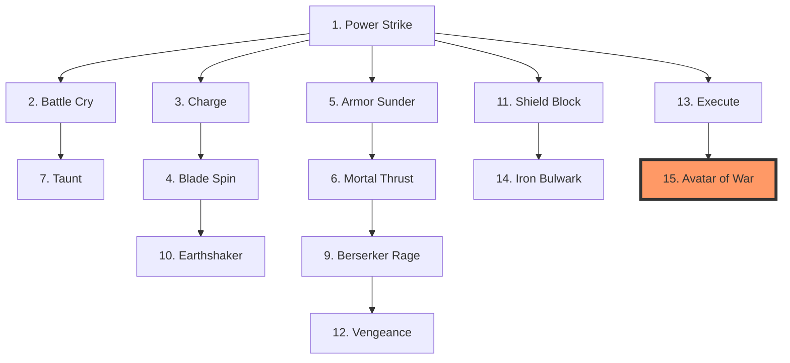
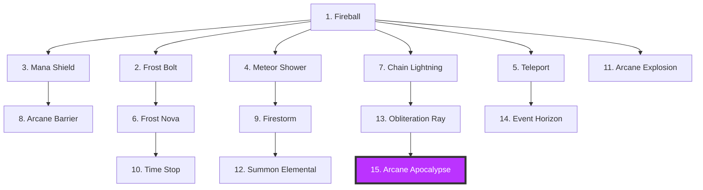
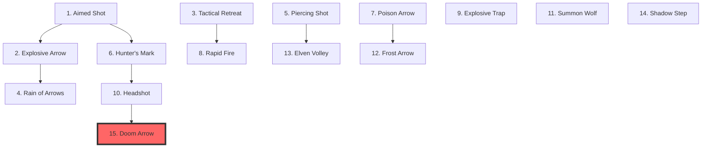
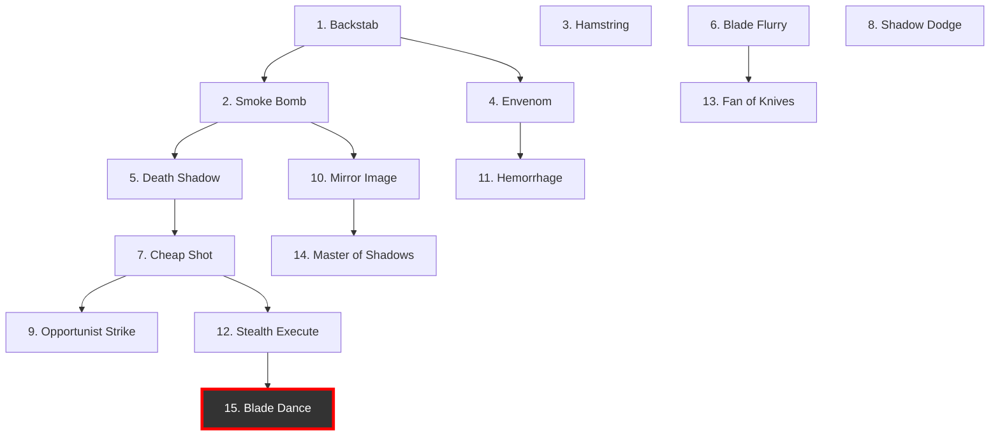
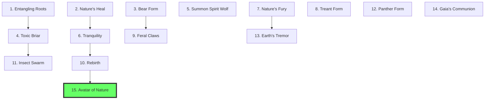
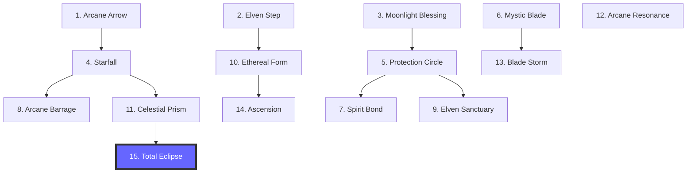
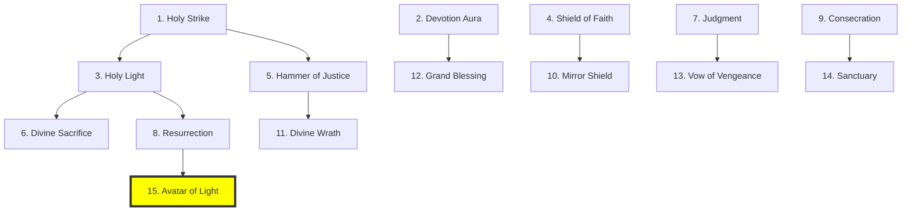
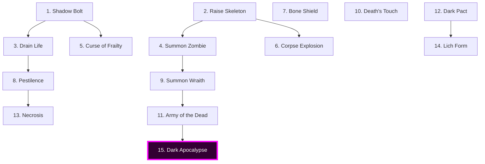
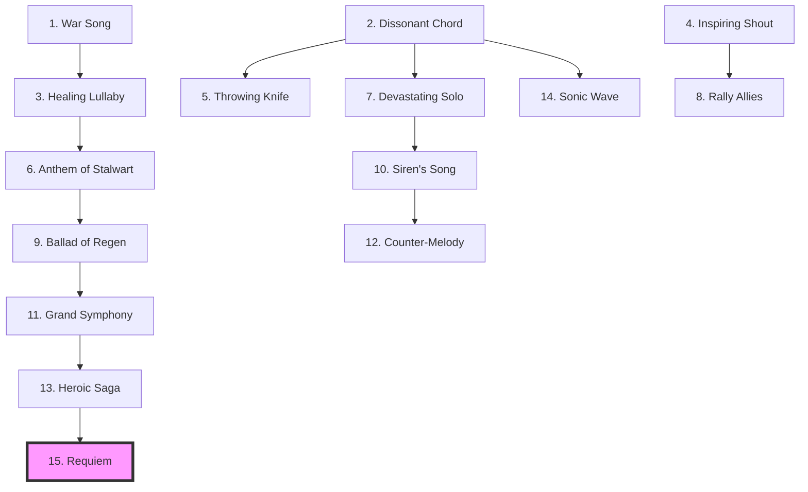
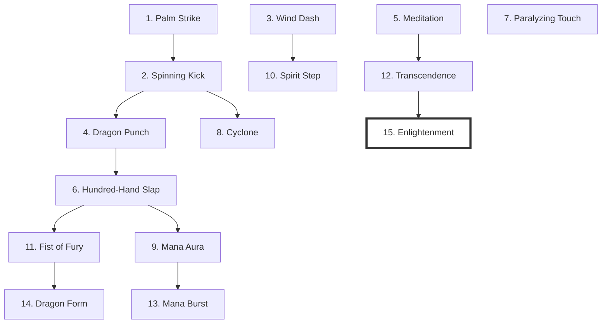

# 4.8. SISTEMA DE SKILLS: ÁRVORE COMPLETA DE HABILIDADES

## Visão Geral

Cada classe possui **30 skills únicas**:

- **15 Ativas**: Habilidades que o herói usa ativamente em combate
- **15 Passivas**: Buffs permanentes que modificam stats ou comportamento

**Total de 10 Classes Jogáveis:**

1. 🗡️ **Guerreiro** (Warrior) - Tank de linha de frente
2. 🔮 **Mago** (Mage) - DPS mágico de longo alcance
3. 🏹 **Arqueiro** (Archer) - DPS físico à distância
4. 🗝️ **Ladino** (Rogue) - Assassino furtivo
5. 🌿 **Druida** (Druid) - Suporte/Metamorfo
6. 🏹 **Elfo** (Elf) - Híbrido mágico/físico
7. 🛡️ **Paladino** (Paladin) - Tank/Healer sagrado
8. 💀 **Necromante** (Necromancer) - Invocador de mortos
9. 🎵 **Bardo** (Bard) - Suporte musical
10. 👊 **Monge** (Monk) - DPS corpo-a-corpo sem armas

O Rei (Majesty) **desbloqueia** essas habilidades pesquisando as "licenças de ensino" nas guildas. Isso disponibiliza o conhecimento no reino, mas o aprendizado **não é automático**:

1.  **O Rei** paga a pesquisa para incluir a skill no "catálogo" da guilda.
2.  **O Herói** decide, via IA, quando gastar o **próprio ouro** para ir à guilda e aprender a skill disponível.

> **�️ Diretrizes de Log e UX (Modelo Console):**
> Para garantir a clareza no modelo baseado em texto/logs, seguimos estas regras:
>
> - **Agregação de Log:** Skills de múltiplos acertos (ex: 8 flechas) são exibidas em uma única linha no log resumindo o total (ex: `8x golpes, Total: 450 Dano`).
> - **Alvos em Área (AoE):** Em vez de metros ou raios, as skills definem o número de alvos (Máximo de 5 inimigos por batalha).
> - **Recursos de Cena:** Cadáveres são notificados no log de cena (`[CENA] Cadáver disponível`) para uso do Necromante.
> - **Auras e Suporte:** Habilidades de área afetam todos os aliados/inimigos presentes no mesmo **Local do Mapa** (Nó/Área) que o herói.
> - **Visibilidade:** Status de buffs e debuffs ativos são monitorados via Janela de Status (F1), evitando spam no log principal.

> **�📊 Nota Técnica de Escalonamento:**
> Uma vez que o herói compra a skill, o poder dela escala **automaticamente** com o **Nível do Herói (Lvl 1 a 10)**. O herói nunca precisa "upar" a skill novamente; ele compra a licença individual uma única vez e ela evolui com ele (+20% de efeito por nível adicional).

---

## 🗡️ GUERREIRO (Warrior) - 30 Skills

### 🗺️ Árvore de Progressão (Ativas)



### ⚔️ Skills Ativas (15)

| #   | Nome                  | Custo    | Cooldown | Ex: Dmg (L1) | Descrição                                    | Requer   | Momento Ideal                                             |
| :-- | :-------------------- | :------- | :------- | :----------- | :------------------------------------------- | :------- | :-------------------------------------------------------- |
| 1   | **Power Strike** 🗡️   | 10 Mana  | 1 Turno  | **30**       | +50% dano no próximo ataque.                 | Nível 1  | Contra inimigos com HP cheio para abrir vantagem.         |
| 2   | **Battle Cry** 📢     | 20 Mana  | 4 Turnos | -            | +20% Attack para aliados no mesmo local.     | Nível 1  | No início do combate, quando o grupo está reunido.        |
| 3   | **Charge** ⚡         | 15 Mana  | 2 Turnos | **20**       | Carga rápida, atordoa alvo por 1 turno.      | Nível 2  | Para anular healers ou arqueiros na retaguarda.           |
| 4   | **Blade Spin** 🌪️     | 25 Mana  | 3 Turnos | **20 AoE**   | Ataque em área, atinge até 5 inimigos.       | Nível 2  | Quando cercado por múltiplos inimigos fracos (zergs).     |
| 5   | **Armor Sunder** 🛡️   | 30 Mana  | 3 Turnos | **20**       | Ignora 50% da defesa do alvo.                | Nível 3  | Contra Tanks ou Bosses de armadura pesada.                |
| 6   | **Mortal Thrust** 🗡️  | 35 Mana  | 4 Turnos | **40**       | Golpe crítico garantido (+100% dano).        | Nível 3  | Para finalizar alvos prioritários rapidamente.            |
| 7   | **Taunt** 💢          | 20 Mana  | 3 Turnos | -            | Força inimigos a atacarem o guerreiro.       | Nível 4  | Para salvar um herói frágil (Mago/Ladino) sob ataque.     |
| 8   | **Second Wind** 🌬️    | 50 Mana  | 6 Turnos | 15 HP Heal   | Recupera 30% HP instantaneamente.            | Nível 4  | Quando o HP cai abaixo de 20% e a cura aliada falha.      |
| 9   | **Berserker Rage** 💢 | 40 Mana  | 5 Turnos | **30**       | +50% Atk, -30% Def por 3 turnos.             | Nível 5  | Quando a vitória é certa, mas precisa acelerar o kill.    |
| 10  | **Earthshaker** 🌋    | 60 Mana  | 6 Turnos | **20 AoE**   | Atordoa até 5 inimigos no local por 1 turno. | Nível 5  | Para interromper múltiplas conjurações de magos inimigos. |
| 11  | **Shield Block** 🛡️   | 30 Mana  | 5 Turnos | -            | Bloqueia o próximo ataque completamente.     | Nível 6  | Antecipando um golpe pesado anunciado de um Boss.         |
| 12  | **Vengeance** 🩸      | 35 Mana  | 4 Turnos | Var.         | Dano causado = HP perdido pelo herói.        | Nível 6  | No momento de quase-morte para um contra-ataque fatal.    |
| 13  | **Execute** 💀        | 25 Mana  | 4 Turnos | Fatal        | Mata instantaneamente se Alvo HP < 15%.      | Nível 8  | Contra Bosses para evitar a fase final furiosa.           |
| 14  | **Iron Bulwark** 🧱   | 70 Mana  | 8 Turnos | -            | Imune a dano por 1 turno (imóvel).           | Nível 9  | Para segurar uma horda enquanto o time recua.             |
| 15  | **Avatar of War** 👑  | 100 Mana | 1x comb. | **60**       | Forma Gigante, +200% Atk, Ataques em Área.   | Nível 10 | Durante invasões massivas ao reino (Ciclo 4).             |

### 🛡️ Skills Passivas (15)

| #   | Passiva               | Requer   | Efeito                                | Momento Ideal (Contexto)                                        |
| :-- | :-------------------- | :------- | :------------------------------------ | :-------------------------------------------------------------- |
| 1   | **Iron Skin**         | Nível 1  | +10% Defense permanente.              | Essencial para todo Guerreiro sobreviver na frente.             |
| 2   | **Vitality**          | Nível 1  | +15% HP máximo.                       | Aumenta a janela de erro para o Curandeiro do grupo.            |
| 3   | **Menacing Presence** | Nível 2  | Inimigos priorizam atacar este herói. | Mantém o herói como o alvo principal do Boss.                   |
| 4   | **Durable**           | Nível 2  | Ignora 20% do dano de DoT.            | Contra aranhas ou cobras (veneno frequente).                    |
| 5   | **Brutal Strength**   | Nível 3  | +15% Attack permanente.               | Garante que o Tank também contribua com dano real.              |
| 6   | **Combat Regen**      | Nível 3  | Cura 3% HP a cada turno em luta.      | Sustentação em batalhas de longa duração contra Elites.         |
| 7   | **Unstoppable**       | Nível 4  | -50% duração de Stuns recebidos.      | Crítico contra inimigos que abusam de controle.                 |
| 8   | **Counter-Strike**    | Nível 4  | 15% chance de revidar ao bloquear.    | Transforma defesa absoluta em dano passivo.                     |
| 9   | **Bloodlust**         | Nível 5  | +5% Atk por kill (máx 50%).           | Em missões de extermínio de hordas baixas.                      |
| 10  | **Juggernaut**        | Nível 5  | +20% HP Max, -10% Speed.              | Para Guerreiros que focam 100% em ser parede.                   |
| 11  | **Plate Mastery**     | Nível 6  | +25% Defense, imune a knock-back.     | Impede que o Boss tire você da posição de guarda.               |
| 12  | **Last Stand**        | Nível 7  | Fica invulnerável por 1t se HP=1.     | Evita mortes por "one-shot" de bosses poderosos.                |
| 13  | **Guardian Aura**     | Nível 8  | Aliados no mesmo local +10% Defense.  | Protege o grupo quando estão todos próximos no mapa.            |
| 14  | **Weapon Master**     | Nível 9  | +20% dano com armas brancas.          | Especialização ofensiva para Guerreiros veteranos.              |
| 15  | **Battle Titan**      | Nível 10 | +30% stats quando HP < 30%.           | Transforma o Guerreiro no herói mais perigoso à beira da morte. |

---

## 🔮 MAGO (Mage) - 30 Skills

### 🗺️ Árvore de Progressão (Ativas)



### ✨ Skills Ativas (15)

| #   | Nome                     | Custo    | Cooldown | Ex: Dmg (L1) | Descrição                                  | Requer   | Momento Ideal                                           |
| :-- | :----------------------- | :------- | :------- | :----------- | :----------------------------------------- | :------- | :------------------------------------------------------ |
| 1   | **Fireball** 🔥          | 20 Mana  | 1 Turno  | **80**       | Projétil de fogo focado.                   | Nível 1  | Dano constante contra alvos únicos de longe.            |
| 2   | **Frost Bolt** ❄️        | 25 Mana  | 2 Turnos | **60**       | Dano + Congela alvo por 1 turno.           | Nível 1  | Para prender um inimigo corpo-a-corpo perigoso.         |
| 3   | **Mana Shield** 🔮       | 30 Mana  | 3 Turnos | 150 Shield   | Absorve 150 de dano por 2 turnos.          | Nível 2  | Ativar assim que um inimigo se aproximar demais.        |
| 4   | **Meteor Shower** ☄️     | 60 Mana  | 5 Turnos | **300 AoE**  | Chuva de fogo, atinge até 5 inimigos.      | Nível 2  | Contra grupos estáticos ou grandes bosses.              |
| 5   | **Teleport** ✨          | 40 Mana  | 3 Turnos | -            | Salta p/ área s/ Fog of War (Máx 2x/dia).  | Nível 3  | Escapar de cercos ou cruzar grandes distâncias no mapa. |
| 6   | **Frost Nova** ❄️        | 50 Mana  | 4 Turnos | Stun AoE     | Congela até 5 inimigos na área.            | Nível 3  | Quando cercado por múltiplos inimigos rápidos.          |
| 7   | **Chain Lightning** ⚡   | 45 Mana  | 4 Turnos | **360 AoE**  | Salta entre até 5 alvos.                   | Nível 4  | Excelente contra grupos dispersos de arqueiros.         |
| 8   | **Arcane Barrier** 🛡️    | 35 Mana  | 4 Turnos | -            | Aliados no local +50% Defesa (2t).         | Nível 4  | Proteger o grupo durante um golpe de área do Boss.      |
| 9   | **Firestorm** 🔥         | 80 Mana  | 6 Turnos | **15/t DoT** | Queima até 5 inimigos por 3 turnos (DoT).  | Nível 5  | Controlar o fluxo de uma horda em caminho estreito.     |
| 10  | **Time Stop** ⏳         | 70 Mana  | 7 Turnos | Slow         | Lentidão (70%) em até 5 inimigos.          | Nível 5  | Para dar tempo ao grupo de recuar ou se curar.          |
| 11  | **Arcane Explosion** 💥  | 55 Mana  | 4 Turnos | **120 AoE**  | Dano em até 5 inimigos + Empurrão.         | Nível 6  | Momento "sai de perto" quando inimigos encostam.        |
| 12  | **Summon Elemental** 🕯️  | 100 Mana | 8 Turnos | Summon       | Invoca Elemental no local (Tank/DPS).      | Nível 7  | Quando o grupo precisa de um "tanque" extra na luta.    |
| 13  | **Obliteration Ray** 🔦  | 90 Mana  | 5 Turnos | **200**      | Raio contínuo (Dano consolidado em log).   | Nível 8  | Contra alvos lentos ou com muita vida.                  |
| 14  | **Event Horizon** 🕳️     | 60 Mana  | 8 Turnos | **100 AoE**  | Dano em até 5 inimigos + Reduz Esquiva.    | Nível 9  | Preparar o combo para o Arqueiro ou Ladino.             |
| 15  | **Arcane Apocalypse** 🎆 | 150 Mana | 1x comb. | **500 AoE**  | Mega explosão, atinge todos os 5 inimigos. | Nível 10 | Para limpar o mapa instantaneamente no Apocalipse.      |

### 🧙 Skills Passivas (15)

| #   | Passiva               | Requer   | Efeito                                          | Momento Ideal (Contexto)                                    |
| :-- | :-------------------- | :------- | :---------------------------------------------- | :---------------------------------------------------------- |
| 1   | **Arcane Intellect**  | Nível 1  | +20% Mana máximo permanente.                    | Essencial para permitir o uso de magias de alto tier.       |
| 2   | **Mana Flow**         | Nível 1  | +10 Mana/t fora de combate.                     | Reduz o tempo de espera entre combates na jornada.          |
| 3   | **Mana Shielding**    | Nível 2  | Converte 10% Mana em escudo natural.            | Aumenta drasticamente a sobrevivência do Mago frágil.       |
| 4   | **Elemental Mastery** | Nível 2  | +15% dano mágico permanente.                    | Escala todo o arsenal ofensivo do Mago.                     |
| 5   | **Focused Mind**      | Nível 3  | -10% custo de Mana em todas skills.             | Permite conjurar magias por mais tempo em lutas longas.     |
| 6   | **Pyromania**         | Nível 3  | +25% dano de fogo, imune a queima.              | Especialização em dano puro e controle de fogo.             |
| 7   | **Cryomancy**         | Nível 4  | +25% dano gelo, reduz lentidão.                 | Especialização em controle de grupo e sobrevivência.        |
| 8   | **Quick Cast**        | Nível 4  | -20% tempo de conjuração.                       | Reduz a janela de interrupção para magias complexas.        |
| 9   | **Spell Reflection**  | Nível 5  | Reflete 20% dano mágico recebido.               | Defesa ofensiva contra outros magos e bosses.               |
| 10  | **Endless Mana**      | Nível 5  | Regenera 2% Mana por kill.                      | Sustentação infinita durante a limpeza de hordas.           |
| 11  | **Arcane Crit**       | Nível 6  | +15% chance de Crítico Mágico.                  | Multiplica o potencial de dano explosivo do Magos.          |
| 12  | **Arcane Presence**   | Nível 7  | Aliados no mesmo local +10% Resistência Mágica. | Defesa em área útil contra ataques elementais.              |
| 13  | **Mana Siphon**       | Nível 8  | Restaura 5% Mana ao matar com spell.            | Permite manter a ofensiva sem parar para descansar.         |
| 14  | **Overload**          | Nível 9  | +50% custo Mana por +40% Dano.                  | Modo de dano extremo para o fim do jogo.                    |
| 15  | **Archmage**          | Nível 10 | +50% Mana Max, +30% Dano Mag total.             | O ápice do poder místico, definindo o "Mestre do Conclave". |

---

## 🏹 ARQUEIRO (Archer) - 30 Skills

### 🗺️ Árvore de Progressão (Ativas)



### 🎯 Skills Ativas (15)

| #   | Nome                    | Custo    | Cooldown | Ex: Dmg (L1) | Descrição                                 | Requer   | Momento Ideal                                            |
| :-- | :---------------------- | :------- | :------- | :----------- | :---------------------------------------- | :------- | :------------------------------------------------------- |
| 1   | **Aimed Shot** 🎯       | 10 Mana  | 1 Turno  | **60**       | +30% precisão.                            | Nível 1  | Contra inimigos esquivos ou voadores.                    |
| 2   | **Explosive Arrow** 💥  | 25 Mana  | 2 Turnos | **80 AoE**   | Atinge até 5 inimigos.                    | Nível 1  | Contra grupos de pequenos monstros (Goblins/Lutadores).  |
| 3   | **Tactical Retreat** 👣 | 15 Mana  | 2 Turnos | **20**       | Recua na linha de batalha + Flecha lenta. | Nível 2  | Quando um inimigo corpo-a-corpo encosta no arqueiro.     |
| 4   | **Rain of Arrows** 🏹   | 40 Mana  | 4 Turnos | **300 AoE**  | Chuva em até 5 inimigos (Log Agregado).   | Nível 2  | Limpeza massiva de área quando monstros estão agrupados. |
| 5   | **Piercing Shot** 🏹    | 20 Mana  | 1 Turno  | **60**       | Atravessa até 5 alvos.                    | Nível 3  | Inimigos em horda ou corredores estreitos.               |
| 6   | **Hunter's Mark** 🎯    | 30 Mana  | 3 Turnos | -            | Alvo marcado (Log alerta o grupo).        | Nível 3  | No início da luta contra um Boss ou monstro Elite.       |
| 7   | **Poison Arrow** ☣️     | 35 Mana  | 3 Turnos | **10/t DoT** | Envenena alvo (Status Visível F1).        | Nível 4  | Contra heróis ou monstros com muita vida.                |
| 8   | **Rapid Fire** 🏹       | 25 Mana  | 2 Turnos | **60**       | 3 flechas (Log: 3x, Dano Agregado).       | Nível 4  | Para finalizar um alvo com HP baixo rapidamente.         |
| 9   | **Explosive Trap** 🪤   | 40 Mana  | 4 Turnos | **150**      | Armadilha (Recurso de Cena) + Stun.       | Nível 5  | Posicionada defensivamente no local.                     |
| 10  | **Headshot** 💀         | 50 Mana  | 5 Turnos | **60**       | Crítico (+200%) ou Instakill.             | Nível 5  | Quando um monstro perigoso está marcado.                 |
| 11  | **Summon Wolf** 🐺      | 60 Mana  | 8 Turnos | Summon       | Invoca lobo no local para lutar.          | Nível 6  | Distrair o inimigo enquanto o arqueiro atira de longe.   |
| 12  | **Frost Arrow** ❄️      | 45 Mana  | 4 Turnos | **70**       | Congela alvo por 1 turno.                 | Nível 7  | Impedir que o Boss alcance o grupo.                      |
| 13  | **Elven Volley** 🏹     | 70 Mana  | 5 Turnos | **100**      | Rajada (5x acertos, Log Agregado).        | Nível 8  | Para explodir o dano em um único turno no Boss.          |
| 14  | **Shadow Step** 👥      | 40 Mana  | 6 Turnos | -            | +50% Esquiva e ignora defesa.             | Nível 9  | Quando sob ataque pesado ou para ignorar escudos.        |
| 15  | **Doom Arrow** 🏹       | 100 Mana | 1x comb. | **600 AoE**  | Flecha em até 5 inimigos + Stun AoE.      | Nível 10 | Golpe final épico na Fase 3 de um Boss.                  |

### 🦅 Skills Passivas (15)

| #   | Passiva                 | Requer   | Efeito                                      | Momento Ideal (Contexto)                                     |
| :-- | :---------------------- | :------- | :------------------------------------------ | :----------------------------------------------------------- |
| 1   | **Eagle Eye**           | Nível 1  | +15% Precisão, +10% Crítico.                | Garante que flechas cruciais nunca errem o alvo.             |
| 2   | **Fleet Foot**          | Nível 1  | +15% Speed.                                 | Facilita a exploração e a fuga de perigos.                   |
| 3   | **Mortal Precision**    | Nível 2  | +10% chance de crítico adicional.           | Aumenta a letalidade constante do arqueiro.                  |
| 4   | **Archer Mastery**      | Nível 2  | +15% dano com arcos.                        | Upgrade básico para manter a progressão de dano.             |
| 5   | **Evasion**             | Nível 3  | +15% chance de esquivar corpo-a-corpo.      | Sobrevivência contra assassinos e monstros rápidos.          |
| 6   | **Skirmishing**         | Nível 3  | Pode atacar e mover no mesmo turno.         | Manter a distância (Kiting) enquanto ataca.                  |
| 7   | **Sharpshooter Stance** | Nível 4  | +20% dano se parado.                        | Quando o guerreiro está segurando o Boss e você está seguro. |
| 8   | **Exploit Weakness**    | Nível 4  | +25% dano se Alvo HP < 50%.                 | Acelera a fase final da morte de monstros elites.            |
| 9   | **Ambush**              | Nível 5  | Primeiro ataque de combate +100% dano.      | Abrir combate com um tiro devastador.                        |
| 10  | **Steady Aim**          | Nível 5  | +10% Precisão, ignora esquiva inimiga.      | Contra fantasmas ou sombras (inimigos com alta esquiva).     |
| 11  | **Toxic Mastery**       | Nível 6  | Efeitos de DoT duram +1 turno.              | Maximiza o dano passivo contra Bosses.                       |
| 12  | **Feline Reflexes**     | Nível 7  | +25% Velocidade de Ação (Turnos).           | Atira mais vezes que o inimigo consegue reagir.              |
| 13  | **Natural Hunter**      | Nível 8  | +30% dano contra animais/bestas.            | Especialização para caçar monstros selvagens.                |
| 14  | **Devastating Crit**    | Nível 9  | Críticos causam +150% dano (em vez de 100). | Transforma o arqueiro em uma máquina de instakill.           |
| 15  | **Living Legend**       | Nível 10 | +40% stats durante o dia.                   | Torna o Arqueiro invencível durante as horas de sol.         |

---

## 🗝️ LADINO (Rogue) - 30 Skills

### 🗺️ Árvore de Progressão (Ativas)



### 🔪 Skills Ativas (15)

| #   | Nome                      | Custo    | Cooldown | Ex: Dmg (L1) | Descrição                                   | Requer   | Momento Ideal                                              |
| :-- | :------------------------ | :------- | :------- | :----------- | :------------------------------------------ | :------- | :--------------------------------------------------------- |
| 1   | **Backstab** 🔪           | 10 Mana  | 1 Turno  | **30**       | +50% dano se atacar pelas costas.           | Nível 1  | Contra arqueiros ou magos distraídos focado em aliados.    |
| 2   | **Smoke Bomb** 💨         | 20 Mana  | 3 Turnos | -            | Invisível por 1 turno.                      | Nível 1  | Para cancelar o foco do inimigo ou fugir de combate fatal. |
| 3   | **Hamstring** 🦶          | 15 Mana  | 2 Turnos | **20**       | Dano e -30% Speed do alvo.                  | Nível 2  | Impedir que um inimigo fujo escape ou alcance sua vila.    |
| 4   | **Envenom** ☣️            | 25 Mana  | 3 Turnos | Poison       | Próximos 5 ataques aplicam Veneno.          | Nível 2  | No início de uma luta prolongada contra alvos resistentes. |
| 5   | **Death Shadow** 🌑       | 30 Mana  | 4 Turnos | **40**       | Força Back Attack (mesmo de frente).        | Nível 3  | Quando você não consegue flanquear o Boss fisicamente.     |
| 6   | **Blade Flurry** ⚔️       | 40 Mana  | 4 Turnos | **160**      | 8 ataques (Log Agregado: 8x).               | Nível 3  | Para causar o máximo de dano no menor tempo possível.      |
| 7   | **Cheap Shot** 👊         | 35 Mana  | 5 Turnos | **20**       | Atordoa o alvo por 1 turno.                 | Nível 4  | Para interromper uma habilidade poderosa do Boss.          |
| 8   | **Shadow Dodge** 👥       | 20 Mana  | 2 Turnos | -            | Esquiva + Recupera Mana (Aparece no Log).   | Nível 4  | Quando o inimigo usa uma skill pesada.                     |
| 9   | **Opportunist Strike** 🗡️ | 45 Mana  | 4 Turnos | **80**       | +300% dano contra alvos atordoados.         | Nível 5  | Combo imediato após o Cheap Shot ou Stun de aliado.        |
| 10  | **Mirror Image** 👥       | 60 Mana  | 6 Turnos | **10/t**     | Clones no local (Status F1).                | Nível 5  | Confundir o Boss e aumentar a pressão ofensiva.            |
| 11  | **Hemorrhage** 🩸         | 50 Mana  | 4 Turnos | **15/t DoT** | Sangramento (Status Visível F1).            | Nível 6  | Contra inimigos que regeneram HP rapidamente.              |
| 12  | **Stealth Execute** 💀    | 55 Mana  | 5 Turnos | Fatal        | Instakill se HP < 30%.                      | Nível 7  | Para finalizar Elite sem chance de reação.                 |
| 13  | **Fan of Knives** 🔪      | 70 Mana  | 5 Turnos | **400 AoE**  | 20 adagas em até 5 inimigos (Log Agregado). | Nível 8  | Quando hordas de monstros tentam cercar o ladino.          |
| 14  | **Master of Shadows** 🌑  | 40 Mana  | 6 Turnos | -            | Invisível no local +50% Speed.              | Nível 9  | Infiltração profunda ou fuga estratégica.                  |
| 15  | **Blade Dance** 💃        | 100 Mana | 1x comb. | Fatal        | Teleporte e ataque em até 5 inimigos.       | Nível 10 | Momento cinematográfico para limpar uma sala inteira.      |

### 🌑 Skills Passivas (15)

| #   | Passiva              | Requer   | Efeito                                    | Momento Ideal (Contexto)                                  |
| :-- | :------------------- | :------- | :---------------------------------------- | :-------------------------------------------------------- |
| 1   | **Stealth**          | Nível 1  | -30% chance de ser alvo (Aggro Baixo).    | Garante que o Ladino não seja o foco inicial da pancada.  |
| 2   | **Quick Fingers**    | Nível 1  | -20% cooldown em skills.                  | Permite o uso frequente de invisibilidade e venenos.      |
| 3   | **Back Attack**      | Nível 2  | +50% dano permanente se atacar por trás.  | Especialização em flanqueamento com aliados.              |
| 4   | **Dagger Mastery**   | Nível 2  | +20% dano com adagas.                     | Upgrade essencial para a progressão base de dano.         |
| 5   | **Plunder**          | Nível 3  | Maior chance de itens raros e ouro.       | Se o objetivo da partida for acumular riqueza rápida.     |
| 6   | **Lethal Poison**    | Nível 3  | DoTs de veneno causam +40% dano.          | Transforma o veneno em uma arma mortal silenciada.        |
| 7   | **Deadly Dodge**     | Nível 4  | +20% chance de esquiva permanente.        | Proteção contra ataques físicos diretos inevitáveis.      |
| 8   | **Poison Immunity**  | Nível 4  | Imune a todos os venenos.                 | Essencial em biomas de Pântano ou contra necromantes.     |
| 9   | **Critical Strike**  | Nível 5  | +25% chance de crítico permanente.        | Foco em burst damage e instakills constantes.             |
| 10  | **Acrobat**          | Nível 5  | +30% Speed permanente.                    | Torna o Ladino o herói mais rápido do reino.              |
| 11  | **Preparation**      | Nível 6  | Reduz 30% cooldowns ao iniciar combate.   | Permite usar magias potentes logo no início da luta.      |
| 12  | **Cold Blood**       | Nível 7  | +40% dano contra alvos com HP completo.   | Para deletar inimigos frágeis com um único golpe inicial. |
| 13  | **Natural Assassin** | Nível 8  | +50% dano contra alvos solitários.        | Perfeito para caçar monstros perdidos no mapa.            |
| 14  | **Living Shadow**    | Nível 9  | Regenera 6% HP/turno quando invisível.    | Permite recuperar vida sem precisar de poções ou curas.   |
| 15  | **Silent Death**     | Nível 10 | +60% dano crítico, mata e fica invisível. | Permite abates sucessivos sem nunca ser detectado.        |

---

## 🌿 DRUIDA (Druid) - 30 Skills

### 🗺️ Árvore de Progressão (Ativas)



### 🍃 Skills Ativas (15)

| #   | Nome                      | Custo    | Cooldown | Ex: Dmg (L1)  | Descrição                                  | Requer   | Momento Ideal                                                        |
| :-- | :------------------------ | :------- | :------- | :------------ | :----------------------------------------- | :------- | :------------------------------------------------------------------- |
| 1   | **Entangling Roots** 🌿   | 20 Mana  | 2 Turnos | **40**        | Prende inimigo por 1 turno.                | Nível 1  | Para imobilizar um inimigo corpo-a-corpo que persegue o grupo.       |
| 2   | **Nature's Heal** 💚      | 30 Mana  | 2 Turnos | 150 HP Heal   | Cura alvo em 150 HP.                       | Nível 1  | Quando um herói Tank está com HP abaixo de 50%.                      |
| 3   | **Bear Form** 🐻          | 40 Mana  | 4 Turnos | **30**        | Vira Urso (+100% HP, +50% Atk).            | Nível 2  | Quando o Druida precisa assumir a linha de frente por falta de Tank. |
| 4   | **Toxic Briar** 🌵        | 25 Mana  | 3 Turnos | **80 + 10/t** | Espinhos em até 5 inimigos + DoT.          | Nível 2  | Criar um obstáculo em gargalos de hordas inimigos.                   |
| 5   | **Summon Spirit Wolf** 🐺 | 50 Mana  | 6 Turnos | Summon        | Invoca lobo no local por 4 turnos.         | Nível 3  | Adicionar um aliado extra para flanquear arqueiros.                  |
| 6   | **Tranquility** 🍃        | 45 Mana  | 4 Turnos | 80 HP Heal    | Cura todos os aliados no mesmo local.      | Nível 3  | Após um ataque em área massivo do Boss.                              |
| 7   | **Nature's Fury** ⚡      | 55 Mana  | 5 Turnos | **20 AoE**    | Tempestade em até 5 inimigos + Lentidão.   | Nível 4  | Para reduzir a velocidade de avanço de grandes grupos.               |
| 8   | **Treant Form** 🌳        | 30 Mana  | 4 Turnos | -             | Transformação no local (Imune a repulsão). | Nível 4  | Para se tornar uma muralha imóvel durante a defesa.                  |
| 9   | **Feral Claws** 🐾        | 35 Mana  | 3 Turnos | **200**       | 5 ataques (Log Agregado: 5x).              | Nível 5  | Para explodir o dano enquanto está em forma de urso.                 |
| 10  | **Rebirth** 🌟            | 80 Mana  | 1x comb. | 50% HP Heal   | Revive herói no local com 50% HP.          | Nível 5  | Quando o herói principal morre em uma luta crucial.                  |
| 11  | **Insect Swarm** 🐝       | 60 Mana  | 5 Turnos | **15/t DoT**  | Nuvem cega até 5 inimigos (DoT).           | Nível 6  | Contra grupos de arqueiros inimigos.                                 |
| 12  | **Panther Form** 🐈       | 45 Mana  | 5 Turnos | **30**        | Transformação no local (+80% Speed).       | Nível 7  | Para perseguição rápida ou para chegar primeiro.                     |
| 13  | **Earth's Tremor** 🌋     | 70 Mana  | 6 Turnos | **150 AoE**   | Terremoto em até 5 inimigos + Stun AoE.    | Nível 8  | Para interromper múltiplas habilidades de inimigos.                  |
| 14  | **Gaia's Communion** ✨   | 50 Mana  | 8 Turnos | -             | Buff geral p/ aliados no local.            | Nível 9  | Preparação final antes de entrar em uma sala de Boss.                |
| 15  | **Avatar of Nature** 🌲   | 120 Mana | 1x comb. | **60**        | Forma e cura em área (Aliados no local).   | Nível 10 | O ápice do poder Druídico para vencer a batalha final.               |

### 🌳 Skills Passivas (15)

| #   | Passiva                  | Requer   | Efeito                                           | Momento Ideal (Contexto)                                       |
| :-- | :----------------------- | :------- | :----------------------------------------------- | :------------------------------------------------------------- |
| 1   | **Forest Guardian**      | Nível 1  | +15% stats em florestas.                         | Torna o Druida imbatível em biomas de matas densas.            |
| 2   | **Nature's Bond**        | Nível 1  | Sobre-cura vira escudo temporário.               | Mantém o grupo protegido mesmo quando eles estão com HP cheio. |
| 3   | **Barkskin**             | Nível 2  | +12% Defense, imune a sangramento.               | Melhora a sobrevivência contra animais e monstros de corte.    |
| 4   | **Wild Instincts**       | Nível 2  | +20% Esquiva se HP < 50%.                        | Ajuda o Druida a sobreviver em situações desesperadoras.       |
| 5   | **Beast Tongue**         | Nível 3  | Pets invocados ganham +20% HP/Dmg.               | Especialização em comando de feras espirituais.                |
| 6   | **Accelerated Regen**    | Nível 3  | Regeneração passiva constante (HP).              | Reduz a dependência de poções de cura fora de combate.         |
| 7   | **Elemental Resistance** | Nível 4  | +30% resist a Fogo, Gelo, Veneno.                | Proteção vital contra ataques mágicos e ambientais.            |
| 8   | **Ancient Wisdom**       | Nível 4  | +25% Mana máximo.                                | Permite mais trocas de forma e conjurações de cura.            |
| 9   | **Shapeshifter**         | Nível 5  | Formas animais duram +50% tempo.                 | Maximiza a utilidade estratégica das transformações.           |
| 10  | **Forest Spirit**        | Nível 5  | Aliados no mesmo local ganham regeneração de HP. | Atua como uma "fonte de cura ambulante" para o grupo.          |
| 11  | **Primordial Fury**      | Nível 6  | +40% Attack em formas animais.                   | Torna o Urso e a Pantera máquinas de destruição real.          |
| 12  | **Symbiosis**            | Nível 7  | Curar aliado cura o druida em 30%.               | Mantém o herói saudável enquanto ele cuida dos outros.         |
| 13  | **Deep Roots**           | Nível 8  | Imune a empurrões e repulsão.                    | Mantém o Druida na posição estratégica desejada.               |
| 14  | **Master Shapeshifter**  | Nível 9  | Troca de forma sem cooldown (1x/t).              | Versatilidade total para adaptar a tática no meio da luta.     |
| 15  | **One with Nature**      | Nível 10 | Buff extremo em Lua Cheia + Reviver.             | O Druida se torna uma força da natureza imparável.             |

---

## 🏹 ELFO (Elf) - 30 Skills

### 🗺️ Árvore de Progressão (Ativas)



### ✨ Skills Ativas (15)

| #   | Nome                      | Custo    | Cooldown | Ex: Dmg (L1) | Descrição                                      | Requer   | Momento Ideal                                              |
| :-- | :------------------------ | :------- | :------- | :----------- | :--------------------------------------------- | :------- | :--------------------------------------------------------- |
| 1   | **Arcane Arrow** 🏹       | 15 Mana  | 1 Turno  | **70**       | Flecha mágica que penetra defesa.              | Nível 1  | Contra inimigos com alta armadura (como Golems).           |
| 2   | **Elven Step** ✨         | 20 Mana  | 2 Turnos | **26**       | Salta p/ área s/ Fog of War (Máx 2x/dia).      | Nível 1  | Para flanquear o inimigo e ganhar vantagem estratégica.    |
| 3   | **Moonlight Blessing** 🌙 | 30 Mana  | 3 Turnos | -            | +20% Speed para o grupo no local.              | Nível 2  | No início de uma caçada para chegar antes ao alvo.         |
| 4   | **Starfall** 💫           | 50 Mana  | 4 Turnos | **350 AoE**  | 10 projéteis teleguiados (Log Agregado).       | Nível 2  | Quando inimigos estão dispersos e você quer atingir todos. |
| 5   | **Protection Circle** 🛡  | 40 Mana  | 4 Turnos | -            | +40% Defense p/ aliados no local.              | Nível 3  | Durante uma defesa de posição imóvel contra hordas.        |
| 6   | **Mystic Blade** 🗡️       | 25 Mana  | 3 Turnos | **36**       | Espada de energia no local por 3 turnos.       | Nível 3  | Quando o inimigo fecha a distância.                        |
| 7   | **Spirit Bond** 🔗        | 45 Mana  | 5 Turnos | -            | Link de dano/cura com aliado no local.         | Nível 4  | Para proteger o Tank do grupo, dividindo o fardo.          |
| 8   | **Arcane Barrage** 🏹     | 35 Mana  | 2 Turnos | **240**      | 6 flechas rápidos (Log Agregado: 6x).          | Nível 4  | Para matar um inimigo específico instantaneamente.         |
| 9   | **Elven Sanctuary** 🌿    | 60 Mana  | 6 Turnos | 20 HP/t Heal | Zona local de cura + Resistência Mágica.       | Nível 5  | Refúgio seguro para o grupo se recuperar.                  |
| 10  | **Ethereal Form** 👻      | 50 Mana  | 5 Turnos | -            | Imune a físico (Status Visível F1).            | Nível 5  | Ativar quando um inimigo pesado investir contra você.      |
| 11  | **Celestial Prism** 💎    | 70 Mana  | 5 Turnos | **500 AoE**  | Raio que divide em 5 inimigos (Log Narrativo). | Nível 6  | Em combates contra múltiplos inimigos de HP médio.         |
| 12  | **Arcane Resonance** 🌀   | 55 Mana  | 5 Turnos | -            | Próximas 3 skills do Elfo custam 0 Mana.       | Nível 7  | Preparar o terreno para usar magias poderosas.             |
| 13  | **Blade Storm** 🌪️        | 65 Mana  | 5 Turnos | **80 AoE**   | Lâminas em até 5 inimigos no local.            | Nível 8  | Quando cercado por inimigos fracos.                        |
| 14  | **Ascension** 👼          | 80 Mana  | 8 Turnos | -            | Levita (Status F1) + Magias instantâneas.      | Nível 9  | Modo de dominação total atacando de cima.                  |
| 15  | **Total Eclipse** 🌒      | 150 Mana | 1x comb. | Blind AoE    | Cega até 5 inimigos no local por 3 turnos.     | Nível 10 | Para ganhar a vantagem definitiva em uma luta de Boss.     |

### 🌟 Skills Passivas (15)

| #   | Passiva                  | Requer   | Efeito                                              | Momento Ideal (Contexto)                                      |
| :-- | :----------------------- | :------- | :-------------------------------------------------- | :------------------------------------------------------------ |
| 1   | **Elven Grace**          | Nível 1  | +25% Speed permanente.                              | Torna o Elfo o mestre da movimentação no campo.               |
| 2   | **Mystic Vision**        | Nível 1  | Detecta invisíveis e ocultos.                       | Crítico contra Ladinos inimigos ou monstros que se escondem.  |
| 3   | **Longevity**            | Nível 2  | +20% HP máximo, imune a doenças.                    | Aumenta a resistência do Elfo para expedições longas.         |
| 4   | **Arcane Affinity**      | Nível 2  | +20% dano mágico permanente.                        | Multiplica o efeito de todas as flechas e lâminas místicas.   |
| 5   | **Supernatural Evasion** | Nível 3  | +18% chance de esquivar permanente.                 | Melhora a defesa passiva do herói sem gastar mana.            |
| 6   | **Ancestral Wisdom**     | Nível 3  | +30% Mana max, -10% custo skills.                   | Permite que o Elfo atue por mais tempo com magia.             |
| 7   | **Elven Precision**      | Nível 4  | +15% Crítico + Penetra Defesa.                      | Garante que cada tiro conte contra inimigos de elite.         |
| 8   | **Lunar Protection**     | Nível 4  | +15% stats durante a noite.                         | Torna o Elfo a escolha perfeita para missões noturnas.        |
| 9   | **Magic Harmony**        | Nível 5  | Regenera 3% Mana por skill usada.                   | Sustentação de mana infinita se o herói for bem gerenciado.   |
| 10  | **Shadow Cloak**         | Nível 5  | +15% Esquiva contra magia/flechas.                  | Proteção contra outros atacantes à distância.                 |
| 11  | **Arcane Resilience**    | Nível 6  | +35% Resistência Mágica.                            | Torna o Elfo um "Anti-Mago" nato.                             |
| 12  | **Soul Link**            | Nível 7  | Quando aliado morre, ganha +50% dano (10 Turnos).   | Vingança poderosa para virar uma luta perdida.                |
| 13  | **Arcane Master**        | Nível 8  | Cooldowns reduzidos em 15%.                         | Aumenta a frequência de uso de habilidades poderosas.         |
| 14  | **Elven Immortality**    | Nível 9  | Revive com 1 HP ao morrer (1x/10 min (200 Turnos)). | Evita mortes acidentais por erros de posicionamento.          |
| 15  | **Transcendence**        | Nível 10 | +60% Mana, +40% Dano, Custo 50%.                    | O estado de perfeição elfo, dominante em todas as distâncias. |

---

## Sistema de Desbloqueio e Economia

O progresso de poder no reino é dividido em duas etapas econômicas distintas.

### 1. Pesquisa Real (O Rei paga para Desbloquear)

O Rei investe no "conhecimento" da guilda. Sem isso, nenhum herói verá a skill disponível para venda.

### 2. Contratação Individual (O Herói paga para Aprender)

O Herói usa o ouro que acumulou em caçadas ou trabalho para comprar a skill da guilda. A escolha é baseada na **IA e Personalidade (PECMA)**: heróis mais proativos compram skills assim que podem; heróis mais gananciosos podem demorar mais para investir.

**Tabela de Categorias e Custos:**

A "Categoria" representa o grupo de skills conforme sua posição nas tabelas (ID #1 a #15).

| Categoria da Skill | Posição (#) na Tabela | Nível do Herói | Custo (Rei) | Preço (Herói) |
| :----------------- | :-------------------- | :------------- | :---------- | :------------ |
| **Básicas**        | Skills #1 a #5        | Nível 1 - 2    | 250g        | 100g          |
| **Intermediárias** | Skills #6 a #10       | Nível 3 - 5    | 750g        | 300g          |
| **Avançadas**      | Skills #11 a #13      | Nível 6 - 8    | 2.000g      | 800g          |
| **Elite**          | Skill #14             | Nível 9        | 4.000g      | 1.500g        |
| **Lendária (Ult)** | Skill #15             | Nível 10       | 10.000g     | 5.000g        |

**Legenda de Termos:**

- **Posição (#):** Refere-se ao número identificador da skill em cada tabela de classe abaixo (exemplo: Active #1 ou Passive #1).
- **Custo (Rei):** Gasto único do Tesouro Real para habilitar a skill na guilda para SEMPRE.
- **Preço (Herói):** O que cada herói paga individualmente para ter direito a usar aquela skill (pago apenas uma vez pelo herói).
- **1x comb.:** Abreviação de "1 vez por combate". A skill só pode ser usada uma única vez em cada encontro de batalha.

### Árvore de Dependências

```
Skills seguem hierarquia:
- Básicas (Nível 1) → Intermediárias → Avançadas → Ultimate

Exemplo (Warrior):
Power Strike (Lvl 1)
    ↓
Battle Cry (Lvl 2)
    ↓
Taunt (Lvl 4)
    ↓
Menacing Presence (Passiva, Lvl 6)
```

### Interface no F2 (ADMIN)

No workspace F2, painel P2 mostra a árvore de skills interativa onde o Majesty pode:

- Ver quais skills estão disponíveis para pesquisa
- Desbloquear novas skills gastando **Ouro**
- Ver pré-requisitos e custos de manutenção da guilda

---

## Balanceamento

**Filosofia de Design:**

- **Skills Ativas**: Impacto imediato, requerem timing e estratégia
- **Skills Passivas**: Poder crescente, modificam playstyle permanentemente
- **Ultimates**: Extremamente poderosas, cooldowns longos, definem momentos épicos

**Progressão Esperada:**

- Dia 1-50: 10-15 skills desbloqueadas
- Dia 51-100: 20-25 skills desbloqueadas
- Dia 101-150: 25-28 skills desbloqueadas
- Dia 151-200: Chance de desbloquear todas 30 (partida perfeita)

---

# Skills das Novas Classes

## 🛡️ PALADINO (Paladin) - 30 Skills

### 🗺️ Árvore de Progressão (Ativas)



### ⚔️ Skills Ativas (15)

| #   | Nome                     | Custo    | Cooldown | Ex: Dmg (L1) | Descrição                                        | Requer   | Momento Ideal                                                 |
| :-- | :----------------------- | :------- | :------- | :----------- | :----------------------------------------------- | :------- | :------------------------------------------------------------ |
| 1   | **Holy Strike** ⚔️       | 15 Mana  | 1 Turno  | **70**       | Ataque sagrado + auto-cura.                      | Nível 1  | Combate constante para manter a vida alta sem ajuda.          |
| 2   | **Devotion Aura** 🛡️     | 20 Mana  | Passiva  | -            | +15% Defesa para aliados (Passiva Sustentada).   | Nível 1  | Sempre ativa para proteger o grupo em formação fechada.       |
| 3   | **Holy Light** ✨        | 30 Mana  | 2 Turnos | 200 HP Heal  | Cura um aliado em 200 HP.                        | Nível 2  | Salvar o Guerreiro ou Ladino em perigo imediato.              |
| 4   | **Shield of Faith** 🛡️   | 25 Mana  | 3 Turnos | 250 Shield   | Escudo de 250 de absorção (2t).                  | Nível 2  | Ativar em si mesmo antes de entrar em uma área perigosa.      |
| 5   | **Hammer of Justice** 🔨 | 35 Mana  | 3 Turnos | **100**      | 100 Dano + Stun 1 turno.                         | Nível 3  | Para interromper um Boss prestes a usar uma skill forte.      |
| 6   | **Divine Sacrifice** 🩸  | 40 Mana  | 4 Turnos | -            | Transfere 50% do dano do aliado para o Paladino. | Nível 3  | Quando o curandeiro não consegue dar conta do dano no Tank.   |
| 7   | **Judgment** ⚖️          | 45 Mana  | 4 Turnos | **32**       | Marca inimigo, +60% dano contra ele.             | Nível 4  | Focar o dano do grupo em um Alvo Prioritário ou Boss.         |
| 8   | **Resurrection** 🕊️      | 80 Mana  | 1x comb. | 70% HP Heal  | Revive herói com 70% HP.                         | Nível 4  | Reverter uma morte crítica no meio de uma batalha épica.      |
| 9   | **Consecration** 🌞      | 50 Mana  | 5 Turnos | Debuff AoE   | Até 5 inimigos no local (-30% Atk).              | Nível 5  | Para mitigar o dano de hordas de mortos-vivos.                |
| 10  | **Mirror Shield** 🪞     | 55 Mana  | 5 Turnos | -            | Reflete ataques (Status Visível F1).             | Nível 5  | Quando o Boss foca o Paladino with ataques rápidos.           |
| 11  | **Divine Wrath** ⚡      | 60 Mana  | 5 Turnos | **40**       | +100% Atk e recuperação de Mana.                 | Nível 6  | Quando o Paladino precisa assumir o papel de executor.        |
| 12  | **Grand Blessing** 🌟    | 70 Mana  | 6 Turnos | -            | Aliados no local +30% stats.                     | Nível 7  | Pré-requisito para iniciar uma investida contra o Boss final. |
| 13  | **Vow of Vengeance** 🩸  | 65 Mana  | 6 Turnos | **50**       | Buff de morte (Aliado no mesmo local).           | Nível 8  | Para evitar que a morte de um amigo resulte em derrota total. |
| 14  | **Sanctuary** 🏰         | 75 Mana  | 8 Turnos | -            | Zona local, aliados -80% dano (1t).              | Nível 9  | Sobrevivência de último segundo contra um "Wipe".             |
| 15  | **Avatar of Light** 👼   | 150 Mana | 1x comb. | **60**       | Forma e cura em área (Aliados no local).         | Nível 10 | Ativar no clímax da invasão para garantir a vitória do reino. |

### 🛡️ Skills Passivas (15)

| #   | Passiva                | Requer   | Efeito                                        | Momento Ideal (Contexto)                                        |
| :-- | :--------------------- | :------- | :-------------------------------------------- | :-------------------------------------------------------------- |
| 1   | **Unwavering Faith**   | Nível 1  | +15% HP Max, +10% Defense.                    | Reforça a base de sobrevivência do herói sagrado.               |
| 2   | **Devotion Gain**      | Nível 1  | Ganha 10 Mana ao ser atingido.                | Mantém o herói com recursos enquanto apanha dos inimigos.       |
| 3   | **Martyr**             | Nível 2  | +20% Defense se HP < 30%.                     | Torna o herói mais difícil de matar quanto mais perto da morte. |
| 4   | **Natural Protector**  | Nível 2  | Aliados no mesmo local recebem -15% dano.     | Melhora a eficiência da aura protetora natural.                 |
| 5   | **Holy Regen**         | Nível 3  | Cura 5% HP máximo a cada turno.               | Sustentação passiva inigualável para o Paladino.                |
| 6   | **Unshakable Justice** | Nível 3  | Imune a Medo e Corrupção.                     | Fundamental em combates contra Necromantes e Liches.            |
| 7   | **Avenger**            | Nível 4  | +30% dano contra Undead/Demônios.             | Especialização para purgar o mal supremo do mapa.               |
| 8   | **Eternal Blessing**   | Nível 4  | Começa combate com +20% stats (3t).           | Garante uma vantagem explosiva em cada novo encontro.           |
| 9   | **Divine Rebirth**     | Nível 5  | Revive com 30% HP (1x por partida).           | Segunda chance automática para o baluarte do reino.             |
| 10  | **Guardian Shield**    | Nível 5  | Bloqueia ataques para aliados no mesmo local. | Atuação como o protetor supremo dos heróis mais fracos.         |
| 11  | **Expanded Aura**      | Nível 6  | Auras afetam **todo o Local (+Adjacentes)**.  | Protege o grupo mesmo quando eles se espalham um pouco.         |
| 12  | **Devoted**            | Nível 7  | Curas custam -20% Mana.                       | Permite economizar mana para habilidades de ataque e aura.      |
| 13  | **Bastion**            | Nível 8  | +50% Defense se não mover por 1 Turno.        | Invicto em lutas contra inimigos que não têm repulsão.          |
| 14  | **Purification**       | Nível 9  | Remove todos debuffs a cada 4 turnos.         | Auto-sustento contra venenos, pragas e lentidões.               |
| 15  | **Holy Warrior**       | Nível 10 | +40% stats, imune a críticos.                 | O Paladino se torna o guerreiro definitivo da luz.              |

---

## 💀 NECROMANTE (Necromancer) - 30 Skills

### 🗺️ Árvore de Progressão (Ativas)



### 🌑 Skills Ativas (15)

| #   | Nome                      | Custo    | Cooldown | Ex: Dmg (L1) | Descrição                                           | Requer   | Momento Ideal                                                     |
| :-- | :------------------------ | :------- | :------- | :----------- | :-------------------------------------------------- | :------- | :---------------------------------------------------------------- |
| 1   | **Shadow Bolt** 🌑        | 20 Mana  | 1 Turno  | **75**       | Projétil sombrio, 75 dano necrótico, drena 20 HP    | Nível 1  | Contra inimigos com pouco HP para se curar rápido.                |
| 2   | **Raise Skeleton** 💀     | 30 Mana  | 1 Turno  | Summon       | Transforma cadáver em Esqueleto (dura 8 Turnos)     | Nível 1  | Assim que o herói ou aliado mata o primeiro inimigo da horda.     |
| 3   | **Drain Life** 🔋         | 25 Mana  | 2 Turnos | **40/t**     | Canaliza 1 Turno, drena 40 HP/t do alvo             | Nível 2  | Quando o Necromante está sob foco e precisa de sustento contínuo. |
| 4   | **Summon Zombie** 🧟      | 50 Mana  | 4 Turnos | Summon       | Invoca Zumbi resistente (dura 10 Turnos)            | Nível 2  | Adicionar uma linha de defesa extra contra o Boss.                |
| 5   | **Curse of Frailty** 📉   | 30 Mana  | 3 Turnos | Debuff       | Alvo perde -40% Attack por 3 Turnos                 | Nível 3  | Contra heróis ataucantes ou monstros elite de alto dano físico.   |
| 6   | **Corpse Explosion** 💥   | 40 Mana  | 3 Turnos | **150 AoE**  | Detona cadáver (Recurso Cena), atinge 5 inimigos.   | Nível 3  | Quando hordas de monstros pequenos cercam um corpo.               |
| 7   | **Bone Shield** 🛡️        | 35 Mana  | 4 Turnos | 200 Shield   | Escudo (Status Visível F1).                         | Nível 4  | Ativação constante para compensar o HP baixo.                     |
| 8   | **Pestilence** ☣️         | 45 Mana  | 5 Turnos | **10/t DoT** | Atinge até 5 inimigos no local com DoT.             | Nível 4  | Para "sujar" o campo de batalha e causar dano em todos os alvos.  |
| 9   | **Summon Wraith** 👻      | 70 Mana  | 6 Turnos | Summon       | Invoca fantasma no local (Ignora Defesa).           | Nível 5  | Contra inimigos com armaduras de placas.                          |
| 10  | **Death's Touch** 💀      | 50 Mana  | 4 Turnos | Fatal        | Instakill inimigo não-elite (Status Alvo F1).       | Nível 5  | Rapidez para remover magos ou curandeiros inimigos.               |
| 11  | **Army of the Dead** 🧟‍♂️🧟‍♀️ | 100 Mana | 1x comb. | Summon x3    | Invoca 3 esqueletos no local (6 Turnos).            | Nível 6  | Momento crucial de uma luta de larga escala ou invasão.           |
| 12  | **Dark Pact** 🩸          | 60 Mana  | 5 Turnos | **36**       | Sacrifício p/ Buff mágico (Status F1).              | Nível 7  | Quando o Mago inimigo está exposto para um burst fatal.           |
| 13  | **Necrosis** 🦴           | 55 Mana  | 5 Turnos | **80/t DoT** | DoT massivo, gera cadáver ao finalizar.             | Nível 8  | Contra alvos únicos de muita vida para derretê-los.               |
| 14  | **Lich Form** 🧙‍♂️          | 80 Mana  | 8 Turnos | **40**       | Transformação em Lich no local (Status F1).         | Nível 9  | Escapar de assassinos ou tanks heróis inimigos.                   |
| 15  | **Dark Apocalypse** 🌋    | 200 Mana | 1x comb. | Summon Max   | Reanima TODOS os cadáveres do local (Máx 3 corpos). | Nível 10 | Preparar um exército imortal para o cerco final.                  |

### 💀 Skills Passivas (15)

| #   | Passiva                  | Requer   | Efeito                                     | Momento Ideal (Contexto)                                               |
| :-- | :----------------------- | :------- | :----------------------------------------- | :--------------------------------------------------------------------- |
| 1   | **Soul Harvest**         | Nível 1  | Ganha 25 Mana ao matar.                    | Sustentação infinita de mana durante a limpeza do mapa.                |
| 2   | **Shadow Essence**       | Nível 1  | +25% Mana máximo permanente.               | Essencial para gerenciar múltiplas invocações e magias.                |
| 3   | **Minion Mastery**       | Nível 2  | Invocações +50% HP e Attack.               | Cria lacaios que podem realmente peitar monstros elites.               |
| 4   | **Necrotic Mastery**     | Nível 2  | +20% dano necrótico permanente.            | Escala todo o arsenal de sombras do herói.                             |
| 5   | **Vital Siphon**         | Nível 3  | Spells curam 15% do dano causado.          | Transforma cada ataque em uma fonte de sobrevivência.                  |
| 6   | **Undead Resilience**    | Nível 3  | +30% resist a necrótico/veneno.            | Proteção contra as próprias magias e inimigos sombrios.                |
| 7   | **Chain Detonation**     | Nível 4  | Explosão de corpos gera reações em cadeia. | Limpa salas inteiras de monstros fracos em poucos Turnos.              |
| 8   | **Minion Longevity**     | Nível 4  | Invocações duram +50% tempo.               | Reduz o custo de mana por Turno de serviço dos servos.                 |
| 9   | **Undying Essence**      | Nível 5  | Regenera 10 Mana/turno constante.          | Garante que o Necromante nunca fique totalmente desarmado.             |
| 10  | **Necrotic Aura**        | Nível 5  | Inimigos no local perdem 4% HP/t.          | Dano passivo que acumula muito em lutas longas.                        |
| 11  | **Eternal Pact**         | Nível 6  | Dark Pact não gasta HP, sacrifica servos.  | Melhor estratégia quando se tem many summons ativos.                   |
| 12  | **Lord of the Dead**     | Nível 7  | Servos +30% stats (Max 3 servos).          | Especialização em um pequeno grupo de servos elite.                    |
| 13  | **Immortal**             | Nível 8  | Vira Lich por 2 turnos ao morrer.          | Permite um último esforço desesperado ou contra-ataque antes da morte. |
| 14  | **Dark Synergy**         | Nível 9  | Cada servo vivo +10% dano mágico.          | Recompensa manter suas invocações vivas e protegidas.                  |
| 15  | **Overlord of Darkness** | Nível 10 | +100% Mana, Servos revivem 1x.             | O Necromante se torna o Deus-Rei dos Mortos-Vivos.                     |

---

## 🎵 BARDO (Bard) - 30 Skills

### 🗺️ Árvore de Progressão (Ativas)



### 🎶 Skills Ativas (15)

| #   | Nome                      | Custo    | Cooldown   | Ex: Dmg (L1) | Descrição                                      | Requer   | Momento Ideal                                            |
| :-- | :------------------------ | :------- | :--------- | :----------- | :--------------------------------------------- | :------- | :------------------------------------------------------- |
| 1   | **War Song** 🎸           | 15 Mana  | Sustentada | **24 Buff**  | Aliados no mesmo local ganham +20% Attack.     | Nível 1  | Durante toda a fase ofensiva de um combate em grupo.     |
| 2   | **Dissonant Chord** 🎶    | 20 Mana  | 1 Turno    | **60**       | Ataca 1 inimigo + Confunde por 1 turno.        | Nível 1  | Para desviar a atenção de um oponente perigoso.          |
| 3   | **Healing Lullaby** 💤    | 25 Mana  | Sustentada | AoE Heal     | Aliados no mesmo local curam HP por turno.     | Nível 2  | Quando múltiplos aliados estão feridos no local.         |
| 4   | **Inspiring Shout** 📢    | 30 Mana  | 4 Turnos   | -            | Aliados no local ganham +30% Speed (3t).       | Nível 2  | Iniciar uma investida ou ajudar na fuga rápida.          |
| 5   | **Throwing Knife** 🔪     | 20 Mana  | 1 Turno    | **150**      | 3 facas (Log: 3x, Dano Agregado).              | Nível 3  | Finalizar inimigos distantes.                            |
| 6   | **Anthem of Stalwart** 🛡️ | 35 Mana  | Sustentada | -            | Aliados no local ganham +30% Defense.          | Nível 3  | Quando o grupo está sob fogo pesado no local.            |
| 7   | **Devastating Solo** 🎸   | 40 Mana  | 4 Turnos   | **480 AoE**  | Atinge os 5 inimigos no local.                 | Nível 4  | Limpar um grupo de inimigos agrupados ao redor do Bardo. |
| 8   | **Rally Allies** 🎺       | 40 Mana  | 5 Turnos   | -            | Aliado no local ganha Turno Extra Imediato.    | Nível 4  | Momento decisivo para finalizar o Boss.                  |
| 9   | **Ballad of Regen** 🌿    | 50 Mana  | Sustentada | AoE Regen    | Aliados no local regeneram HP por turno.       | Nível 5  | Manter o grupo saudável durante lutas de desgaste.       |
| 10  | **Siren's Song** 🧜‍♀️       | 45 Mana  | 5 Turnos   | -            | Encanta os 5 inimigos no local (Perdem turno). | Nível 5  | Para neutralizar heróis inimigos temporariamente.        |
| 11  | **Grand Symphony** 🎼     | 60 Mana  | 6 Turnos   | **28 Buff**  | Aliados no local ganham +40% stats (3t).       | Nível 6  | O "buff de vitória" usado antes da investida final.      |
| 12  | **Counter-Melody** 🔇     | 50 Mana  | 5 Turnos   | -            | Cancela buffs inimigos no mesmo local.         | Nível 7  | Contra Bosses que usam buffs de escudo ou dano massivo.  |
| 13  | **Heroic Saga** 📖        | 70 Mana  | 8 Turnos   | -            | Aliado no local ignora 2 ataques.              | Nível 8  | Proteger o herói mais importante em um momento crítico.  |
| 14  | **Sonic Wave** 🔊         | 80 Mana  | 6 Turnos   | **200 AoE**  | Empurra os 5 inimigos no local (Log: Recuo).   | Nível 9  | Para afastar inimigos da vila ou postos.                 |
| 15  | **Requiem** 💀            | 150 Mana | 1x comb.   | **40 Buff**  | Inimigos -50%, Aliados +100% (No local).       | Nível 10 | A cartada final para garantir a dominação total.         |

### 🎵 Skills Passivas (15)

| #   | Passiva               | Requer   | Efeito                                         | Momento Ideal (Contexto)                                           |
| :-- | :-------------------- | :------- | :--------------------------------------------- | :----------------------------------------------------------------- |
| 1   | **Inspiration Gain**  | Nível 1  | Ganha 20 Mana ao ver kill de aliado.           | Permite que o Bardo nunca pare de cantar durante o combate.        |
| 2   | **Charismatic**       | Nível 1  | +30% afinidade natural com heróis.             | Acelera a formação de grupos e combos de afinidade.                |
| 3   | **Musical Reach**     | Nível 2  | Canções afetam **todo o Local**.               | Protege aliados que lutam na retaguarda ou estão distantes.        |
| 4   | **Multitasking**      | Nível 2  | Pode cantar e atacar simultaneamente.          | Garante que o Bardo contribua com dano sem cessar o suporte.       |
| 5   | **Sonic Mastery**     | Nível 3  | +15% dano sonoro permanente.                   | Melhora as magias ofensivas do Bardo.                              |
| 6   | **Natural Performer** | Nível 3  | Canções custam -20% Mana.                      | Eficiência econômica para expedições de longa duração.             |
| 7   | **Performance Speed** | Nível 4  | Canções têm efeito 50% mais rápido.            | Reação tática veloz a mudanças no campo de batalha.                |
| 8   | **Auto-Inspiration**  | Nível 4  | Regenera 20 Mana/turno em grupo.               | Mantém o herói sempre pronto para a próxima composição.            |
| 9   | **Resonance**         | Nível 5  | Canções duram +1 turno após parar.             | Permite trocar de música sem perder o buff anterior imediatamente. |
| 10  | **High Morale**       | Nível 5  | Aliados no mesmo local nunca fogem de medo.    | Essencial em lutas contra o Dragão ou Necromantes.                 |
| 11  | **Virtuoso**          | Nível 6  | Mantém 2 canções simultâneas.                  | Dobra a utilidade tática do Bardo para o reino.                    |
| 12  | **Charisma Aura**     | Nível 7  | Grupos formam 3x mais rápido na taverna.       | Logística acelerada para novas expedições e ataques.               |
| 13  | **Chorus Influence**  | Nível 8  | Cada aliado no mesmo local +15% efeito canção. | Recompensa manter o reino unido e lutar em grandes exércitos.      |
| 14  | **Eternal Echo**      | Nível 9  | Canção dura +4t se o Bardo morrer.             | Um último presente heróico para o grupo vencer a luta.             |
| 15  | **Living Legend**     | Nível 10 | +50% XP Aliados, +100% Mana Regen.             | O Bardo se torna o farol de progresso de todo o reino.             |

---

## 👊 MONGE (Monk) - 30 Skills

### 🗺️ Árvore de Progressão (Ativas)



### 🥋 Skills Ativas (15)

| #   | Nome                     | Custo    | Cooldown | Ex: Dmg (L1) | Descrição                                                 | Requer   | Momento Ideal                                             |
| :-- | :----------------------- | :------- | :------- | :----------- | :-------------------------------------------------------- | :------- | :-------------------------------------------------------- |
| 1   | **Palm Strike** 👊       | 10 Mana  | 1 Turno  | **55**       | Soco rápido, 55 dano, gera 1 combo                        | Nível 1  | Início da sequência para acumular combos rapidamente.     |
| 2   | **Spinning Kick** 🦵     | 15 Mana  | 1 Turno  | **280 AoE**  | Ataque 360°, 70 dano, atinge até 4 inimigos               | Nível 1  | Combater múltiplos inimigos que cercaram o Monge.         |
| 3   | **Wind Dash** 💨         | 20 Mana  | 1 Turno  | -            | Teleporta para **qualquer ponto do Local**, gera 2 combos | Nível 2  | Para se aproximar instantaneamente de alvos à distância.  |
| 4   | **Dragon Punch** 🐉      | 25 Mana  | 2 Turnos | **120**      | 3 socos rápidos (ação única), 40 dano cada, gera 3 combos | Nível 2  | Contra alvos únicos para maximizar o acúmulo de recursos. |
| 5   | **Meditation** 🧘        | 0 Mana   | 4 Turnos | -            | Regenera 50 Mana, gasta turno                             | Nível 3  | Momento de pausa segura para restaurar energia vital.     |
| 6   | **Hundred-Hand Slap** ✋ | 30 Mana  | 3 Turnos | **200**      | Ataque frenético em alvo único, 10 hits                   | Nível 3  | Descarregar o burst de dano em um oponente imobilizado.   |
| 7   | **Paralyzing Touch** 🧪  | 35 Mana  | 3 Turnos | -            | Paralisa inimigo por 1 Turno                              | Nível 4  | Garantir que um monstro perigoso perca sua vez de ataque. |
| 8   | **Cyclone** 🌪️           | 40 Mana  | 4 Turnos | **100 AoE**  | Gira e atinge todos os 5 inimigos no local.               | Nível 4  | Limpeza de área eficiente quando cercado.                 |
| 9   | **Mana Aura** ✨         | 45 Mana  | 4 Turnos | -            | Buff action speed (Status F1), consome combo.             | Nível 5  | Acelerar seus turnos para dominar a luta.                 |
| 10  | **Spirit Step** 🌌       | 50 Mana  | 5 Turnos | -            | Salta p/ área s/ Fog of War (Máx 2x/dia).                 | Nível 5  | Movimentação tática livre pelo mapa.                      |
| 11  | **Fist of Fury** 👊💥    | 60 Mana  | 5 Turnos | **300**      | Golpe massivo (Bônus de combo agregado no Log).           | Nível 6  | Finalizar um oponente when estiver com 10 combos.         |
| 12  | **Transcendence** 💎     | 70 Mana  | 8 Turnos | -            | Imunidade no local (Status Visível F1).                   | Nível 7  | Escapar de uma armadilha fatal ou golpe inevitável.       |
| 13  | **Mana Burst** 💥        | 80 Mana  | 5 Turnos | **900 AoE**  | Libera Mana em todos os 5 inimigos + Empurrão.            | Nível 8  | Afastar hordas massivas com dano explosivo.               |
| 14  | **Dragon Form** 🐲       | 90 Mana  | 1x comb. | **50**       | Transformação no local (Status Visível F1).               | Nível 9  | Transformação heróica para enfrentar os piores males.     |
| 15  | **Enlightenment** 🧘‍♂️✨   | 150 Mana | 1x comb. | -            | Boost extremo no local (Status Visível F1).               | Nível 10 | O ápice do domínio corporal, imparável no combate final.  |

### 🧘 Skills Passivas (15)

| #   | Passiva                 | Requer   | Efeito                                  | Momento Ideal (Contexto)                                         |
| :-- | :---------------------- | :------- | :-------------------------------------- | :--------------------------------------------------------------- |
| 1   | **Mana Regen**          | Nível 1  | Regenera 10 Mana/turno natural.         | Sustenta o uso constante de socos e técnicas de combo.           |
| 2   | **Martial Arts Master** | Nível 1  | +20% dano corpo-a-corpo permanente.     | Fortalece todos os ataques físicos básicos do herói.             |
| 3   | **Combo System**        | Nível 2  | Cada ataque gera 1 combo (Max 10).      | A base de todo o poder e estratégia do Monge.                    |
| 4   | **Combo Damage**        | Nível 2  | +5% dano por combo ativo.               | Faz com que o Monge fique mais forte conforme a luta progride.   |
| 5   | **Superhuman Reflexes** | Nível 3  | +25% Speed permanente.                  | Melhora a iniciativa e a capacidade de fuga do herói.            |
| 6   | **Master Evasion**      | Nível 3  | +20% chance de esquiva natural.         | Principal método de defesa para uma classe sem armadura.         |
| 7   | **Perfect Counter**     | Nível 4  | 30% chance de revidar ao esquivar.      | Transforma defesa passiva in agressão constante.                 |
| 8   | **Passive Meditation**  | Nível 4  | Regenera 5% HP/turno fora de combate.   | Mantém o herói sempre pronto para a próxima batalha.             |
| 9   | **Infinite Mana**       | Nível 5  | Mana máximo +50.                        | Permite sequências mais longas de habilidades especiais.         |
| 10  | **Iron Discipline**     | Nível 5  | Imune a Stun se tiver 5+ combos.        | Mantém o herói em movimento mesmo sob CC pesado.                 |
| 11  | **Critical Strikes**    | Nível 6  | +30% chance de crítico corpo-a-corpo.   | Potencializa o dano explosivo dos ataques rápidos.               |
| 12  | **Flash Speed**         | Nível 7  | +40% Velocidade de Ação (Iniciativa).   | Garante que o Monge quase sempre ataque primeiro.                |
| 13  | **Fist Mastery**        | Nível 8  | +50% stats se estiver sem arma.         | O caminho do monge purista, focado no próprio corpo.             |
| 14  | **Dragon Spirit**       | Nível 9  | Próximo ataque +300% Dano se 10 combos. | Golpe de misericórdia após uma sequência perfeita.               |
| 15  | **Enlightened Master**  | Nível 10 | Combos nunca resetam em Enlightenment.  | Permite disparar golpes máximos repetidamente no ápice da força. |

---

### 4.8. Combos de Afinidade (DUAL TECHS & SYNERGY)

Diferente de skills normais, **Combos de Afinidade** (baseados em Chrono Trigger) não consomem recursos e são ativados automaticamente quando dois heróis com **Alta Afinidade (+60)** atacam o mesmo alvo ou estão próximos. Eles proporcionam espetáculo visual (Console UX) e recompensam a socialização.

**Nota Importante:** Embora não consumam Mana, Combos possuem **Alto Delay** (tempo de preparação e recuperação maior), deixando os heróis vulneráveis se errarem ou se o inimigo não morrer.

#### ⚔️ Combos de Guerreiro (Iniciador)

| Parceiro     | Nome do Combo            | Efeito Visual & Mecânico                                                                         |
| :----------- | :----------------------- | :----------------------------------------------------------------------------------------------- |
| **Mago**     | **Flaming Blade**        | Mago encanta espada do Guerreiro. Dano Físico + Mágico explozivo em área cônica.                 |
| **Ladino**   | **Tactical Smoke**       | Ladino joga bomba de fumaça, Guerreiro executa ataque surpresa crítico (Insta-Stun).             |
| **Arqueiro** | **Skyward Toss**         | Guerreiro "arremessa" Arqueiro para o alto. Arqueiro chove flechas de cima (Dano em Área total). |
| **Paladino** | **Impenetrable Phalanx** | Ambos erguem escudos. Criam barreira que reflete 100% projéteis por 1 Turno.                     |

#### 🔮 Combos de Mago (Iniciador)

| Parceiro       | Nome do Combo          | Efeito Visual & Mecânico                                                                 |
| :------------- | :--------------------- | :--------------------------------------------------------------------------------------- |
| **Ladino**     | **Frost Rush**         | Mago congela o tempo, Ladino desfere 20 cortes instantâneos. Dano massivo single-target. |
| **Druida**     | **Blazing Briar**      | Mago lança ciclone de fogo, Druida adiciona espinhos. Tornado de fogo físico/mágico.     |
| **Necromante** | **Vital Paradox**      | Drenam vida de todos inimigos e curam todo o grupo instantaneamente (Inversão de Fluxo). |
| **Elfo**       | **Arcane Convergence** | Dois raios de energia se fundem em um feixe prismático (Dano Puro que ignora defesa).    |

#### 🏹 Combos de Arqueiro (Iniciador)

| Parceiro  | Nome do Combo       | Efeito Visual & Mecânico                                                                           |
| :-------- | :------------------ | :------------------------------------------------------------------------------------------------- |
| **Elfo**  | **Star Shower**     | Arqueiro dispara para o céu, Elfo encanta flechas. Caem como meteoros teleguiados.                 |
| **Monge** | **Sky Piercer**     | Monge chuta inimigo para o ar, Arqueiro o "prega" na parede com uma flecha gigante (Stun 1 Turno). |
| **Bardo** | **Hunter’s Groove** | Bardo toca acelerado, Arqueiro entra em modo "Metralhadora" (Dobro de Speed por 2 Turnos).         |

#### 🛡️ Combos de Suporte/Outros

| Parceiro A     | Parceiro B     | Nome do Combo        | Efeito                                                                                        |
| :------------- | :------------- | :------------------- | :-------------------------------------------------------------------------------------------- |
| **Paladino**   | **Necromante** | **Final Judgment**   | Luz e Trevas colidem. Elimina instantaneamente todos inimigos não-boss (Low HP).              |
| **Druida**     | **Bardo**      | **Wild Harmony**     | Invoca animais da floresta que dançam e lutam ao ritmo da música (+50% stats pets).           |
| **Monge**      | **Guerreiro**  | **Ground Slam**      | Ambos golpeiam o chão. Terremoto global que derruba (knock-down) todos inimigos.              |
| **Ladino**     | **Bardo**      | **The Bard's Grift** | Bardo distrai inimigos com monólogo, Ladino saqueia itens de TODOS os bolsos simultaneamente. |
| **Necromante** | **Guerreiro**  | **Death Knight**     | Necromante anima armadura do Guerreiro. Guerreiro luta com +200% Defesa mas perde HP/turno.   |

**Regras de Ativação:**

1.  Cooldown interno de 1x por combate por par.
2.  Requer ambos heróis vivos, próximos e sem status negativos (Stun/Silence).
3.  Combos possuem **Alto Delay** (Animação longa e pós-cast delay).
4.  Gera log diferenciado: `⚔️ [COMBO] Kaelen & Lila executaram "Tactical Smoke"! (850 Dano)`

---
