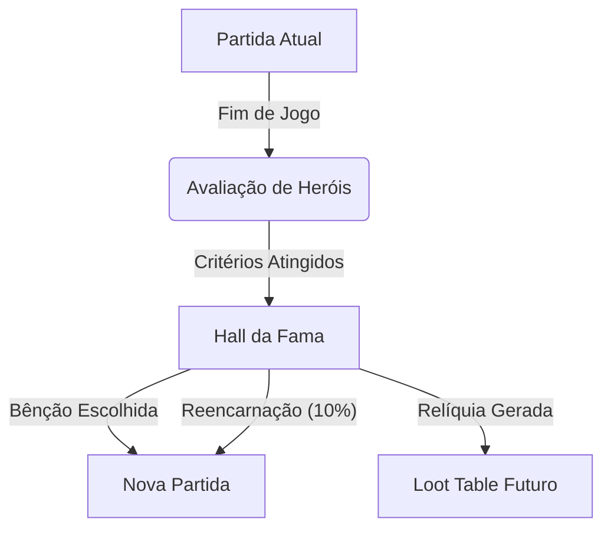

# 5b. SISTEMA DE LEGADO E HALL DA FAMA (PERSISTÊNCIA)

## 1. O Chamado Eterno (Overview)

Em _Heroes of Majesty_, a morte não é o fim, e a vitória não é esquecida. Através do **Sistema de Legado**, feitos heroicos ecoam em partidas futuras, criando uma narrativa emergente que atravessa gerações de reinos.
A persistência não é apenas um "Hall da Fama" estático, mas um mercado vivo de lendas que podem ser contratadas para virar o jogo em momentos de crise.

---

## 2. Hall da Fama (The Pantheon)

Ao final de cada partida (Vitória ou Derrota no Dia 8+), o sistema avalia o desempenho dos heróis. A entrada no Panteão não depende apenas de força bruta, mas de **impacto e sacrifício**.

### 2.1 Critérios de Ascensão

Para entrar no Hall da Fama, um herói deve cumprir **pelo menos um** dos requisitos abaixo:

| Categoria      | Requisito                                                                   | Exemplo Narrativo                         |
| :------------- | :-------------------------------------------------------------------------- | :---------------------------------------- |
| **Lenda Viva** | Atingir **Level 10 (Max Level)**.                                           | "Alcançou o ápice do poder mortal."       |
| **O Salvador** | Salvar aliados da morte (Curar/Proteger em HP Crítico) **15+ vezes**.       | "O escudo que nunca falhou."              |
| **O Mártir**   | Morrer permanentemente para **evitar o Wipe** do grupo (Salvar 2+ aliados). | "Deu sua vida para que outros vivessem."  |
| **O Matador**  | Derrotar sozinho (Solo Kill) um Boss ou 5+ Elites.                          | "Enfrentou a escuridão sozinho e venceu." |
| **O Líder**    | Manter Afinidade Máxima (+100) com 2+ heróis até o fim.                     | "Uniu corações e mentes."                 |
| **O Imortal**  | Sobreviver aos 4 Ciclos sem nunca cair (0 K.O.s).                           | "Aquele que a morte não conseguiu tocar." |

> **Nota:** O "Last Hit" em Bosses **NÃO** garante vaga automática, valorizando suportes e tanks.

### 2.2 Benefícios na Próxima Partida (Patronos)

Heróis no Hall da Fama concedem **bênçãos passivas** para novos reinos. O jogador pode escolher **1 Patrono** no início do jogo, baseado na classe do herói lendário.

| Classe do Patrono | Bênção de Legado (Passiva Global)                                | Descrição Narrativa                                        |
| :---------------- | :--------------------------------------------------------------- | :--------------------------------------------------------- |
| **Guerreiro**     | **Vontade de Ferro:** Todos heróis começam com +10% HP.          | "A resistência de Kaelen ainda protege nossas muralhas."   |
| **Mago**          | **Fluxo Arcano:** Regeneração de Mana +5% para todos.            | "Os estudos de Gandalf elevaram nossa compreensão mágica." |
| **Ladino**        | **Sorte do Trapaceiro:** +5% Ouro Loot e +2% Chance Crítica.     | "Lila ensinou que o ouro está onde você procura."          |
| **Paladino**      | **Aura de Devoção:** Regeneração de IP +10% (Fé no Reino).       | "A fé de Sir Arthur inspira lealdade ao trono."            |
| **Bardo**         | **Lendas Vivas:** Ganho de XP +5% para todos.                    | "As canções de Elara inspiram novos aventureiros."         |
| **Necromante**    | **Pacto Sombrio:** Ninguém morre no 1º Dia (Sobrevive com 1 HP). | "A morte hesita onde Malakai caminhou."                    |
| **Monge**         | **Disciplina Mental:** -20% Penalidade de Fadiga/Cansaço.        | "O foco de Liu-Kang transcende o corpo."                   |
| **Arqueiro**      | **Olhos de Águia:** +1 Distância de Visão (Fog of War reduzido). | "Legolas vigia o horizonte por nós."                       |
| **Druida**        | **Bênção da Terra:** Regeneração de HP +2%/turno em Florestas.   | "A natureza reconhece seus filhos."                        |
| **Elfo**          | **Graça Ancestral:** +5% Speed e Evasão para todos.              | "Movemo-nos como o vento, graças a Eldrin."                |

---

### 2.3 Crônicas do Legado (Histórico Estendido)

Ao entrar no Hall da Fama, o arquivo do herói torna-se imutável em sua essência, mas aberto a novas histórias como **Mercenário Global**.

**Estrutura do Log de Vida:**

```json
{
  "hero_id": "kaelen_legend_01",
  "original_saga": {
    "world_seed": "kingdom_alpha_1",
    "achievements": ["Matou o Dragão Vermelho", "Salvou a Princesa"],
    "death": null, // Sobreviveu
    "status": "HALL_OF_FAME"
  },
  "mercenary_contracts": [
    {
      "hired_by": "Player_X99",
      "cycle": "Inverno",
      "feat": "Ajudou a defender a Muralha do Norte contra 50 Orcs.",
      "outcome": "Success"
    },
    {
      "hired_by": "Player_Z01",
      "cycle": "Lua de Sangue",
      "feat": "Caiu em combate contra o Lich King (Retornou Ferido).",
      "outcome": "Defeat"
    }
  ]
}
```

Isso garante que a **lenda original** permaneça pura, enquanto as "aventuras paralelas" enriquecem a fama do herói sem corromper sua história canônica.

### 2.4 Mecânica de Mercenários Globais (The Freelancers)

Heróis lendários de outros jogadores (ou de suas vidas passadas) podem ser contratados temporariamente.

#### A. Requisito de Infraestrutura (Embaixada das Lendas)

Para acessar o mercado global, o Reino deve construir a **Embaixada das Lendas**.

- **Custo de Construção:** 3.000 Ouro + 500 Magia.
- **Função:** Portal de conexão com o Hall da Fama Global.

#### B. Regras de Contratação (Fixo e Justo)

Diferente da contratação local, as regras para Lendas são rígidas para manter o balanceamento:

- **Custo Único:** **1.000 Ouro**.
  - _Detalhe Crucial:_ Esse ouro não some. Ele é **transferido para o "Cofre de Legado" do Criador do Herói**, disponível para ele iniciar sua próxima partida com mais recursos.
- **Duração do Contrato:** Exatamente **1 Ciclo (2 Dias do Jogo)**. Após isso, o herói parte.
- **Adaptação de Poder (Level Sync):** Embora seja uma Lenda Level 10, o herói chegará com o nível ajustado ao **Level Cap do Ciclo Atual** para não trivializar o jogo.
  - _Ciclo 1:_ Lenda chega no Level 3 (Máx do Ciclo).
  - _Ciclo 2:_ Lenda chega no Level 5.
  - _Ciclo 3:_ Lenda chega no Level 8.
  - _Ciclo 4:_ Lenda libera seu poder total (Level 10).
  - _Vantagem:_ Eles sempre chegam no topo do poder permitido, com skills otimizadas e equipamentos de alto tier.

---

## 3. Relíquias Ancestrais (Itens de Herança)

Itens lendários empunhados por heróis do Hall da Fama não desaparecem. Eles se tornam **Relíquias** que podem ser encontradas em partidas futuras.

### Mecânica de Descoberta

- **Chance:** 5% ao explorar Ruínas/Dungeons de Nível Alto (Ciclo 3+).
- **Evento:** "Túmulo Esquecido" ou "Câmara do Tesouro Antigo".
- **Restrição:** Somente 1 Relíquia por partida.

### Exemplo de Narrativa de Loot

```
[Exploração - Ruínas do Norte]
Sir Balin encontrou: [Espada Quebrada de Kaelen] (Relíquia)
Descrição: "A lâmina ainda vibra com a fúria de seu antigo dono."
Efeito: +50 Attack, +20 Speed. Mas o portador ganha Trait: 'Melancólico' (Ethics +0.2).
Memória Desbloqueada: "Kaelen morreu protegendo a vila no Inverno de 1024."
```

---

## 4. Memórias Sociais (Ecos do Passado)

O sistema social (Affinity/Banter) reconhece o legado.

### 4.1 Referências em Diálogos (Banter)

Bardos e NPCs podem mencionar heróis antigos em suas falas.

**Template:**
`"Até [NOME_HEROI_ANTIGO] teria medo desse monstro!"`
`"Você luta como [NOME_HEROI_ANTIGO], mas sem a mesma elegância."`

### 4.2 Reencarnação (Alma Retornada)

Existe uma chance significativa de uma lenda retornar em um novo corpo.

- **Chance:** **10%** ao recrutar um novo herói.
- **Nome:** Idêntico ao antigo (com sufixo numérico, ex: "Kaelen II").
- **Traits:** Herda a mesma personalidade base e arquétipo.
- **Conexão:** Se encontrar a Relíquia do seu antecessor, ganha bônus de stats dobrado.

---

## 5. Resumo da Persistência


